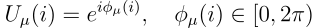
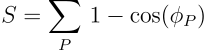
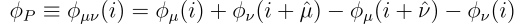
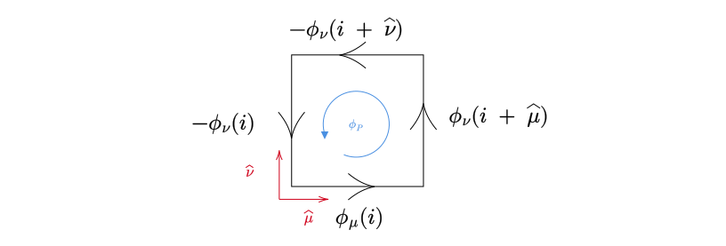
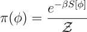
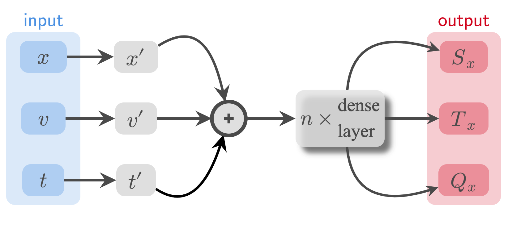

# l2hmc-qcd  [](https://www.codefactor.io/repository/github/saforem2/l2hmc-qcd) 
---

## Overview

The L2HMC algorithm aims to improve upon [HMC](https://en.wikipedia.org/wiki/Hamiltonian_Monte_Carlo)
by optimizing a carefully chosen loss function which is designed to minimize autocorrelations
within the Markov Chain, thereby improving the efficiency of the sampler.

This work is based on the original implementation: [brain-research/l2hmc/](https://github.com/brain-research/l2hmc).

A detailed description of the L2HMC algorithm can be found in the paper:

[*Generalizing Hamiltonian Monte Carlo with Neural Network*](https://arxiv.org/abs/1711.09268)

by [Daniel Levy](http://ai.stanford.edu/~danilevy), [Matt D. Hoffman](http://matthewdhoffman.com/) and [Jascha Sohl-Dickstein](sohldickstein.com).

Broadly, given an *analytically* described target distribution, π(x), L2HMC provides a *statistically exact* sampler that:

- Quickly converges to the target distribution (fast ***burn-in***).
- Quickly produces uncorrelated samples (fast ***mixing***).
- Is able to efficiently mix between energy levels.
- Is capable of traversing low-density zones to mix between modes (often difficult for generic HMC).


## L2HMC for LatticeQCD

**Goal:** Use L2HMC to **efficiently** generate _gauge configurations_ for calculating observables in lattice QCD.

A detailed description of the (ongoing) work to apply this algorithm to simulations in 
lattice QCD (specifically, a 2D U(1) lattice gauge theory model) can be found in [`doc/main.pdf`](doc/main.pdf).

### Background

MCMC algorithms are known to encounter difficulties when used for simulating theories close to a critical point,
a phenomenon known as [_critical slowing down_](https://doi.org/10.1016/0920-5632(90)90224-I).

In order to extract meaningful physics from the discretized lattice theory, an extrapolation to the continuum limit is necessary.

Unfortunately, as we simulate the theory on increasingly smaller lattice spacings, the computational resources
(when using [traditional sampling methods](https://en.wikipedia.org/wiki/Hamiltonian_Monte_Carlo)) 
necessary to generate independent gauge configurations grows exponentially.

To combat this effect, we propose a generalized version of the L2HMC algorithm 
and demonstrate improvements for the case of a two-dimensional U(1) lattice gauge theory.


### U(1) Lattice Gauge Theory

We start by considering the simpler (1+1)-dimensional U(1) lattice gauge theory, defined on an Nx * Nt lattice with periodic boundary conditions.

The action of this gauge theory is defined in terms of the *link variables*

<div align="center">
 
</div>

and can be written as

<div align="center">
 
</div>
where:

&nbsp;

<div align="center">

</div>

&nbsp;

<div align="center">
  
</div>

### Target distribution:

Our target distribution is then given by:

<div align="center">

</div>
where Z is the partition function (normalizing factor), β is the inverse coupling constant,
and S[ɸ] is the Wilson gauge action for the 2D U(1) theory.

Lattice methods for the 2D U(1) gauge model are implemented using the `GaugeLattice` object, which can be found at
[`l2hmc-qcd/lattice/lattice.py`](l2hmc-qcd/lattice/lattice.py)


## Organization

### Dynamics / Network

The base class for the augmented L2HMC leapfrog integrator is implemented in the [`BaseDynamics`](l2hmc-qcd/dynamics/base_dynamics.py) (a `tf.keras.Model` object).

The [`GaugeDynamics`](l2hmc-qcd/dynamics/gauge_dynamics.py) is a subclass of `BaseDynamics` containing modifications for the 2D U(1) pure gauge theory.

The network is defined in [` l2hmc-qcd/network/functional_net.py`](l2hmc-qcd/network/functional_net.py).


#### Network Architecture

An illustration of the `xNet` network architecture used for updating the position variable `x` can be seen below.

<div align="center">
 
</div>

The network takes as input the position `x`, momentum `v` and a fictitious time `t` variable and outputs the quantities `Sx, Tx, Qx`, which are then used in the augmented Hamiltonian dynamics to update `x`.

Similarly, the network used for updating the momentum variable `v` has an identical architecture, taking as inputs the position `x`, the gradient of the potential, `dUdX`, and the same fictitious time `t`, and outputs the quantities `Sv, Tv, Qv` which are then used to update `v`.

Explicitly:
```
xNet: (x, v, t) --> (Sx, Tx, Qx)
vNet: (x, dUdX, t) --> (Sv, Tv, Qv)
```

**Note:** In the image above, the quantities `x', v', t'` represent the outputs of a Dense layer followed by a `ReLu` nonlinearity.

### Lattice

Lattice code can be found in [`lattice.py`](l2hmc-qcd/lattice/lattice.py), specifically the `GaugeLattice` object that provides the base structure on which our target distribution exists.

Additionally, the `GaugeLattice` object implements a variety of methods for calculating physical observables such as the average plaquette, ɸₚ, and the topological charge \mathcal{Q},

### Training

The training loop is implemented in [`l2hmc-qcd/utils/training_utils.py `](l2hmc-qcd/utils/training_utils.py).

To train the sampler on a 2D U(1) gauge model using the parameters specified in [` bin/train_configs.json`](bin/train_configs.json):

```bash
$ python3 /path/to/l2hmc-qcd/l2hmc-qcd/train.py --json_file=/path/to/l2hmc-qcd/bin/train_configs.json
```

Or via the [` bin/train.sh `](bin/train.sh) script provided in [` bin/ `](bin/).

## Features

- **Distributed training**
  (via [`horovod`](https://github.com/horovod/horovod)): If `horovod` is installed, the model can be trained across multiple GPUs (or CPUs) by:

  ```bash
  #!/bin/bash
  
  TRAINER=/path/to/l2hmc-qcd/l2hmc-qcd/train.py
  JSON_FILE=/path/to/l2hmc-qcd/bin/train_configs.json
  
  horovodrun -np ${PROCS} python3 ${TRAINER} --json_file=${JSON_FILE}
  ```

## Contact
---
***Code author:*** Sam Foreman

***Pull requests and issues should be directed to:*** [saforem2](http://github.com/saforem2)

## Citation

If you use this code, please cite the original paper:
```bibtex
@article{levy2017generalizing,
  title={Generalizing Hamiltonian Monte Carlo with Neural Networks},
  author={Levy, Daniel and Hoffman, Matthew D. and Sohl-Dickstein, Jascha},
  journal={arXiv preprint arXiv:1711.09268},
  year={2017}
}
```

## Acknowledgement

<div align="center">
 
</div>
This research used resources of the Argonne Leadership Computing Facility, which is a DOE Office of Science User Facility supported under contract DE_AC02-06CH11357.  This work describes objective technical results and analysis. Any subjective views or opinions that might be expressed in the work do not necessarily represent the views of the U.S. DOE or the United States
Government. Declaration of Interests - None.

 <!--  -->
<!---
As a result, traditional sampling methods tend to get "stuck" in distinct regions of the t
preventing the sampler from efficiently exploring different _topological sectors_ of the target distribution.
This challenge quickly becomes insurmountable, and as a result there has been a growing interest in using machine learning
to help design more efficient sampling techniques.
*****
demonstrate its success apply it to the case of a
two-dimensional U(1) lattice gauge theory.
*****
By using a loss function that encourages exploration of different topological charge sectors we are able to reduce the comp
we are able to
reduce the integrated autocorrelation time 
and demonstrate its success towards improving 
the efficiency of the MCMC sampler compared to generic [Hamiltonian Monte Carlo](https://en.wikipedia.org/wiki/Hamiltonian_Monte_Carlo).
*****
as we approach the continuum limit and quickly becomes insurmountable.
Using conventional methods, the computational cost of generating these configurations grows exponentially as we simulate the theory
at increasingly smaller lattice spacings.
, a phenomenon known as [_critical slowing down_](https://doi.org/10.1016/0920-5632(90)90224-I).
****
We propose a generalized version of the L2HMC algorithm and apply it to the case of a two-dimensional U(1) lattice gauge theory where we demonstrate an improvement compared to traditional HMC. 
*****
as we approach the continuum limit (i.e. as the finite lattice spacing goes to zero).
The continuum limit is known as a critical point of the theory, a phenomenon known as [_critical slowing down_](https://doi.org/10.1016/0920-5632(90)90224-I)
All lattice QCD simulations are performed at finit lattice spacing a, and need an extrapolation to the continuum in order to be used for computing values of physical quantities.
More reliable extrapolations can be done by simulating the theory at increasingly smaller lattice spacings.
The picture that results when the lattice spacing is reduced and the physics kept constant is that all finite physical quantities of negative mass dimension diverge if measured in lattice units.
In statistical mechanics language, this states that the continuum limit is a critical point of the theory since the correlation lengths diverge.
*****
MCMC algorithms are known to encounter difficulties when used for simulating theories close to a critical point, an issue known as the _critical slowing down_ of the algorithm.
****
<!---This work is based on the original implementation which can be found at [brain-research/l2hmc/](https://github.com/brain-research/l2hmc).---!>

<!-- <details><summary>FFHQ 256</summary> -->
<!---We are interested in applying the L2HMC algorithm to generate *gauge configurations* for LatticeQCD.---!>
---!>
