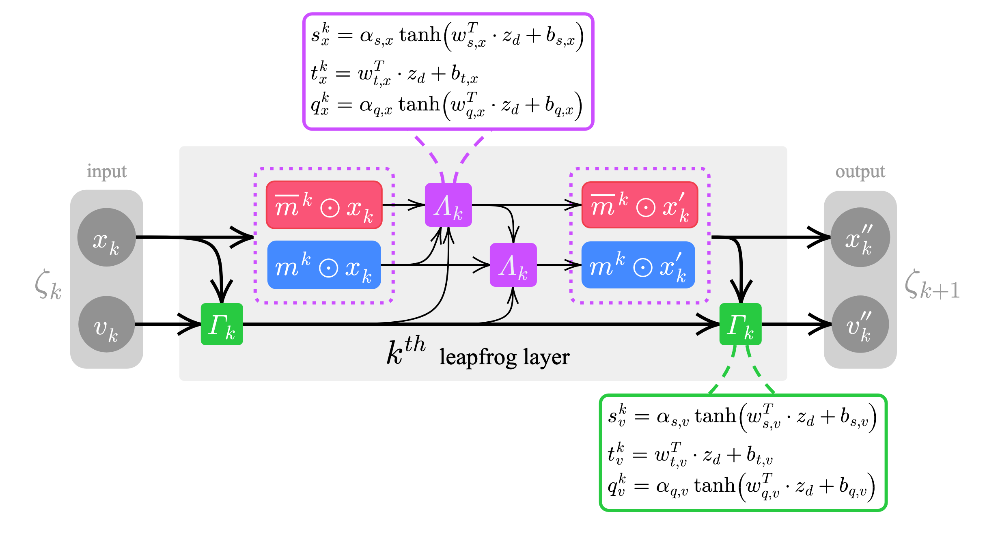

<div align="center">


<!--<br> -->

<a href="https://hits.seeyoufarm.com"></a>    
<a href="https://github.com/saforem2/l2hmc-qcd/"></a> <a href="https://www.codefactor.io/repository/github/saforem2/l2hmc-qcd"></a>
<br>
<a href="https://arxiv.org/abs/2112.01582"></a> <a href="https://arxiv.org/abs/2105.03418"></a> 
<br>
<a href="https://hydra.cc"></a> <a href="https://pytorch.org/get-started/locally/"></a> <a href="https://www.tensorflow.org"></a> 

</div>


# Contents

- [Overview](#overview)
  * [Papers 📚, Slides 📊, etc.](https://github.com/saforem2/l2hmc-qcd/#training--experimenting)
  * [Background](#background)
- [Installation](#installation)
- [Training](#training)
- [Details](#details)
  * [L2HMC for LatticeQCD](#l2hmc-for-latticeqcd)
  * [Organization](#organization)
    + [Dynamics / Network](#dynamics---network)
      - [Network Architecture](#network-architecture)
    + [Lattice](#lattice)

# Overview

## Papers 📚, Slides 📊, etc.
- 📘 [Example Notebook](./src/l2hmc/notebooks/experiment.ipynb) ([alternative link](https://nbviewer.org/github/saforem2/l2hmc-qcd/blob/dev/src/l2hmc/notebooks/experiment.ipynb) if github won't load)
- [Accelerated Sampling Techniques for Lattice Gauge Theory](https://saforem2.github.io/l2hmc-dwq25/#/) @ [BNL & RBRC: DWQ @ 25](https://indico.bnl.gov/event/13576/) (12/2021)
- [Training Topological Samplers for Lattice Gauge Theory](https://bit.ly/l2hmc-ect2021) from the [*ML for HEP, on and off the Lattice*](https://indico.ectstar.eu/event/77/) @ ECT$^{*}$ Trento (09/2021) (+ 📊 [slides](https://www.bit.ly/l2hmc-ect2021))
- [Deep Learning Hamiltonian Monte Carlo](https://arxiv.org/abs/2105.03418) @ [Deep Learning for Simulation (SimDL) Workshop](https://simdl.github.io/overview/) **ICLR 2021**
	- 📚 : [arXiv:2105.03418](https://arxiv.org/abs/2105.03418)  
	- 📊 : [poster](https://www.bit.ly/l2hmc_poster)


## Background
The L2HMC algorithm aims to improve upon [HMC](https://en.wikipedia.org/wiki/Hamiltonian_Monte_Carlo) by optimizing a carefully chosen loss function which is designed to minimize autocorrelations within the Markov Chain, thereby improving the efficiency of the sampler.

A detailed description of the original L2HMC algorithm can be found in the paper:

[*Generalizing Hamiltonian Monte Carlo with Neural Network*](https://arxiv.org/abs/1711.09268)

with implementation available at [brain-research/l2hmc/](https://github.com/brain-research/l2hmc) by [Daniel Levy](http://ai.stanford.edu/~danilevy), [Matt D. Hoffman](http://matthewdhoffman.com/) and [Jascha Sohl-Dickstein](sohldickstein.com).

Broadly, given an *analytically* described target distribution, π(x), L2HMC provides a *statistically exact* sampler that:

- Quickly converges to the target distribution (fast ***burn-in***).
- Quickly produces uncorrelated samples (fast ***mixing***).
- Is able to efficiently mix between energy levels.
- Is capable of traversing low-density zones to mix between modes (often difficult for generic HMC).


# Installation

- [`l2hmc`](https://pypi.org/project/l2hmc/) on PyPi:

```bash
$ python3 -m pip install l2hmc
```

# Training

This project uses [`hydra`](https://hydra.cc) for configuration management and supports both TensorFlow (+ Horovod) and PyTorch (+ DDP) training frameworks.

The [`l2hmc/conf/config.yaml`](./src/l2hmc/conf/config.yaml) contains a brief explanation of each of the various parameter options, and values can be overriden either by modifying the `config.yaml` file, or directly through the command line, e.g.

```bash
python3 main.py framework=tensorflow network.activation_fn=swish
```

for more information on how this works I encourage you to read [Hydra's Documentation Page](https://hydra.cc).


# Details
## L2HMC for LatticeQCD

**Goal:** Use L2HMC to **efficiently** generate _gauge configurations_ for calculating observables in lattice QCD.

A detailed description of the (ongoing) work to apply this algorithm to simulations in lattice QCD (specifically, a 2D U(1) lattice gauge theory model) can be found in [`doc/main.pdf`](doc/main.pdf).

<div align="center">
 
</div>

## Organization

### Dynamics / Network

For a given target distribution, π(x), the `Dynamics` object ([`src/l2hmc/dynamics/`](src/l2hmc/dynamics)) implements methods for generating proposal configurations (x' ~ π) using the generalized leapfrog update.


This generalized leapfrog update takes as input a buffer of lattice configurations `x` and generates a proposal configuration `x' = Dynamics(x)` by evolving the 

<!--The [`GaugeDynamics`](l2hmc-qcd/dynamics/gauge_dynamics.py) is a subclass of `BaseDynamics` containing modifications for the 2D U(1) pure gauge theory.-->

<!--The network is defined in [` l2hmc-qcd/network/functional_net.py`](l2hmc-qcd/network/functional_net.py).-->


#### Network Architecture

An illustration of the `leapfrog layer` updating `(x, v) --> (x', v')` can be seen below.

<div align="center">
 
</div>
<!---The network takes as input the position `x`, momentum `v` and and outputs the quantities `sx, tx, qx`, which are then used in the augmented Hamiltonian dynamics to update `x`.--->

<!---Similarly, the network used for updating the momentum variable `v` has an identical architecture, taking as inputs the position `x`, the gradient of the potential, `dUdX`, and the same fictitious time `t`, and outputs the quantities `sv, tv, qv` which are then used to update `v`.--->

<!---**Note:** In the image above, the quantities `x', v''` represent the outputs of a Dense layer followed by a `ReLu` nonlinearity.--->

### Lattice

Lattice code can be found in [`lattice/`](./lattice/), specifically:


specifically the `GaugeLattice` object that provides the base structure on which our target distribution exists.

Additionally, the `GaugeLattice` object implements a variety of methods for calculating physical observables such as the average plaquette, ɸₚ, and the topological charge Q,

<!--### Training

The training loop is implemented in [`l2hmc-qcd/utils/training_utils.py `](l2hmc-qcd/utils/training_utils.py).

To train the sampler on a 2D U(1) gauge model using the parameters specified in [` bin/train_configs.json`](bin/train_configs.json):

```bash
$ python3 /path/to/l2hmc-qcd/l2hmc-qcd/train.py --json_file=/path/to/l2hmc-qcd/bin/train_configs.json
```

Or via the [` bin/train.sh `](bin/train.sh) script provided in [` bin/ `](bin/).

## Features

- **Distributed training**
  (via [`horovod`](https://github.com/horovod/horovod)): If `horovod` is installed, the model can be trained across multiple GPUs (or CPUs) by:

  ```bash
  #!/bin/bash
  
  TRAINER=/path/to/l2hmc-qcd/l2hmc-qcd/train.py
  JSON_FILE=/path/to/l2hmc-qcd/bin/train_configs.json
  
  horovodrun -np ${PROCS} python3 ${TRAINER} --json_file=${JSON_FILE}
  ```
-->

<div align="center">
	


</div>
    
## Contact

***Code author:*** Sam Foreman

***Pull requests and issues should be directed to:*** [saforem2](http://github.com/saforem2)

## Citation

If you use this code or found this work interesting, please cite our work along with the original paper:

```bibtex
@misc{foreman2021deep,
      title={Deep Learning Hamiltonian Monte Carlo}, 
      author={Sam Foreman and Xiao-Yong Jin and James C. Osborn},
      year={2021},
      eprint={2105.03418},
      archivePrefix={arXiv},
      primaryClass={hep-lat}
}
```

```bibtex
@article{levy2017generalizing,
  title={Generalizing Hamiltonian Monte Carlo with Neural Networks},
  author={Levy, Daniel and Hoffman, Matthew D. and Sohl-Dickstein, Jascha},
  journal={arXiv preprint arXiv:1711.09268},
  year={2017}
}
```

## Acknowledgement

> This research used resources of the Argonne Leadership Computing Facility, which is a DOE Office of Science User Facility supported under contract DE_AC02-06CH11357. This work describes objective technical results and analysis. Any subjective views or opinions that might be expressed in the work do not necessarily represent the views of the U.S. DOE or the United States Government.
