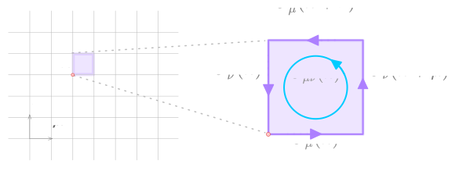
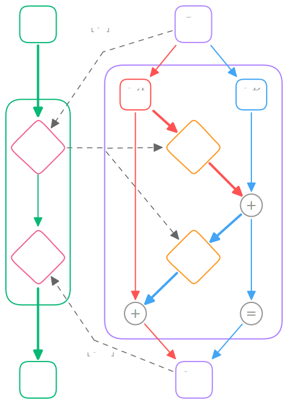

# <span align="left" display="inline" width="20%" style="vertical-align:middle; line-height: 3.0em;">[](https://saforem2.github.io/l2hmc-qcd)</span>

<div class="flex">

<a href="https://hydra.cc"></a>
<a href="https://pytorch.org/get-started/locally/"></a>
<a href="https://www.tensorflow.org"></a>

<a href="https://hits.seeyoufarm.com"></a>
<a href="https://github.com/saforem2/l2hmc-qcd/"></a>
[](https://wandb.ai/l2hmc-qcd/l2hmc-qcd)

<a href="https://www.codefactor.io/repository/github/saforem2/l2hmc-qcd"></a>
<a href="https://arxiv.org/abs/2112.01582"></a>
<a href="https://arxiv.org/abs/2105.03418"></a>

</div>

<!-- ::: {.callout-tip collapse="false" icon="false" style="width:40%; background-color: var(--bg-transparent)!important; border-color: var(--bg-border)!important;" title="[ Contents]{.dim-text}"} -->
<!---->
<!-- - [Overview](#overview) -->
<!--   * [Papers 📚, Slides 📊, etc.](https://github.com/saforem2/l2hmc-qcd/#training--experimenting) -->
<!--   * [Background](#background) -->
<!-- - [Installation](#installation) -->
<!-- - [Training](#training) -->
<!--   - [Configuration Management](#configuration-management) -->
<!--   - [Running @ ALCF](#running-at-ALCF)  -->
<!-- - [Details](#details) -->
<!--   * [Organization](#organization) -->
<!--       - [Lattice Dynamics](#lattice-dynamics) -->
<!--       - [Network Architecture](#network-architecture) -->
<!---->
<!-- ::: -->
<!---->
<!-- ::: -->

<div>

> **<span class="dim-text"> Papers 📚, Slides 📊 etc.</span>**
>
> - [📊 Slides (07/31/2023 @ Lattice
>   2023)](https://saforem2.github.io/lattice23/#/title-slide)
> - [📕 Notebooks / Reports](./reports/):
>   - [📓 2D $U(1)$ Example](./qmd/l2hmc-2DU1.qmd)
>     - [📙 2D U(1) Model (w/ `fp16` or `fp32` for
>       training)](./qmd/l2hmc-2DU1.qmd)
>     - [📒 4D SU(3) Model (w/ `complex128` + `fp64` for
>       training)](./qmd/l2hmc-4DSU3.qmd)
>       - [alt link (if github won’t
>         load)](https://nbviewer.org/github/saforem2/l2hmc-qcd/blob/dev/src/l2hmc/notebooks/pytorch-SU3d4.ipynb)
> - 📝 Papers:
>   - [LeapfrogLayers: A Trainable Framework for Effective Topological
>     Sampling](https://arxiv.org/abs/2112.01582), 2022  
>   - [Accelerated Sampling Techniques for Lattice Gauge
>     Theory](https://saforem2.github.io/l2hmc-dwq25/#/) @ [BNL & RBRC:
>     DWQ @ 25](https://indico.bnl.gov/event/13576/) (12/2021)
>   - [Training Topological Samplers for Lattice Gauge
>     Theory](https://bit.ly/l2hmc-ect2021) from the [*ML for HEP, on
>     and off the Lattice*](https://indico.ectstar.eu/event/77/) @
>     $\mathrm{ECT}^{*}$ Trento (09/2021) (+ 📊
>     [slides](https://www.bit.ly/l2hmc-ect2021))
>   - [Deep Learning Hamiltonian Monte
>     Carlo](https://arxiv.org/abs/2105.03418) @ [Deep Learning for
>     Simulation (SimDL) Workshop](https://simdl.github.io/overview/)
>     **ICLR 2021**
>     - 📚 : [arXiv:2105.03418](https://arxiv.org/abs/2105.03418)  
>     - 📊 : [poster](https://www.bit.ly/l2hmc_poster)
>
> <div>
>
> > **<span class="dim-text"></span> $\hspace{2pt}$
> > <span class="dim-text">[**MLMC: Machine Learning Monte
> > Carlo**](https://saforem2.github.io/lattice23) @ [Lattice
> > 2023](https://indico.fnal.gov/event/57249/contributions/271305/)
> > (07/2023)</span>**
> >
> > <iframe src="https://saforem2.github.io/lattice23/#/section" title="MLMC: Machine Learning Monte Carlo" width="100%" align="center" height="512" frameborder="0" webkitallowfullscreen mozallowfullscreen allowfullscreen style="border-radius:0.25rem;border:none;align:center;">
> > <p>
> > Your browser does not support iframes.
> > </p>
> > </iframe>
>
> </div>

</div>

## Background

The L2HMC algorithm aims to improve upon
[HMC](https://en.wikipedia.org/wiki/Hamiltonian_Monte_Carlo) by
optimizing a carefully chosen loss function which is designed to
minimize autocorrelations within the Markov Chain, thereby improving the
efficiency of the sampler.

A detailed description of the original L2HMC algorithm can be found in
the paper:

[*Generalizing Hamiltonian Monte Carlo with Neural
Network*](https://arxiv.org/abs/1711.09268)

with implementation available at
[brain-research/l2hmc/](https://github.com/brain-research/l2hmc) by
[Daniel Levy](http://ai.stanford.edu/~danilevy), [Matt D.
Hoffman](http://matthewdhoffman.com/) and [Jascha
Sohl-Dickstein](sohldickstein.com).

Broadly, given an *analytically* described target distribution, π(x),
L2HMC provides a *statistically exact* sampler that:

- Quickly converges to the target distribution (fast ***burn-in***).
- Quickly produces uncorrelated samples (fast ***mixing***).
- Is able to efficiently mix between energy levels.
- Is capable of traversing low-density zones to mix between modes (often
  difficult for generic HMC).

## Installation

<div>

> **Warning**
>
> It is recommended to use / install `l2hmc` into a virtual
> environment[^1]<br>
> <!-- (ideally one with either`pytorch [horovod,deepspeed], ` already installed) -->

</div>

<details open>
<summary>
<b>From source (RECOMMENDED)</b>
</summary>

``` bash
git clone https://github.com/saforem2/l2hmc-qcd
cd l2hmc-qcd
# for development addons:
# python3 -m pip install -e ".[dev]"
python3 -m pip install -e .
```

<details closed>
<summary>
<b> From <a href="https://pypi.org/project/l2hmc/"> <code>l2hmc</code>
on PyPI</a> </b>
</summary>
<p>

``` bash
python3 -m pip install l2hmc
```

</p>
</details>

Test install:

``` bash
python3 -c 'import l2hmc ; print(l2hmc.__file__)'
# output: /path/to/l2hmc-qcd/src/l2hmc/__init__.py
```

## Running the Code

<!-- ## Configuring your `Experiment` -->

### `Experiment` configuration with [Hydra](https://hydra.cc) 

This project uses [`hydra`](https://hydra.cc) for configuration
management and supports distributed training for both PyTorch and
TensorFlow.

In particular, we support the following combinations of `framework` +
`backend` for distributed training:

- TensorFlow (+ Horovod for distributed training)
- PyTorch +
  - DDP
  - Horovod
  - DeepSpeed

The main entry point is [`src/l2hmc/main.py`](./src/l2hmc/main.py),
which contains the logic for running an end-to-end `Experiment`.

An [`Experiment`](./src/l2hmc/experiment/) consists of the following
sub-tasks:

1.  Training
2.  Evaluation
3.  HMC (for comparison and to measure model improvement)

## Running an `Experiment`

**All** configuration options can be dynamically overridden via the CLI
at runtime, and we can specify our desired `framework` and `backend`
combination via:

``` bash
python3 main.py mode=debug framework=pytorch backend=deepspeed precision=fp16
```

to run a (non-distributed) Experiment with `pytorch + deepspeed` with
`fp16` precision.

The [`l2hmc/conf/config.yaml`](./src/l2hmc/conf/config.yaml) contains a
brief explanation of each of the various parameter options, and values
can be overriden either by modifying the `config.yaml` file, or directly
through the command line, e.g.

``` bash
cd src/l2hmc
./train.sh mode=debug framework=pytorch > train.log 2>&1 &
tail -f train.log $(tail -1 logs/latest)
```

Additional information about various configuration options can be found
in:

- [`src/l2hmc/configs.py`](./src/l2hmc/configs.py): Contains
  implementations of the (concrete python objects) that are adjustable
  for our experiment.
- [`src/l2hmc/conf/config.yaml`](./src/l2hmc/conf/config.yaml): Starting
  point with default configuration options for a generic `Experiment`.

for more information on how this works I encourage you to read [Hydra’s
Documentation Page](https://hydra.cc).

### Running at ALCF

For running with distributed training on ALCF systems, we provide a
complete [`src/l2hmc/train.sh`](./src/l2hmc/train.sh) script which
should run without issues on either Polaris or ThetaGPU @ ALCF.

- ALCF:

  ``` bash
  # Polaris --------------------------------
  if [[ "$(hostname)==x3*" ]]; then
    MACHINE="Polaris"
    CONDA_DATE="2023-10-02"
  # thetaGPU -------------------------------
  elif  [[ "$(hostname)==thetagpu*" ]]; then
    MACHINE="thetaGPU"
    CONDA_DATE="2023-01-11"
  else
    echo "Unknown machine"
    exit 1
  fi
  # Setup conda + build virtual env -----------------------------------------
  module load "conda/${CONDA_DATE}"
  conda activate base
  git clone https://github.com/saforem2/l2hmc-qcd
  cd l2hmc-qcd
  mkdir -p "venvs/${MACHINE}/${CONDA_DATE}"
  python3 -m venv "venvs/${MACHINE}/${CONDA_DATE}" --system-site-packages
  source "venvs/${MACHINE}/${CONDA_DATE}/bin/activate"
  python3 -m pip install --upgrade pip setuptools wheel
  # Install `l2hmc` ----------
  python3 -m pip install -e .
  # Train ----------------------------------------------------------------------
  cd src/l2hmc
  ./bin/train.sh mode=test framework=pytorch backend=deepspeed seed="${RANDOM}"
  ```

# Details

<div class="columns">

<div class="column" width="50%" style="padding-right: 1%;">

## Lattice Dynamics

<div id="fig-lattice" style="text-align:center;">



Figure 1: A 2D view of the lattice, with an elementary plaquette,
$U_{\mu\nu}(x)$ illustrated.

</div>

**Goal**: Use L2HMC to efficiently generate gauge configurations for
calculating observables in lattice QCD.

A detailed description of the (ongoing) work to apply this algorithm to
simulations in lattice QCD (specifically, a 2D U(1) lattice gauge theory
model) can be found in arXiv:2105.03418.

For a given target distribution, $\pi(U)$ the `Dynamics` object
([`src/l2hmc/dynamics/`](src/l2hmc/dynamics)) implements methods for
generating proposal configurations

$$U_{0} \rightarrow U_{1} \rightarrow \cdots \rightarrow U_{n} \sim \pi(U)$$

using the generalized leapfrog update, as shown to the right in
[Figure 2](#fig-lflayer).

This generalized leapfrog update takes as input a buffer of lattice
configurations `U`[^2] and generates a proposal configuration:

<div style="text-align: center;">

$U^{\prime}=$ `Dynamics(U)`

</div>

by evolving the generalized L2HMC dynamics.

</div>

<div class="column" width="50%" style="padding-left: 1%;">

## Network Architecture

We use networks with identical architectures, $\Gamma^{\pm}$[^3],
$\Lambda^{\pm}$[^4] to update our momenta $P$ and links $U$,
respectively.

<div id="fig-lflayer">

<span width="85%"></span>

Figure 2: An illustration of the `leapfrog layer` updating
$(P, U) \rightarrow (P', U')$.

</div>

</div>

</div>

<div id="fig-poster">


Figure 3: Overview of the L2HMC algorithm

</div>

## Contact

***Code author:*** Sam Foreman

***Pull requests and issues should be directed to:***
[saforem2](http://github.com/saforem2)

## Posts

<!-- ::: {.callout-tip collapse="true" icon="false" style="width:100%; background-color: rgba(red(var(--green-text)), green(var(--green-text)), blue(var(--green-text)), 0.075)))!important;" title="[]{.green-text} Posts"} -->

<div id="listings">

</div>

<!-- ::: -->

## Citation

If you use this code or found this work interesting, please cite our
work along with the original paper:

``` bibtex
@misc{foreman2021deep,
      title={Deep Learning Hamiltonian Monte Carlo}, 
      author={Sam Foreman and Xiao-Yong Jin and James C. Osborn},
      year={2021},
      eprint={2105.03418},
      archivePrefix={arXiv},
      primaryClass={hep-lat}
}
```

``` bibtex
@article{levy2017generalizing,
  title={Generalizing Hamiltonian Monte Carlo with Neural Networks},
  author={Levy, Daniel and Hoffman, Matthew D. and Sohl-Dickstein, Jascha},
  journal={arXiv preprint arXiv:1711.09268},
  year={2017}
}
```

## Acknowledgement

> **Note**<br> This research used resources of the Argonne Leadership
> Computing Facility, which is a DOE Office of Science User Facility
> supported under contract DE_AC02-06CH11357.<br> This work describes
> objective technical results and analysis.<br> Any subjective views or
> opinions that might be expressed in the work do not necessarily
> represent the views of the U.S. DOE or the United States Government.

<p align="center">
<a href="https://hits.seeyoufarm.com"></a>
</p>

[^1]: A good way to do this is on top of a `conda` environment, e.g.:  
    `bash   conda activate base;  # with either {pytorch, tensorflow}   mkdir venv   python3 -m venv venv --system-site-packages   source venv/bin/activate   # for development addons:   # python3 -m pip install -e ".[dev]"   python3 -m pip install -e .`

[^2]: Note that throughout the code, we refer to the link variables as
    `x` and the conjugate momenta as `v`.

[^3]: referred to as `vNet` for the network used to update `v`

[^4]: referred to as `xNet` for the network used to update `x`
