# `l2hmc` Example: 2D $U(1)$
Sam Foreman
[<span class="orcid-green"></span>](https://orcid.org/0000-0002-9981-0876)
2023-12-14

<!-- # `l2hmc` Example: 2d $U(1)$ -->

<span style="text-align:left;">[](https://github.com/saforem2/l2hmc-qcd/blob/main/reports/l2hmc-2dU1/README.md)</span>

<!-- [](https://arxiv.org/abs/2105.03418) [](https://arxiv.org/abs/2112.01582) -->
<!-- <a href="https://arxiv.org/abs/2105.03418"></a> <a href="https://arxiv.org/abs/2112.01582"></a><br> -->

This notebook will (attempt) to walk through the steps needed to
successfully instantiate and “run” an experiment.

For this example, we wish to train the L2HMC sampler for the 2D $U(1)$
lattice gauge model with Wilson action:

$$
S_{\beta}(n) = \beta \sum_{n}\sum_{\mu<\nu}\mathrm{Re}\left[1 - U_{\mu\nu}(n) \right]
$$

This consists of the following steps:

1.  Build an `Experiment` by parsing our configuration object

2.  Train our model using the `Experiment.train()` method

3.  Evaluate our trained model `Experiment.evaluate(job_type='eval')`

4.  Compare our trained models’ performance against generic HMC
    `Experiment.evaluate(job_type='hmc')`

<div class="alert alert-block alert-info"
style="background:rgba(102, 102, 102, 0.1);color:#666666; border-radius:5px; border: none;">

<span style="font-weight:700; font-size:1.5em;">Evaluating
Performance</span>

We measure the performance of our model by comparing the *tunneling
rate* $\delta Q$ of our **trained** sampler to that of generic HMC.

Explicitly, the tunneling rate is given by:

$$ \delta Q = \frac{1}{N_{\mathrm{chains}}}\sum_{\mathrm{chains}} \left|Q_{i+1} - Q_{i}\right| $$

where the difference is between subsequent states in a chain, and the
sum is over all $N$ chains (each being ran in parallel,
*independently*).

Since our goal is to generate *independent configurations*, the more our
sampler tunnels between different topological sectors (*tunneling
rate*), the more efficient our sampler.

</div>

## Imports / Setup

``` python
! nvidia-smi | tail --lines -7
```

<div>

> **<span class="code-text">`output`:</span>**
>
> <div class="cell-output cell-output-display">
>
>     |        ID   ID                                                   Usage      |
>     |=============================================================================|
>     |    1   N/A  N/A   4027423      C   ...PU/2023-04-26/bin/python3     2915MiB |
>     |    2   N/A  N/A   4054944      C   ...PU/2023-04-26/bin/python3     5793MiB |
>     |    3   N/A  N/A   3989894      C   ...PU/2023-04-26/bin/python3     6021MiB |
>     |    4   N/A  N/A   3981679      C   ...PU/2023-04-26/bin/python3     3951MiB |
>     +-----------------------------------------------------------------------------+
>
> </div>

</div>

``` python
import os
devices = os.environ.get('CUDA_VISIBLE_DEVICES', None)
print(devices)
!getconf _NPROCESSORS_ONLN  # get number of availble CPUs
```

<div>

> **<span class="code-text">`output`:</span>**
>
> <div class="cell-output cell-output-display">
>
>     None
>     256
>
> </div>

</div>

``` python
os.environ['TORCH_CPP_LOG_LEVEL'] = 'ERROR'
os.environ['AUTOGRAPH_VERBOSITY'] = '10'
!echo $CUDA_VISIBLE_DEVICES
```

``` python
import lovely_tensors as lt
lt.monkey_patch()
lt.set_config(color=False)
```

``` python
# automatically detect and reload local changes to modules
%load_ext autoreload
%autoreload 2

# automatically detect and reload local changes to modules
%matplotlib inline
import matplotlib_inline
matplotlib_inline.backend_inline.set_matplotlib_formats('svg', 'retina')
```

<div>

> **<span class="code-text">`output`:</span>**
>
> <div class="cell-output cell-output-display">
>
>     The autoreload extension is already loaded. To reload it, use:
>       %reload_ext autoreload
>
> </div>

</div>

``` python
import os
import warnings

os.environ['COLORTERM'] = 'truecolor'
warnings.filterwarnings('ignore')
# --------------------------------------
# BE SURE TO GRAB A FRESH GPU !
os.environ['CUDA_VISIBLE_DEVICES'] = '5'
!echo $CUDA_VISIBLE_DEVICES
# --------------------------------------
```

<div>

> **<span class="code-text">`output`:</span>**
>
> <div class="cell-output cell-output-display">
>
>     5
>
> </div>

</div>

``` python
import yaml
import logging
from l2hmc.configs import CONF_DIR

rlog_yaml = CONF_DIR.joinpath('hydra', 'job_logging', 'rich_jupyter.yaml')
with rlog_yaml.open('r') as stream:
    logconf = dict(yaml.safe_load(stream))

logging.config.dictConfig(logconf)
log = logging.getLogger()
log.setLevel('INFO')
```

<div>

> **<span class="code-text">`output`:</span>**
>
> <div class="cell-output cell-output-display">
>
>     --------------------------------------------------------------------------
>     WARNING: There was an error initializing an OpenFabrics device.
>
>       Local host:   thetagpu23
>       Local device: mlx5_0
>     --------------------------------------------------------------------------
>
> <pre style="white-space:pre;overflow-x:auto;line-height:normal;font-family:monospace">Using device: cuda </pre>
>
> </div>

</div>

``` python
import torch
import opinionated

import seaborn as sns
import numpy as np
import lovely_tensors as lt
import matplotlib.pyplot as plt
import l2hmc.group.su3.pytorch.group as g

from pathlib import Path
from typing import Optional

from ezpz import setup_torch
#from l2hmc.utils.dist import setup_torch_distributed

from l2hmc.common import grab_tensor, print_dict
from l2hmc.configs import dict_to_list_of_overrides, get_experiment
from l2hmc.experiment.pytorch.experiment import Experiment, evaluate  # noqa  # noqa
from l2hmc.utils.plot_helpers import set_plot_style
from l2hmc.utils.history import BaseHistory
from l2hmc.utils.plot_helpers import (  # noqa
    set_plot_style,
    plot_scalar,
    plot_chains,
    plot_leapfrogs
)

os.environ['COLORTERM'] = 'truecolor'
PORT = np.random.randint(5000, 6000)
#SEED = np.random.randint(0, 2 ** 16)
SEED = 4351
log.critical(f'{SEED=}')
log.info(f'{PORT=}')
os.environ['MASTER_PORT'] = str(PORT)

#_ = setup_torch_distributed(backend='DDP', )
_ = setup_torch(backend='DDP', seed=SEED, port=PORT)

_ = (
    torch.set_default_device('cuda')
    if torch.cuda.is_available() else None
)
#torch.set_default_dtype(torch.bfloat16)
#_ = (
#    torch.set_autocast_gpu_dtype(torch.bfloat16)
#    if torch.cuda.is_available() else None
#)

set_plot_style()
plt.style.use(opinionated.STYLES['opinionated_min'])
sns.set_context('notebook', font_scale=1.25)
```

<div>

> **<span class="code-text">`output`:</span>**
>
> <div class="cell-output cell-output-display">
>
>     Failed to download font: Source Sans Pro, skipping!
>     Failed to download font: Titillium WebRoboto Condensed, skipping!
>
>
>     2023-12-05 11:12:19.257964: I tensorflow/core/platform/cpu_feature_guard.cc:193] This TensorFlow binary is optimized with oneAPI Deep Neural Network Library (oneDNN) to use the following CPU instructions in performance-critical operations:  SSE3 SSE4.1 SSE4.2 AVX AVX2 FMA
>     To enable them in other operations, rebuild TensorFlow with the appropriate compiler flags.
>
> <pre style="white-space:pre;overflow-x:auto;line-height:normal;font-family:monospace">[2023-12-05 11:12:22,359] [INFO] [real_accelerator.py:161:get_accelerator] Setting ds_accelerator to cuda (auto detect) </pre>
> <pre style="white-space:pre;overflow-x:auto;line-height:normal;font-family:monospace"><span style="color: #838383; text-decoration-color: #838383">[2023-12-05 11:12:27]</span><span style="background-color: #ff0000; font-weight: bold">[CRITICAL]</span><span style="color: #777777; text-decoration-color: #777777">[747729381.py:32]</span> - <span style="color: #ff00ff; text-decoration-color: #ff00ff; font-style: italic">SEED</span>=<span style="color: #1A8FFF; text-decoration-color: #1A8FFF; font-weight: bold">4351</span> </pre>
> <pre style="white-space:pre;overflow-x:auto;line-height:normal;font-family:monospace"><span style="color: #838383; text-decoration-color: #838383">[2023-12-05 11:12:27]</span><span style="color: #2196F3; text-decoration-color: #2196F3">[INFO]</span><span style="color: #777777; text-decoration-color: #777777">[747729381.py:33]</span> - <span style="color: #ff00ff; text-decoration-color: #ff00ff; font-style: italic">PORT</span>=<span style="color: #1A8FFF; text-decoration-color: #1A8FFF; font-weight: bold">5249</span> </pre>
> <pre style="white-space:pre;overflow-x:auto;line-height:normal;font-family:monospace"><span style="color: #838383; text-decoration-color: #838383">[2023-12-05 11:12:27]</span><span style="color: #2196F3; text-decoration-color: #2196F3">[INFO]</span><span style="color: #777777; text-decoration-color: #777777">[dist.py:185]</span> - Using DDP for distributed training </pre>
> <pre style="white-space:pre;overflow-x:auto;line-height:normal;font-family:monospace"><span style="color: #838383; text-decoration-color: #838383">[2023-12-05 11:12:27]</span><span style="color: #2196F3; text-decoration-color: #2196F3">[INFO]</span><span style="color: #777777; text-decoration-color: #777777">[dist.py:162]</span> - Caught MASTER_PORT:<span style="color: #1A8FFF; text-decoration-color: #1A8FFF; font-weight: bold">5249</span> from environment! </pre>
> <pre style="white-space:pre;overflow-x:auto;line-height:normal;font-family:monospace"><span style="color: #838383; text-decoration-color: #838383">[2023-12-05 11:12:27]</span><span style="color: #2196F3; text-decoration-color: #2196F3">[INFO]</span><span style="color: #777777; text-decoration-color: #777777">[distributed_c10d.py:442]</span> - Added key: store_based_barrier_key:<span style="color: #1A8FFF; text-decoration-color: #1A8FFF; font-weight: bold">1</span> to store for rank: <span style="color: #1A8FFF; text-decoration-color: #1A8FFF; font-weight: bold">0</span> </pre>
> <pre style="white-space:pre;overflow-x:auto;line-height:normal;font-family:monospace"><span style="color: #838383; text-decoration-color: #838383">[2023-12-05 11:12:27]</span><span style="color: #2196F3; text-decoration-color: #2196F3">[INFO]</span><span style="color: #777777; text-decoration-color: #777777">[distributed_c10d.py:476]</span> - Rank <span style="color: #1A8FFF; text-decoration-color: #1A8FFF; font-weight: bold">0</span>: Completed store-based barrier for key:store_based_barrier_key:<span style="color: #1A8FFF; text-decoration-color: #1A8FFF; font-weight: bold">1</span> with <span style="color: #1A8FFF; text-decoration-color: #1A8FFF; font-weight: bold">1</span> nodes. </pre>
> <pre style="white-space:pre;overflow-x:auto;line-height:normal;font-family:monospace"><span style="color: #838383; text-decoration-color: #838383">[2023-12-05 11:12:27]</span><span style="color: #2196F3; text-decoration-color: #2196F3">[INFO]</span><span style="color: #777777; text-decoration-color: #777777">[dist.py:240]</span> - RANK: <span style="color: #1A8FFF; text-decoration-color: #1A8FFF; font-weight: bold">0</span> <span style="color: #008000; text-decoration-color: #008000">/</span> <span style="color: #1A8FFF; text-decoration-color: #1A8FFF; font-weight: bold">0</span> </pre>
>
> </div>

</div>

``` python
import l2hmc
log.info(f'{l2hmc.__file__=}')
```

<div>

> **<span class="code-text">`output`:</span>**
>
> <div class="cell-output cell-output-display">
>
> <pre style="white-space:pre;overflow-x:auto;line-height:normal;font-family:monospace"><span style="color: #838383; text-decoration-color: #838383">[2023-12-05 11:12:28]</span><span style="color: #2196F3; text-decoration-color: #2196F3">[INFO]</span><span style="color: #777777; text-decoration-color: #777777">[1221488284.py:2]</span> - l2hmc.<span style="color: #ff00ff; text-decoration-color: #ff00ff; font-style: italic">__file__</span>=<span style="color: #008000; text-decoration-color: #008000">'/lus/grand/projects/DLHMC/foremans/locations/thetaGPU/projects/saforem2/l2hmc-qcd/src/l2hmc/__init__.py'</span> </pre>
>
> </div>

</div>

# Initialize and Build `Experiment` objects:

- The `l2hmc.main` module provides a function `build_experiment`:

``` python
def build_experiment(overrides: list[str]) -> tfExperiment | ptExperiment:
    ...
```

which will:

1.  Load the default options from `conf/config.yaml`
2.  Override the default options with any values provided in `overrides`
3.  Parse these options and build an `ExperimentConfig` which uniquely
    defines an experiment
4.  Instantiate / return an `Experiment` from the `ExperimentConfig`.
    Depending on `framework=pytorch|tensorflow`:
    1.  `framework=pytorch` -\> `l2hmc.experiment.pytorch.Experiment`
    2.  `framework=tensorflow` -\>
        `l2hmc.experiment.tensorflow.Experiment`

``` python
>>> train_output = experiment.train()
>>> eval_output = experiment.evaluate(job_type='eval')
>>> hmc_output = experiment.evaluate(job_type='hmc')
```

<div class="alert alert-block alert-info"
style="background:rgba(102, 102, 102, 0.2);color:rgb(102,102,102); border-radius:5px; border:none">

<b><u>Overriding Defaults</u></b>

Specifics about the training / evaluation / hmc runs can be flexibly
overridden by passing arguments to the training / evaluation / hmc runs,
respectively

</div>

``` python
import numpy as np

# ---- NOTE -----------------------------
# These don't NEED to be specified,
# they're just here for completeness.
# the defaults are in `conf/config.yaml`
# ----------------------------------------
DEFAULTS = {
    'seed': 76043,
    'precision': 'fp16',
    'init_aim': False,
    'init_wandb': False,
    'use_wandb': False,
    'restore': False,
    'save': False,
    'use_tb': False,
    'dynamics': {
        'nleapfrog': 4,
        'nchains': 2048,
        'eps': 0.05,
    },
    'conv': 'none',
    'steps': {
        'log': 20,
        'print': 200,
        'nepoch': 5000,
        'nera': 1,
    },
    'annealing_schedule': {
        'beta_init': 4.0,
        'beta_final': 4.0,
    },
}

outputs = {
    'pytorch': {
        'train': {},
        'eval': {},
        'hmc': {},
    },
    'tensorflow': {
        'train': {},
        'eval': {},
        'hmc': {},
    },
}
```

``` python
from l2hmc.configs import dict_to_list_of_overrides
OVERRIDES = dict_to_list_of_overrides(DEFAULTS)
log.info('\n'.join(OVERRIDES))
```

<div>

> **<span class="code-text">`output`:</span>**
>
> <div class="cell-output cell-output-display">
>
> <pre style="white-space:pre;overflow-x:auto;line-height:normal;font-family:monospace"><span style="color: #838383; text-decoration-color: #838383">[2023-12-05 11:13:50]</span><span style="color: #2196F3; text-decoration-color: #2196F3">[INFO]</span><span style="color: #777777; text-decoration-color: #777777">[503454067.py:3]</span> - <span style="color: #ff00ff; text-decoration-color: #ff00ff; font-style: italic">seed</span>=<span style="color: #1A8FFF; text-decoration-color: #1A8FFF; font-weight: bold">76043</span>
> <span style="color: #ff00ff; text-decoration-color: #ff00ff; font-style: italic">precision</span>=<span style="color: #ff00ff; text-decoration-color: #ff00ff">fp16</span>
> <span style="color: #ff00ff; text-decoration-color: #ff00ff; font-style: italic">init_aim</span>=<span style="color: #ff0000; text-decoration-color: #ff0000; font-style: italic">False</span>
> <span style="color: #ff00ff; text-decoration-color: #ff00ff; font-style: italic">init_wandb</span>=<span style="color: #ff0000; text-decoration-color: #ff0000; font-style: italic">False</span>
> <span style="color: #ff00ff; text-decoration-color: #ff00ff; font-style: italic">use_wandb</span>=<span style="color: #ff0000; text-decoration-color: #ff0000; font-style: italic">False</span>
> <span style="color: #ff00ff; text-decoration-color: #ff00ff; font-style: italic">restore</span>=<span style="color: #ff0000; text-decoration-color: #ff0000; font-style: italic">False</span>
> <span style="color: #ff00ff; text-decoration-color: #ff00ff; font-style: italic">save</span>=<span style="color: #ff0000; text-decoration-color: #ff0000; font-style: italic">False</span>
> <span style="color: #ff00ff; text-decoration-color: #ff00ff; font-style: italic">use_tb</span>=<span style="color: #ff0000; text-decoration-color: #ff0000; font-style: italic">False</span>
> dynamics.<span style="color: #ff00ff; text-decoration-color: #ff00ff; font-style: italic">nleapfrog</span>=<span style="color: #1A8FFF; text-decoration-color: #1A8FFF; font-weight: bold">4</span>
> dynamics.<span style="color: #ff00ff; text-decoration-color: #ff00ff; font-style: italic">nchains</span>=<span style="color: #1A8FFF; text-decoration-color: #1A8FFF; font-weight: bold">2048</span>
> dynamics.<span style="color: #ff00ff; text-decoration-color: #ff00ff; font-style: italic">eps</span>=<span style="color: #1A8FFF; text-decoration-color: #1A8FFF; font-weight: bold">0.05</span>
> <span style="color: #ff00ff; text-decoration-color: #ff00ff; font-style: italic">conv</span>=<span style="color: #ff00ff; text-decoration-color: #ff00ff">none</span>
> steps.<span style="color: #ff00ff; text-decoration-color: #ff00ff; font-style: italic">log</span>=<span style="color: #1A8FFF; text-decoration-color: #1A8FFF; font-weight: bold">20</span>
> steps.<span style="color: #ff00ff; text-decoration-color: #ff00ff; font-style: italic">print</span>=<span style="color: #1A8FFF; text-decoration-color: #1A8FFF; font-weight: bold">200</span>
> steps.<span style="color: #ff00ff; text-decoration-color: #ff00ff; font-style: italic">nepoch</span>=<span style="color: #1A8FFF; text-decoration-color: #1A8FFF; font-weight: bold">5000</span>
> steps.<span style="color: #ff00ff; text-decoration-color: #ff00ff; font-style: italic">nera</span>=<span style="color: #1A8FFF; text-decoration-color: #1A8FFF; font-weight: bold">1</span>
> annealing_schedule.<span style="color: #ff00ff; text-decoration-color: #ff00ff; font-style: italic">beta_init</span>=<span style="color: #1A8FFF; text-decoration-color: #1A8FFF; font-weight: bold">4.0</span>
> annealing_schedule.<span style="color: #ff00ff; text-decoration-color: #ff00ff; font-style: italic">beta_final</span>=<span style="color: #1A8FFF; text-decoration-color: #1A8FFF; font-weight: bold">4.0</span> </pre>
>
> </div>

</div>

``` python
from l2hmc.__main__ import build_experiment

# Build PyTorch Experiment
ptExpU1 = build_experiment(
    overrides=[
        *OVERRIDES,
        'framework=pytorch',
        'backend=DDP',
    ]
)
```

<div>

> **<span class="code-text">`output`:</span>**
>
> <div class="cell-output cell-output-display">
>
> <pre style="white-space:pre;overflow-x:auto;line-height:normal;font-family:monospace"><span style="color: #838383; text-decoration-color: #838383">[2023-12-05 11:13:55]</span><span style="color: #2196F3; text-decoration-color: #2196F3">[INFO]</span><span style="color: #777777; text-decoration-color: #777777">[dist.py:185]</span> - Using DDP for distributed training </pre>
> <pre style="white-space:pre;overflow-x:auto;line-height:normal;font-family:monospace"><span style="color: #838383; text-decoration-color: #838383">[2023-12-05 11:13:55]</span><span style="color: #2196F3; text-decoration-color: #2196F3">[INFO]</span><span style="color: #777777; text-decoration-color: #777777">[dist.py:162]</span> - Caught MASTER_PORT:<span style="color: #1A8FFF; text-decoration-color: #1A8FFF; font-weight: bold">5249</span> from environment! </pre>
> <pre style="white-space:pre;overflow-x:auto;line-height:normal;font-family:monospace"><span style="color: #838383; text-decoration-color: #838383">[2023-12-05 11:13:55]</span><span style="color: #2196F3; text-decoration-color: #2196F3">[INFO]</span><span style="color: #777777; text-decoration-color: #777777">[dist.py:240]</span> - RANK: <span style="color: #1A8FFF; text-decoration-color: #1A8FFF; font-weight: bold">0</span> <span style="color: #008000; text-decoration-color: #008000">/</span> <span style="color: #1A8FFF; text-decoration-color: #1A8FFF; font-weight: bold">0</span> </pre>
> <pre style="white-space:pre;overflow-x:auto;line-height:normal;font-family:monospace"><span style="color: #838383; text-decoration-color: #838383">[2023-12-05 11:13:55]</span><span style="color: #2196F3; text-decoration-color: #2196F3">[INFO]</span><span style="color: #777777; text-decoration-color: #777777">[dist.py:226]</span> - Caught MASTER_PORT:<span style="color: #1A8FFF; text-decoration-color: #1A8FFF; font-weight: bold">5249</span> from environment! </pre>
> <pre style="white-space:pre;overflow-x:auto;line-height:normal;font-family:monospace"><span style="color: #838383; text-decoration-color: #838383">[2023-12-05 11:13:55]</span><span style="color: #2196F3; text-decoration-color: #2196F3">[INFO]</span><span style="color: #777777; text-decoration-color: #777777">[dist.py:226]</span> - Caught MASTER_PORT:<span style="color: #1A8FFF; text-decoration-color: #1A8FFF; font-weight: bold">5249</span> from environment! </pre>
> <pre style="white-space:pre;overflow-x:auto;line-height:normal;font-family:monospace"><span style="color: #838383; text-decoration-color: #838383">[2023-12-05 11:13:55]</span><span style="color: #FD971F; text-decoration-color: #FD971F">[WARNING]</span><span style="color: #777777; text-decoration-color: #777777">[trainer.py:467]</span> - Using torch.float16 on cuda! </pre>
> <pre style="white-space:pre;overflow-x:auto;line-height:normal;font-family:monospace"><span style="color: #838383; text-decoration-color: #838383">[2023-12-05 11:13:56]</span><span style="color: #FD971F; text-decoration-color: #FD971F">[WARNING]</span><span style="color: #777777; text-decoration-color: #777777">[trainer.py:467]</span> - Using `torch.optim.Adam` optimizer </pre>
> <pre style="white-space:pre;overflow-x:auto;line-height:normal;font-family:monospace"><span style="color: #838383; text-decoration-color: #838383">[2023-12-05 11:13:56]</span><span style="color: #2196F3; text-decoration-color: #2196F3">[INFO]</span><span style="color: #777777; text-decoration-color: #777777">[trainer.py:305]</span> - num_params in model: <span style="color: #1A8FFF; text-decoration-color: #1A8FFF; font-weight: bold">598344</span> </pre>
> <pre style="white-space:pre;overflow-x:auto;line-height:normal;font-family:monospace"><span style="color: #838383; text-decoration-color: #838383">[2023-12-05 11:13:56]</span><span style="color: #FD971F; text-decoration-color: #FD971F">[WARNING]</span><span style="color: #777777; text-decoration-color: #777777">[trainer.py:271]</span> - logging with freq <span style="color: #1A8FFF; text-decoration-color: #1A8FFF; font-weight: bold">20</span> for wandb.watch </pre>
>
> </div>

</div>

``` python
# Build TensorFlow Experiment
import tensorflow as tf
tf.keras.mixed_precision.set_global_policy('mixed_float16')

tfExpU1 = build_experiment(
    overrides=[
        *OVERRIDES,
        'framework=tensorflow',
        'backend=horovod',
    ]
)
```

<div>

> **<span class="code-text">`output`:</span>**
>
> <div class="cell-output cell-output-display">
>
> <pre style="white-space:pre;overflow-x:auto;line-height:normal;font-family:monospace"><span style="color: #838383; text-decoration-color: #838383">[2023-12-05 11:14:05]</span><span style="color: #2196F3; text-decoration-color: #2196F3">[INFO]</span><span style="color: #777777; text-decoration-color: #777777">[device_compatibility_check.py:130]</span> - Mixed precision compatibility check <span style="font-weight: bold">(</span>mixed_float16<span style="font-weight: bold">)</span>: OK
> Your GPU will likely run quickly with dtype policy mixed_float16 as it has compute capability of at least <span style="color: #1A8FFF; text-decoration-color: #1A8FFF; font-weight: bold">7.0</span>. Your GPU: NVIDIA A100-SXM4-80GB, compute capability <span style="color: #1A8FFF; text-decoration-color: #1A8FFF; font-weight: bold">8.0</span> </pre>
> <pre style="white-space:pre;overflow-x:auto;line-height:normal;font-family:monospace"><span style="color: #838383; text-decoration-color: #838383">[2023-12-05 11:14:05]</span><span style="color: #2196F3; text-decoration-color: #2196F3">[INFO]</span><span style="color: #777777; text-decoration-color: #777777">[dist.py:323]</span> - RANK: <span style="color: #1A8FFF; text-decoration-color: #1A8FFF; font-weight: bold">0</span> <span style="color: #008000; text-decoration-color: #008000">/</span> <span style="color: #1A8FFF; text-decoration-color: #1A8FFF; font-weight: bold">0</span> </pre>
> <pre style="white-space:pre;overflow-x:auto;line-height:normal;font-family:monospace"><span style="color: #838383; text-decoration-color: #838383">[2023-12-05 11:14:05]</span><span style="color: #2196F3; text-decoration-color: #2196F3">[INFO]</span><span style="color: #777777; text-decoration-color: #777777">[dist.py:325]</span> - Using float32 precision </pre>
>
> </div>

</div>

## PyTorch

``` python
import time
from l2hmc.utils.history import BaseHistory, summarize_dict
import l2hmc.utils.live_plots as plotter

plt.rcParams['xaxis.labellocation'] = 'center'
plt.rcParams['yaxis.labellocation'] = 'center'

beta = 4.0
state = ptExpU1.trainer.dynamics.random_state(beta)
```

``` python
state.x.device
```

<div>

> **<span class="code-text">`output`:</span>**
>
> <div class="cell-output cell-output-display">
>
>     device(type='cuda', index=0)
>
> </div>

</div>

### Training

``` python
outputs['pytorch']['train'] = ptExpU1.trainer.train(
    nera=1,
    nepoch=5000,
    beta=4.0,
    # beta=[4.0, 4.25, 4.5, 4.75, 5.0],
)
```


<div>

> **<span class="code-text">`output`:</span>**
>
> <div class="cell-output cell-output-display">
>
> <!-- {.stretch} -->
> <pre style="white-space:pre;overflow-x:auto;line-height:normal;font-family:monospace"><span style="color: #838383; text-decoration-color: #838383">[2023-12-05 11:14:13]</span><span style="color: #2196F3; text-decoration-color: #2196F3">[INFO]</span><span style="color: #777777; text-decoration-color: #777777">[trainer.py:108]</span> - ┏━━━━━━━━━━━━━━━━━━━━━━━━━━━━━━┓ </pre>
> <pre style="white-space:pre;overflow-x:auto;line-height:normal;font-family:monospace"><span style="color: #838383; text-decoration-color: #838383">[2023-12-05 11:14:13]</span><span style="color: #2196F3; text-decoration-color: #2196F3">[INFO]</span><span style="color: #777777; text-decoration-color: #777777">[trainer.py:109]</span> - ┃ ERA: <span style="color: #1A8FFF; text-decoration-color: #1A8FFF; font-weight: bold">0</span> <span style="color: #008000; text-decoration-color: #008000">/</span> <span style="color: #1A8FFF; text-decoration-color: #1A8FFF; font-weight: bold">1</span>, BETA: <span style="color: #1A8FFF; text-decoration-color: #1A8FFF; font-weight: bold">4.000</span> ┃ </pre>
> <pre style="white-space:pre;overflow-x:auto;line-height:normal;font-family:monospace"><span style="color: #838383; text-decoration-color: #838383">[2023-12-05 11:14:13]</span><span style="color: #2196F3; text-decoration-color: #2196F3">[INFO]</span><span style="color: #777777; text-decoration-color: #777777">[trainer.py:110]</span> - ┗━━━━━━━━━━━━━━━━━━━━━━━━━━━━━━┛ </pre>
> <pre style="white-space:pre;overflow-x:auto;line-height:normal;font-family:monospace"><span style="color: #838383; text-decoration-color: #838383">[2023-12-05 11:14:14]</span><span style="color: #2196F3; text-decoration-color: #2196F3">[INFO]</span><span style="color: #777777; text-decoration-color: #777777">[trainer.py:471]</span> - Thermalizing configs @ <span style="color: #1A8FFF; text-decoration-color: #1A8FFF; font-weight: bold">4.00</span> took <span style="color: #1A8FFF; text-decoration-color: #1A8FFF; font-weight: bold">1.7203</span> s </pre>
> <pre style="white-space:pre;overflow-x:auto;line-height:normal;font-family:monospace"><span style="color: #838383; text-decoration-color: #838383">[2023-12-05 11:14:15]</span><span style="color: #2196F3; text-decoration-color: #2196F3">[INFO]</span><span style="color: #777777; text-decoration-color: #777777">[trainer.py:1623]</span> - <span style="color: #ff00ff; text-decoration-color: #ff00ff; font-style: italic">era</span>=<span style="color: #1A8FFF; text-decoration-color: #1A8FFF; font-weight: bold">0</span> <span style="color: #ff00ff; text-decoration-color: #ff00ff; font-style: italic">epoch</span>=<span style="color: #1A8FFF; text-decoration-color: #1A8FFF; font-weight: bold">0</span> <span style="color: #ff00ff; text-decoration-color: #ff00ff; font-style: italic">tstep</span>=<span style="color: #1A8FFF; text-decoration-color: #1A8FFF; font-weight: bold">1</span> <span style="color: #ff00ff; text-decoration-color: #ff00ff; font-style: italic">dt</span>=<span style="color: #1A8FFF; text-decoration-color: #1A8FFF; font-weight: bold">0.311</span> <span style="color: #ff00ff; text-decoration-color: #ff00ff; font-style: italic">beta</span>=<span style="color: #1A8FFF; text-decoration-color: #1A8FFF; font-weight: bold">4.000</span> <span style="color: #ff00ff; text-decoration-color: #ff00ff; font-style: italic">loss</span>=<span style="color: #1A8FFF; text-decoration-color: #1A8FFF; font-weight: bold">81.851</span> <span style="color: #ff00ff; text-decoration-color: #ff00ff; font-style: italic">dQsin</span>=<span style="color: #1A8FFF; text-decoration-color: #1A8FFF; font-weight: bold">0.006</span> <span style="color: #ff00ff; text-decoration-color: #ff00ff; font-style: italic">dQint</span>=<span style="color: #1A8FFF; text-decoration-color: #1A8FFF; font-weight: bold">0.002</span> <span style="color: #ff00ff; text-decoration-color: #ff00ff; font-style: italic">energy</span>=<span style="color: #1A8FFF; text-decoration-color: #1A8FFF; font-weight: bold">411.822</span> <span style="color: #ff00ff; text-decoration-color: #ff00ff; font-style: italic">logprob</span>=<span style="color: #1A8FFF; text-decoration-color: #1A8FFF; font-weight: bold">411.697</span> <span style="color: #ff00ff; text-decoration-color: #ff00ff; font-style: italic">logdet</span>=<span style="color: #1A8FFF; text-decoration-color: #1A8FFF; font-weight: bold">0.125</span> <span style="color: #ff00ff; text-decoration-color: #ff00ff; font-style: italic">sldf</span>=<span style="color: #1A8FFF; text-decoration-color: #1A8FFF; font-weight: bold">0.120</span> <span style="color: #ff00ff; text-decoration-color: #ff00ff; font-style: italic">sldb</span>=<span style="color: #1A8FFF; text-decoration-color: #1A8FFF; font-weight: bold">-0.107</span> <span style="color: #ff00ff; text-decoration-color: #ff00ff; font-style: italic">sld</span>=<span style="color: #1A8FFF; text-decoration-color: #1A8FFF; font-weight: bold">0.125</span> <span style="color: #ff00ff; text-decoration-color: #ff00ff; font-style: italic">xeps</span>=<span style="color: #1A8FFF; text-decoration-color: #1A8FFF; font-weight: bold">0.050</span> <span style="color: #ff00ff; text-decoration-color: #ff00ff; font-style: italic">veps</span>=<span style="color: #1A8FFF; text-decoration-color: #1A8FFF; font-weight: bold">0.050</span> <span style="color: #ff00ff; text-decoration-color: #ff00ff; font-style: italic">acc</span>=<span style="color: #1A8FFF; text-decoration-color: #1A8FFF; font-weight: bold">0.026</span> <span style="color: #ff00ff; text-decoration-color: #ff00ff; font-style: italic">sumlogdet</span>=<span style="color: #1A8FFF; text-decoration-color: #1A8FFF; font-weight: bold">0.003</span> <span style="color: #ff00ff; text-decoration-color: #ff00ff; font-style: italic">acc_mask</span>=<span style="color: #1A8FFF; text-decoration-color: #1A8FFF; font-weight: bold">0.026</span> <span style="color: #ff00ff; text-decoration-color: #ff00ff; font-style: italic">plaqs</span>=<span style="color: #1A8FFF; text-decoration-color: #1A8FFF; font-weight: bold">0.854</span> <span style="color: #ff00ff; text-decoration-color: #ff00ff; font-style: italic">intQ</span>=<span style="color: #1A8FFF; text-decoration-color: #1A8FFF; font-weight: bold">0.053</span> <span style="color: #ff00ff; text-decoration-color: #ff00ff; font-style: italic">sinQ</span>=<span style="color: #1A8FFF; text-decoration-color: #1A8FFF; font-weight: bold">0.037</span> <span style="color: #ff00ff; text-decoration-color: #ff00ff; font-style: italic">lr</span>=<span style="color: #1A8FFF; text-decoration-color: #1A8FFF; font-weight: bold">0.001</span> </pre>
> <pre style="white-space:pre;overflow-x:auto;line-height:normal;font-family:monospace"><span style="color: #838383; text-decoration-color: #838383">[2023-12-05 11:14:15]</span><span style="color: #2196F3; text-decoration-color: #2196F3">[INFO]</span><span style="color: #777777; text-decoration-color: #777777">[distributed.py:1140]</span> - Reducer buckets have been rebuilt in this iteration. </pre>
> <pre style="white-space:pre;overflow-x:auto;line-height:normal;font-family:monospace"><span style="color: #838383; text-decoration-color: #838383">[2023-12-05 11:15:18]</span><span style="color: #2196F3; text-decoration-color: #2196F3">[INFO]</span><span style="color: #777777; text-decoration-color: #777777">[trainer.py:1623]</span> - <span style="color: #ff00ff; text-decoration-color: #ff00ff; font-style: italic">era</span>=<span style="color: #1A8FFF; text-decoration-color: #1A8FFF; font-weight: bold">0</span> <span style="color: #ff00ff; text-decoration-color: #ff00ff; font-style: italic">epoch</span>=<span style="color: #1A8FFF; text-decoration-color: #1A8FFF; font-weight: bold">200</span> <span style="color: #ff00ff; text-decoration-color: #ff00ff; font-style: italic">tstep</span>=<span style="color: #1A8FFF; text-decoration-color: #1A8FFF; font-weight: bold">201</span> <span style="color: #ff00ff; text-decoration-color: #ff00ff; font-style: italic">dt</span>=<span style="color: #1A8FFF; text-decoration-color: #1A8FFF; font-weight: bold">0.291</span> <span style="color: #ff00ff; text-decoration-color: #ff00ff; font-style: italic">beta</span>=<span style="color: #1A8FFF; text-decoration-color: #1A8FFF; font-weight: bold">4.000</span> <span style="color: #ff00ff; text-decoration-color: #ff00ff; font-style: italic">loss</span>=<span style="color: #1A8FFF; text-decoration-color: #1A8FFF; font-weight: bold">10.499</span> <span style="color: #ff00ff; text-decoration-color: #ff00ff; font-style: italic">dQsin</span>=<span style="color: #1A8FFF; text-decoration-color: #1A8FFF; font-weight: bold">0.076</span> <span style="color: #ff00ff; text-decoration-color: #ff00ff; font-style: italic">dQint</span>=<span style="color: #1A8FFF; text-decoration-color: #1A8FFF; font-weight: bold">0.011</span> <span style="color: #ff00ff; text-decoration-color: #ff00ff; font-style: italic">energy</span>=<span style="color: #1A8FFF; text-decoration-color: #1A8FFF; font-weight: bold">396.810</span> <span style="color: #ff00ff; text-decoration-color: #ff00ff; font-style: italic">logprob</span>=<span style="color: #1A8FFF; text-decoration-color: #1A8FFF; font-weight: bold">396.496</span> <span style="color: #ff00ff; text-decoration-color: #ff00ff; font-style: italic">logdet</span>=<span style="color: #1A8FFF; text-decoration-color: #1A8FFF; font-weight: bold">0.314</span> <span style="color: #ff00ff; text-decoration-color: #ff00ff; font-style: italic">sldf</span>=<span style="color: #1A8FFF; text-decoration-color: #1A8FFF; font-weight: bold">0.195</span> <span style="color: #ff00ff; text-decoration-color: #ff00ff; font-style: italic">sldb</span>=<span style="color: #1A8FFF; text-decoration-color: #1A8FFF; font-weight: bold">-0.154</span> <span style="color: #ff00ff; text-decoration-color: #ff00ff; font-style: italic">sld</span>=<span style="color: #1A8FFF; text-decoration-color: #1A8FFF; font-weight: bold">0.314</span> <span style="color: #ff00ff; text-decoration-color: #ff00ff; font-style: italic">xeps</span>=<span style="color: #1A8FFF; text-decoration-color: #1A8FFF; font-weight: bold">0.021</span> <span style="color: #ff00ff; text-decoration-color: #ff00ff; font-style: italic">veps</span>=<span style="color: #1A8FFF; text-decoration-color: #1A8FFF; font-weight: bold">0.022</span> <span style="color: #ff00ff; text-decoration-color: #ff00ff; font-style: italic">acc</span>=<span style="color: #1A8FFF; text-decoration-color: #1A8FFF; font-weight: bold">0.598</span> <span style="color: #ff00ff; text-decoration-color: #ff00ff; font-style: italic">sumlogdet</span>=<span style="color: #1A8FFF; text-decoration-color: #1A8FFF; font-weight: bold">-0.006</span> <span style="color: #ff00ff; text-decoration-color: #ff00ff; font-style: italic">acc_mask</span>=<span style="color: #1A8FFF; text-decoration-color: #1A8FFF; font-weight: bold">0.601</span> <span style="color: #ff00ff; text-decoration-color: #ff00ff; font-style: italic">plaqs</span>=<span style="color: #1A8FFF; text-decoration-color: #1A8FFF; font-weight: bold">0.863</span> <span style="color: #ff00ff; text-decoration-color: #ff00ff; font-style: italic">intQ</span>=<span style="color: #1A8FFF; text-decoration-color: #1A8FFF; font-weight: bold">0.056</span> <span style="color: #ff00ff; text-decoration-color: #ff00ff; font-style: italic">sinQ</span>=<span style="color: #1A8FFF; text-decoration-color: #1A8FFF; font-weight: bold">0.060</span> <span style="color: #ff00ff; text-decoration-color: #ff00ff; font-style: italic">lr</span>=<span style="color: #1A8FFF; text-decoration-color: #1A8FFF; font-weight: bold">0.001</span> </pre>
> <pre style="white-space:pre;overflow-x:auto;line-height:normal;font-family:monospace"><span style="color: #838383; text-decoration-color: #838383">[2023-12-05 11:16:19]</span><span style="color: #2196F3; text-decoration-color: #2196F3">[INFO]</span><span style="color: #777777; text-decoration-color: #777777">[trainer.py:1623]</span> - <span style="color: #ff00ff; text-decoration-color: #ff00ff; font-style: italic">era</span>=<span style="color: #1A8FFF; text-decoration-color: #1A8FFF; font-weight: bold">0</span> <span style="color: #ff00ff; text-decoration-color: #ff00ff; font-style: italic">epoch</span>=<span style="color: #1A8FFF; text-decoration-color: #1A8FFF; font-weight: bold">400</span> <span style="color: #ff00ff; text-decoration-color: #ff00ff; font-style: italic">tstep</span>=<span style="color: #1A8FFF; text-decoration-color: #1A8FFF; font-weight: bold">401</span> <span style="color: #ff00ff; text-decoration-color: #ff00ff; font-style: italic">dt</span>=<span style="color: #1A8FFF; text-decoration-color: #1A8FFF; font-weight: bold">0.289</span> <span style="color: #ff00ff; text-decoration-color: #ff00ff; font-style: italic">beta</span>=<span style="color: #1A8FFF; text-decoration-color: #1A8FFF; font-weight: bold">4.000</span> <span style="color: #ff00ff; text-decoration-color: #ff00ff; font-style: italic">loss</span>=<span style="color: #1A8FFF; text-decoration-color: #1A8FFF; font-weight: bold">7.030</span> <span style="color: #ff00ff; text-decoration-color: #ff00ff; font-style: italic">dQsin</span>=<span style="color: #1A8FFF; text-decoration-color: #1A8FFF; font-weight: bold">0.099</span> <span style="color: #ff00ff; text-decoration-color: #ff00ff; font-style: italic">dQint</span>=<span style="color: #1A8FFF; text-decoration-color: #1A8FFF; font-weight: bold">0.014</span> <span style="color: #ff00ff; text-decoration-color: #ff00ff; font-style: italic">energy</span>=<span style="color: #1A8FFF; text-decoration-color: #1A8FFF; font-weight: bold">396.425</span> <span style="color: #ff00ff; text-decoration-color: #ff00ff; font-style: italic">logprob</span>=<span style="color: #1A8FFF; text-decoration-color: #1A8FFF; font-weight: bold">395.868</span> <span style="color: #ff00ff; text-decoration-color: #ff00ff; font-style: italic">logdet</span>=<span style="color: #1A8FFF; text-decoration-color: #1A8FFF; font-weight: bold">0.557</span> <span style="color: #ff00ff; text-decoration-color: #ff00ff; font-style: italic">sldf</span>=<span style="color: #1A8FFF; text-decoration-color: #1A8FFF; font-weight: bold">0.347</span> <span style="color: #ff00ff; text-decoration-color: #ff00ff; font-style: italic">sldb</span>=<span style="color: #1A8FFF; text-decoration-color: #1A8FFF; font-weight: bold">-0.310</span> <span style="color: #ff00ff; text-decoration-color: #ff00ff; font-style: italic">sld</span>=<span style="color: #1A8FFF; text-decoration-color: #1A8FFF; font-weight: bold">0.557</span> <span style="color: #ff00ff; text-decoration-color: #ff00ff; font-style: italic">xeps</span>=<span style="color: #1A8FFF; text-decoration-color: #1A8FFF; font-weight: bold">0.029</span> <span style="color: #ff00ff; text-decoration-color: #ff00ff; font-style: italic">veps</span>=<span style="color: #1A8FFF; text-decoration-color: #1A8FFF; font-weight: bold">0.030</span> <span style="color: #ff00ff; text-decoration-color: #ff00ff; font-style: italic">acc</span>=<span style="color: #1A8FFF; text-decoration-color: #1A8FFF; font-weight: bold">0.630</span> <span style="color: #ff00ff; text-decoration-color: #ff00ff; font-style: italic">sumlogdet</span>=<span style="color: #1A8FFF; text-decoration-color: #1A8FFF; font-weight: bold">-0.002</span> <span style="color: #ff00ff; text-decoration-color: #ff00ff; font-style: italic">acc_mask</span>=<span style="color: #1A8FFF; text-decoration-color: #1A8FFF; font-weight: bold">0.631</span> <span style="color: #ff00ff; text-decoration-color: #ff00ff; font-style: italic">plaqs</span>=<span style="color: #1A8FFF; text-decoration-color: #1A8FFF; font-weight: bold">0.864</span> <span style="color: #ff00ff; text-decoration-color: #ff00ff; font-style: italic">intQ</span>=<span style="color: #1A8FFF; text-decoration-color: #1A8FFF; font-weight: bold">0.047</span> <span style="color: #ff00ff; text-decoration-color: #ff00ff; font-style: italic">sinQ</span>=<span style="color: #1A8FFF; text-decoration-color: #1A8FFF; font-weight: bold">0.036</span> <span style="color: #ff00ff; text-decoration-color: #ff00ff; font-style: italic">lr</span>=<span style="color: #1A8FFF; text-decoration-color: #1A8FFF; font-weight: bold">0.001</span> </pre>
> <pre style="white-space:pre;overflow-x:auto;line-height:normal;font-family:monospace"><span style="color: #838383; text-decoration-color: #838383">[2023-12-05 11:17:22]</span><span style="color: #2196F3; text-decoration-color: #2196F3">[INFO]</span><span style="color: #777777; text-decoration-color: #777777">[trainer.py:1623]</span> - <span style="color: #ff00ff; text-decoration-color: #ff00ff; font-style: italic">era</span>=<span style="color: #1A8FFF; text-decoration-color: #1A8FFF; font-weight: bold">0</span> <span style="color: #ff00ff; text-decoration-color: #ff00ff; font-style: italic">epoch</span>=<span style="color: #1A8FFF; text-decoration-color: #1A8FFF; font-weight: bold">600</span> <span style="color: #ff00ff; text-decoration-color: #ff00ff; font-style: italic">tstep</span>=<span style="color: #1A8FFF; text-decoration-color: #1A8FFF; font-weight: bold">601</span> <span style="color: #ff00ff; text-decoration-color: #ff00ff; font-style: italic">dt</span>=<span style="color: #1A8FFF; text-decoration-color: #1A8FFF; font-weight: bold">0.291</span> <span style="color: #ff00ff; text-decoration-color: #ff00ff; font-style: italic">beta</span>=<span style="color: #1A8FFF; text-decoration-color: #1A8FFF; font-weight: bold">4.000</span> <span style="color: #ff00ff; text-decoration-color: #ff00ff; font-style: italic">loss</span>=<span style="color: #1A8FFF; text-decoration-color: #1A8FFF; font-weight: bold">2.930</span> <span style="color: #ff00ff; text-decoration-color: #ff00ff; font-style: italic">dQsin</span>=<span style="color: #1A8FFF; text-decoration-color: #1A8FFF; font-weight: bold">0.130</span> <span style="color: #ff00ff; text-decoration-color: #ff00ff; font-style: italic">dQint</span>=<span style="color: #1A8FFF; text-decoration-color: #1A8FFF; font-weight: bold">0.023</span> <span style="color: #ff00ff; text-decoration-color: #ff00ff; font-style: italic">energy</span>=<span style="color: #1A8FFF; text-decoration-color: #1A8FFF; font-weight: bold">397.770</span> <span style="color: #ff00ff; text-decoration-color: #ff00ff; font-style: italic">logprob</span>=<span style="color: #1A8FFF; text-decoration-color: #1A8FFF; font-weight: bold">396.874</span> <span style="color: #ff00ff; text-decoration-color: #ff00ff; font-style: italic">logdet</span>=<span style="color: #1A8FFF; text-decoration-color: #1A8FFF; font-weight: bold">0.896</span> <span style="color: #ff00ff; text-decoration-color: #ff00ff; font-style: italic">sldf</span>=<span style="color: #1A8FFF; text-decoration-color: #1A8FFF; font-weight: bold">0.553</span> <span style="color: #ff00ff; text-decoration-color: #ff00ff; font-style: italic">sldb</span>=<span style="color: #1A8FFF; text-decoration-color: #1A8FFF; font-weight: bold">-0.487</span> <span style="color: #ff00ff; text-decoration-color: #ff00ff; font-style: italic">sld</span>=<span style="color: #1A8FFF; text-decoration-color: #1A8FFF; font-weight: bold">0.896</span> <span style="color: #ff00ff; text-decoration-color: #ff00ff; font-style: italic">xeps</span>=<span style="color: #1A8FFF; text-decoration-color: #1A8FFF; font-weight: bold">0.039</span> <span style="color: #ff00ff; text-decoration-color: #ff00ff; font-style: italic">veps</span>=<span style="color: #1A8FFF; text-decoration-color: #1A8FFF; font-weight: bold">0.040</span> <span style="color: #ff00ff; text-decoration-color: #ff00ff; font-style: italic">acc</span>=<span style="color: #1A8FFF; text-decoration-color: #1A8FFF; font-weight: bold">0.664</span> <span style="color: #ff00ff; text-decoration-color: #ff00ff; font-style: italic">sumlogdet</span>=<span style="color: #1A8FFF; text-decoration-color: #1A8FFF; font-weight: bold">-0.003</span> <span style="color: #ff00ff; text-decoration-color: #ff00ff; font-style: italic">acc_mask</span>=<span style="color: #1A8FFF; text-decoration-color: #1A8FFF; font-weight: bold">0.676</span> <span style="color: #ff00ff; text-decoration-color: #ff00ff; font-style: italic">plaqs</span>=<span style="color: #1A8FFF; text-decoration-color: #1A8FFF; font-weight: bold">0.864</span> <span style="color: #ff00ff; text-decoration-color: #ff00ff; font-style: italic">intQ</span>=<span style="color: #1A8FFF; text-decoration-color: #1A8FFF; font-weight: bold">0.035</span> <span style="color: #ff00ff; text-decoration-color: #ff00ff; font-style: italic">sinQ</span>=<span style="color: #1A8FFF; text-decoration-color: #1A8FFF; font-weight: bold">0.023</span> <span style="color: #ff00ff; text-decoration-color: #ff00ff; font-style: italic">lr</span>=<span style="color: #1A8FFF; text-decoration-color: #1A8FFF; font-weight: bold">0.001</span> </pre>
> <pre style="white-space:pre;overflow-x:auto;line-height:normal;font-family:monospace"><span style="color: #838383; text-decoration-color: #838383">[2023-12-05 11:18:25]</span><span style="color: #2196F3; text-decoration-color: #2196F3">[INFO]</span><span style="color: #777777; text-decoration-color: #777777">[trainer.py:1623]</span> - <span style="color: #ff00ff; text-decoration-color: #ff00ff; font-style: italic">era</span>=<span style="color: #1A8FFF; text-decoration-color: #1A8FFF; font-weight: bold">0</span> <span style="color: #ff00ff; text-decoration-color: #ff00ff; font-style: italic">epoch</span>=<span style="color: #1A8FFF; text-decoration-color: #1A8FFF; font-weight: bold">800</span> <span style="color: #ff00ff; text-decoration-color: #ff00ff; font-style: italic">tstep</span>=<span style="color: #1A8FFF; text-decoration-color: #1A8FFF; font-weight: bold">801</span> <span style="color: #ff00ff; text-decoration-color: #ff00ff; font-style: italic">dt</span>=<span style="color: #1A8FFF; text-decoration-color: #1A8FFF; font-weight: bold">0.291</span> <span style="color: #ff00ff; text-decoration-color: #ff00ff; font-style: italic">beta</span>=<span style="color: #1A8FFF; text-decoration-color: #1A8FFF; font-weight: bold">4.000</span> <span style="color: #ff00ff; text-decoration-color: #ff00ff; font-style: italic">loss</span>=<span style="color: #1A8FFF; text-decoration-color: #1A8FFF; font-weight: bold">0.603</span> <span style="color: #ff00ff; text-decoration-color: #ff00ff; font-style: italic">dQsin</span>=<span style="color: #1A8FFF; text-decoration-color: #1A8FFF; font-weight: bold">0.154</span> <span style="color: #ff00ff; text-decoration-color: #ff00ff; font-style: italic">dQint</span>=<span style="color: #1A8FFF; text-decoration-color: #1A8FFF; font-weight: bold">0.029</span> <span style="color: #ff00ff; text-decoration-color: #ff00ff; font-style: italic">energy</span>=<span style="color: #1A8FFF; text-decoration-color: #1A8FFF; font-weight: bold">399.160</span> <span style="color: #ff00ff; text-decoration-color: #ff00ff; font-style: italic">logprob</span>=<span style="color: #1A8FFF; text-decoration-color: #1A8FFF; font-weight: bold">397.946</span> <span style="color: #ff00ff; text-decoration-color: #ff00ff; font-style: italic">logdet</span>=<span style="color: #1A8FFF; text-decoration-color: #1A8FFF; font-weight: bold">1.214</span> <span style="color: #ff00ff; text-decoration-color: #ff00ff; font-style: italic">sldf</span>=<span style="color: #1A8FFF; text-decoration-color: #1A8FFF; font-weight: bold">0.750</span> <span style="color: #ff00ff; text-decoration-color: #ff00ff; font-style: italic">sldb</span>=<span style="color: #1A8FFF; text-decoration-color: #1A8FFF; font-weight: bold">-0.663</span> <span style="color: #ff00ff; text-decoration-color: #ff00ff; font-style: italic">sld</span>=<span style="color: #1A8FFF; text-decoration-color: #1A8FFF; font-weight: bold">1.214</span> <span style="color: #ff00ff; text-decoration-color: #ff00ff; font-style: italic">xeps</span>=<span style="color: #1A8FFF; text-decoration-color: #1A8FFF; font-weight: bold">0.047</span> <span style="color: #ff00ff; text-decoration-color: #ff00ff; font-style: italic">veps</span>=<span style="color: #1A8FFF; text-decoration-color: #1A8FFF; font-weight: bold">0.050</span> <span style="color: #ff00ff; text-decoration-color: #ff00ff; font-style: italic">acc</span>=<span style="color: #1A8FFF; text-decoration-color: #1A8FFF; font-weight: bold">0.757</span> <span style="color: #ff00ff; text-decoration-color: #ff00ff; font-style: italic">sumlogdet</span>=<span style="color: #1A8FFF; text-decoration-color: #1A8FFF; font-weight: bold">-0.000</span> <span style="color: #ff00ff; text-decoration-color: #ff00ff; font-style: italic">acc_mask</span>=<span style="color: #1A8FFF; text-decoration-color: #1A8FFF; font-weight: bold">0.746</span> <span style="color: #ff00ff; text-decoration-color: #ff00ff; font-style: italic">plaqs</span>=<span style="color: #1A8FFF; text-decoration-color: #1A8FFF; font-weight: bold">0.863</span> <span style="color: #ff00ff; text-decoration-color: #ff00ff; font-style: italic">intQ</span>=<span style="color: #1A8FFF; text-decoration-color: #1A8FFF; font-weight: bold">0.030</span> <span style="color: #ff00ff; text-decoration-color: #ff00ff; font-style: italic">sinQ</span>=<span style="color: #1A8FFF; text-decoration-color: #1A8FFF; font-weight: bold">0.015</span> <span style="color: #ff00ff; text-decoration-color: #ff00ff; font-style: italic">lr</span>=<span style="color: #1A8FFF; text-decoration-color: #1A8FFF; font-weight: bold">0.001</span> </pre>
> <pre style="white-space:pre;overflow-x:auto;line-height:normal;font-family:monospace"><span style="color: #838383; text-decoration-color: #838383">[2023-12-05 11:19:29]</span><span style="color: #2196F3; text-decoration-color: #2196F3">[INFO]</span><span style="color: #777777; text-decoration-color: #777777">[trainer.py:1623]</span> - <span style="color: #ff00ff; text-decoration-color: #ff00ff; font-style: italic">era</span>=<span style="color: #1A8FFF; text-decoration-color: #1A8FFF; font-weight: bold">0</span> <span style="color: #ff00ff; text-decoration-color: #ff00ff; font-style: italic">epoch</span>=<span style="color: #1A8FFF; text-decoration-color: #1A8FFF; font-weight: bold">1000</span> <span style="color: #ff00ff; text-decoration-color: #ff00ff; font-style: italic">tstep</span>=<span style="color: #1A8FFF; text-decoration-color: #1A8FFF; font-weight: bold">1001</span> <span style="color: #ff00ff; text-decoration-color: #ff00ff; font-style: italic">dt</span>=<span style="color: #1A8FFF; text-decoration-color: #1A8FFF; font-weight: bold">0.300</span> <span style="color: #ff00ff; text-decoration-color: #ff00ff; font-style: italic">beta</span>=<span style="color: #1A8FFF; text-decoration-color: #1A8FFF; font-weight: bold">4.000</span> <span style="color: #ff00ff; text-decoration-color: #ff00ff; font-style: italic">loss</span>=<span style="color: #1A8FFF; text-decoration-color: #1A8FFF; font-weight: bold">-0.085</span> <span style="color: #ff00ff; text-decoration-color: #ff00ff; font-style: italic">dQsin</span>=<span style="color: #1A8FFF; text-decoration-color: #1A8FFF; font-weight: bold">0.168</span> <span style="color: #ff00ff; text-decoration-color: #ff00ff; font-style: italic">dQint</span>=<span style="color: #1A8FFF; text-decoration-color: #1A8FFF; font-weight: bold">0.025</span> <span style="color: #ff00ff; text-decoration-color: #ff00ff; font-style: italic">energy</span>=<span style="color: #1A8FFF; text-decoration-color: #1A8FFF; font-weight: bold">398.964</span> <span style="color: #ff00ff; text-decoration-color: #ff00ff; font-style: italic">logprob</span>=<span style="color: #1A8FFF; text-decoration-color: #1A8FFF; font-weight: bold">397.578</span> <span style="color: #ff00ff; text-decoration-color: #ff00ff; font-style: italic">logdet</span>=<span style="color: #1A8FFF; text-decoration-color: #1A8FFF; font-weight: bold">1.386</span> <span style="color: #ff00ff; text-decoration-color: #ff00ff; font-style: italic">sldf</span>=<span style="color: #1A8FFF; text-decoration-color: #1A8FFF; font-weight: bold">0.858</span> <span style="color: #ff00ff; text-decoration-color: #ff00ff; font-style: italic">sldb</span>=<span style="color: #1A8FFF; text-decoration-color: #1A8FFF; font-weight: bold">-0.783</span> <span style="color: #ff00ff; text-decoration-color: #ff00ff; font-style: italic">sld</span>=<span style="color: #1A8FFF; text-decoration-color: #1A8FFF; font-weight: bold">1.386</span> <span style="color: #ff00ff; text-decoration-color: #ff00ff; font-style: italic">xeps</span>=<span style="color: #1A8FFF; text-decoration-color: #1A8FFF; font-weight: bold">0.052</span> <span style="color: #ff00ff; text-decoration-color: #ff00ff; font-style: italic">veps</span>=<span style="color: #1A8FFF; text-decoration-color: #1A8FFF; font-weight: bold">0.055</span> <span style="color: #ff00ff; text-decoration-color: #ff00ff; font-style: italic">acc</span>=<span style="color: #1A8FFF; text-decoration-color: #1A8FFF; font-weight: bold">0.814</span> <span style="color: #ff00ff; text-decoration-color: #ff00ff; font-style: italic">sumlogdet</span>=<span style="color: #1A8FFF; text-decoration-color: #1A8FFF; font-weight: bold">0.000</span> <span style="color: #ff00ff; text-decoration-color: #ff00ff; font-style: italic">acc_mask</span>=<span style="color: #1A8FFF; text-decoration-color: #1A8FFF; font-weight: bold">0.808</span> <span style="color: #ff00ff; text-decoration-color: #ff00ff; font-style: italic">plaqs</span>=<span style="color: #1A8FFF; text-decoration-color: #1A8FFF; font-weight: bold">0.864</span> <span style="color: #ff00ff; text-decoration-color: #ff00ff; font-style: italic">intQ</span>=<span style="color: #1A8FFF; text-decoration-color: #1A8FFF; font-weight: bold">0.010</span> <span style="color: #ff00ff; text-decoration-color: #ff00ff; font-style: italic">sinQ</span>=<span style="color: #1A8FFF; text-decoration-color: #1A8FFF; font-weight: bold">0.003</span> <span style="color: #ff00ff; text-decoration-color: #ff00ff; font-style: italic">lr</span>=<span style="color: #1A8FFF; text-decoration-color: #1A8FFF; font-weight: bold">0.001</span> </pre>
> <pre style="white-space:pre;overflow-x:auto;line-height:normal;font-family:monospace"><span style="color: #838383; text-decoration-color: #838383">[2023-12-05 11:20:34]</span><span style="color: #2196F3; text-decoration-color: #2196F3">[INFO]</span><span style="color: #777777; text-decoration-color: #777777">[trainer.py:1623]</span> - <span style="color: #ff00ff; text-decoration-color: #ff00ff; font-style: italic">era</span>=<span style="color: #1A8FFF; text-decoration-color: #1A8FFF; font-weight: bold">0</span> <span style="color: #ff00ff; text-decoration-color: #ff00ff; font-style: italic">epoch</span>=<span style="color: #1A8FFF; text-decoration-color: #1A8FFF; font-weight: bold">1200</span> <span style="color: #ff00ff; text-decoration-color: #ff00ff; font-style: italic">tstep</span>=<span style="color: #1A8FFF; text-decoration-color: #1A8FFF; font-weight: bold">1201</span> <span style="color: #ff00ff; text-decoration-color: #ff00ff; font-style: italic">dt</span>=<span style="color: #1A8FFF; text-decoration-color: #1A8FFF; font-weight: bold">0.313</span> <span style="color: #ff00ff; text-decoration-color: #ff00ff; font-style: italic">beta</span>=<span style="color: #1A8FFF; text-decoration-color: #1A8FFF; font-weight: bold">4.000</span> <span style="color: #ff00ff; text-decoration-color: #ff00ff; font-style: italic">loss</span>=<span style="color: #1A8FFF; text-decoration-color: #1A8FFF; font-weight: bold">-1.749</span> <span style="color: #ff00ff; text-decoration-color: #ff00ff; font-style: italic">dQsin</span>=<span style="color: #1A8FFF; text-decoration-color: #1A8FFF; font-weight: bold">0.181</span> <span style="color: #ff00ff; text-decoration-color: #ff00ff; font-style: italic">dQint</span>=<span style="color: #1A8FFF; text-decoration-color: #1A8FFF; font-weight: bold">0.045</span> <span style="color: #ff00ff; text-decoration-color: #ff00ff; font-style: italic">energy</span>=<span style="color: #1A8FFF; text-decoration-color: #1A8FFF; font-weight: bold">399.484</span> <span style="color: #ff00ff; text-decoration-color: #ff00ff; font-style: italic">logprob</span>=<span style="color: #1A8FFF; text-decoration-color: #1A8FFF; font-weight: bold">397.867</span> <span style="color: #ff00ff; text-decoration-color: #ff00ff; font-style: italic">logdet</span>=<span style="color: #1A8FFF; text-decoration-color: #1A8FFF; font-weight: bold">1.617</span> <span style="color: #ff00ff; text-decoration-color: #ff00ff; font-style: italic">sldf</span>=<span style="color: #1A8FFF; text-decoration-color: #1A8FFF; font-weight: bold">1.003</span> <span style="color: #ff00ff; text-decoration-color: #ff00ff; font-style: italic">sldb</span>=<span style="color: #1A8FFF; text-decoration-color: #1A8FFF; font-weight: bold">-0.942</span> <span style="color: #ff00ff; text-decoration-color: #ff00ff; font-style: italic">sld</span>=<span style="color: #1A8FFF; text-decoration-color: #1A8FFF; font-weight: bold">1.617</span> <span style="color: #ff00ff; text-decoration-color: #ff00ff; font-style: italic">xeps</span>=<span style="color: #1A8FFF; text-decoration-color: #1A8FFF; font-weight: bold">0.062</span> <span style="color: #ff00ff; text-decoration-color: #ff00ff; font-style: italic">veps</span>=<span style="color: #1A8FFF; text-decoration-color: #1A8FFF; font-weight: bold">0.065</span> <span style="color: #ff00ff; text-decoration-color: #ff00ff; font-style: italic">acc</span>=<span style="color: #1A8FFF; text-decoration-color: #1A8FFF; font-weight: bold">0.814</span> <span style="color: #ff00ff; text-decoration-color: #ff00ff; font-style: italic">sumlogdet</span>=<span style="color: #1A8FFF; text-decoration-color: #1A8FFF; font-weight: bold">0.003</span> <span style="color: #ff00ff; text-decoration-color: #ff00ff; font-style: italic">acc_mask</span>=<span style="color: #1A8FFF; text-decoration-color: #1A8FFF; font-weight: bold">0.794</span> <span style="color: #ff00ff; text-decoration-color: #ff00ff; font-style: italic">plaqs</span>=<span style="color: #1A8FFF; text-decoration-color: #1A8FFF; font-weight: bold">0.863</span> <span style="color: #ff00ff; text-decoration-color: #ff00ff; font-style: italic">intQ</span>=<span style="color: #1A8FFF; text-decoration-color: #1A8FFF; font-weight: bold">-0.012</span> <span style="color: #ff00ff; text-decoration-color: #ff00ff; font-style: italic">sinQ</span>=<span style="color: #1A8FFF; text-decoration-color: #1A8FFF; font-weight: bold">-0.007</span> <span style="color: #ff00ff; text-decoration-color: #ff00ff; font-style: italic">lr</span>=<span style="color: #1A8FFF; text-decoration-color: #1A8FFF; font-weight: bold">0.001</span> </pre>
> <pre style="white-space:pre;overflow-x:auto;line-height:normal;font-family:monospace"><span style="color: #838383; text-decoration-color: #838383">[2023-12-05 11:21:38]</span><span style="color: #2196F3; text-decoration-color: #2196F3">[INFO]</span><span style="color: #777777; text-decoration-color: #777777">[trainer.py:1623]</span> - <span style="color: #ff00ff; text-decoration-color: #ff00ff; font-style: italic">era</span>=<span style="color: #1A8FFF; text-decoration-color: #1A8FFF; font-weight: bold">0</span> <span style="color: #ff00ff; text-decoration-color: #ff00ff; font-style: italic">epoch</span>=<span style="color: #1A8FFF; text-decoration-color: #1A8FFF; font-weight: bold">1400</span> <span style="color: #ff00ff; text-decoration-color: #ff00ff; font-style: italic">tstep</span>=<span style="color: #1A8FFF; text-decoration-color: #1A8FFF; font-weight: bold">1401</span> <span style="color: #ff00ff; text-decoration-color: #ff00ff; font-style: italic">dt</span>=<span style="color: #1A8FFF; text-decoration-color: #1A8FFF; font-weight: bold">0.297</span> <span style="color: #ff00ff; text-decoration-color: #ff00ff; font-style: italic">beta</span>=<span style="color: #1A8FFF; text-decoration-color: #1A8FFF; font-weight: bold">4.000</span> <span style="color: #ff00ff; text-decoration-color: #ff00ff; font-style: italic">loss</span>=<span style="color: #1A8FFF; text-decoration-color: #1A8FFF; font-weight: bold">-2.117</span> <span style="color: #ff00ff; text-decoration-color: #ff00ff; font-style: italic">dQsin</span>=<span style="color: #1A8FFF; text-decoration-color: #1A8FFF; font-weight: bold">0.192</span> <span style="color: #ff00ff; text-decoration-color: #ff00ff; font-style: italic">dQint</span>=<span style="color: #1A8FFF; text-decoration-color: #1A8FFF; font-weight: bold">0.042</span> <span style="color: #ff00ff; text-decoration-color: #ff00ff; font-style: italic">energy</span>=<span style="color: #1A8FFF; text-decoration-color: #1A8FFF; font-weight: bold">399.738</span> <span style="color: #ff00ff; text-decoration-color: #ff00ff; font-style: italic">logprob</span>=<span style="color: #1A8FFF; text-decoration-color: #1A8FFF; font-weight: bold">397.874</span> <span style="color: #ff00ff; text-decoration-color: #ff00ff; font-style: italic">logdet</span>=<span style="color: #1A8FFF; text-decoration-color: #1A8FFF; font-weight: bold">1.864</span> <span style="color: #ff00ff; text-decoration-color: #ff00ff; font-style: italic">sldf</span>=<span style="color: #1A8FFF; text-decoration-color: #1A8FFF; font-weight: bold">1.158</span> <span style="color: #ff00ff; text-decoration-color: #ff00ff; font-style: italic">sldb</span>=<span style="color: #1A8FFF; text-decoration-color: #1A8FFF; font-weight: bold">-1.104</span> <span style="color: #ff00ff; text-decoration-color: #ff00ff; font-style: italic">sld</span>=<span style="color: #1A8FFF; text-decoration-color: #1A8FFF; font-weight: bold">1.864</span> <span style="color: #ff00ff; text-decoration-color: #ff00ff; font-style: italic">xeps</span>=<span style="color: #1A8FFF; text-decoration-color: #1A8FFF; font-weight: bold">0.072</span> <span style="color: #ff00ff; text-decoration-color: #ff00ff; font-style: italic">veps</span>=<span style="color: #1A8FFF; text-decoration-color: #1A8FFF; font-weight: bold">0.076</span> <span style="color: #ff00ff; text-decoration-color: #ff00ff; font-style: italic">acc</span>=<span style="color: #1A8FFF; text-decoration-color: #1A8FFF; font-weight: bold">0.832</span> <span style="color: #ff00ff; text-decoration-color: #ff00ff; font-style: italic">sumlogdet</span>=<span style="color: #1A8FFF; text-decoration-color: #1A8FFF; font-weight: bold">0.007</span> <span style="color: #ff00ff; text-decoration-color: #ff00ff; font-style: italic">acc_mask</span>=<span style="color: #1A8FFF; text-decoration-color: #1A8FFF; font-weight: bold">0.831</span> <span style="color: #ff00ff; text-decoration-color: #ff00ff; font-style: italic">plaqs</span>=<span style="color: #1A8FFF; text-decoration-color: #1A8FFF; font-weight: bold">0.864</span> <span style="color: #ff00ff; text-decoration-color: #ff00ff; font-style: italic">intQ</span>=<span style="color: #1A8FFF; text-decoration-color: #1A8FFF; font-weight: bold">-0.052</span> <span style="color: #ff00ff; text-decoration-color: #ff00ff; font-style: italic">sinQ</span>=<span style="color: #1A8FFF; text-decoration-color: #1A8FFF; font-weight: bold">-0.047</span> <span style="color: #ff00ff; text-decoration-color: #ff00ff; font-style: italic">lr</span>=<span style="color: #1A8FFF; text-decoration-color: #1A8FFF; font-weight: bold">0.001</span> </pre>
> <pre style="white-space:pre;overflow-x:auto;line-height:normal;font-family:monospace"><span style="color: #838383; text-decoration-color: #838383">[2023-12-05 11:22:41]</span><span style="color: #2196F3; text-decoration-color: #2196F3">[INFO]</span><span style="color: #777777; text-decoration-color: #777777">[trainer.py:1623]</span> - <span style="color: #ff00ff; text-decoration-color: #ff00ff; font-style: italic">era</span>=<span style="color: #1A8FFF; text-decoration-color: #1A8FFF; font-weight: bold">0</span> <span style="color: #ff00ff; text-decoration-color: #ff00ff; font-style: italic">epoch</span>=<span style="color: #1A8FFF; text-decoration-color: #1A8FFF; font-weight: bold">1600</span> <span style="color: #ff00ff; text-decoration-color: #ff00ff; font-style: italic">tstep</span>=<span style="color: #1A8FFF; text-decoration-color: #1A8FFF; font-weight: bold">1601</span> <span style="color: #ff00ff; text-decoration-color: #ff00ff; font-style: italic">dt</span>=<span style="color: #1A8FFF; text-decoration-color: #1A8FFF; font-weight: bold">0.297</span> <span style="color: #ff00ff; text-decoration-color: #ff00ff; font-style: italic">beta</span>=<span style="color: #1A8FFF; text-decoration-color: #1A8FFF; font-weight: bold">4.000</span> <span style="color: #ff00ff; text-decoration-color: #ff00ff; font-style: italic">loss</span>=<span style="color: #1A8FFF; text-decoration-color: #1A8FFF; font-weight: bold">-3.168</span> <span style="color: #ff00ff; text-decoration-color: #ff00ff; font-style: italic">dQsin</span>=<span style="color: #1A8FFF; text-decoration-color: #1A8FFF; font-weight: bold">0.205</span> <span style="color: #ff00ff; text-decoration-color: #ff00ff; font-style: italic">dQint</span>=<span style="color: #1A8FFF; text-decoration-color: #1A8FFF; font-weight: bold">0.063</span> <span style="color: #ff00ff; text-decoration-color: #ff00ff; font-style: italic">energy</span>=<span style="color: #1A8FFF; text-decoration-color: #1A8FFF; font-weight: bold">401.640</span> <span style="color: #ff00ff; text-decoration-color: #ff00ff; font-style: italic">logprob</span>=<span style="color: #1A8FFF; text-decoration-color: #1A8FFF; font-weight: bold">399.423</span> <span style="color: #ff00ff; text-decoration-color: #ff00ff; font-style: italic">logdet</span>=<span style="color: #1A8FFF; text-decoration-color: #1A8FFF; font-weight: bold">2.218</span> <span style="color: #ff00ff; text-decoration-color: #ff00ff; font-style: italic">sldf</span>=<span style="color: #1A8FFF; text-decoration-color: #1A8FFF; font-weight: bold">1.373</span> <span style="color: #ff00ff; text-decoration-color: #ff00ff; font-style: italic">sldb</span>=<span style="color: #1A8FFF; text-decoration-color: #1A8FFF; font-weight: bold">-1.267</span> <span style="color: #ff00ff; text-decoration-color: #ff00ff; font-style: italic">sld</span>=<span style="color: #1A8FFF; text-decoration-color: #1A8FFF; font-weight: bold">2.218</span> <span style="color: #ff00ff; text-decoration-color: #ff00ff; font-style: italic">xeps</span>=<span style="color: #1A8FFF; text-decoration-color: #1A8FFF; font-weight: bold">0.085</span> <span style="color: #ff00ff; text-decoration-color: #ff00ff; font-style: italic">veps</span>=<span style="color: #1A8FFF; text-decoration-color: #1A8FFF; font-weight: bold">0.089</span> <span style="color: #ff00ff; text-decoration-color: #ff00ff; font-style: italic">acc</span>=<span style="color: #1A8FFF; text-decoration-color: #1A8FFF; font-weight: bold">0.813</span> <span style="color: #ff00ff; text-decoration-color: #ff00ff; font-style: italic">sumlogdet</span>=<span style="color: #1A8FFF; text-decoration-color: #1A8FFF; font-weight: bold">-0.000</span> <span style="color: #ff00ff; text-decoration-color: #ff00ff; font-style: italic">acc_mask</span>=<span style="color: #1A8FFF; text-decoration-color: #1A8FFF; font-weight: bold">0.815</span> <span style="color: #ff00ff; text-decoration-color: #ff00ff; font-style: italic">plaqs</span>=<span style="color: #1A8FFF; text-decoration-color: #1A8FFF; font-weight: bold">0.863</span> <span style="color: #ff00ff; text-decoration-color: #ff00ff; font-style: italic">intQ</span>=<span style="color: #1A8FFF; text-decoration-color: #1A8FFF; font-weight: bold">0.031</span> <span style="color: #ff00ff; text-decoration-color: #ff00ff; font-style: italic">sinQ</span>=<span style="color: #1A8FFF; text-decoration-color: #1A8FFF; font-weight: bold">0.022</span> <span style="color: #ff00ff; text-decoration-color: #ff00ff; font-style: italic">lr</span>=<span style="color: #1A8FFF; text-decoration-color: #1A8FFF; font-weight: bold">0.001</span> </pre>
> <pre style="white-space:pre;overflow-x:auto;line-height:normal;font-family:monospace"><span style="color: #838383; text-decoration-color: #838383">[2023-12-05 11:23:44]</span><span style="color: #2196F3; text-decoration-color: #2196F3">[INFO]</span><span style="color: #777777; text-decoration-color: #777777">[trainer.py:1623]</span> - <span style="color: #ff00ff; text-decoration-color: #ff00ff; font-style: italic">era</span>=<span style="color: #1A8FFF; text-decoration-color: #1A8FFF; font-weight: bold">0</span> <span style="color: #ff00ff; text-decoration-color: #ff00ff; font-style: italic">epoch</span>=<span style="color: #1A8FFF; text-decoration-color: #1A8FFF; font-weight: bold">1800</span> <span style="color: #ff00ff; text-decoration-color: #ff00ff; font-style: italic">tstep</span>=<span style="color: #1A8FFF; text-decoration-color: #1A8FFF; font-weight: bold">1801</span> <span style="color: #ff00ff; text-decoration-color: #ff00ff; font-style: italic">dt</span>=<span style="color: #1A8FFF; text-decoration-color: #1A8FFF; font-weight: bold">0.297</span> <span style="color: #ff00ff; text-decoration-color: #ff00ff; font-style: italic">beta</span>=<span style="color: #1A8FFF; text-decoration-color: #1A8FFF; font-weight: bold">4.000</span> <span style="color: #ff00ff; text-decoration-color: #ff00ff; font-style: italic">loss</span>=<span style="color: #1A8FFF; text-decoration-color: #1A8FFF; font-weight: bold">-4.396</span> <span style="color: #ff00ff; text-decoration-color: #ff00ff; font-style: italic">dQsin</span>=<span style="color: #1A8FFF; text-decoration-color: #1A8FFF; font-weight: bold">0.212</span> <span style="color: #ff00ff; text-decoration-color: #ff00ff; font-style: italic">dQint</span>=<span style="color: #1A8FFF; text-decoration-color: #1A8FFF; font-weight: bold">0.054</span> <span style="color: #ff00ff; text-decoration-color: #ff00ff; font-style: italic">energy</span>=<span style="color: #1A8FFF; text-decoration-color: #1A8FFF; font-weight: bold">400.607</span> <span style="color: #ff00ff; text-decoration-color: #ff00ff; font-style: italic">logprob</span>=<span style="color: #1A8FFF; text-decoration-color: #1A8FFF; font-weight: bold">398.216</span> <span style="color: #ff00ff; text-decoration-color: #ff00ff; font-style: italic">logdet</span>=<span style="color: #1A8FFF; text-decoration-color: #1A8FFF; font-weight: bold">2.391</span> <span style="color: #ff00ff; text-decoration-color: #ff00ff; font-style: italic">sldf</span>=<span style="color: #1A8FFF; text-decoration-color: #1A8FFF; font-weight: bold">1.477</span> <span style="color: #ff00ff; text-decoration-color: #ff00ff; font-style: italic">sldb</span>=<span style="color: #1A8FFF; text-decoration-color: #1A8FFF; font-weight: bold">-1.335</span> <span style="color: #ff00ff; text-decoration-color: #ff00ff; font-style: italic">sld</span>=<span style="color: #1A8FFF; text-decoration-color: #1A8FFF; font-weight: bold">2.391</span> <span style="color: #ff00ff; text-decoration-color: #ff00ff; font-style: italic">xeps</span>=<span style="color: #1A8FFF; text-decoration-color: #1A8FFF; font-weight: bold">0.091</span> <span style="color: #ff00ff; text-decoration-color: #ff00ff; font-style: italic">veps</span>=<span style="color: #1A8FFF; text-decoration-color: #1A8FFF; font-weight: bold">0.095</span> <span style="color: #ff00ff; text-decoration-color: #ff00ff; font-style: italic">acc</span>=<span style="color: #1A8FFF; text-decoration-color: #1A8FFF; font-weight: bold">0.820</span> <span style="color: #ff00ff; text-decoration-color: #ff00ff; font-style: italic">sumlogdet</span>=<span style="color: #1A8FFF; text-decoration-color: #1A8FFF; font-weight: bold">-0.003</span> <span style="color: #ff00ff; text-decoration-color: #ff00ff; font-style: italic">acc_mask</span>=<span style="color: #1A8FFF; text-decoration-color: #1A8FFF; font-weight: bold">0.822</span> <span style="color: #ff00ff; text-decoration-color: #ff00ff; font-style: italic">plaqs</span>=<span style="color: #1A8FFF; text-decoration-color: #1A8FFF; font-weight: bold">0.863</span> <span style="color: #ff00ff; text-decoration-color: #ff00ff; font-style: italic">intQ</span>=<span style="color: #1A8FFF; text-decoration-color: #1A8FFF; font-weight: bold">0.005</span> <span style="color: #ff00ff; text-decoration-color: #ff00ff; font-style: italic">sinQ</span>=<span style="color: #1A8FFF; text-decoration-color: #1A8FFF; font-weight: bold">0.000</span> <span style="color: #ff00ff; text-decoration-color: #ff00ff; font-style: italic">lr</span>=<span style="color: #1A8FFF; text-decoration-color: #1A8FFF; font-weight: bold">0.001</span> </pre>
> <pre style="white-space:pre;overflow-x:auto;line-height:normal;font-family:monospace"><span style="color: #838383; text-decoration-color: #838383">[2023-12-05 11:24:49]</span><span style="color: #2196F3; text-decoration-color: #2196F3">[INFO]</span><span style="color: #777777; text-decoration-color: #777777">[trainer.py:1623]</span> - <span style="color: #ff00ff; text-decoration-color: #ff00ff; font-style: italic">era</span>=<span style="color: #1A8FFF; text-decoration-color: #1A8FFF; font-weight: bold">0</span> <span style="color: #ff00ff; text-decoration-color: #ff00ff; font-style: italic">epoch</span>=<span style="color: #1A8FFF; text-decoration-color: #1A8FFF; font-weight: bold">2000</span> <span style="color: #ff00ff; text-decoration-color: #ff00ff; font-style: italic">tstep</span>=<span style="color: #1A8FFF; text-decoration-color: #1A8FFF; font-weight: bold">2001</span> <span style="color: #ff00ff; text-decoration-color: #ff00ff; font-style: italic">dt</span>=<span style="color: #1A8FFF; text-decoration-color: #1A8FFF; font-weight: bold">0.319</span> <span style="color: #ff00ff; text-decoration-color: #ff00ff; font-style: italic">beta</span>=<span style="color: #1A8FFF; text-decoration-color: #1A8FFF; font-weight: bold">4.000</span> <span style="color: #ff00ff; text-decoration-color: #ff00ff; font-style: italic">loss</span>=<span style="color: #1A8FFF; text-decoration-color: #1A8FFF; font-weight: bold">-4.874</span> <span style="color: #ff00ff; text-decoration-color: #ff00ff; font-style: italic">dQsin</span>=<span style="color: #1A8FFF; text-decoration-color: #1A8FFF; font-weight: bold">0.220</span> <span style="color: #ff00ff; text-decoration-color: #ff00ff; font-style: italic">dQint</span>=<span style="color: #1A8FFF; text-decoration-color: #1A8FFF; font-weight: bold">0.060</span> <span style="color: #ff00ff; text-decoration-color: #ff00ff; font-style: italic">energy</span>=<span style="color: #1A8FFF; text-decoration-color: #1A8FFF; font-weight: bold">400.020</span> <span style="color: #ff00ff; text-decoration-color: #ff00ff; font-style: italic">logprob</span>=<span style="color: #1A8FFF; text-decoration-color: #1A8FFF; font-weight: bold">397.462</span> <span style="color: #ff00ff; text-decoration-color: #ff00ff; font-style: italic">logdet</span>=<span style="color: #1A8FFF; text-decoration-color: #1A8FFF; font-weight: bold">2.557</span> <span style="color: #ff00ff; text-decoration-color: #ff00ff; font-style: italic">sldf</span>=<span style="color: #1A8FFF; text-decoration-color: #1A8FFF; font-weight: bold">1.575</span> <span style="color: #ff00ff; text-decoration-color: #ff00ff; font-style: italic">sldb</span>=<span style="color: #1A8FFF; text-decoration-color: #1A8FFF; font-weight: bold">-1.388</span> <span style="color: #ff00ff; text-decoration-color: #ff00ff; font-style: italic">sld</span>=<span style="color: #1A8FFF; text-decoration-color: #1A8FFF; font-weight: bold">2.557</span> <span style="color: #ff00ff; text-decoration-color: #ff00ff; font-style: italic">xeps</span>=<span style="color: #1A8FFF; text-decoration-color: #1A8FFF; font-weight: bold">0.097</span> <span style="color: #ff00ff; text-decoration-color: #ff00ff; font-style: italic">veps</span>=<span style="color: #1A8FFF; text-decoration-color: #1A8FFF; font-weight: bold">0.100</span> <span style="color: #ff00ff; text-decoration-color: #ff00ff; font-style: italic">acc</span>=<span style="color: #1A8FFF; text-decoration-color: #1A8FFF; font-weight: bold">0.825</span> <span style="color: #ff00ff; text-decoration-color: #ff00ff; font-style: italic">sumlogdet</span>=<span style="color: #1A8FFF; text-decoration-color: #1A8FFF; font-weight: bold">0.002</span> <span style="color: #ff00ff; text-decoration-color: #ff00ff; font-style: italic">acc_mask</span>=<span style="color: #1A8FFF; text-decoration-color: #1A8FFF; font-weight: bold">0.832</span> <span style="color: #ff00ff; text-decoration-color: #ff00ff; font-style: italic">plaqs</span>=<span style="color: #1A8FFF; text-decoration-color: #1A8FFF; font-weight: bold">0.863</span> <span style="color: #ff00ff; text-decoration-color: #ff00ff; font-style: italic">intQ</span>=<span style="color: #1A8FFF; text-decoration-color: #1A8FFF; font-weight: bold">-0.021</span> <span style="color: #ff00ff; text-decoration-color: #ff00ff; font-style: italic">sinQ</span>=<span style="color: #1A8FFF; text-decoration-color: #1A8FFF; font-weight: bold">-0.021</span> <span style="color: #ff00ff; text-decoration-color: #ff00ff; font-style: italic">lr</span>=<span style="color: #1A8FFF; text-decoration-color: #1A8FFF; font-weight: bold">0.001</span> </pre>
> <pre style="white-space:pre;overflow-x:auto;line-height:normal;font-family:monospace"><span style="color: #838383; text-decoration-color: #838383">[2023-12-05 11:25:53]</span><span style="color: #2196F3; text-decoration-color: #2196F3">[INFO]</span><span style="color: #777777; text-decoration-color: #777777">[trainer.py:1623]</span> - <span style="color: #ff00ff; text-decoration-color: #ff00ff; font-style: italic">era</span>=<span style="color: #1A8FFF; text-decoration-color: #1A8FFF; font-weight: bold">0</span> <span style="color: #ff00ff; text-decoration-color: #ff00ff; font-style: italic">epoch</span>=<span style="color: #1A8FFF; text-decoration-color: #1A8FFF; font-weight: bold">2200</span> <span style="color: #ff00ff; text-decoration-color: #ff00ff; font-style: italic">tstep</span>=<span style="color: #1A8FFF; text-decoration-color: #1A8FFF; font-weight: bold">2201</span> <span style="color: #ff00ff; text-decoration-color: #ff00ff; font-style: italic">dt</span>=<span style="color: #1A8FFF; text-decoration-color: #1A8FFF; font-weight: bold">0.297</span> <span style="color: #ff00ff; text-decoration-color: #ff00ff; font-style: italic">beta</span>=<span style="color: #1A8FFF; text-decoration-color: #1A8FFF; font-weight: bold">4.000</span> <span style="color: #ff00ff; text-decoration-color: #ff00ff; font-style: italic">loss</span>=<span style="color: #1A8FFF; text-decoration-color: #1A8FFF; font-weight: bold">-5.154</span> <span style="color: #ff00ff; text-decoration-color: #ff00ff; font-style: italic">dQsin</span>=<span style="color: #1A8FFF; text-decoration-color: #1A8FFF; font-weight: bold">0.222</span> <span style="color: #ff00ff; text-decoration-color: #ff00ff; font-style: italic">dQint</span>=<span style="color: #1A8FFF; text-decoration-color: #1A8FFF; font-weight: bold">0.066</span> <span style="color: #ff00ff; text-decoration-color: #ff00ff; font-style: italic">energy</span>=<span style="color: #1A8FFF; text-decoration-color: #1A8FFF; font-weight: bold">400.023</span> <span style="color: #ff00ff; text-decoration-color: #ff00ff; font-style: italic">logprob</span>=<span style="color: #1A8FFF; text-decoration-color: #1A8FFF; font-weight: bold">397.279</span> <span style="color: #ff00ff; text-decoration-color: #ff00ff; font-style: italic">logdet</span>=<span style="color: #1A8FFF; text-decoration-color: #1A8FFF; font-weight: bold">2.743</span> <span style="color: #ff00ff; text-decoration-color: #ff00ff; font-style: italic">sldf</span>=<span style="color: #1A8FFF; text-decoration-color: #1A8FFF; font-weight: bold">1.685</span> <span style="color: #ff00ff; text-decoration-color: #ff00ff; font-style: italic">sldb</span>=<span style="color: #1A8FFF; text-decoration-color: #1A8FFF; font-weight: bold">-1.462</span> <span style="color: #ff00ff; text-decoration-color: #ff00ff; font-style: italic">sld</span>=<span style="color: #1A8FFF; text-decoration-color: #1A8FFF; font-weight: bold">2.743</span> <span style="color: #ff00ff; text-decoration-color: #ff00ff; font-style: italic">xeps</span>=<span style="color: #1A8FFF; text-decoration-color: #1A8FFF; font-weight: bold">0.105</span> <span style="color: #ff00ff; text-decoration-color: #ff00ff; font-style: italic">veps</span>=<span style="color: #1A8FFF; text-decoration-color: #1A8FFF; font-weight: bold">0.108</span> <span style="color: #ff00ff; text-decoration-color: #ff00ff; font-style: italic">acc</span>=<span style="color: #1A8FFF; text-decoration-color: #1A8FFF; font-weight: bold">0.840</span> <span style="color: #ff00ff; text-decoration-color: #ff00ff; font-style: italic">sumlogdet</span>=<span style="color: #1A8FFF; text-decoration-color: #1A8FFF; font-weight: bold">0.011</span> <span style="color: #ff00ff; text-decoration-color: #ff00ff; font-style: italic">acc_mask</span>=<span style="color: #1A8FFF; text-decoration-color: #1A8FFF; font-weight: bold">0.847</span> <span style="color: #ff00ff; text-decoration-color: #ff00ff; font-style: italic">plaqs</span>=<span style="color: #1A8FFF; text-decoration-color: #1A8FFF; font-weight: bold">0.863</span> <span style="color: #ff00ff; text-decoration-color: #ff00ff; font-style: italic">intQ</span>=<span style="color: #1A8FFF; text-decoration-color: #1A8FFF; font-weight: bold">0.014</span> <span style="color: #ff00ff; text-decoration-color: #ff00ff; font-style: italic">sinQ</span>=<span style="color: #1A8FFF; text-decoration-color: #1A8FFF; font-weight: bold">0.017</span> <span style="color: #ff00ff; text-decoration-color: #ff00ff; font-style: italic">lr</span>=<span style="color: #1A8FFF; text-decoration-color: #1A8FFF; font-weight: bold">0.001</span> </pre>
> <pre style="white-space:pre;overflow-x:auto;line-height:normal;font-family:monospace"><span style="color: #838383; text-decoration-color: #838383">[2023-12-05 11:26:56]</span><span style="color: #2196F3; text-decoration-color: #2196F3">[INFO]</span><span style="color: #777777; text-decoration-color: #777777">[trainer.py:1623]</span> - <span style="color: #ff00ff; text-decoration-color: #ff00ff; font-style: italic">era</span>=<span style="color: #1A8FFF; text-decoration-color: #1A8FFF; font-weight: bold">0</span> <span style="color: #ff00ff; text-decoration-color: #ff00ff; font-style: italic">epoch</span>=<span style="color: #1A8FFF; text-decoration-color: #1A8FFF; font-weight: bold">2400</span> <span style="color: #ff00ff; text-decoration-color: #ff00ff; font-style: italic">tstep</span>=<span style="color: #1A8FFF; text-decoration-color: #1A8FFF; font-weight: bold">2401</span> <span style="color: #ff00ff; text-decoration-color: #ff00ff; font-style: italic">dt</span>=<span style="color: #1A8FFF; text-decoration-color: #1A8FFF; font-weight: bold">0.298</span> <span style="color: #ff00ff; text-decoration-color: #ff00ff; font-style: italic">beta</span>=<span style="color: #1A8FFF; text-decoration-color: #1A8FFF; font-weight: bold">4.000</span> <span style="color: #ff00ff; text-decoration-color: #ff00ff; font-style: italic">loss</span>=<span style="color: #1A8FFF; text-decoration-color: #1A8FFF; font-weight: bold">-7.020</span> <span style="color: #ff00ff; text-decoration-color: #ff00ff; font-style: italic">dQsin</span>=<span style="color: #1A8FFF; text-decoration-color: #1A8FFF; font-weight: bold">0.231</span> <span style="color: #ff00ff; text-decoration-color: #ff00ff; font-style: italic">dQint</span>=<span style="color: #1A8FFF; text-decoration-color: #1A8FFF; font-weight: bold">0.070</span> <span style="color: #ff00ff; text-decoration-color: #ff00ff; font-style: italic">energy</span>=<span style="color: #1A8FFF; text-decoration-color: #1A8FFF; font-weight: bold">400.368</span> <span style="color: #ff00ff; text-decoration-color: #ff00ff; font-style: italic">logprob</span>=<span style="color: #1A8FFF; text-decoration-color: #1A8FFF; font-weight: bold">397.445</span> <span style="color: #ff00ff; text-decoration-color: #ff00ff; font-style: italic">logdet</span>=<span style="color: #1A8FFF; text-decoration-color: #1A8FFF; font-weight: bold">2.922</span> <span style="color: #ff00ff; text-decoration-color: #ff00ff; font-style: italic">sldf</span>=<span style="color: #1A8FFF; text-decoration-color: #1A8FFF; font-weight: bold">1.793</span> <span style="color: #ff00ff; text-decoration-color: #ff00ff; font-style: italic">sldb</span>=<span style="color: #1A8FFF; text-decoration-color: #1A8FFF; font-weight: bold">-1.533</span> <span style="color: #ff00ff; text-decoration-color: #ff00ff; font-style: italic">sld</span>=<span style="color: #1A8FFF; text-decoration-color: #1A8FFF; font-weight: bold">2.922</span> <span style="color: #ff00ff; text-decoration-color: #ff00ff; font-style: italic">xeps</span>=<span style="color: #1A8FFF; text-decoration-color: #1A8FFF; font-weight: bold">0.114</span> <span style="color: #ff00ff; text-decoration-color: #ff00ff; font-style: italic">veps</span>=<span style="color: #1A8FFF; text-decoration-color: #1A8FFF; font-weight: bold">0.116</span> <span style="color: #ff00ff; text-decoration-color: #ff00ff; font-style: italic">acc</span>=<span style="color: #1A8FFF; text-decoration-color: #1A8FFF; font-weight: bold">0.858</span> <span style="color: #ff00ff; text-decoration-color: #ff00ff; font-style: italic">sumlogdet</span>=<span style="color: #1A8FFF; text-decoration-color: #1A8FFF; font-weight: bold">0.005</span> <span style="color: #ff00ff; text-decoration-color: #ff00ff; font-style: italic">acc_mask</span>=<span style="color: #1A8FFF; text-decoration-color: #1A8FFF; font-weight: bold">0.848</span> <span style="color: #ff00ff; text-decoration-color: #ff00ff; font-style: italic">plaqs</span>=<span style="color: #1A8FFF; text-decoration-color: #1A8FFF; font-weight: bold">0.863</span> <span style="color: #ff00ff; text-decoration-color: #ff00ff; font-style: italic">intQ</span>=<span style="color: #1A8FFF; text-decoration-color: #1A8FFF; font-weight: bold">0.062</span> <span style="color: #ff00ff; text-decoration-color: #ff00ff; font-style: italic">sinQ</span>=<span style="color: #1A8FFF; text-decoration-color: #1A8FFF; font-weight: bold">0.059</span> <span style="color: #ff00ff; text-decoration-color: #ff00ff; font-style: italic">lr</span>=<span style="color: #1A8FFF; text-decoration-color: #1A8FFF; font-weight: bold">0.001</span> </pre>
> <pre style="white-space:pre;overflow-x:auto;line-height:normal;font-family:monospace"><span style="color: #838383; text-decoration-color: #838383">[2023-12-05 11:28:00]</span><span style="color: #2196F3; text-decoration-color: #2196F3">[INFO]</span><span style="color: #777777; text-decoration-color: #777777">[trainer.py:1623]</span> - <span style="color: #ff00ff; text-decoration-color: #ff00ff; font-style: italic">era</span>=<span style="color: #1A8FFF; text-decoration-color: #1A8FFF; font-weight: bold">0</span> <span style="color: #ff00ff; text-decoration-color: #ff00ff; font-style: italic">epoch</span>=<span style="color: #1A8FFF; text-decoration-color: #1A8FFF; font-weight: bold">2600</span> <span style="color: #ff00ff; text-decoration-color: #ff00ff; font-style: italic">tstep</span>=<span style="color: #1A8FFF; text-decoration-color: #1A8FFF; font-weight: bold">2601</span> <span style="color: #ff00ff; text-decoration-color: #ff00ff; font-style: italic">dt</span>=<span style="color: #1A8FFF; text-decoration-color: #1A8FFF; font-weight: bold">0.297</span> <span style="color: #ff00ff; text-decoration-color: #ff00ff; font-style: italic">beta</span>=<span style="color: #1A8FFF; text-decoration-color: #1A8FFF; font-weight: bold">4.000</span> <span style="color: #ff00ff; text-decoration-color: #ff00ff; font-style: italic">loss</span>=<span style="color: #1A8FFF; text-decoration-color: #1A8FFF; font-weight: bold">-7.241</span> <span style="color: #ff00ff; text-decoration-color: #ff00ff; font-style: italic">dQsin</span>=<span style="color: #1A8FFF; text-decoration-color: #1A8FFF; font-weight: bold">0.240</span> <span style="color: #ff00ff; text-decoration-color: #ff00ff; font-style: italic">dQint</span>=<span style="color: #1A8FFF; text-decoration-color: #1A8FFF; font-weight: bold">0.091</span> <span style="color: #ff00ff; text-decoration-color: #ff00ff; font-style: italic">energy</span>=<span style="color: #1A8FFF; text-decoration-color: #1A8FFF; font-weight: bold">401.233</span> <span style="color: #ff00ff; text-decoration-color: #ff00ff; font-style: italic">logprob</span>=<span style="color: #1A8FFF; text-decoration-color: #1A8FFF; font-weight: bold">398.224</span> <span style="color: #ff00ff; text-decoration-color: #ff00ff; font-style: italic">logdet</span>=<span style="color: #1A8FFF; text-decoration-color: #1A8FFF; font-weight: bold">3.009</span> <span style="color: #ff00ff; text-decoration-color: #ff00ff; font-style: italic">sldf</span>=<span style="color: #1A8FFF; text-decoration-color: #1A8FFF; font-weight: bold">1.847</span> <span style="color: #ff00ff; text-decoration-color: #ff00ff; font-style: italic">sldb</span>=<span style="color: #1A8FFF; text-decoration-color: #1A8FFF; font-weight: bold">-1.578</span> <span style="color: #ff00ff; text-decoration-color: #ff00ff; font-style: italic">sld</span>=<span style="color: #1A8FFF; text-decoration-color: #1A8FFF; font-weight: bold">3.009</span> <span style="color: #ff00ff; text-decoration-color: #ff00ff; font-style: italic">xeps</span>=<span style="color: #1A8FFF; text-decoration-color: #1A8FFF; font-weight: bold">0.120</span> <span style="color: #ff00ff; text-decoration-color: #ff00ff; font-style: italic">veps</span>=<span style="color: #1A8FFF; text-decoration-color: #1A8FFF; font-weight: bold">0.120</span> <span style="color: #ff00ff; text-decoration-color: #ff00ff; font-style: italic">acc</span>=<span style="color: #1A8FFF; text-decoration-color: #1A8FFF; font-weight: bold">0.865</span> <span style="color: #ff00ff; text-decoration-color: #ff00ff; font-style: italic">sumlogdet</span>=<span style="color: #1A8FFF; text-decoration-color: #1A8FFF; font-weight: bold">0.002</span> <span style="color: #ff00ff; text-decoration-color: #ff00ff; font-style: italic">acc_mask</span>=<span style="color: #1A8FFF; text-decoration-color: #1A8FFF; font-weight: bold">0.856</span> <span style="color: #ff00ff; text-decoration-color: #ff00ff; font-style: italic">plaqs</span>=<span style="color: #1A8FFF; text-decoration-color: #1A8FFF; font-weight: bold">0.863</span> <span style="color: #ff00ff; text-decoration-color: #ff00ff; font-style: italic">intQ</span>=<span style="color: #1A8FFF; text-decoration-color: #1A8FFF; font-weight: bold">0.047</span> <span style="color: #ff00ff; text-decoration-color: #ff00ff; font-style: italic">sinQ</span>=<span style="color: #1A8FFF; text-decoration-color: #1A8FFF; font-weight: bold">0.042</span> <span style="color: #ff00ff; text-decoration-color: #ff00ff; font-style: italic">lr</span>=<span style="color: #1A8FFF; text-decoration-color: #1A8FFF; font-weight: bold">0.001</span> </pre>
> <pre style="white-space:pre;overflow-x:auto;line-height:normal;font-family:monospace"><span style="color: #838383; text-decoration-color: #838383">[2023-12-05 11:29:03]</span><span style="color: #2196F3; text-decoration-color: #2196F3">[INFO]</span><span style="color: #777777; text-decoration-color: #777777">[trainer.py:1623]</span> - <span style="color: #ff00ff; text-decoration-color: #ff00ff; font-style: italic">era</span>=<span style="color: #1A8FFF; text-decoration-color: #1A8FFF; font-weight: bold">0</span> <span style="color: #ff00ff; text-decoration-color: #ff00ff; font-style: italic">epoch</span>=<span style="color: #1A8FFF; text-decoration-color: #1A8FFF; font-weight: bold">2800</span> <span style="color: #ff00ff; text-decoration-color: #ff00ff; font-style: italic">tstep</span>=<span style="color: #1A8FFF; text-decoration-color: #1A8FFF; font-weight: bold">2801</span> <span style="color: #ff00ff; text-decoration-color: #ff00ff; font-style: italic">dt</span>=<span style="color: #1A8FFF; text-decoration-color: #1A8FFF; font-weight: bold">0.304</span> <span style="color: #ff00ff; text-decoration-color: #ff00ff; font-style: italic">beta</span>=<span style="color: #1A8FFF; text-decoration-color: #1A8FFF; font-weight: bold">4.000</span> <span style="color: #ff00ff; text-decoration-color: #ff00ff; font-style: italic">loss</span>=<span style="color: #1A8FFF; text-decoration-color: #1A8FFF; font-weight: bold">-6.760</span> <span style="color: #ff00ff; text-decoration-color: #ff00ff; font-style: italic">dQsin</span>=<span style="color: #1A8FFF; text-decoration-color: #1A8FFF; font-weight: bold">0.237</span> <span style="color: #ff00ff; text-decoration-color: #ff00ff; font-style: italic">dQint</span>=<span style="color: #1A8FFF; text-decoration-color: #1A8FFF; font-weight: bold">0.086</span> <span style="color: #ff00ff; text-decoration-color: #ff00ff; font-style: italic">energy</span>=<span style="color: #1A8FFF; text-decoration-color: #1A8FFF; font-weight: bold">399.980</span> <span style="color: #ff00ff; text-decoration-color: #ff00ff; font-style: italic">logprob</span>=<span style="color: #1A8FFF; text-decoration-color: #1A8FFF; font-weight: bold">396.791</span> <span style="color: #ff00ff; text-decoration-color: #ff00ff; font-style: italic">logdet</span>=<span style="color: #1A8FFF; text-decoration-color: #1A8FFF; font-weight: bold">3.189</span> <span style="color: #ff00ff; text-decoration-color: #ff00ff; font-style: italic">sldf</span>=<span style="color: #1A8FFF; text-decoration-color: #1A8FFF; font-weight: bold">1.955</span> <span style="color: #ff00ff; text-decoration-color: #ff00ff; font-style: italic">sldb</span>=<span style="color: #1A8FFF; text-decoration-color: #1A8FFF; font-weight: bold">-1.653</span> <span style="color: #ff00ff; text-decoration-color: #ff00ff; font-style: italic">sld</span>=<span style="color: #1A8FFF; text-decoration-color: #1A8FFF; font-weight: bold">3.189</span> <span style="color: #ff00ff; text-decoration-color: #ff00ff; font-style: italic">xeps</span>=<span style="color: #1A8FFF; text-decoration-color: #1A8FFF; font-weight: bold">0.127</span> <span style="color: #ff00ff; text-decoration-color: #ff00ff; font-style: italic">veps</span>=<span style="color: #1A8FFF; text-decoration-color: #1A8FFF; font-weight: bold">0.128</span> <span style="color: #ff00ff; text-decoration-color: #ff00ff; font-style: italic">acc</span>=<span style="color: #1A8FFF; text-decoration-color: #1A8FFF; font-weight: bold">0.870</span> <span style="color: #ff00ff; text-decoration-color: #ff00ff; font-style: italic">sumlogdet</span>=<span style="color: #1A8FFF; text-decoration-color: #1A8FFF; font-weight: bold">0.000</span> <span style="color: #ff00ff; text-decoration-color: #ff00ff; font-style: italic">acc_mask</span>=<span style="color: #1A8FFF; text-decoration-color: #1A8FFF; font-weight: bold">0.870</span> <span style="color: #ff00ff; text-decoration-color: #ff00ff; font-style: italic">plaqs</span>=<span style="color: #1A8FFF; text-decoration-color: #1A8FFF; font-weight: bold">0.863</span> <span style="color: #ff00ff; text-decoration-color: #ff00ff; font-style: italic">intQ</span>=<span style="color: #1A8FFF; text-decoration-color: #1A8FFF; font-weight: bold">0.014</span> <span style="color: #ff00ff; text-decoration-color: #ff00ff; font-style: italic">sinQ</span>=<span style="color: #1A8FFF; text-decoration-color: #1A8FFF; font-weight: bold">0.007</span> <span style="color: #ff00ff; text-decoration-color: #ff00ff; font-style: italic">lr</span>=<span style="color: #1A8FFF; text-decoration-color: #1A8FFF; font-weight: bold">0.001</span> </pre>
> <pre style="white-space:pre;overflow-x:auto;line-height:normal;font-family:monospace"><span style="color: #838383; text-decoration-color: #838383">[2023-12-05 11:30:08]</span><span style="color: #2196F3; text-decoration-color: #2196F3">[INFO]</span><span style="color: #777777; text-decoration-color: #777777">[trainer.py:1623]</span> - <span style="color: #ff00ff; text-decoration-color: #ff00ff; font-style: italic">era</span>=<span style="color: #1A8FFF; text-decoration-color: #1A8FFF; font-weight: bold">0</span> <span style="color: #ff00ff; text-decoration-color: #ff00ff; font-style: italic">epoch</span>=<span style="color: #1A8FFF; text-decoration-color: #1A8FFF; font-weight: bold">3000</span> <span style="color: #ff00ff; text-decoration-color: #ff00ff; font-style: italic">tstep</span>=<span style="color: #1A8FFF; text-decoration-color: #1A8FFF; font-weight: bold">3001</span> <span style="color: #ff00ff; text-decoration-color: #ff00ff; font-style: italic">dt</span>=<span style="color: #1A8FFF; text-decoration-color: #1A8FFF; font-weight: bold">0.302</span> <span style="color: #ff00ff; text-decoration-color: #ff00ff; font-style: italic">beta</span>=<span style="color: #1A8FFF; text-decoration-color: #1A8FFF; font-weight: bold">4.000</span> <span style="color: #ff00ff; text-decoration-color: #ff00ff; font-style: italic">loss</span>=<span style="color: #1A8FFF; text-decoration-color: #1A8FFF; font-weight: bold">-7.325</span> <span style="color: #ff00ff; text-decoration-color: #ff00ff; font-style: italic">dQsin</span>=<span style="color: #1A8FFF; text-decoration-color: #1A8FFF; font-weight: bold">0.243</span> <span style="color: #ff00ff; text-decoration-color: #ff00ff; font-style: italic">dQint</span>=<span style="color: #1A8FFF; text-decoration-color: #1A8FFF; font-weight: bold">0.083</span> <span style="color: #ff00ff; text-decoration-color: #ff00ff; font-style: italic">energy</span>=<span style="color: #1A8FFF; text-decoration-color: #1A8FFF; font-weight: bold">401.154</span> <span style="color: #ff00ff; text-decoration-color: #ff00ff; font-style: italic">logprob</span>=<span style="color: #1A8FFF; text-decoration-color: #1A8FFF; font-weight: bold">397.836</span> <span style="color: #ff00ff; text-decoration-color: #ff00ff; font-style: italic">logdet</span>=<span style="color: #1A8FFF; text-decoration-color: #1A8FFF; font-weight: bold">3.319</span> <span style="color: #ff00ff; text-decoration-color: #ff00ff; font-style: italic">sldf</span>=<span style="color: #1A8FFF; text-decoration-color: #1A8FFF; font-weight: bold">2.032</span> <span style="color: #ff00ff; text-decoration-color: #ff00ff; font-style: italic">sldb</span>=<span style="color: #1A8FFF; text-decoration-color: #1A8FFF; font-weight: bold">-1.711</span> <span style="color: #ff00ff; text-decoration-color: #ff00ff; font-style: italic">sld</span>=<span style="color: #1A8FFF; text-decoration-color: #1A8FFF; font-weight: bold">3.319</span> <span style="color: #ff00ff; text-decoration-color: #ff00ff; font-style: italic">xeps</span>=<span style="color: #1A8FFF; text-decoration-color: #1A8FFF; font-weight: bold">0.131</span> <span style="color: #ff00ff; text-decoration-color: #ff00ff; font-style: italic">veps</span>=<span style="color: #1A8FFF; text-decoration-color: #1A8FFF; font-weight: bold">0.133</span> <span style="color: #ff00ff; text-decoration-color: #ff00ff; font-style: italic">acc</span>=<span style="color: #1A8FFF; text-decoration-color: #1A8FFF; font-weight: bold">0.878</span> <span style="color: #ff00ff; text-decoration-color: #ff00ff; font-style: italic">sumlogdet</span>=<span style="color: #1A8FFF; text-decoration-color: #1A8FFF; font-weight: bold">0.010</span> <span style="color: #ff00ff; text-decoration-color: #ff00ff; font-style: italic">acc_mask</span>=<span style="color: #1A8FFF; text-decoration-color: #1A8FFF; font-weight: bold">0.876</span> <span style="color: #ff00ff; text-decoration-color: #ff00ff; font-style: italic">plaqs</span>=<span style="color: #1A8FFF; text-decoration-color: #1A8FFF; font-weight: bold">0.863</span> <span style="color: #ff00ff; text-decoration-color: #ff00ff; font-style: italic">intQ</span>=<span style="color: #1A8FFF; text-decoration-color: #1A8FFF; font-weight: bold">-0.017</span> <span style="color: #ff00ff; text-decoration-color: #ff00ff; font-style: italic">sinQ</span>=<span style="color: #1A8FFF; text-decoration-color: #1A8FFF; font-weight: bold">-0.011</span> <span style="color: #ff00ff; text-decoration-color: #ff00ff; font-style: italic">lr</span>=<span style="color: #1A8FFF; text-decoration-color: #1A8FFF; font-weight: bold">0.001</span> </pre>
> <pre style="white-space:pre;overflow-x:auto;line-height:normal;font-family:monospace"><span style="color: #838383; text-decoration-color: #838383">[2023-12-05 11:31:12]</span><span style="color: #2196F3; text-decoration-color: #2196F3">[INFO]</span><span style="color: #777777; text-decoration-color: #777777">[trainer.py:1623]</span> - <span style="color: #ff00ff; text-decoration-color: #ff00ff; font-style: italic">era</span>=<span style="color: #1A8FFF; text-decoration-color: #1A8FFF; font-weight: bold">0</span> <span style="color: #ff00ff; text-decoration-color: #ff00ff; font-style: italic">epoch</span>=<span style="color: #1A8FFF; text-decoration-color: #1A8FFF; font-weight: bold">3200</span> <span style="color: #ff00ff; text-decoration-color: #ff00ff; font-style: italic">tstep</span>=<span style="color: #1A8FFF; text-decoration-color: #1A8FFF; font-weight: bold">3201</span> <span style="color: #ff00ff; text-decoration-color: #ff00ff; font-style: italic">dt</span>=<span style="color: #1A8FFF; text-decoration-color: #1A8FFF; font-weight: bold">0.302</span> <span style="color: #ff00ff; text-decoration-color: #ff00ff; font-style: italic">beta</span>=<span style="color: #1A8FFF; text-decoration-color: #1A8FFF; font-weight: bold">4.000</span> <span style="color: #ff00ff; text-decoration-color: #ff00ff; font-style: italic">loss</span>=<span style="color: #1A8FFF; text-decoration-color: #1A8FFF; font-weight: bold">-7.431</span> <span style="color: #ff00ff; text-decoration-color: #ff00ff; font-style: italic">dQsin</span>=<span style="color: #1A8FFF; text-decoration-color: #1A8FFF; font-weight: bold">0.242</span> <span style="color: #ff00ff; text-decoration-color: #ff00ff; font-style: italic">dQint</span>=<span style="color: #1A8FFF; text-decoration-color: #1A8FFF; font-weight: bold">0.082</span> <span style="color: #ff00ff; text-decoration-color: #ff00ff; font-style: italic">energy</span>=<span style="color: #1A8FFF; text-decoration-color: #1A8FFF; font-weight: bold">400.859</span> <span style="color: #ff00ff; text-decoration-color: #ff00ff; font-style: italic">logprob</span>=<span style="color: #1A8FFF; text-decoration-color: #1A8FFF; font-weight: bold">397.497</span> <span style="color: #ff00ff; text-decoration-color: #ff00ff; font-style: italic">logdet</span>=<span style="color: #1A8FFF; text-decoration-color: #1A8FFF; font-weight: bold">3.362</span> <span style="color: #ff00ff; text-decoration-color: #ff00ff; font-style: italic">sldf</span>=<span style="color: #1A8FFF; text-decoration-color: #1A8FFF; font-weight: bold">2.059</span> <span style="color: #ff00ff; text-decoration-color: #ff00ff; font-style: italic">sldb</span>=<span style="color: #1A8FFF; text-decoration-color: #1A8FFF; font-weight: bold">-1.728</span> <span style="color: #ff00ff; text-decoration-color: #ff00ff; font-style: italic">sld</span>=<span style="color: #1A8FFF; text-decoration-color: #1A8FFF; font-weight: bold">3.362</span> <span style="color: #ff00ff; text-decoration-color: #ff00ff; font-style: italic">xeps</span>=<span style="color: #1A8FFF; text-decoration-color: #1A8FFF; font-weight: bold">0.134</span> <span style="color: #ff00ff; text-decoration-color: #ff00ff; font-style: italic">veps</span>=<span style="color: #1A8FFF; text-decoration-color: #1A8FFF; font-weight: bold">0.135</span> <span style="color: #ff00ff; text-decoration-color: #ff00ff; font-style: italic">acc</span>=<span style="color: #1A8FFF; text-decoration-color: #1A8FFF; font-weight: bold">0.885</span> <span style="color: #ff00ff; text-decoration-color: #ff00ff; font-style: italic">sumlogdet</span>=<span style="color: #1A8FFF; text-decoration-color: #1A8FFF; font-weight: bold">0.006</span> <span style="color: #ff00ff; text-decoration-color: #ff00ff; font-style: italic">acc_mask</span>=<span style="color: #1A8FFF; text-decoration-color: #1A8FFF; font-weight: bold">0.883</span> <span style="color: #ff00ff; text-decoration-color: #ff00ff; font-style: italic">plaqs</span>=<span style="color: #1A8FFF; text-decoration-color: #1A8FFF; font-weight: bold">0.863</span> <span style="color: #ff00ff; text-decoration-color: #ff00ff; font-style: italic">intQ</span>=<span style="color: #1A8FFF; text-decoration-color: #1A8FFF; font-weight: bold">0.012</span> <span style="color: #ff00ff; text-decoration-color: #ff00ff; font-style: italic">sinQ</span>=<span style="color: #1A8FFF; text-decoration-color: #1A8FFF; font-weight: bold">0.006</span> <span style="color: #ff00ff; text-decoration-color: #ff00ff; font-style: italic">lr</span>=<span style="color: #1A8FFF; text-decoration-color: #1A8FFF; font-weight: bold">0.001</span> </pre>
> <pre style="white-space:pre;overflow-x:auto;line-height:normal;font-family:monospace"><span style="color: #838383; text-decoration-color: #838383">[2023-12-05 11:32:16]</span><span style="color: #2196F3; text-decoration-color: #2196F3">[INFO]</span><span style="color: #777777; text-decoration-color: #777777">[trainer.py:1623]</span> - <span style="color: #ff00ff; text-decoration-color: #ff00ff; font-style: italic">era</span>=<span style="color: #1A8FFF; text-decoration-color: #1A8FFF; font-weight: bold">0</span> <span style="color: #ff00ff; text-decoration-color: #ff00ff; font-style: italic">epoch</span>=<span style="color: #1A8FFF; text-decoration-color: #1A8FFF; font-weight: bold">3400</span> <span style="color: #ff00ff; text-decoration-color: #ff00ff; font-style: italic">tstep</span>=<span style="color: #1A8FFF; text-decoration-color: #1A8FFF; font-weight: bold">3401</span> <span style="color: #ff00ff; text-decoration-color: #ff00ff; font-style: italic">dt</span>=<span style="color: #1A8FFF; text-decoration-color: #1A8FFF; font-weight: bold">0.302</span> <span style="color: #ff00ff; text-decoration-color: #ff00ff; font-style: italic">beta</span>=<span style="color: #1A8FFF; text-decoration-color: #1A8FFF; font-weight: bold">4.000</span> <span style="color: #ff00ff; text-decoration-color: #ff00ff; font-style: italic">loss</span>=<span style="color: #1A8FFF; text-decoration-color: #1A8FFF; font-weight: bold">-6.296</span> <span style="color: #ff00ff; text-decoration-color: #ff00ff; font-style: italic">dQsin</span>=<span style="color: #1A8FFF; text-decoration-color: #1A8FFF; font-weight: bold">0.229</span> <span style="color: #ff00ff; text-decoration-color: #ff00ff; font-style: italic">dQint</span>=<span style="color: #1A8FFF; text-decoration-color: #1A8FFF; font-weight: bold">0.084</span> <span style="color: #ff00ff; text-decoration-color: #ff00ff; font-style: italic">energy</span>=<span style="color: #1A8FFF; text-decoration-color: #1A8FFF; font-weight: bold">400.674</span> <span style="color: #ff00ff; text-decoration-color: #ff00ff; font-style: italic">logprob</span>=<span style="color: #1A8FFF; text-decoration-color: #1A8FFF; font-weight: bold">397.367</span> <span style="color: #ff00ff; text-decoration-color: #ff00ff; font-style: italic">logdet</span>=<span style="color: #1A8FFF; text-decoration-color: #1A8FFF; font-weight: bold">3.307</span> <span style="color: #ff00ff; text-decoration-color: #ff00ff; font-style: italic">sldf</span>=<span style="color: #1A8FFF; text-decoration-color: #1A8FFF; font-weight: bold">2.026</span> <span style="color: #ff00ff; text-decoration-color: #ff00ff; font-style: italic">sldb</span>=<span style="color: #1A8FFF; text-decoration-color: #1A8FFF; font-weight: bold">-1.714</span> <span style="color: #ff00ff; text-decoration-color: #ff00ff; font-style: italic">sld</span>=<span style="color: #1A8FFF; text-decoration-color: #1A8FFF; font-weight: bold">3.307</span> <span style="color: #ff00ff; text-decoration-color: #ff00ff; font-style: italic">xeps</span>=<span style="color: #1A8FFF; text-decoration-color: #1A8FFF; font-weight: bold">0.132</span> <span style="color: #ff00ff; text-decoration-color: #ff00ff; font-style: italic">veps</span>=<span style="color: #1A8FFF; text-decoration-color: #1A8FFF; font-weight: bold">0.132</span> <span style="color: #ff00ff; text-decoration-color: #ff00ff; font-style: italic">acc</span>=<span style="color: #1A8FFF; text-decoration-color: #1A8FFF; font-weight: bold">0.885</span> <span style="color: #ff00ff; text-decoration-color: #ff00ff; font-style: italic">sumlogdet</span>=<span style="color: #1A8FFF; text-decoration-color: #1A8FFF; font-weight: bold">0.006</span> <span style="color: #ff00ff; text-decoration-color: #ff00ff; font-style: italic">acc_mask</span>=<span style="color: #1A8FFF; text-decoration-color: #1A8FFF; font-weight: bold">0.881</span> <span style="color: #ff00ff; text-decoration-color: #ff00ff; font-style: italic">plaqs</span>=<span style="color: #1A8FFF; text-decoration-color: #1A8FFF; font-weight: bold">0.863</span> <span style="color: #ff00ff; text-decoration-color: #ff00ff; font-style: italic">intQ</span>=<span style="color: #1A8FFF; text-decoration-color: #1A8FFF; font-weight: bold">0.045</span> <span style="color: #ff00ff; text-decoration-color: #ff00ff; font-style: italic">sinQ</span>=<span style="color: #1A8FFF; text-decoration-color: #1A8FFF; font-weight: bold">0.041</span> <span style="color: #ff00ff; text-decoration-color: #ff00ff; font-style: italic">lr</span>=<span style="color: #1A8FFF; text-decoration-color: #1A8FFF; font-weight: bold">0.001</span> </pre>
> <pre style="white-space:pre;overflow-x:auto;line-height:normal;font-family:monospace"><span style="color: #838383; text-decoration-color: #838383">[2023-12-05 11:33:20]</span><span style="color: #2196F3; text-decoration-color: #2196F3">[INFO]</span><span style="color: #777777; text-decoration-color: #777777">[trainer.py:1623]</span> - <span style="color: #ff00ff; text-decoration-color: #ff00ff; font-style: italic">era</span>=<span style="color: #1A8FFF; text-decoration-color: #1A8FFF; font-weight: bold">0</span> <span style="color: #ff00ff; text-decoration-color: #ff00ff; font-style: italic">epoch</span>=<span style="color: #1A8FFF; text-decoration-color: #1A8FFF; font-weight: bold">3600</span> <span style="color: #ff00ff; text-decoration-color: #ff00ff; font-style: italic">tstep</span>=<span style="color: #1A8FFF; text-decoration-color: #1A8FFF; font-weight: bold">3601</span> <span style="color: #ff00ff; text-decoration-color: #ff00ff; font-style: italic">dt</span>=<span style="color: #1A8FFF; text-decoration-color: #1A8FFF; font-weight: bold">0.302</span> <span style="color: #ff00ff; text-decoration-color: #ff00ff; font-style: italic">beta</span>=<span style="color: #1A8FFF; text-decoration-color: #1A8FFF; font-weight: bold">4.000</span> <span style="color: #ff00ff; text-decoration-color: #ff00ff; font-style: italic">loss</span>=<span style="color: #1A8FFF; text-decoration-color: #1A8FFF; font-weight: bold">-7.885</span> <span style="color: #ff00ff; text-decoration-color: #ff00ff; font-style: italic">dQsin</span>=<span style="color: #1A8FFF; text-decoration-color: #1A8FFF; font-weight: bold">0.252</span> <span style="color: #ff00ff; text-decoration-color: #ff00ff; font-style: italic">dQint</span>=<span style="color: #1A8FFF; text-decoration-color: #1A8FFF; font-weight: bold">0.092</span> <span style="color: #ff00ff; text-decoration-color: #ff00ff; font-style: italic">energy</span>=<span style="color: #1A8FFF; text-decoration-color: #1A8FFF; font-weight: bold">399.823</span> <span style="color: #ff00ff; text-decoration-color: #ff00ff; font-style: italic">logprob</span>=<span style="color: #1A8FFF; text-decoration-color: #1A8FFF; font-weight: bold">396.495</span> <span style="color: #ff00ff; text-decoration-color: #ff00ff; font-style: italic">logdet</span>=<span style="color: #1A8FFF; text-decoration-color: #1A8FFF; font-weight: bold">3.328</span> <span style="color: #ff00ff; text-decoration-color: #ff00ff; font-style: italic">sldf</span>=<span style="color: #1A8FFF; text-decoration-color: #1A8FFF; font-weight: bold">2.039</span> <span style="color: #ff00ff; text-decoration-color: #ff00ff; font-style: italic">sldb</span>=<span style="color: #1A8FFF; text-decoration-color: #1A8FFF; font-weight: bold">-1.725</span> <span style="color: #ff00ff; text-decoration-color: #ff00ff; font-style: italic">sld</span>=<span style="color: #1A8FFF; text-decoration-color: #1A8FFF; font-weight: bold">3.328</span> <span style="color: #ff00ff; text-decoration-color: #ff00ff; font-style: italic">xeps</span>=<span style="color: #1A8FFF; text-decoration-color: #1A8FFF; font-weight: bold">0.132</span> <span style="color: #ff00ff; text-decoration-color: #ff00ff; font-style: italic">veps</span>=<span style="color: #1A8FFF; text-decoration-color: #1A8FFF; font-weight: bold">0.133</span> <span style="color: #ff00ff; text-decoration-color: #ff00ff; font-style: italic">acc</span>=<span style="color: #1A8FFF; text-decoration-color: #1A8FFF; font-weight: bold">0.900</span> <span style="color: #ff00ff; text-decoration-color: #ff00ff; font-style: italic">sumlogdet</span>=<span style="color: #1A8FFF; text-decoration-color: #1A8FFF; font-weight: bold">0.008</span> <span style="color: #ff00ff; text-decoration-color: #ff00ff; font-style: italic">acc_mask</span>=<span style="color: #1A8FFF; text-decoration-color: #1A8FFF; font-weight: bold">0.903</span> <span style="color: #ff00ff; text-decoration-color: #ff00ff; font-style: italic">plaqs</span>=<span style="color: #1A8FFF; text-decoration-color: #1A8FFF; font-weight: bold">0.864</span> <span style="color: #ff00ff; text-decoration-color: #ff00ff; font-style: italic">intQ</span>=<span style="color: #1A8FFF; text-decoration-color: #1A8FFF; font-weight: bold">-0.002</span> <span style="color: #ff00ff; text-decoration-color: #ff00ff; font-style: italic">sinQ</span>=<span style="color: #1A8FFF; text-decoration-color: #1A8FFF; font-weight: bold">0.000</span> <span style="color: #ff00ff; text-decoration-color: #ff00ff; font-style: italic">lr</span>=<span style="color: #1A8FFF; text-decoration-color: #1A8FFF; font-weight: bold">0.001</span> </pre>
> <pre style="white-space:pre;overflow-x:auto;line-height:normal;font-family:monospace"><span style="color: #838383; text-decoration-color: #838383">[2023-12-05 11:34:25]</span><span style="color: #2196F3; text-decoration-color: #2196F3">[INFO]</span><span style="color: #777777; text-decoration-color: #777777">[trainer.py:1623]</span> - <span style="color: #ff00ff; text-decoration-color: #ff00ff; font-style: italic">era</span>=<span style="color: #1A8FFF; text-decoration-color: #1A8FFF; font-weight: bold">0</span> <span style="color: #ff00ff; text-decoration-color: #ff00ff; font-style: italic">epoch</span>=<span style="color: #1A8FFF; text-decoration-color: #1A8FFF; font-weight: bold">3800</span> <span style="color: #ff00ff; text-decoration-color: #ff00ff; font-style: italic">tstep</span>=<span style="color: #1A8FFF; text-decoration-color: #1A8FFF; font-weight: bold">3801</span> <span style="color: #ff00ff; text-decoration-color: #ff00ff; font-style: italic">dt</span>=<span style="color: #1A8FFF; text-decoration-color: #1A8FFF; font-weight: bold">0.303</span> <span style="color: #ff00ff; text-decoration-color: #ff00ff; font-style: italic">beta</span>=<span style="color: #1A8FFF; text-decoration-color: #1A8FFF; font-weight: bold">4.000</span> <span style="color: #ff00ff; text-decoration-color: #ff00ff; font-style: italic">loss</span>=<span style="color: #1A8FFF; text-decoration-color: #1A8FFF; font-weight: bold">-8.489</span> <span style="color: #ff00ff; text-decoration-color: #ff00ff; font-style: italic">dQsin</span>=<span style="color: #1A8FFF; text-decoration-color: #1A8FFF; font-weight: bold">0.257</span> <span style="color: #ff00ff; text-decoration-color: #ff00ff; font-style: italic">dQint</span>=<span style="color: #1A8FFF; text-decoration-color: #1A8FFF; font-weight: bold">0.091</span> <span style="color: #ff00ff; text-decoration-color: #ff00ff; font-style: italic">energy</span>=<span style="color: #1A8FFF; text-decoration-color: #1A8FFF; font-weight: bold">400.076</span> <span style="color: #ff00ff; text-decoration-color: #ff00ff; font-style: italic">logprob</span>=<span style="color: #1A8FFF; text-decoration-color: #1A8FFF; font-weight: bold">396.664</span> <span style="color: #ff00ff; text-decoration-color: #ff00ff; font-style: italic">logdet</span>=<span style="color: #1A8FFF; text-decoration-color: #1A8FFF; font-weight: bold">3.412</span> <span style="color: #ff00ff; text-decoration-color: #ff00ff; font-style: italic">sldf</span>=<span style="color: #1A8FFF; text-decoration-color: #1A8FFF; font-weight: bold">2.091</span> <span style="color: #ff00ff; text-decoration-color: #ff00ff; font-style: italic">sldb</span>=<span style="color: #1A8FFF; text-decoration-color: #1A8FFF; font-weight: bold">-1.762</span> <span style="color: #ff00ff; text-decoration-color: #ff00ff; font-style: italic">sld</span>=<span style="color: #1A8FFF; text-decoration-color: #1A8FFF; font-weight: bold">3.412</span> <span style="color: #ff00ff; text-decoration-color: #ff00ff; font-style: italic">xeps</span>=<span style="color: #1A8FFF; text-decoration-color: #1A8FFF; font-weight: bold">0.135</span> <span style="color: #ff00ff; text-decoration-color: #ff00ff; font-style: italic">veps</span>=<span style="color: #1A8FFF; text-decoration-color: #1A8FFF; font-weight: bold">0.137</span> <span style="color: #ff00ff; text-decoration-color: #ff00ff; font-style: italic">acc</span>=<span style="color: #1A8FFF; text-decoration-color: #1A8FFF; font-weight: bold">0.897</span> <span style="color: #ff00ff; text-decoration-color: #ff00ff; font-style: italic">sumlogdet</span>=<span style="color: #1A8FFF; text-decoration-color: #1A8FFF; font-weight: bold">-0.005</span> <span style="color: #ff00ff; text-decoration-color: #ff00ff; font-style: italic">acc_mask</span>=<span style="color: #1A8FFF; text-decoration-color: #1A8FFF; font-weight: bold">0.913</span> <span style="color: #ff00ff; text-decoration-color: #ff00ff; font-style: italic">plaqs</span>=<span style="color: #1A8FFF; text-decoration-color: #1A8FFF; font-weight: bold">0.863</span> <span style="color: #ff00ff; text-decoration-color: #ff00ff; font-style: italic">intQ</span>=<span style="color: #1A8FFF; text-decoration-color: #1A8FFF; font-weight: bold">-0.035</span> <span style="color: #ff00ff; text-decoration-color: #ff00ff; font-style: italic">sinQ</span>=<span style="color: #1A8FFF; text-decoration-color: #1A8FFF; font-weight: bold">-0.029</span> <span style="color: #ff00ff; text-decoration-color: #ff00ff; font-style: italic">lr</span>=<span style="color: #1A8FFF; text-decoration-color: #1A8FFF; font-weight: bold">0.001</span> </pre>
> <pre style="white-space:pre;overflow-x:auto;line-height:normal;font-family:monospace"><span style="color: #838383; text-decoration-color: #838383">[2023-12-05 11:35:30]</span><span style="color: #2196F3; text-decoration-color: #2196F3">[INFO]</span><span style="color: #777777; text-decoration-color: #777777">[trainer.py:1623]</span> - <span style="color: #ff00ff; text-decoration-color: #ff00ff; font-style: italic">era</span>=<span style="color: #1A8FFF; text-decoration-color: #1A8FFF; font-weight: bold">0</span> <span style="color: #ff00ff; text-decoration-color: #ff00ff; font-style: italic">epoch</span>=<span style="color: #1A8FFF; text-decoration-color: #1A8FFF; font-weight: bold">4000</span> <span style="color: #ff00ff; text-decoration-color: #ff00ff; font-style: italic">tstep</span>=<span style="color: #1A8FFF; text-decoration-color: #1A8FFF; font-weight: bold">4001</span> <span style="color: #ff00ff; text-decoration-color: #ff00ff; font-style: italic">dt</span>=<span style="color: #1A8FFF; text-decoration-color: #1A8FFF; font-weight: bold">0.306</span> <span style="color: #ff00ff; text-decoration-color: #ff00ff; font-style: italic">beta</span>=<span style="color: #1A8FFF; text-decoration-color: #1A8FFF; font-weight: bold">4.000</span> <span style="color: #ff00ff; text-decoration-color: #ff00ff; font-style: italic">loss</span>=<span style="color: #1A8FFF; text-decoration-color: #1A8FFF; font-weight: bold">-7.836</span> <span style="color: #ff00ff; text-decoration-color: #ff00ff; font-style: italic">dQsin</span>=<span style="color: #1A8FFF; text-decoration-color: #1A8FFF; font-weight: bold">0.245</span> <span style="color: #ff00ff; text-decoration-color: #ff00ff; font-style: italic">dQint</span>=<span style="color: #1A8FFF; text-decoration-color: #1A8FFF; font-weight: bold">0.085</span> <span style="color: #ff00ff; text-decoration-color: #ff00ff; font-style: italic">energy</span>=<span style="color: #1A8FFF; text-decoration-color: #1A8FFF; font-weight: bold">400.851</span> <span style="color: #ff00ff; text-decoration-color: #ff00ff; font-style: italic">logprob</span>=<span style="color: #1A8FFF; text-decoration-color: #1A8FFF; font-weight: bold">397.384</span> <span style="color: #ff00ff; text-decoration-color: #ff00ff; font-style: italic">logdet</span>=<span style="color: #1A8FFF; text-decoration-color: #1A8FFF; font-weight: bold">3.468</span> <span style="color: #ff00ff; text-decoration-color: #ff00ff; font-style: italic">sldf</span>=<span style="color: #1A8FFF; text-decoration-color: #1A8FFF; font-weight: bold">2.125</span> <span style="color: #ff00ff; text-decoration-color: #ff00ff; font-style: italic">sldb</span>=<span style="color: #1A8FFF; text-decoration-color: #1A8FFF; font-weight: bold">-1.793</span> <span style="color: #ff00ff; text-decoration-color: #ff00ff; font-style: italic">sld</span>=<span style="color: #1A8FFF; text-decoration-color: #1A8FFF; font-weight: bold">3.468</span> <span style="color: #ff00ff; text-decoration-color: #ff00ff; font-style: italic">xeps</span>=<span style="color: #1A8FFF; text-decoration-color: #1A8FFF; font-weight: bold">0.137</span> <span style="color: #ff00ff; text-decoration-color: #ff00ff; font-style: italic">veps</span>=<span style="color: #1A8FFF; text-decoration-color: #1A8FFF; font-weight: bold">0.139</span> <span style="color: #ff00ff; text-decoration-color: #ff00ff; font-style: italic">acc</span>=<span style="color: #1A8FFF; text-decoration-color: #1A8FFF; font-weight: bold">0.891</span> <span style="color: #ff00ff; text-decoration-color: #ff00ff; font-style: italic">sumlogdet</span>=<span style="color: #1A8FFF; text-decoration-color: #1A8FFF; font-weight: bold">0.002</span> <span style="color: #ff00ff; text-decoration-color: #ff00ff; font-style: italic">acc_mask</span>=<span style="color: #1A8FFF; text-decoration-color: #1A8FFF; font-weight: bold">0.893</span> <span style="color: #ff00ff; text-decoration-color: #ff00ff; font-style: italic">plaqs</span>=<span style="color: #1A8FFF; text-decoration-color: #1A8FFF; font-weight: bold">0.863</span> <span style="color: #ff00ff; text-decoration-color: #ff00ff; font-style: italic">intQ</span>=<span style="color: #1A8FFF; text-decoration-color: #1A8FFF; font-weight: bold">0.022</span> <span style="color: #ff00ff; text-decoration-color: #ff00ff; font-style: italic">sinQ</span>=<span style="color: #1A8FFF; text-decoration-color: #1A8FFF; font-weight: bold">0.013</span> <span style="color: #ff00ff; text-decoration-color: #ff00ff; font-style: italic">lr</span>=<span style="color: #1A8FFF; text-decoration-color: #1A8FFF; font-weight: bold">0.001</span> </pre>
> <pre style="white-space:pre;overflow-x:auto;line-height:normal;font-family:monospace"><span style="color: #838383; text-decoration-color: #838383">[2023-12-05 11:36:34]</span><span style="color: #2196F3; text-decoration-color: #2196F3">[INFO]</span><span style="color: #777777; text-decoration-color: #777777">[trainer.py:1623]</span> - <span style="color: #ff00ff; text-decoration-color: #ff00ff; font-style: italic">era</span>=<span style="color: #1A8FFF; text-decoration-color: #1A8FFF; font-weight: bold">0</span> <span style="color: #ff00ff; text-decoration-color: #ff00ff; font-style: italic">epoch</span>=<span style="color: #1A8FFF; text-decoration-color: #1A8FFF; font-weight: bold">4200</span> <span style="color: #ff00ff; text-decoration-color: #ff00ff; font-style: italic">tstep</span>=<span style="color: #1A8FFF; text-decoration-color: #1A8FFF; font-weight: bold">4201</span> <span style="color: #ff00ff; text-decoration-color: #ff00ff; font-style: italic">dt</span>=<span style="color: #1A8FFF; text-decoration-color: #1A8FFF; font-weight: bold">0.305</span> <span style="color: #ff00ff; text-decoration-color: #ff00ff; font-style: italic">beta</span>=<span style="color: #1A8FFF; text-decoration-color: #1A8FFF; font-weight: bold">4.000</span> <span style="color: #ff00ff; text-decoration-color: #ff00ff; font-style: italic">loss</span>=<span style="color: #1A8FFF; text-decoration-color: #1A8FFF; font-weight: bold">-7.812</span> <span style="color: #ff00ff; text-decoration-color: #ff00ff; font-style: italic">dQsin</span>=<span style="color: #1A8FFF; text-decoration-color: #1A8FFF; font-weight: bold">0.252</span> <span style="color: #ff00ff; text-decoration-color: #ff00ff; font-style: italic">dQint</span>=<span style="color: #1A8FFF; text-decoration-color: #1A8FFF; font-weight: bold">0.084</span> <span style="color: #ff00ff; text-decoration-color: #ff00ff; font-style: italic">energy</span>=<span style="color: #1A8FFF; text-decoration-color: #1A8FFF; font-weight: bold">400.178</span> <span style="color: #ff00ff; text-decoration-color: #ff00ff; font-style: italic">logprob</span>=<span style="color: #1A8FFF; text-decoration-color: #1A8FFF; font-weight: bold">396.688</span> <span style="color: #ff00ff; text-decoration-color: #ff00ff; font-style: italic">logdet</span>=<span style="color: #1A8FFF; text-decoration-color: #1A8FFF; font-weight: bold">3.490</span> <span style="color: #ff00ff; text-decoration-color: #ff00ff; font-style: italic">sldf</span>=<span style="color: #1A8FFF; text-decoration-color: #1A8FFF; font-weight: bold">2.137</span> <span style="color: #ff00ff; text-decoration-color: #ff00ff; font-style: italic">sldb</span>=<span style="color: #1A8FFF; text-decoration-color: #1A8FFF; font-weight: bold">-1.801</span> <span style="color: #ff00ff; text-decoration-color: #ff00ff; font-style: italic">sld</span>=<span style="color: #1A8FFF; text-decoration-color: #1A8FFF; font-weight: bold">3.490</span> <span style="color: #ff00ff; text-decoration-color: #ff00ff; font-style: italic">xeps</span>=<span style="color: #1A8FFF; text-decoration-color: #1A8FFF; font-weight: bold">0.137</span> <span style="color: #ff00ff; text-decoration-color: #ff00ff; font-style: italic">veps</span>=<span style="color: #1A8FFF; text-decoration-color: #1A8FFF; font-weight: bold">0.139</span> <span style="color: #ff00ff; text-decoration-color: #ff00ff; font-style: italic">acc</span>=<span style="color: #1A8FFF; text-decoration-color: #1A8FFF; font-weight: bold">0.904</span> <span style="color: #ff00ff; text-decoration-color: #ff00ff; font-style: italic">sumlogdet</span>=<span style="color: #1A8FFF; text-decoration-color: #1A8FFF; font-weight: bold">0.015</span> <span style="color: #ff00ff; text-decoration-color: #ff00ff; font-style: italic">acc_mask</span>=<span style="color: #1A8FFF; text-decoration-color: #1A8FFF; font-weight: bold">0.906</span> <span style="color: #ff00ff; text-decoration-color: #ff00ff; font-style: italic">plaqs</span>=<span style="color: #1A8FFF; text-decoration-color: #1A8FFF; font-weight: bold">0.864</span> <span style="color: #ff00ff; text-decoration-color: #ff00ff; font-style: italic">intQ</span>=<span style="color: #1A8FFF; text-decoration-color: #1A8FFF; font-weight: bold">-0.042</span> <span style="color: #ff00ff; text-decoration-color: #ff00ff; font-style: italic">sinQ</span>=<span style="color: #1A8FFF; text-decoration-color: #1A8FFF; font-weight: bold">-0.032</span> <span style="color: #ff00ff; text-decoration-color: #ff00ff; font-style: italic">lr</span>=<span style="color: #1A8FFF; text-decoration-color: #1A8FFF; font-weight: bold">0.001</span> </pre>
> <pre style="white-space:pre;overflow-x:auto;line-height:normal;font-family:monospace"><span style="color: #838383; text-decoration-color: #838383">[2023-12-05 11:37:38]</span><span style="color: #2196F3; text-decoration-color: #2196F3">[INFO]</span><span style="color: #777777; text-decoration-color: #777777">[trainer.py:1623]</span> - <span style="color: #ff00ff; text-decoration-color: #ff00ff; font-style: italic">era</span>=<span style="color: #1A8FFF; text-decoration-color: #1A8FFF; font-weight: bold">0</span> <span style="color: #ff00ff; text-decoration-color: #ff00ff; font-style: italic">epoch</span>=<span style="color: #1A8FFF; text-decoration-color: #1A8FFF; font-weight: bold">4400</span> <span style="color: #ff00ff; text-decoration-color: #ff00ff; font-style: italic">tstep</span>=<span style="color: #1A8FFF; text-decoration-color: #1A8FFF; font-weight: bold">4401</span> <span style="color: #ff00ff; text-decoration-color: #ff00ff; font-style: italic">dt</span>=<span style="color: #1A8FFF; text-decoration-color: #1A8FFF; font-weight: bold">0.302</span> <span style="color: #ff00ff; text-decoration-color: #ff00ff; font-style: italic">beta</span>=<span style="color: #1A8FFF; text-decoration-color: #1A8FFF; font-weight: bold">4.000</span> <span style="color: #ff00ff; text-decoration-color: #ff00ff; font-style: italic">loss</span>=<span style="color: #1A8FFF; text-decoration-color: #1A8FFF; font-weight: bold">-7.997</span> <span style="color: #ff00ff; text-decoration-color: #ff00ff; font-style: italic">dQsin</span>=<span style="color: #1A8FFF; text-decoration-color: #1A8FFF; font-weight: bold">0.251</span> <span style="color: #ff00ff; text-decoration-color: #ff00ff; font-style: italic">dQint</span>=<span style="color: #1A8FFF; text-decoration-color: #1A8FFF; font-weight: bold">0.088</span> <span style="color: #ff00ff; text-decoration-color: #ff00ff; font-style: italic">energy</span>=<span style="color: #1A8FFF; text-decoration-color: #1A8FFF; font-weight: bold">400.410</span> <span style="color: #ff00ff; text-decoration-color: #ff00ff; font-style: italic">logprob</span>=<span style="color: #1A8FFF; text-decoration-color: #1A8FFF; font-weight: bold">396.859</span> <span style="color: #ff00ff; text-decoration-color: #ff00ff; font-style: italic">logdet</span>=<span style="color: #1A8FFF; text-decoration-color: #1A8FFF; font-weight: bold">3.550</span> <span style="color: #ff00ff; text-decoration-color: #ff00ff; font-style: italic">sldf</span>=<span style="color: #1A8FFF; text-decoration-color: #1A8FFF; font-weight: bold">2.175</span> <span style="color: #ff00ff; text-decoration-color: #ff00ff; font-style: italic">sldb</span>=<span style="color: #1A8FFF; text-decoration-color: #1A8FFF; font-weight: bold">-1.834</span> <span style="color: #ff00ff; text-decoration-color: #ff00ff; font-style: italic">sld</span>=<span style="color: #1A8FFF; text-decoration-color: #1A8FFF; font-weight: bold">3.550</span> <span style="color: #ff00ff; text-decoration-color: #ff00ff; font-style: italic">xeps</span>=<span style="color: #1A8FFF; text-decoration-color: #1A8FFF; font-weight: bold">0.140</span> <span style="color: #ff00ff; text-decoration-color: #ff00ff; font-style: italic">veps</span>=<span style="color: #1A8FFF; text-decoration-color: #1A8FFF; font-weight: bold">0.142</span> <span style="color: #ff00ff; text-decoration-color: #ff00ff; font-style: italic">acc</span>=<span style="color: #1A8FFF; text-decoration-color: #1A8FFF; font-weight: bold">0.898</span> <span style="color: #ff00ff; text-decoration-color: #ff00ff; font-style: italic">sumlogdet</span>=<span style="color: #1A8FFF; text-decoration-color: #1A8FFF; font-weight: bold">0.012</span> <span style="color: #ff00ff; text-decoration-color: #ff00ff; font-style: italic">acc_mask</span>=<span style="color: #1A8FFF; text-decoration-color: #1A8FFF; font-weight: bold">0.911</span> <span style="color: #ff00ff; text-decoration-color: #ff00ff; font-style: italic">plaqs</span>=<span style="color: #1A8FFF; text-decoration-color: #1A8FFF; font-weight: bold">0.863</span> <span style="color: #ff00ff; text-decoration-color: #ff00ff; font-style: italic">intQ</span>=<span style="color: #1A8FFF; text-decoration-color: #1A8FFF; font-weight: bold">-0.001</span> <span style="color: #ff00ff; text-decoration-color: #ff00ff; font-style: italic">sinQ</span>=<span style="color: #1A8FFF; text-decoration-color: #1A8FFF; font-weight: bold">-0.003</span> <span style="color: #ff00ff; text-decoration-color: #ff00ff; font-style: italic">lr</span>=<span style="color: #1A8FFF; text-decoration-color: #1A8FFF; font-weight: bold">0.001</span> </pre>
> <pre style="white-space:pre;overflow-x:auto;line-height:normal;font-family:monospace"><span style="color: #838383; text-decoration-color: #838383">[2023-12-05 11:38:42]</span><span style="color: #2196F3; text-decoration-color: #2196F3">[INFO]</span><span style="color: #777777; text-decoration-color: #777777">[trainer.py:1623]</span> - <span style="color: #ff00ff; text-decoration-color: #ff00ff; font-style: italic">era</span>=<span style="color: #1A8FFF; text-decoration-color: #1A8FFF; font-weight: bold">0</span> <span style="color: #ff00ff; text-decoration-color: #ff00ff; font-style: italic">epoch</span>=<span style="color: #1A8FFF; text-decoration-color: #1A8FFF; font-weight: bold">4600</span> <span style="color: #ff00ff; text-decoration-color: #ff00ff; font-style: italic">tstep</span>=<span style="color: #1A8FFF; text-decoration-color: #1A8FFF; font-weight: bold">4601</span> <span style="color: #ff00ff; text-decoration-color: #ff00ff; font-style: italic">dt</span>=<span style="color: #1A8FFF; text-decoration-color: #1A8FFF; font-weight: bold">0.306</span> <span style="color: #ff00ff; text-decoration-color: #ff00ff; font-style: italic">beta</span>=<span style="color: #1A8FFF; text-decoration-color: #1A8FFF; font-weight: bold">4.000</span> <span style="color: #ff00ff; text-decoration-color: #ff00ff; font-style: italic">loss</span>=<span style="color: #1A8FFF; text-decoration-color: #1A8FFF; font-weight: bold">-8.629</span> <span style="color: #ff00ff; text-decoration-color: #ff00ff; font-style: italic">dQsin</span>=<span style="color: #1A8FFF; text-decoration-color: #1A8FFF; font-weight: bold">0.252</span> <span style="color: #ff00ff; text-decoration-color: #ff00ff; font-style: italic">dQint</span>=<span style="color: #1A8FFF; text-decoration-color: #1A8FFF; font-weight: bold">0.088</span> <span style="color: #ff00ff; text-decoration-color: #ff00ff; font-style: italic">energy</span>=<span style="color: #1A8FFF; text-decoration-color: #1A8FFF; font-weight: bold">400.759</span> <span style="color: #ff00ff; text-decoration-color: #ff00ff; font-style: italic">logprob</span>=<span style="color: #1A8FFF; text-decoration-color: #1A8FFF; font-weight: bold">397.157</span> <span style="color: #ff00ff; text-decoration-color: #ff00ff; font-style: italic">logdet</span>=<span style="color: #1A8FFF; text-decoration-color: #1A8FFF; font-weight: bold">3.601</span> <span style="color: #ff00ff; text-decoration-color: #ff00ff; font-style: italic">sldf</span>=<span style="color: #1A8FFF; text-decoration-color: #1A8FFF; font-weight: bold">2.208</span> <span style="color: #ff00ff; text-decoration-color: #ff00ff; font-style: italic">sldb</span>=<span style="color: #1A8FFF; text-decoration-color: #1A8FFF; font-weight: bold">-1.865</span> <span style="color: #ff00ff; text-decoration-color: #ff00ff; font-style: italic">sld</span>=<span style="color: #1A8FFF; text-decoration-color: #1A8FFF; font-weight: bold">3.601</span> <span style="color: #ff00ff; text-decoration-color: #ff00ff; font-style: italic">xeps</span>=<span style="color: #1A8FFF; text-decoration-color: #1A8FFF; font-weight: bold">0.142</span> <span style="color: #ff00ff; text-decoration-color: #ff00ff; font-style: italic">veps</span>=<span style="color: #1A8FFF; text-decoration-color: #1A8FFF; font-weight: bold">0.144</span> <span style="color: #ff00ff; text-decoration-color: #ff00ff; font-style: italic">acc</span>=<span style="color: #1A8FFF; text-decoration-color: #1A8FFF; font-weight: bold">0.896</span> <span style="color: #ff00ff; text-decoration-color: #ff00ff; font-style: italic">sumlogdet</span>=<span style="color: #1A8FFF; text-decoration-color: #1A8FFF; font-weight: bold">-0.003</span> <span style="color: #ff00ff; text-decoration-color: #ff00ff; font-style: italic">acc_mask</span>=<span style="color: #1A8FFF; text-decoration-color: #1A8FFF; font-weight: bold">0.902</span> <span style="color: #ff00ff; text-decoration-color: #ff00ff; font-style: italic">plaqs</span>=<span style="color: #1A8FFF; text-decoration-color: #1A8FFF; font-weight: bold">0.863</span> <span style="color: #ff00ff; text-decoration-color: #ff00ff; font-style: italic">intQ</span>=<span style="color: #1A8FFF; text-decoration-color: #1A8FFF; font-weight: bold">0.017</span> <span style="color: #ff00ff; text-decoration-color: #ff00ff; font-style: italic">sinQ</span>=<span style="color: #1A8FFF; text-decoration-color: #1A8FFF; font-weight: bold">0.013</span> <span style="color: #ff00ff; text-decoration-color: #ff00ff; font-style: italic">lr</span>=<span style="color: #1A8FFF; text-decoration-color: #1A8FFF; font-weight: bold">0.001</span> </pre>
> <pre style="white-space:pre;overflow-x:auto;line-height:normal;font-family:monospace"><span style="color: #838383; text-decoration-color: #838383">[2023-12-05 11:39:46]</span><span style="color: #2196F3; text-decoration-color: #2196F3">[INFO]</span><span style="color: #777777; text-decoration-color: #777777">[trainer.py:1623]</span> - <span style="color: #ff00ff; text-decoration-color: #ff00ff; font-style: italic">era</span>=<span style="color: #1A8FFF; text-decoration-color: #1A8FFF; font-weight: bold">0</span> <span style="color: #ff00ff; text-decoration-color: #ff00ff; font-style: italic">epoch</span>=<span style="color: #1A8FFF; text-decoration-color: #1A8FFF; font-weight: bold">4800</span> <span style="color: #ff00ff; text-decoration-color: #ff00ff; font-style: italic">tstep</span>=<span style="color: #1A8FFF; text-decoration-color: #1A8FFF; font-weight: bold">4801</span> <span style="color: #ff00ff; text-decoration-color: #ff00ff; font-style: italic">dt</span>=<span style="color: #1A8FFF; text-decoration-color: #1A8FFF; font-weight: bold">0.304</span> <span style="color: #ff00ff; text-decoration-color: #ff00ff; font-style: italic">beta</span>=<span style="color: #1A8FFF; text-decoration-color: #1A8FFF; font-weight: bold">4.000</span> <span style="color: #ff00ff; text-decoration-color: #ff00ff; font-style: italic">loss</span>=<span style="color: #1A8FFF; text-decoration-color: #1A8FFF; font-weight: bold">-8.538</span> <span style="color: #ff00ff; text-decoration-color: #ff00ff; font-style: italic">dQsin</span>=<span style="color: #1A8FFF; text-decoration-color: #1A8FFF; font-weight: bold">0.256</span> <span style="color: #ff00ff; text-decoration-color: #ff00ff; font-style: italic">dQint</span>=<span style="color: #1A8FFF; text-decoration-color: #1A8FFF; font-weight: bold">0.095</span> <span style="color: #ff00ff; text-decoration-color: #ff00ff; font-style: italic">energy</span>=<span style="color: #1A8FFF; text-decoration-color: #1A8FFF; font-weight: bold">400.788</span> <span style="color: #ff00ff; text-decoration-color: #ff00ff; font-style: italic">logprob</span>=<span style="color: #1A8FFF; text-decoration-color: #1A8FFF; font-weight: bold">397.108</span> <span style="color: #ff00ff; text-decoration-color: #ff00ff; font-style: italic">logdet</span>=<span style="color: #1A8FFF; text-decoration-color: #1A8FFF; font-weight: bold">3.680</span> <span style="color: #ff00ff; text-decoration-color: #ff00ff; font-style: italic">sldf</span>=<span style="color: #1A8FFF; text-decoration-color: #1A8FFF; font-weight: bold">2.257</span> <span style="color: #ff00ff; text-decoration-color: #ff00ff; font-style: italic">sldb</span>=<span style="color: #1A8FFF; text-decoration-color: #1A8FFF; font-weight: bold">-1.907</span> <span style="color: #ff00ff; text-decoration-color: #ff00ff; font-style: italic">sld</span>=<span style="color: #1A8FFF; text-decoration-color: #1A8FFF; font-weight: bold">3.680</span> <span style="color: #ff00ff; text-decoration-color: #ff00ff; font-style: italic">xeps</span>=<span style="color: #1A8FFF; text-decoration-color: #1A8FFF; font-weight: bold">0.146</span> <span style="color: #ff00ff; text-decoration-color: #ff00ff; font-style: italic">veps</span>=<span style="color: #1A8FFF; text-decoration-color: #1A8FFF; font-weight: bold">0.148</span> <span style="color: #ff00ff; text-decoration-color: #ff00ff; font-style: italic">acc</span>=<span style="color: #1A8FFF; text-decoration-color: #1A8FFF; font-weight: bold">0.891</span> <span style="color: #ff00ff; text-decoration-color: #ff00ff; font-style: italic">sumlogdet</span>=<span style="color: #1A8FFF; text-decoration-color: #1A8FFF; font-weight: bold">-0.012</span> <span style="color: #ff00ff; text-decoration-color: #ff00ff; font-style: italic">acc_mask</span>=<span style="color: #1A8FFF; text-decoration-color: #1A8FFF; font-weight: bold">0.892</span> <span style="color: #ff00ff; text-decoration-color: #ff00ff; font-style: italic">plaqs</span>=<span style="color: #1A8FFF; text-decoration-color: #1A8FFF; font-weight: bold">0.863</span> <span style="color: #ff00ff; text-decoration-color: #ff00ff; font-style: italic">intQ</span>=<span style="color: #1A8FFF; text-decoration-color: #1A8FFF; font-weight: bold">0.018</span> <span style="color: #ff00ff; text-decoration-color: #ff00ff; font-style: italic">sinQ</span>=<span style="color: #1A8FFF; text-decoration-color: #1A8FFF; font-weight: bold">0.016</span> <span style="color: #ff00ff; text-decoration-color: #ff00ff; font-style: italic">lr</span>=<span style="color: #1A8FFF; text-decoration-color: #1A8FFF; font-weight: bold">0.001</span> </pre>
>
> 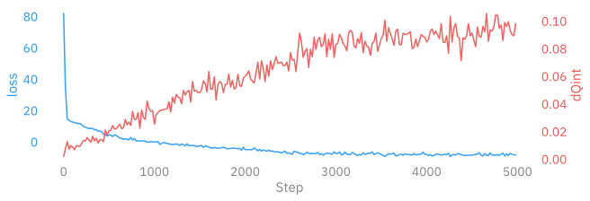
>
> </div>

</div>

``` python
# dset_train = ptExpU1.trainer.histories['train'].plot_all(num_chains=128)
dset_train_pt = ptExpU1.save_dataset(job_type='train', nchains=32)
```

<div>

> **<span class="code-text">`output`:</span>**
>
> <div class="cell-output cell-output-display">
>
> <pre style="white-space:pre;overflow-x:auto;line-height:normal;font-family:monospace"><span style="color: #838383; text-decoration-color: #838383">[2023-12-05 11:41:01]</span><span style="color: #2196F3; text-decoration-color: #2196F3">[INFO]</span><span style="color: #777777; text-decoration-color: #777777">[plot_helpers.py:1046]</span> - Saving figure to: <span style="color: #008000; text-decoration-color: #008000">/lus/grand/projects/DLHMC/foremans/locations/thetaGPU/projects/saforem2/l2hmc-qcd/src/l2hmc/notebooks/outputs/2023-12-05-111355/pytorch/plots/ridgeplots/svgs/</span><span style="color: #800080; text-decoration-color: #800080">energy_ridgeplot.svg</span> </pre>
> <pre style="white-space:pre;overflow-x:auto;line-height:normal;font-family:monospace"><span style="color: #838383; text-decoration-color: #838383">[2023-12-05 11:41:03]</span><span style="color: #2196F3; text-decoration-color: #2196F3">[INFO]</span><span style="color: #777777; text-decoration-color: #777777">[plot_helpers.py:1046]</span> - Saving figure to: <span style="color: #008000; text-decoration-color: #008000">/lus/grand/projects/DLHMC/foremans/locations/thetaGPU/projects/saforem2/l2hmc-qcd/src/l2hmc/notebooks/outputs/2023-12-05-111355/pytorch/plots/ridgeplots/svgs/</span><span style="color: #800080; text-decoration-color: #800080">logprob_ridgeplot.svg</span> </pre>
> <pre style="white-space:pre;overflow-x:auto;line-height:normal;font-family:monospace"><span style="color: #838383; text-decoration-color: #838383">[2023-12-05 11:41:05]</span><span style="color: #2196F3; text-decoration-color: #2196F3">[INFO]</span><span style="color: #777777; text-decoration-color: #777777">[plot_helpers.py:1046]</span> - Saving figure to: <span style="color: #008000; text-decoration-color: #008000">/lus/grand/projects/DLHMC/foremans/locations/thetaGPU/projects/saforem2/l2hmc-qcd/src/l2hmc/notebooks/outputs/2023-12-05-111355/pytorch/plots/ridgeplots/svgs/</span><span style="color: #800080; text-decoration-color: #800080">logdet_ridgeplot.svg</span> </pre>
> <pre style="white-space:pre;overflow-x:auto;line-height:normal;font-family:monospace"><span style="color: #838383; text-decoration-color: #838383">[2023-12-05 11:41:07]</span><span style="color: #2196F3; text-decoration-color: #2196F3">[INFO]</span><span style="color: #777777; text-decoration-color: #777777">[plot_helpers.py:1046]</span> - Saving figure to: <span style="color: #008000; text-decoration-color: #008000">/lus/grand/projects/DLHMC/foremans/locations/thetaGPU/projects/saforem2/l2hmc-qcd/src/l2hmc/notebooks/outputs/2023-12-05-111355/pytorch/plots/ridgeplots/svgs/</span><span style="color: #800080; text-decoration-color: #800080">sldf_ridgeplot.svg</span> </pre>
> <pre style="white-space:pre;overflow-x:auto;line-height:normal;font-family:monospace"><span style="color: #838383; text-decoration-color: #838383">[2023-12-05 11:41:09]</span><span style="color: #2196F3; text-decoration-color: #2196F3">[INFO]</span><span style="color: #777777; text-decoration-color: #777777">[plot_helpers.py:1046]</span> - Saving figure to: <span style="color: #008000; text-decoration-color: #008000">/lus/grand/projects/DLHMC/foremans/locations/thetaGPU/projects/saforem2/l2hmc-qcd/src/l2hmc/notebooks/outputs/2023-12-05-111355/pytorch/plots/ridgeplots/svgs/</span><span style="color: #800080; text-decoration-color: #800080">sldb_ridgeplot.svg</span> </pre>
> <pre style="white-space:pre;overflow-x:auto;line-height:normal;font-family:monospace"><span style="color: #838383; text-decoration-color: #838383">[2023-12-05 11:41:11]</span><span style="color: #2196F3; text-decoration-color: #2196F3">[INFO]</span><span style="color: #777777; text-decoration-color: #777777">[plot_helpers.py:1046]</span> - Saving figure to: <span style="color: #008000; text-decoration-color: #008000">/lus/grand/projects/DLHMC/foremans/locations/thetaGPU/projects/saforem2/l2hmc-qcd/src/l2hmc/notebooks/outputs/2023-12-05-111355/pytorch/plots/ridgeplots/svgs/</span><span style="color: #800080; text-decoration-color: #800080">sld_ridgeplot.svg</span> </pre>
> <pre style="white-space:pre;overflow-x:auto;line-height:normal;font-family:monospace"><span style="color: #838383; text-decoration-color: #838383">[2023-12-05 11:41:41]</span><span style="color: #2196F3; text-decoration-color: #2196F3">[INFO]</span><span style="color: #777777; text-decoration-color: #777777">[common.py:275]</span> - Saving dataset to: <span style="color: #008000; text-decoration-color: #008000">/lus/grand/projects/DLHMC/foremans/locations/thetaGPU/projects/saforem2/l2hmc-qcd/src/l2hmc/notebooks/outputs/2023-12-05-111355/pytorch/data/</span><span style="color: #800080; text-decoration-color: #800080">train_data.h5</span> </pre>
> <pre style="white-space:pre;overflow-x:auto;line-height:normal;font-family:monospace"><span style="color: #838383; text-decoration-color: #838383">[2023-12-05 11:41:42]</span><span style="color: #2196F3; text-decoration-color: #2196F3">[INFO]</span><span style="color: #777777; text-decoration-color: #777777">[experiment.py:378]</span> - Done saving and analyzing data. </pre>
> <pre style="white-space:pre;overflow-x:auto;line-height:normal;font-family:monospace"><span style="color: #838383; text-decoration-color: #838383">[2023-12-05 11:41:42]</span><span style="color: #2196F3; text-decoration-color: #2196F3">[INFO]</span><span style="color: #777777; text-decoration-color: #777777">[experiment.py:379]</span> - Creating summaries for WandB, Aim </pre>
>
> 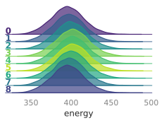
>
> 
>
> 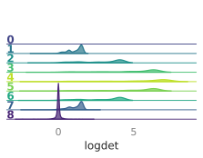
>
> 
>
> 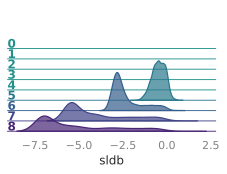
>
> 
>
> 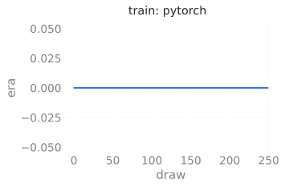
>
> 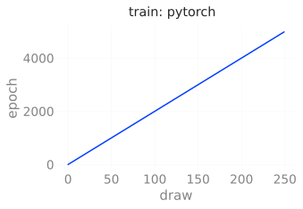
>
> 
>
> 
>
> 
>
> 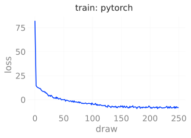
>
> 
>
> 
>
> 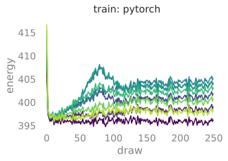
>
> 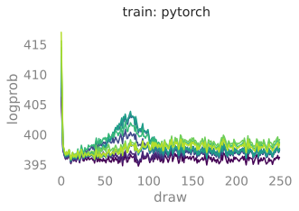
>
> 
>
> 
>
> 
>
> 
>
> 
>
> 
>
> 
>
> 
>
> 
>
> 
>
> 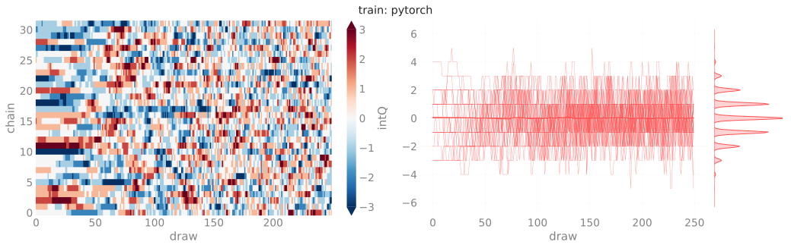
>
> 
>
> 
>
> </div>

</div>

### Inference

#### Evaluation

``` python
outputs['pytorch']['eval'] = ptExpU1.trainer.eval(
    job_type='eval',
    nprint=500,
    nchains=128,
    eval_steps=2000,
)
dset_eval_pt = ptExpU1.save_dataset(job_type='eval', nchains=32)
# dset_eval_pt = ptExpU1.trainer.histories['eval'].plot_all()
```

<div>

> **<span class="code-text">`output`:</span>**
>
> <div class="cell-output cell-output-display">
>
> <pre style="white-space:pre;overflow-x:auto;line-height:normal;font-family:monospace"><span style="color: #838383; text-decoration-color: #838383">[2023-12-05 11:42:03]</span><span style="color: #FD971F; text-decoration-color: #FD971F">[WARNING]</span><span style="color: #777777; text-decoration-color: #777777">[trainer.py:467]</span> - x.shape <span style="font-weight: bold">(</span>original<span style="font-weight: bold">)</span>: <span style="color: #800080; text-decoration-color: #800080; font-weight: bold">torch.Size</span><span style="font-weight: bold">([</span><span style="color: #1A8FFF; text-decoration-color: #1A8FFF; font-weight: bold">2048</span>, <span style="color: #1A8FFF; text-decoration-color: #1A8FFF; font-weight: bold">2</span>, <span style="color: #1A8FFF; text-decoration-color: #1A8FFF; font-weight: bold">16</span>, <span style="color: #1A8FFF; text-decoration-color: #1A8FFF; font-weight: bold">16</span><span style="font-weight: bold">])</span> </pre>
> <pre style="white-space:pre;overflow-x:auto;line-height:normal;font-family:monospace"><span style="color: #838383; text-decoration-color: #838383">[2023-12-05 11:42:03]</span><span style="color: #FD971F; text-decoration-color: #FD971F">[WARNING]</span><span style="color: #777777; text-decoration-color: #777777">[trainer.py:467]</span> - x<span style="font-weight: bold">[</span>:nchains<span style="font-weight: bold">]</span>.shape: <span style="color: #800080; text-decoration-color: #800080; font-weight: bold">torch.Size</span><span style="font-weight: bold">([</span><span style="color: #1A8FFF; text-decoration-color: #1A8FFF; font-weight: bold">128</span>, <span style="color: #1A8FFF; text-decoration-color: #1A8FFF; font-weight: bold">2</span>, <span style="color: #1A8FFF; text-decoration-color: #1A8FFF; font-weight: bold">16</span>, <span style="color: #1A8FFF; text-decoration-color: #1A8FFF; font-weight: bold">16</span><span style="font-weight: bold">])</span> </pre>
> <pre style="white-space:pre;overflow-x:auto;line-height:normal;font-family:monospace"><span style="color: #838383; text-decoration-color: #838383">[2023-12-05 11:42:03]</span><span style="color: #2196F3; text-decoration-color: #2196F3">[INFO]</span><span style="color: #777777; text-decoration-color: #777777">[trainer.py:1077]</span> - <span style="color: #ff00ff; text-decoration-color: #ff00ff; font-style: italic">eps</span>=<span style="color: #ff00ff; text-decoration-color: #ff00ff; font-style: italic">None</span>
> <span style="color: #ff00ff; text-decoration-color: #ff00ff; font-style: italic">beta</span>=<span style="color: #1A8FFF; text-decoration-color: #1A8FFF; font-weight: bold">4.0</span>
> <span style="color: #ff00ff; text-decoration-color: #ff00ff; font-style: italic">nlog</span>=<span style="color: #1A8FFF; text-decoration-color: #1A8FFF; font-weight: bold">10</span>
> <span style="color: #ff00ff; text-decoration-color: #ff00ff; font-style: italic">table</span>=<span style="font-weight: bold">&lt;</span><span style="color: #ff00ff; text-decoration-color: #ff00ff; font-weight: bold">rich.table.Table</span><span style="color: #000000; text-decoration-color: #000000"> object at </span><span style="color: #1A8FFF; text-decoration-color: #1A8FFF; font-weight: bold">0x7efbf40b16f0</span><span style="font-weight: bold">&gt;</span>
> <span style="color: #ff00ff; text-decoration-color: #ff00ff; font-style: italic">nprint</span>=<span style="color: #1A8FFF; text-decoration-color: #1A8FFF; font-weight: bold">500</span>
> <span style="color: #ff00ff; text-decoration-color: #ff00ff; font-style: italic">eval_steps</span>=<span style="color: #1A8FFF; text-decoration-color: #1A8FFF; font-weight: bold">2000</span>
> <span style="color: #ff00ff; text-decoration-color: #ff00ff; font-style: italic">nleapfrog</span>=<span style="color: #ff00ff; text-decoration-color: #ff00ff; font-style: italic">None</span> </pre>
>
> 
>
> <pre style="white-space:pre;overflow-x:auto;line-height:normal;font-family:monospace"><span style="color: #838383; text-decoration-color: #838383">[2023-12-05 11:42:06]</span><span style="color: #2196F3; text-decoration-color: #2196F3">[INFO]</span><span style="color: #777777; text-decoration-color: #777777">[trainer.py:1207]</span> - <span style="color: #ff00ff; text-decoration-color: #ff00ff; font-style: italic">estep</span>=<span style="color: #1A8FFF; text-decoration-color: #1A8FFF; font-weight: bold">0</span> <span style="color: #ff00ff; text-decoration-color: #ff00ff; font-style: italic">dt</span>=<span style="color: #1A8FFF; text-decoration-color: #1A8FFF; font-weight: bold">0.140</span> <span style="color: #ff00ff; text-decoration-color: #ff00ff; font-style: italic">beta</span>=<span style="color: #1A8FFF; text-decoration-color: #1A8FFF; font-weight: bold">4.000</span> <span style="color: #ff00ff; text-decoration-color: #ff00ff; font-style: italic">loss</span>=<span style="color: #1A8FFF; text-decoration-color: #1A8FFF; font-weight: bold">-9.137</span> <span style="color: #ff00ff; text-decoration-color: #ff00ff; font-style: italic">dQsin</span>=<span style="color: #1A8FFF; text-decoration-color: #1A8FFF; font-weight: bold">0.269</span> <span style="color: #ff00ff; text-decoration-color: #ff00ff; font-style: italic">dQint</span>=<span style="color: #1A8FFF; text-decoration-color: #1A8FFF; font-weight: bold">0.148</span> <span style="color: #ff00ff; text-decoration-color: #ff00ff; font-style: italic">energy</span>=<span style="color: #1A8FFF; text-decoration-color: #1A8FFF; font-weight: bold">407.745</span> <span style="color: #ff00ff; text-decoration-color: #ff00ff; font-style: italic">logprob</span>=<span style="color: #1A8FFF; text-decoration-color: #1A8FFF; font-weight: bold">404.067</span> <span style="color: #ff00ff; text-decoration-color: #ff00ff; font-style: italic">logdet</span>=<span style="color: #1A8FFF; text-decoration-color: #1A8FFF; font-weight: bold">3.678</span> <span style="color: #ff00ff; text-decoration-color: #ff00ff; font-style: italic">sldf</span>=<span style="color: #1A8FFF; text-decoration-color: #1A8FFF; font-weight: bold">2.253</span> <span style="color: #ff00ff; text-decoration-color: #ff00ff; font-style: italic">sldb</span>=<span style="color: #1A8FFF; text-decoration-color: #1A8FFF; font-weight: bold">-1.896</span> <span style="color: #ff00ff; text-decoration-color: #ff00ff; font-style: italic">sld</span>=<span style="color: #1A8FFF; text-decoration-color: #1A8FFF; font-weight: bold">3.678</span> <span style="color: #ff00ff; text-decoration-color: #ff00ff; font-style: italic">xeps</span>=<span style="color: #1A8FFF; text-decoration-color: #1A8FFF; font-weight: bold">0.145</span> <span style="color: #ff00ff; text-decoration-color: #ff00ff; font-style: italic">veps</span>=<span style="color: #1A8FFF; text-decoration-color: #1A8FFF; font-weight: bold">0.147</span> <span style="color: #ff00ff; text-decoration-color: #ff00ff; font-style: italic">acc</span>=<span style="color: #1A8FFF; text-decoration-color: #1A8FFF; font-weight: bold">0.913</span> <span style="color: #ff00ff; text-decoration-color: #ff00ff; font-style: italic">sumlogdet</span>=<span style="color: #1A8FFF; text-decoration-color: #1A8FFF; font-weight: bold">0.004</span> <span style="color: #ff00ff; text-decoration-color: #ff00ff; font-style: italic">acc_mask</span>=<span style="color: #1A8FFF; text-decoration-color: #1A8FFF; font-weight: bold">0.930</span> <span style="color: #ff00ff; text-decoration-color: #ff00ff; font-style: italic">plaqs</span>=<span style="color: #1A8FFF; text-decoration-color: #1A8FFF; font-weight: bold">0.854</span> <span style="color: #ff00ff; text-decoration-color: #ff00ff; font-style: italic">intQ</span>=<span style="color: #1A8FFF; text-decoration-color: #1A8FFF; font-weight: bold">0.156</span> <span style="color: #ff00ff; text-decoration-color: #ff00ff; font-style: italic">sinQ</span>=<span style="color: #1A8FFF; text-decoration-color: #1A8FFF; font-weight: bold">0.151</span> </pre>
> <pre style="white-space:pre;overflow-x:auto;line-height:normal;font-family:monospace"><span style="color: #838383; text-decoration-color: #838383">[2023-12-05 11:43:38]</span><span style="color: #2196F3; text-decoration-color: #2196F3">[INFO]</span><span style="color: #777777; text-decoration-color: #777777">[trainer.py:1207]</span> - <span style="color: #ff00ff; text-decoration-color: #ff00ff; font-style: italic">estep</span>=<span style="color: #1A8FFF; text-decoration-color: #1A8FFF; font-weight: bold">500</span> <span style="color: #ff00ff; text-decoration-color: #ff00ff; font-style: italic">dt</span>=<span style="color: #1A8FFF; text-decoration-color: #1A8FFF; font-weight: bold">0.119</span> <span style="color: #ff00ff; text-decoration-color: #ff00ff; font-style: italic">beta</span>=<span style="color: #1A8FFF; text-decoration-color: #1A8FFF; font-weight: bold">4.000</span> <span style="color: #ff00ff; text-decoration-color: #ff00ff; font-style: italic">loss</span>=<span style="color: #1A8FFF; text-decoration-color: #1A8FFF; font-weight: bold">-7.346</span> <span style="color: #ff00ff; text-decoration-color: #ff00ff; font-style: italic">dQsin</span>=<span style="color: #1A8FFF; text-decoration-color: #1A8FFF; font-weight: bold">0.264</span> <span style="color: #ff00ff; text-decoration-color: #ff00ff; font-style: italic">dQint</span>=<span style="color: #1A8FFF; text-decoration-color: #1A8FFF; font-weight: bold">0.125</span> <span style="color: #ff00ff; text-decoration-color: #ff00ff; font-style: italic">energy</span>=<span style="color: #1A8FFF; text-decoration-color: #1A8FFF; font-weight: bold">403.427</span> <span style="color: #ff00ff; text-decoration-color: #ff00ff; font-style: italic">logprob</span>=<span style="color: #1A8FFF; text-decoration-color: #1A8FFF; font-weight: bold">399.747</span> <span style="color: #ff00ff; text-decoration-color: #ff00ff; font-style: italic">logdet</span>=<span style="color: #1A8FFF; text-decoration-color: #1A8FFF; font-weight: bold">3.680</span> <span style="color: #ff00ff; text-decoration-color: #ff00ff; font-style: italic">sldf</span>=<span style="color: #1A8FFF; text-decoration-color: #1A8FFF; font-weight: bold">2.255</span> <span style="color: #ff00ff; text-decoration-color: #ff00ff; font-style: italic">sldb</span>=<span style="color: #1A8FFF; text-decoration-color: #1A8FFF; font-weight: bold">-1.906</span> <span style="color: #ff00ff; text-decoration-color: #ff00ff; font-style: italic">sld</span>=<span style="color: #1A8FFF; text-decoration-color: #1A8FFF; font-weight: bold">3.680</span> <span style="color: #ff00ff; text-decoration-color: #ff00ff; font-style: italic">xeps</span>=<span style="color: #1A8FFF; text-decoration-color: #1A8FFF; font-weight: bold">0.145</span> <span style="color: #ff00ff; text-decoration-color: #ff00ff; font-style: italic">veps</span>=<span style="color: #1A8FFF; text-decoration-color: #1A8FFF; font-weight: bold">0.147</span> <span style="color: #ff00ff; text-decoration-color: #ff00ff; font-style: italic">acc</span>=<span style="color: #1A8FFF; text-decoration-color: #1A8FFF; font-weight: bold">0.909</span> <span style="color: #ff00ff; text-decoration-color: #ff00ff; font-style: italic">sumlogdet</span>=<span style="color: #1A8FFF; text-decoration-color: #1A8FFF; font-weight: bold">0.005</span> <span style="color: #ff00ff; text-decoration-color: #ff00ff; font-style: italic">acc_mask</span>=<span style="color: #1A8FFF; text-decoration-color: #1A8FFF; font-weight: bold">0.883</span> <span style="color: #ff00ff; text-decoration-color: #ff00ff; font-style: italic">plaqs</span>=<span style="color: #1A8FFF; text-decoration-color: #1A8FFF; font-weight: bold">0.864</span> <span style="color: #ff00ff; text-decoration-color: #ff00ff; font-style: italic">intQ</span>=<span style="color: #1A8FFF; text-decoration-color: #1A8FFF; font-weight: bold">-0.305</span> <span style="color: #ff00ff; text-decoration-color: #ff00ff; font-style: italic">sinQ</span>=<span style="color: #1A8FFF; text-decoration-color: #1A8FFF; font-weight: bold">-0.216</span> </pre>
> <pre style="white-space:pre;overflow-x:auto;line-height:normal;font-family:monospace"><span style="color: #838383; text-decoration-color: #838383">[2023-12-05 11:45:11]</span><span style="color: #2196F3; text-decoration-color: #2196F3">[INFO]</span><span style="color: #777777; text-decoration-color: #777777">[trainer.py:1207]</span> - <span style="color: #ff00ff; text-decoration-color: #ff00ff; font-style: italic">estep</span>=<span style="color: #1A8FFF; text-decoration-color: #1A8FFF; font-weight: bold">1000</span> <span style="color: #ff00ff; text-decoration-color: #ff00ff; font-style: italic">dt</span>=<span style="color: #1A8FFF; text-decoration-color: #1A8FFF; font-weight: bold">0.119</span> <span style="color: #ff00ff; text-decoration-color: #ff00ff; font-style: italic">beta</span>=<span style="color: #1A8FFF; text-decoration-color: #1A8FFF; font-weight: bold">4.000</span> <span style="color: #ff00ff; text-decoration-color: #ff00ff; font-style: italic">loss</span>=<span style="color: #1A8FFF; text-decoration-color: #1A8FFF; font-weight: bold">-8.075</span> <span style="color: #ff00ff; text-decoration-color: #ff00ff; font-style: italic">dQsin</span>=<span style="color: #1A8FFF; text-decoration-color: #1A8FFF; font-weight: bold">0.287</span> <span style="color: #ff00ff; text-decoration-color: #ff00ff; font-style: italic">dQint</span>=<span style="color: #1A8FFF; text-decoration-color: #1A8FFF; font-weight: bold">0.133</span> <span style="color: #ff00ff; text-decoration-color: #ff00ff; font-style: italic">energy</span>=<span style="color: #1A8FFF; text-decoration-color: #1A8FFF; font-weight: bold">402.009</span> <span style="color: #ff00ff; text-decoration-color: #ff00ff; font-style: italic">logprob</span>=<span style="color: #1A8FFF; text-decoration-color: #1A8FFF; font-weight: bold">398.331</span> <span style="color: #ff00ff; text-decoration-color: #ff00ff; font-style: italic">logdet</span>=<span style="color: #1A8FFF; text-decoration-color: #1A8FFF; font-weight: bold">3.678</span> <span style="color: #ff00ff; text-decoration-color: #ff00ff; font-style: italic">sldf</span>=<span style="color: #1A8FFF; text-decoration-color: #1A8FFF; font-weight: bold">2.253</span> <span style="color: #ff00ff; text-decoration-color: #ff00ff; font-style: italic">sldb</span>=<span style="color: #1A8FFF; text-decoration-color: #1A8FFF; font-weight: bold">-1.898</span> <span style="color: #ff00ff; text-decoration-color: #ff00ff; font-style: italic">sld</span>=<span style="color: #1A8FFF; text-decoration-color: #1A8FFF; font-weight: bold">3.678</span> <span style="color: #ff00ff; text-decoration-color: #ff00ff; font-style: italic">xeps</span>=<span style="color: #1A8FFF; text-decoration-color: #1A8FFF; font-weight: bold">0.145</span> <span style="color: #ff00ff; text-decoration-color: #ff00ff; font-style: italic">veps</span>=<span style="color: #1A8FFF; text-decoration-color: #1A8FFF; font-weight: bold">0.147</span> <span style="color: #ff00ff; text-decoration-color: #ff00ff; font-style: italic">acc</span>=<span style="color: #1A8FFF; text-decoration-color: #1A8FFF; font-weight: bold">0.897</span> <span style="color: #ff00ff; text-decoration-color: #ff00ff; font-style: italic">sumlogdet</span>=<span style="color: #1A8FFF; text-decoration-color: #1A8FFF; font-weight: bold">0.005</span> <span style="color: #ff00ff; text-decoration-color: #ff00ff; font-style: italic">acc_mask</span>=<span style="color: #1A8FFF; text-decoration-color: #1A8FFF; font-weight: bold">0.945</span> <span style="color: #ff00ff; text-decoration-color: #ff00ff; font-style: italic">plaqs</span>=<span style="color: #1A8FFF; text-decoration-color: #1A8FFF; font-weight: bold">0.863</span> <span style="color: #ff00ff; text-decoration-color: #ff00ff; font-style: italic">intQ</span>=<span style="color: #1A8FFF; text-decoration-color: #1A8FFF; font-weight: bold">-0.023</span> <span style="color: #ff00ff; text-decoration-color: #ff00ff; font-style: italic">sinQ</span>=<span style="color: #1A8FFF; text-decoration-color: #1A8FFF; font-weight: bold">-0.042</span> </pre>
> <pre style="white-space:pre;overflow-x:auto;line-height:normal;font-family:monospace"><span style="color: #838383; text-decoration-color: #838383">[2023-12-05 11:46:44]</span><span style="color: #2196F3; text-decoration-color: #2196F3">[INFO]</span><span style="color: #777777; text-decoration-color: #777777">[trainer.py:1207]</span> - <span style="color: #ff00ff; text-decoration-color: #ff00ff; font-style: italic">estep</span>=<span style="color: #1A8FFF; text-decoration-color: #1A8FFF; font-weight: bold">1500</span> <span style="color: #ff00ff; text-decoration-color: #ff00ff; font-style: italic">dt</span>=<span style="color: #1A8FFF; text-decoration-color: #1A8FFF; font-weight: bold">0.119</span> <span style="color: #ff00ff; text-decoration-color: #ff00ff; font-style: italic">beta</span>=<span style="color: #1A8FFF; text-decoration-color: #1A8FFF; font-weight: bold">4.000</span> <span style="color: #ff00ff; text-decoration-color: #ff00ff; font-style: italic">loss</span>=<span style="color: #1A8FFF; text-decoration-color: #1A8FFF; font-weight: bold">-11.254</span> <span style="color: #ff00ff; text-decoration-color: #ff00ff; font-style: italic">dQsin</span>=<span style="color: #1A8FFF; text-decoration-color: #1A8FFF; font-weight: bold">0.261</span> <span style="color: #ff00ff; text-decoration-color: #ff00ff; font-style: italic">dQint</span>=<span style="color: #1A8FFF; text-decoration-color: #1A8FFF; font-weight: bold">0.109</span> <span style="color: #ff00ff; text-decoration-color: #ff00ff; font-style: italic">energy</span>=<span style="color: #1A8FFF; text-decoration-color: #1A8FFF; font-weight: bold">401.410</span> <span style="color: #ff00ff; text-decoration-color: #ff00ff; font-style: italic">logprob</span>=<span style="color: #1A8FFF; text-decoration-color: #1A8FFF; font-weight: bold">397.734</span> <span style="color: #ff00ff; text-decoration-color: #ff00ff; font-style: italic">logdet</span>=<span style="color: #1A8FFF; text-decoration-color: #1A8FFF; font-weight: bold">3.676</span> <span style="color: #ff00ff; text-decoration-color: #ff00ff; font-style: italic">sldf</span>=<span style="color: #1A8FFF; text-decoration-color: #1A8FFF; font-weight: bold">2.254</span> <span style="color: #ff00ff; text-decoration-color: #ff00ff; font-style: italic">sldb</span>=<span style="color: #1A8FFF; text-decoration-color: #1A8FFF; font-weight: bold">-1.918</span> <span style="color: #ff00ff; text-decoration-color: #ff00ff; font-style: italic">sld</span>=<span style="color: #1A8FFF; text-decoration-color: #1A8FFF; font-weight: bold">3.676</span> <span style="color: #ff00ff; text-decoration-color: #ff00ff; font-style: italic">xeps</span>=<span style="color: #1A8FFF; text-decoration-color: #1A8FFF; font-weight: bold">0.145</span> <span style="color: #ff00ff; text-decoration-color: #ff00ff; font-style: italic">veps</span>=<span style="color: #1A8FFF; text-decoration-color: #1A8FFF; font-weight: bold">0.147</span> <span style="color: #ff00ff; text-decoration-color: #ff00ff; font-style: italic">acc</span>=<span style="color: #1A8FFF; text-decoration-color: #1A8FFF; font-weight: bold">0.896</span> <span style="color: #ff00ff; text-decoration-color: #ff00ff; font-style: italic">sumlogdet</span>=<span style="color: #1A8FFF; text-decoration-color: #1A8FFF; font-weight: bold">0.004</span> <span style="color: #ff00ff; text-decoration-color: #ff00ff; font-style: italic">acc_mask</span>=<span style="color: #1A8FFF; text-decoration-color: #1A8FFF; font-weight: bold">0.875</span> <span style="color: #ff00ff; text-decoration-color: #ff00ff; font-style: italic">plaqs</span>=<span style="color: #1A8FFF; text-decoration-color: #1A8FFF; font-weight: bold">0.862</span> <span style="color: #ff00ff; text-decoration-color: #ff00ff; font-style: italic">intQ</span>=<span style="color: #1A8FFF; text-decoration-color: #1A8FFF; font-weight: bold">0.078</span> <span style="color: #ff00ff; text-decoration-color: #ff00ff; font-style: italic">sinQ</span>=<span style="color: #1A8FFF; text-decoration-color: #1A8FFF; font-weight: bold">0.071</span> </pre>
> <pre style="white-space:pre;overflow-x:auto;line-height:normal;font-family:monospace"><span style="color: #838383; text-decoration-color: #838383">[2023-12-05 11:48:21]</span><span style="color: #2196F3; text-decoration-color: #2196F3">[INFO]</span><span style="color: #777777; text-decoration-color: #777777">[plot_helpers.py:1046]</span> - Saving figure to: <span style="color: #008000; text-decoration-color: #008000">/lus/grand/projects/DLHMC/foremans/locations/thetaGPU/projects/saforem2/l2hmc-qcd/src/l2hmc/notebooks/outputs/2023-12-05-111355/pytorch/plots/ridgeplots/svgs/</span><span style="color: #800080; text-decoration-color: #800080">energy_ridgeplot.svg</span> </pre>
> <pre style="white-space:pre;overflow-x:auto;line-height:normal;font-family:monospace"><span style="color: #838383; text-decoration-color: #838383">[2023-12-05 11:48:23]</span><span style="color: #2196F3; text-decoration-color: #2196F3">[INFO]</span><span style="color: #777777; text-decoration-color: #777777">[plot_helpers.py:1046]</span> - Saving figure to: <span style="color: #008000; text-decoration-color: #008000">/lus/grand/projects/DLHMC/foremans/locations/thetaGPU/projects/saforem2/l2hmc-qcd/src/l2hmc/notebooks/outputs/2023-12-05-111355/pytorch/plots/ridgeplots/svgs/</span><span style="color: #800080; text-decoration-color: #800080">logprob_ridgeplot.svg</span> </pre>
> <pre style="white-space:pre;overflow-x:auto;line-height:normal;font-family:monospace"><span style="color: #838383; text-decoration-color: #838383">[2023-12-05 11:48:25]</span><span style="color: #2196F3; text-decoration-color: #2196F3">[INFO]</span><span style="color: #777777; text-decoration-color: #777777">[plot_helpers.py:1046]</span> - Saving figure to: <span style="color: #008000; text-decoration-color: #008000">/lus/grand/projects/DLHMC/foremans/locations/thetaGPU/projects/saforem2/l2hmc-qcd/src/l2hmc/notebooks/outputs/2023-12-05-111355/pytorch/plots/ridgeplots/svgs/</span><span style="color: #800080; text-decoration-color: #800080">logdet_ridgeplot.svg</span> </pre>
> <pre style="white-space:pre;overflow-x:auto;line-height:normal;font-family:monospace"><span style="color: #838383; text-decoration-color: #838383">[2023-12-05 11:48:27]</span><span style="color: #2196F3; text-decoration-color: #2196F3">[INFO]</span><span style="color: #777777; text-decoration-color: #777777">[plot_helpers.py:1046]</span> - Saving figure to: <span style="color: #008000; text-decoration-color: #008000">/lus/grand/projects/DLHMC/foremans/locations/thetaGPU/projects/saforem2/l2hmc-qcd/src/l2hmc/notebooks/outputs/2023-12-05-111355/pytorch/plots/ridgeplots/svgs/</span><span style="color: #800080; text-decoration-color: #800080">sldf_ridgeplot.svg</span> </pre>
> <pre style="white-space:pre;overflow-x:auto;line-height:normal;font-family:monospace"><span style="color: #838383; text-decoration-color: #838383">[2023-12-05 11:48:28]</span><span style="color: #2196F3; text-decoration-color: #2196F3">[INFO]</span><span style="color: #777777; text-decoration-color: #777777">[plot_helpers.py:1046]</span> - Saving figure to: <span style="color: #008000; text-decoration-color: #008000">/lus/grand/projects/DLHMC/foremans/locations/thetaGPU/projects/saforem2/l2hmc-qcd/src/l2hmc/notebooks/outputs/2023-12-05-111355/pytorch/plots/ridgeplots/svgs/</span><span style="color: #800080; text-decoration-color: #800080">sldb_ridgeplot.svg</span> </pre>
> <pre style="white-space:pre;overflow-x:auto;line-height:normal;font-family:monospace"><span style="color: #838383; text-decoration-color: #838383">[2023-12-05 11:48:30]</span><span style="color: #2196F3; text-decoration-color: #2196F3">[INFO]</span><span style="color: #777777; text-decoration-color: #777777">[plot_helpers.py:1046]</span> - Saving figure to: <span style="color: #008000; text-decoration-color: #008000">/lus/grand/projects/DLHMC/foremans/locations/thetaGPU/projects/saforem2/l2hmc-qcd/src/l2hmc/notebooks/outputs/2023-12-05-111355/pytorch/plots/ridgeplots/svgs/</span><span style="color: #800080; text-decoration-color: #800080">sld_ridgeplot.svg</span> </pre>
> <pre style="white-space:pre;overflow-x:auto;line-height:normal;font-family:monospace"><span style="color: #838383; text-decoration-color: #838383">[2023-12-05 11:48:45]</span><span style="color: #2196F3; text-decoration-color: #2196F3">[INFO]</span><span style="color: #777777; text-decoration-color: #777777">[common.py:275]</span> - Saving dataset to: <span style="color: #008000; text-decoration-color: #008000">/lus/grand/projects/DLHMC/foremans/locations/thetaGPU/projects/saforem2/l2hmc-qcd/src/l2hmc/notebooks/outputs/2023-12-05-111355/pytorch/data/</span><span style="color: #800080; text-decoration-color: #800080">eval_data.h5</span> </pre>
> <pre style="white-space:pre;overflow-x:auto;line-height:normal;font-family:monospace"><span style="color: #838383; text-decoration-color: #838383">[2023-12-05 11:48:45]</span><span style="color: #2196F3; text-decoration-color: #2196F3">[INFO]</span><span style="color: #777777; text-decoration-color: #777777">[experiment.py:378]</span> - Done saving and analyzing data. </pre>
> <pre style="white-space:pre;overflow-x:auto;line-height:normal;font-family:monospace"><span style="color: #838383; text-decoration-color: #838383">[2023-12-05 11:48:45]</span><span style="color: #2196F3; text-decoration-color: #2196F3">[INFO]</span><span style="color: #777777; text-decoration-color: #777777">[experiment.py:379]</span> - Creating summaries for WandB, Aim </pre>
>
> 
>
> 
>
> 
>
> 
>
> 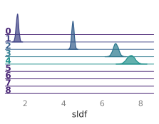
>
> 
>
> 
>
> 
>
> 
>
> 
>
> 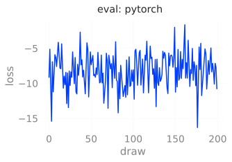
>
> 
>
> 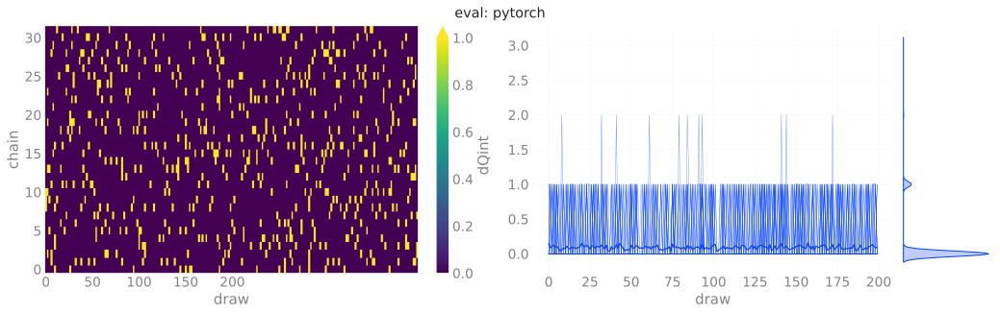
>
> 
>
> 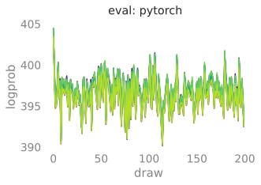
>
> 
>
> 
>
> 
>
> 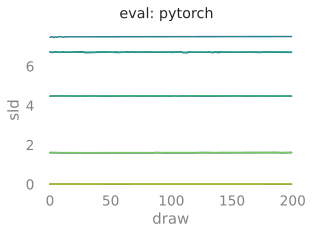
>
> 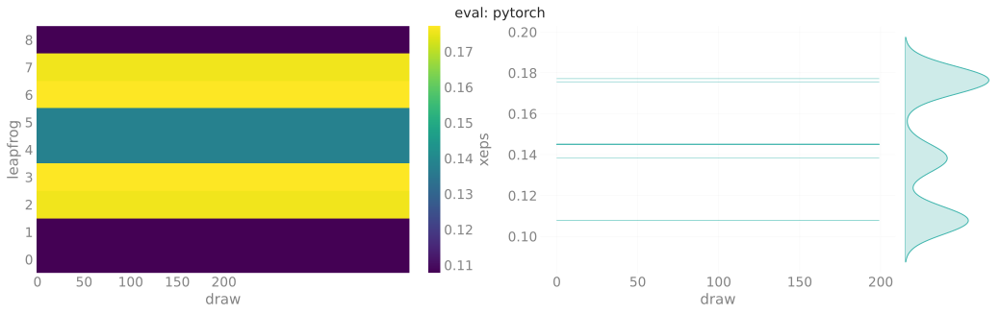
>
> 
>
> 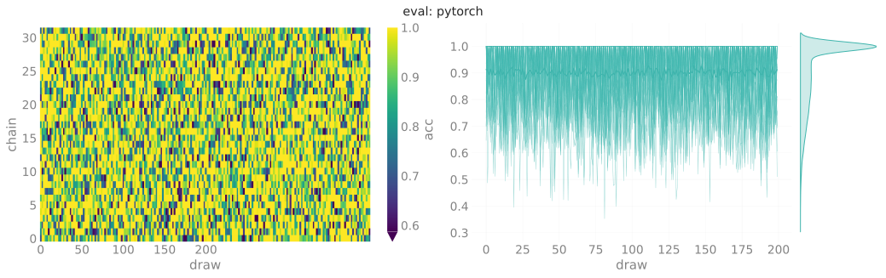
>
> 
>
> 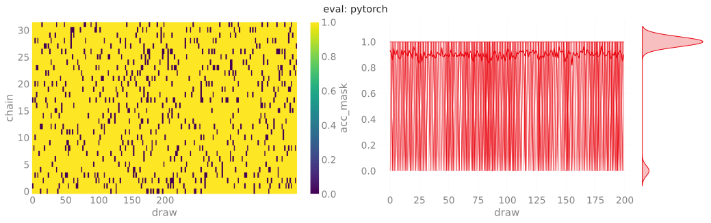
>
> 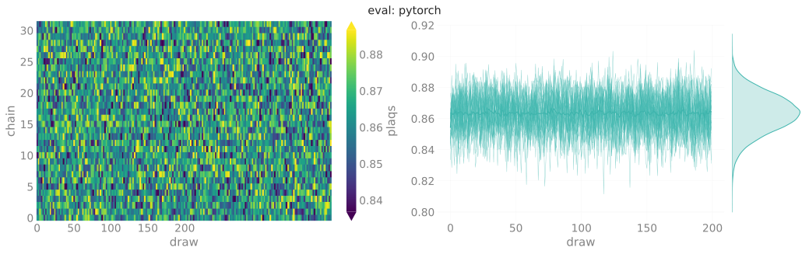
>
> 
>
> 
>
> </div>

</div>

#### HMC

``` python
outputs['pytorch']['hmc'] = ptExpU1.trainer.eval(
    job_type='hmc',
    nprint=500,
    nchains=128,
    eval_steps=2000,
)
dset_hmc_pt = ptExpU1.save_dataset(job_type='hmc', nchains=32)
# dset_hmc_pt = ptExpU1.trainer.histories['hmc'].plot_all()
```

<div>

> **<span class="code-text">`output`:</span>**
>
> <div class="cell-output cell-output-display">
>
> <pre style="white-space:pre;overflow-x:auto;line-height:normal;font-family:monospace"><span style="color: #838383; text-decoration-color: #838383">[2023-12-05 11:49:07]</span><span style="color: #FD971F; text-decoration-color: #FD971F">[WARNING]</span><span style="color: #777777; text-decoration-color: #777777">[trainer.py:467]</span> - Step size `eps` not specified for HMC! Using default: <span style="color: #1A8FFF; text-decoration-color: #1A8FFF; font-weight: bold">0.2500</span> for generic HMC </pre>
> <pre style="white-space:pre;overflow-x:auto;line-height:normal;font-family:monospace"><span style="color: #838383; text-decoration-color: #838383">[2023-12-05 11:49:07]</span><span style="color: #FD971F; text-decoration-color: #FD971F">[WARNING]</span><span style="color: #777777; text-decoration-color: #777777">[trainer.py:467]</span> - x.shape <span style="font-weight: bold">(</span>original<span style="font-weight: bold">)</span>: <span style="color: #800080; text-decoration-color: #800080; font-weight: bold">torch.Size</span><span style="font-weight: bold">([</span><span style="color: #1A8FFF; text-decoration-color: #1A8FFF; font-weight: bold">2048</span>, <span style="color: #1A8FFF; text-decoration-color: #1A8FFF; font-weight: bold">2</span>, <span style="color: #1A8FFF; text-decoration-color: #1A8FFF; font-weight: bold">16</span>, <span style="color: #1A8FFF; text-decoration-color: #1A8FFF; font-weight: bold">16</span><span style="font-weight: bold">])</span> </pre>
> <pre style="white-space:pre;overflow-x:auto;line-height:normal;font-family:monospace"><span style="color: #838383; text-decoration-color: #838383">[2023-12-05 11:49:07]</span><span style="color: #FD971F; text-decoration-color: #FD971F">[WARNING]</span><span style="color: #777777; text-decoration-color: #777777">[trainer.py:467]</span> - x<span style="font-weight: bold">[</span>:nchains<span style="font-weight: bold">]</span>.shape: <span style="color: #800080; text-decoration-color: #800080; font-weight: bold">torch.Size</span><span style="font-weight: bold">([</span><span style="color: #1A8FFF; text-decoration-color: #1A8FFF; font-weight: bold">128</span>, <span style="color: #1A8FFF; text-decoration-color: #1A8FFF; font-weight: bold">2</span>, <span style="color: #1A8FFF; text-decoration-color: #1A8FFF; font-weight: bold">16</span>, <span style="color: #1A8FFF; text-decoration-color: #1A8FFF; font-weight: bold">16</span><span style="font-weight: bold">])</span> </pre>
> <pre style="white-space:pre;overflow-x:auto;line-height:normal;font-family:monospace"><span style="color: #838383; text-decoration-color: #838383">[2023-12-05 11:49:07]</span><span style="color: #2196F3; text-decoration-color: #2196F3">[INFO]</span><span style="color: #777777; text-decoration-color: #777777">[trainer.py:1077]</span> - <span style="color: #ff00ff; text-decoration-color: #ff00ff; font-style: italic">eps</span>=<span style="color: #1A8FFF; text-decoration-color: #1A8FFF; font-weight: bold">0.25</span>
> <span style="color: #ff00ff; text-decoration-color: #ff00ff; font-style: italic">beta</span>=<span style="color: #1A8FFF; text-decoration-color: #1A8FFF; font-weight: bold">4.0</span>
> <span style="color: #ff00ff; text-decoration-color: #ff00ff; font-style: italic">nlog</span>=<span style="color: #1A8FFF; text-decoration-color: #1A8FFF; font-weight: bold">10</span>
> <span style="color: #ff00ff; text-decoration-color: #ff00ff; font-style: italic">table</span>=<span style="font-weight: bold">&lt;</span><span style="color: #ff00ff; text-decoration-color: #ff00ff; font-weight: bold">rich.table.Table</span><span style="color: #000000; text-decoration-color: #000000"> object at </span><span style="color: #1A8FFF; text-decoration-color: #1A8FFF; font-weight: bold">0x7efbf4167580</span><span style="font-weight: bold">&gt;</span>
> <span style="color: #ff00ff; text-decoration-color: #ff00ff; font-style: italic">nprint</span>=<span style="color: #1A8FFF; text-decoration-color: #1A8FFF; font-weight: bold">500</span>
> <span style="color: #ff00ff; text-decoration-color: #ff00ff; font-style: italic">eval_steps</span>=<span style="color: #1A8FFF; text-decoration-color: #1A8FFF; font-weight: bold">2000</span>
> <span style="color: #ff00ff; text-decoration-color: #ff00ff; font-style: italic">nleapfrog</span>=<span style="color: #1A8FFF; text-decoration-color: #1A8FFF; font-weight: bold">8</span> </pre>
>
> 
>
> <pre style="white-space:pre;overflow-x:auto;line-height:normal;font-family:monospace"><span style="color: #838383; text-decoration-color: #838383">[2023-12-05 11:49:09]</span><span style="color: #2196F3; text-decoration-color: #2196F3">[INFO]</span><span style="color: #777777; text-decoration-color: #777777">[trainer.py:1207]</span> - <span style="color: #ff00ff; text-decoration-color: #ff00ff; font-style: italic">hstep</span>=<span style="color: #1A8FFF; text-decoration-color: #1A8FFF; font-weight: bold">0</span> <span style="color: #ff00ff; text-decoration-color: #ff00ff; font-style: italic">dt</span>=<span style="color: #1A8FFF; text-decoration-color: #1A8FFF; font-weight: bold">0.018</span> <span style="color: #ff00ff; text-decoration-color: #ff00ff; font-style: italic">beta</span>=<span style="color: #1A8FFF; text-decoration-color: #1A8FFF; font-weight: bold">4.000</span> <span style="color: #ff00ff; text-decoration-color: #ff00ff; font-style: italic">loss</span>=<span style="color: #1A8FFF; text-decoration-color: #1A8FFF; font-weight: bold">46.645</span> <span style="color: #ff00ff; text-decoration-color: #ff00ff; font-style: italic">dQsin</span>=<span style="color: #1A8FFF; text-decoration-color: #1A8FFF; font-weight: bold">0.039</span> <span style="color: #ff00ff; text-decoration-color: #ff00ff; font-style: italic">dQint</span>=<span style="color: #1A8FFF; text-decoration-color: #1A8FFF; font-weight: bold">0.031</span> <span style="color: #ff00ff; text-decoration-color: #ff00ff; font-style: italic">energy</span>=<span style="color: #1A8FFF; text-decoration-color: #1A8FFF; font-weight: bold">412.712</span> <span style="color: #ff00ff; text-decoration-color: #ff00ff; font-style: italic">logprob</span>=<span style="color: #1A8FFF; text-decoration-color: #1A8FFF; font-weight: bold">412.712</span> <span style="color: #ff00ff; text-decoration-color: #ff00ff; font-style: italic">logdet</span>=<span style="color: #1A8FFF; text-decoration-color: #1A8FFF; font-weight: bold">0.000</span> <span style="color: #ff00ff; text-decoration-color: #ff00ff; font-style: italic">acc</span>=<span style="color: #1A8FFF; text-decoration-color: #1A8FFF; font-weight: bold">0.114</span> <span style="color: #ff00ff; text-decoration-color: #ff00ff; font-style: italic">sumlogdet</span>=<span style="color: #1A8FFF; text-decoration-color: #1A8FFF; font-weight: bold">0.000</span> <span style="color: #ff00ff; text-decoration-color: #ff00ff; font-style: italic">acc_mask</span>=<span style="color: #1A8FFF; text-decoration-color: #1A8FFF; font-weight: bold">0.125</span> <span style="color: #ff00ff; text-decoration-color: #ff00ff; font-style: italic">plaqs</span>=<span style="color: #1A8FFF; text-decoration-color: #1A8FFF; font-weight: bold">0.853</span> <span style="color: #ff00ff; text-decoration-color: #ff00ff; font-style: italic">intQ</span>=<span style="color: #1A8FFF; text-decoration-color: #1A8FFF; font-weight: bold">-0.117</span> <span style="color: #ff00ff; text-decoration-color: #ff00ff; font-style: italic">sinQ</span>=<span style="color: #1A8FFF; text-decoration-color: #1A8FFF; font-weight: bold">-0.126</span> </pre>
> <pre style="white-space:pre;overflow-x:auto;line-height:normal;font-family:monospace"><span style="color: #838383; text-decoration-color: #838383">[2023-12-05 11:49:50]</span><span style="color: #2196F3; text-decoration-color: #2196F3">[INFO]</span><span style="color: #777777; text-decoration-color: #777777">[trainer.py:1207]</span> - <span style="color: #ff00ff; text-decoration-color: #ff00ff; font-style: italic">hstep</span>=<span style="color: #1A8FFF; text-decoration-color: #1A8FFF; font-weight: bold">500</span> <span style="color: #ff00ff; text-decoration-color: #ff00ff; font-style: italic">dt</span>=<span style="color: #1A8FFF; text-decoration-color: #1A8FFF; font-weight: bold">0.018</span> <span style="color: #ff00ff; text-decoration-color: #ff00ff; font-style: italic">beta</span>=<span style="color: #1A8FFF; text-decoration-color: #1A8FFF; font-weight: bold">4.000</span> <span style="color: #ff00ff; text-decoration-color: #ff00ff; font-style: italic">loss</span>=<span style="color: #1A8FFF; text-decoration-color: #1A8FFF; font-weight: bold">51.958</span> <span style="color: #ff00ff; text-decoration-color: #ff00ff; font-style: italic">dQsin</span>=<span style="color: #1A8FFF; text-decoration-color: #1A8FFF; font-weight: bold">0.014</span> <span style="color: #ff00ff; text-decoration-color: #ff00ff; font-style: italic">dQint</span>=<span style="color: #1A8FFF; text-decoration-color: #1A8FFF; font-weight: bold">0.000</span> <span style="color: #ff00ff; text-decoration-color: #ff00ff; font-style: italic">energy</span>=<span style="color: #1A8FFF; text-decoration-color: #1A8FFF; font-weight: bold">401.030</span> <span style="color: #ff00ff; text-decoration-color: #ff00ff; font-style: italic">logprob</span>=<span style="color: #1A8FFF; text-decoration-color: #1A8FFF; font-weight: bold">401.030</span> <span style="color: #ff00ff; text-decoration-color: #ff00ff; font-style: italic">logdet</span>=<span style="color: #1A8FFF; text-decoration-color: #1A8FFF; font-weight: bold">0.000</span> <span style="color: #ff00ff; text-decoration-color: #ff00ff; font-style: italic">acc</span>=<span style="color: #1A8FFF; text-decoration-color: #1A8FFF; font-weight: bold">0.054</span> <span style="color: #ff00ff; text-decoration-color: #ff00ff; font-style: italic">sumlogdet</span>=<span style="color: #1A8FFF; text-decoration-color: #1A8FFF; font-weight: bold">0.000</span> <span style="color: #ff00ff; text-decoration-color: #ff00ff; font-style: italic">acc_mask</span>=<span style="color: #1A8FFF; text-decoration-color: #1A8FFF; font-weight: bold">0.055</span> <span style="color: #ff00ff; text-decoration-color: #ff00ff; font-style: italic">plaqs</span>=<span style="color: #1A8FFF; text-decoration-color: #1A8FFF; font-weight: bold">0.863</span> <span style="color: #ff00ff; text-decoration-color: #ff00ff; font-style: italic">intQ</span>=<span style="color: #1A8FFF; text-decoration-color: #1A8FFF; font-weight: bold">-0.016</span> <span style="color: #ff00ff; text-decoration-color: #ff00ff; font-style: italic">sinQ</span>=<span style="color: #1A8FFF; text-decoration-color: #1A8FFF; font-weight: bold">-0.038</span> </pre>
> <pre style="white-space:pre;overflow-x:auto;line-height:normal;font-family:monospace"><span style="color: #838383; text-decoration-color: #838383">[2023-12-05 11:50:31]</span><span style="color: #2196F3; text-decoration-color: #2196F3">[INFO]</span><span style="color: #777777; text-decoration-color: #777777">[trainer.py:1207]</span> - <span style="color: #ff00ff; text-decoration-color: #ff00ff; font-style: italic">hstep</span>=<span style="color: #1A8FFF; text-decoration-color: #1A8FFF; font-weight: bold">1000</span> <span style="color: #ff00ff; text-decoration-color: #ff00ff; font-style: italic">dt</span>=<span style="color: #1A8FFF; text-decoration-color: #1A8FFF; font-weight: bold">0.017</span> <span style="color: #ff00ff; text-decoration-color: #ff00ff; font-style: italic">beta</span>=<span style="color: #1A8FFF; text-decoration-color: #1A8FFF; font-weight: bold">4.000</span> <span style="color: #ff00ff; text-decoration-color: #ff00ff; font-style: italic">loss</span>=<span style="color: #1A8FFF; text-decoration-color: #1A8FFF; font-weight: bold">58.470</span> <span style="color: #ff00ff; text-decoration-color: #ff00ff; font-style: italic">dQsin</span>=<span style="color: #1A8FFF; text-decoration-color: #1A8FFF; font-weight: bold">0.017</span> <span style="color: #ff00ff; text-decoration-color: #ff00ff; font-style: italic">dQint</span>=<span style="color: #1A8FFF; text-decoration-color: #1A8FFF; font-weight: bold">0.016</span> <span style="color: #ff00ff; text-decoration-color: #ff00ff; font-style: italic">energy</span>=<span style="color: #1A8FFF; text-decoration-color: #1A8FFF; font-weight: bold">403.846</span> <span style="color: #ff00ff; text-decoration-color: #ff00ff; font-style: italic">logprob</span>=<span style="color: #1A8FFF; text-decoration-color: #1A8FFF; font-weight: bold">403.846</span> <span style="color: #ff00ff; text-decoration-color: #ff00ff; font-style: italic">logdet</span>=<span style="color: #1A8FFF; text-decoration-color: #1A8FFF; font-weight: bold">0.000</span> <span style="color: #ff00ff; text-decoration-color: #ff00ff; font-style: italic">acc</span>=<span style="color: #1A8FFF; text-decoration-color: #1A8FFF; font-weight: bold">0.055</span> <span style="color: #ff00ff; text-decoration-color: #ff00ff; font-style: italic">sumlogdet</span>=<span style="color: #1A8FFF; text-decoration-color: #1A8FFF; font-weight: bold">0.000</span> <span style="color: #ff00ff; text-decoration-color: #ff00ff; font-style: italic">acc_mask</span>=<span style="color: #1A8FFF; text-decoration-color: #1A8FFF; font-weight: bold">0.055</span> <span style="color: #ff00ff; text-decoration-color: #ff00ff; font-style: italic">plaqs</span>=<span style="color: #1A8FFF; text-decoration-color: #1A8FFF; font-weight: bold">0.862</span> <span style="color: #ff00ff; text-decoration-color: #ff00ff; font-style: italic">intQ</span>=<span style="color: #1A8FFF; text-decoration-color: #1A8FFF; font-weight: bold">-0.078</span> <span style="color: #ff00ff; text-decoration-color: #ff00ff; font-style: italic">sinQ</span>=<span style="color: #1A8FFF; text-decoration-color: #1A8FFF; font-weight: bold">-0.089</span> </pre>
> <pre style="white-space:pre;overflow-x:auto;line-height:normal;font-family:monospace"><span style="color: #838383; text-decoration-color: #838383">[2023-12-05 11:51:13]</span><span style="color: #2196F3; text-decoration-color: #2196F3">[INFO]</span><span style="color: #777777; text-decoration-color: #777777">[trainer.py:1207]</span> - <span style="color: #ff00ff; text-decoration-color: #ff00ff; font-style: italic">hstep</span>=<span style="color: #1A8FFF; text-decoration-color: #1A8FFF; font-weight: bold">1500</span> <span style="color: #ff00ff; text-decoration-color: #ff00ff; font-style: italic">dt</span>=<span style="color: #1A8FFF; text-decoration-color: #1A8FFF; font-weight: bold">0.017</span> <span style="color: #ff00ff; text-decoration-color: #ff00ff; font-style: italic">beta</span>=<span style="color: #1A8FFF; text-decoration-color: #1A8FFF; font-weight: bold">4.000</span> <span style="color: #ff00ff; text-decoration-color: #ff00ff; font-style: italic">loss</span>=<span style="color: #1A8FFF; text-decoration-color: #1A8FFF; font-weight: bold">54.941</span> <span style="color: #ff00ff; text-decoration-color: #ff00ff; font-style: italic">dQsin</span>=<span style="color: #1A8FFF; text-decoration-color: #1A8FFF; font-weight: bold">0.014</span> <span style="color: #ff00ff; text-decoration-color: #ff00ff; font-style: italic">dQint</span>=<span style="color: #1A8FFF; text-decoration-color: #1A8FFF; font-weight: bold">0.000</span> <span style="color: #ff00ff; text-decoration-color: #ff00ff; font-style: italic">energy</span>=<span style="color: #1A8FFF; text-decoration-color: #1A8FFF; font-weight: bold">400.502</span> <span style="color: #ff00ff; text-decoration-color: #ff00ff; font-style: italic">logprob</span>=<span style="color: #1A8FFF; text-decoration-color: #1A8FFF; font-weight: bold">400.502</span> <span style="color: #ff00ff; text-decoration-color: #ff00ff; font-style: italic">logdet</span>=<span style="color: #1A8FFF; text-decoration-color: #1A8FFF; font-weight: bold">0.000</span> <span style="color: #ff00ff; text-decoration-color: #ff00ff; font-style: italic">acc</span>=<span style="color: #1A8FFF; text-decoration-color: #1A8FFF; font-weight: bold">0.056</span> <span style="color: #ff00ff; text-decoration-color: #ff00ff; font-style: italic">sumlogdet</span>=<span style="color: #1A8FFF; text-decoration-color: #1A8FFF; font-weight: bold">0.000</span> <span style="color: #ff00ff; text-decoration-color: #ff00ff; font-style: italic">acc_mask</span>=<span style="color: #1A8FFF; text-decoration-color: #1A8FFF; font-weight: bold">0.047</span> <span style="color: #ff00ff; text-decoration-color: #ff00ff; font-style: italic">plaqs</span>=<span style="color: #1A8FFF; text-decoration-color: #1A8FFF; font-weight: bold">0.865</span> <span style="color: #ff00ff; text-decoration-color: #ff00ff; font-style: italic">intQ</span>=<span style="color: #1A8FFF; text-decoration-color: #1A8FFF; font-weight: bold">-0.117</span> <span style="color: #ff00ff; text-decoration-color: #ff00ff; font-style: italic">sinQ</span>=<span style="color: #1A8FFF; text-decoration-color: #1A8FFF; font-weight: bold">-0.096</span> </pre>
> <pre style="white-space:pre;overflow-x:auto;line-height:normal;font-family:monospace"><span style="color: #838383; text-decoration-color: #838383">[2023-12-05 11:51:58]</span><span style="color: #2196F3; text-decoration-color: #2196F3">[INFO]</span><span style="color: #777777; text-decoration-color: #777777">[plot_helpers.py:1046]</span> - Saving figure to: <span style="color: #008000; text-decoration-color: #008000">/lus/grand/projects/DLHMC/foremans/locations/thetaGPU/projects/saforem2/l2hmc-qcd/src/l2hmc/notebooks/outputs/2023-12-05-111355/pytorch/plots/ridgeplots/svgs/</span><span style="color: #800080; text-decoration-color: #800080">energy_ridgeplot.svg</span> </pre>
> <pre style="white-space:pre;overflow-x:auto;line-height:normal;font-family:monospace"><span style="color: #838383; text-decoration-color: #838383">[2023-12-05 11:52:00]</span><span style="color: #2196F3; text-decoration-color: #2196F3">[INFO]</span><span style="color: #777777; text-decoration-color: #777777">[plot_helpers.py:1046]</span> - Saving figure to: <span style="color: #008000; text-decoration-color: #008000">/lus/grand/projects/DLHMC/foremans/locations/thetaGPU/projects/saforem2/l2hmc-qcd/src/l2hmc/notebooks/outputs/2023-12-05-111355/pytorch/plots/ridgeplots/svgs/</span><span style="color: #800080; text-decoration-color: #800080">logprob_ridgeplot.svg</span> </pre>
> <pre style="white-space:pre;overflow-x:auto;line-height:normal;font-family:monospace"><span style="color: #838383; text-decoration-color: #838383">[2023-12-05 11:52:02]</span><span style="color: #2196F3; text-decoration-color: #2196F3">[INFO]</span><span style="color: #777777; text-decoration-color: #777777">[plot_helpers.py:1046]</span> - Saving figure to: <span style="color: #008000; text-decoration-color: #008000">/lus/grand/projects/DLHMC/foremans/locations/thetaGPU/projects/saforem2/l2hmc-qcd/src/l2hmc/notebooks/outputs/2023-12-05-111355/pytorch/plots/ridgeplots/svgs/</span><span style="color: #800080; text-decoration-color: #800080">logdet_ridgeplot.svg</span> </pre>
> <pre style="white-space:pre;overflow-x:auto;line-height:normal;font-family:monospace"><span style="color: #838383; text-decoration-color: #838383">[2023-12-05 11:52:14]</span><span style="color: #2196F3; text-decoration-color: #2196F3">[INFO]</span><span style="color: #777777; text-decoration-color: #777777">[common.py:275]</span> - Saving dataset to: <span style="color: #008000; text-decoration-color: #008000">/lus/grand/projects/DLHMC/foremans/locations/thetaGPU/projects/saforem2/l2hmc-qcd/src/l2hmc/notebooks/outputs/2023-12-05-111355/pytorch/data/</span><span style="color: #800080; text-decoration-color: #800080">hmc_data.h5</span> </pre>
> <pre style="white-space:pre;overflow-x:auto;line-height:normal;font-family:monospace"><span style="color: #838383; text-decoration-color: #838383">[2023-12-05 11:52:14]</span><span style="color: #2196F3; text-decoration-color: #2196F3">[INFO]</span><span style="color: #777777; text-decoration-color: #777777">[experiment.py:378]</span> - Done saving and analyzing data. </pre>
> <pre style="white-space:pre;overflow-x:auto;line-height:normal;font-family:monospace"><span style="color: #838383; text-decoration-color: #838383">[2023-12-05 11:52:14]</span><span style="color: #2196F3; text-decoration-color: #2196F3">[INFO]</span><span style="color: #777777; text-decoration-color: #777777">[experiment.py:379]</span> - Creating summaries for WandB, Aim </pre>
>
> 
>
> 
>
> 
>
> 
>
> 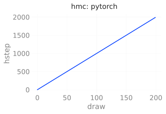
>
> 
>
> 
>
> 
>
> 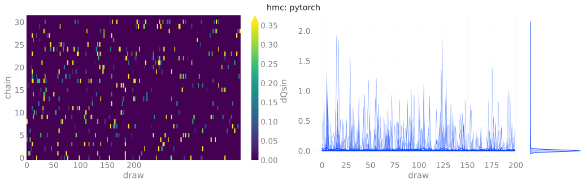
>
> 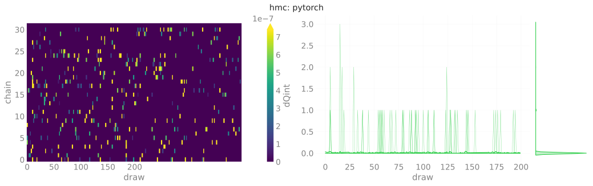
>
> 
>
> 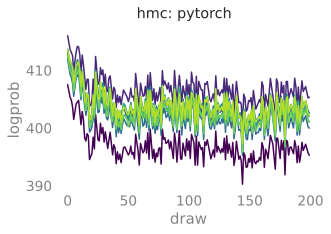
>
> 
>
> 
>
> 
>
> 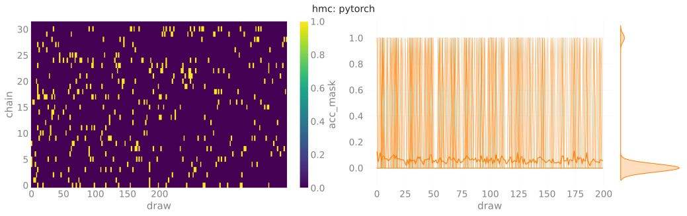
>
> 
>
> 
>
> 
>
> </div>

</div>

## TensorFlow

### Train

``` python
outputs['tensorflow']['train'] = tfExpU1.trainer.train(
    nera=1,
    nepoch=5000,
    beta=4.0,
    # beta=[4.0, 4.25, 4.5, 4.75, 5.0],
)
# dset_train_tf = tfExpU1.trainer.histories['train'].plot_all()
_ = tfExpU1.save_dataset(job_type='train', nchains=32)
```


<div>

> **<span class="code-text">`output`:</span>**
>
> <div class="cell-output cell-output-display">
>
> <pre style="white-space:pre;overflow-x:auto;line-height:normal;font-family:monospace"><span style="color: #838383; text-decoration-color: #838383">[2023-12-05 11:52:30]</span><span style="color: #2196F3; text-decoration-color: #2196F3">[INFO]</span><span style="color: #777777; text-decoration-color: #777777">[trainer.py:198]</span> - Looking for checkpoints in: <span style="color: #008000; text-decoration-color: #008000">/lus/grand/projects/DLHMC/foremans/locations/thetaGPU/projects/saforem2/l2hmc-qcd/src/l2hmc/checkpoints/U1/2-16-16/nlf-4/xsplit-True/sepnets-True/merge-True/net-16-16-16-16_dp-0.2_bn-True/</span><span style="color: #800080; text-decoration-color: #800080">tensorflow</span> </pre>
> <pre style="white-space:pre;overflow-x:auto;line-height:normal;font-family:monospace"><span style="color: #838383; text-decoration-color: #838383">[2023-12-05 11:52:30]</span><span style="color: #2196F3; text-decoration-color: #2196F3">[INFO]</span><span style="color: #777777; text-decoration-color: #777777">[trainer.py:198]</span> - No checkpoints found to load from. Continuing </pre>
> <!-- {.stretch} -->
> <pre style="white-space:pre;overflow-x:auto;line-height:normal;font-family:monospace"><span style="color: #838383; text-decoration-color: #838383">[2023-12-05 11:52:31]</span><span style="color: #2196F3; text-decoration-color: #2196F3">[INFO]</span><span style="color: #777777; text-decoration-color: #777777">[trainer.py:1259]</span> - ERA: <span style="color: #1A8FFF; text-decoration-color: #1A8FFF; font-weight: bold">0</span> <span style="color: #008000; text-decoration-color: #008000">/</span> <span style="color: #1A8FFF; text-decoration-color: #1A8FFF; font-weight: bold">1</span>, BETA: <span style="color: #1A8FFF; text-decoration-color: #1A8FFF; font-weight: bold">4.000</span> </pre>
> <pre style="white-space:pre;overflow-x:auto;line-height:normal;font-family:monospace"><span style="color: #838383; text-decoration-color: #838383">[2023-12-05 11:53:11]</span><span style="color: #2196F3; text-decoration-color: #2196F3">[INFO]</span><span style="color: #777777; text-decoration-color: #777777">[trainer.py:198]</span> - Thermalizing configs @ <span style="color: #1A8FFF; text-decoration-color: #1A8FFF; font-weight: bold">4.00</span> took <span style="color: #1A8FFF; text-decoration-color: #1A8FFF; font-weight: bold">40.3690</span> s </pre>
>
>     Training:   0%|          | 0/5000 [00:00<?, ?it/s]
>
> <pre style="white-space:pre;overflow-x:auto;line-height:normal;font-family:monospace"><span style="color: #838383; text-decoration-color: #838383">[2023-12-05 11:53:21]</span><span style="color: #FD971F; text-decoration-color: #FD971F">[WARNING]</span><span style="color: #777777; text-decoration-color: #777777">[deprecation.py:350]</span> - From <span style="color: #008000; text-decoration-color: #008000">/lus/grand/projects/datascience/foremans/locations/thetaGPU/miniconda3/envs/2023-04-26/lib/python3.10/site-packages/tensorflow/python/autograph/pyct/static_analysis/</span><span style="color: #800080; text-decoration-color: #800080">liveness.py</span>:<span style="color: #1A8FFF; text-decoration-color: #1A8FFF; font-weight: bold">83</span>: Analyzer.lamba_check <span style="font-weight: bold">(</span>from tensorflow.python.autograph.pyct.static_analysis.liveness<span style="font-weight: bold">)</span> is deprecated and will be removed after <span style="color: #1A8FFF; text-decoration-color: #1A8FFF; font-weight: bold">2023</span>-<span style="color: #1A8FFF; text-decoration-color: #1A8FFF; font-weight: bold">09</span>-<span style="color: #1A8FFF; text-decoration-color: #1A8FFF; font-weight: bold">23</span>.
> Instructions for updating:
> Lambda fuctions will be no more assumed to be used in the statement where they are used, or at least in the same block. <span style="color: #0000ff; text-decoration-color: #0000ff; text-decoration: underline">https://github.com/tensorflow/tensorflow/issues/56089</span> </pre>
> <pre style="white-space:pre;overflow-x:auto;line-height:normal;font-family:monospace"><span style="color: #838383; text-decoration-color: #838383">[2023-12-05 11:53:55]</span><span style="color: #FD971F; text-decoration-color: #FD971F">[WARNING]</span><span style="color: #777777; text-decoration-color: #777777">[trainer.py:194]</span> - Resetting optimizer state! </pre>
> <pre style="white-space:pre;overflow-x:auto;line-height:normal;font-family:monospace"><span style="color: #838383; text-decoration-color: #838383">[2023-12-05 11:53:55]</span><span style="color: #FD971F; text-decoration-color: #FD971F">[WARNING]</span><span style="color: #777777; text-decoration-color: #777777">[trainer.py:194]</span> - Chains are stuck! Re-drawing x ! </pre>
> <pre style="white-space:pre;overflow-x:auto;line-height:normal;font-family:monospace"><span style="color: #838383; text-decoration-color: #838383">[2023-12-05 11:53:56]</span><span style="color: #2196F3; text-decoration-color: #2196F3">[INFO]</span><span style="color: #777777; text-decoration-color: #777777">[trainer.py:1085]</span> - <span style="color: #ff00ff; text-decoration-color: #ff00ff; font-style: italic">era</span>=<span style="color: #1A8FFF; text-decoration-color: #1A8FFF; font-weight: bold">0</span> <span style="color: #ff00ff; text-decoration-color: #ff00ff; font-style: italic">epoch</span>=<span style="color: #1A8FFF; text-decoration-color: #1A8FFF; font-weight: bold">0</span> <span style="color: #ff00ff; text-decoration-color: #ff00ff; font-style: italic">tstep</span>=<span style="color: #1A8FFF; text-decoration-color: #1A8FFF; font-weight: bold">1.000</span> <span style="color: #ff00ff; text-decoration-color: #ff00ff; font-style: italic">dt</span>=<span style="color: #1A8FFF; text-decoration-color: #1A8FFF; font-weight: bold">44.185</span> <span style="color: #ff00ff; text-decoration-color: #ff00ff; font-style: italic">beta</span>=<span style="color: #1A8FFF; text-decoration-color: #1A8FFF; font-weight: bold">4.000</span> <span style="color: #ff00ff; text-decoration-color: #ff00ff; font-style: italic">loss</span>=<span style="color: #1A8FFF; text-decoration-color: #1A8FFF; font-weight: bold">99.113</span> <span style="color: #ff00ff; text-decoration-color: #ff00ff; font-style: italic">dQsin</span>=<span style="color: #1A8FFF; text-decoration-color: #1A8FFF; font-weight: bold">0.000</span> <span style="color: #ff00ff; text-decoration-color: #ff00ff; font-style: italic">dQint</span>=<span style="color: #1A8FFF; text-decoration-color: #1A8FFF; font-weight: bold">0.000</span> <span style="color: #ff00ff; text-decoration-color: #ff00ff; font-style: italic">energy</span>=<span style="color: #1A8FFF; text-decoration-color: #1A8FFF; font-weight: bold">1288.705</span> <span style="color: #ff00ff; text-decoration-color: #ff00ff; font-style: italic">logprob</span>=<span style="color: #1A8FFF; text-decoration-color: #1A8FFF; font-weight: bold">1288.768</span> <span style="color: #ff00ff; text-decoration-color: #ff00ff; font-style: italic">logdet</span>=<span style="color: #1A8FFF; text-decoration-color: #1A8FFF; font-weight: bold">-0.063</span> <span style="color: #ff00ff; text-decoration-color: #ff00ff; font-style: italic">sldf</span>=<span style="color: #1A8FFF; text-decoration-color: #1A8FFF; font-weight: bold">-0.013</span> <span style="color: #ff00ff; text-decoration-color: #ff00ff; font-style: italic">sldb</span>=<span style="color: #1A8FFF; text-decoration-color: #1A8FFF; font-weight: bold">-0.029</span> <span style="color: #ff00ff; text-decoration-color: #ff00ff; font-style: italic">sld</span>=<span style="color: #1A8FFF; text-decoration-color: #1A8FFF; font-weight: bold">-0.063</span> <span style="color: #ff00ff; text-decoration-color: #ff00ff; font-style: italic">xeps</span>=<span style="color: #1A8FFF; text-decoration-color: #1A8FFF; font-weight: bold">0.051</span> <span style="color: #ff00ff; text-decoration-color: #ff00ff; font-style: italic">veps</span>=<span style="color: #1A8FFF; text-decoration-color: #1A8FFF; font-weight: bold">0.049</span> <span style="color: #ff00ff; text-decoration-color: #ff00ff; font-style: italic">acc</span>=<span style="color: #1A8FFF; text-decoration-color: #1A8FFF; font-weight: bold">0.000</span> <span style="color: #ff00ff; text-decoration-color: #ff00ff; font-style: italic">sumlogdet</span>=<span style="color: #1A8FFF; text-decoration-color: #1A8FFF; font-weight: bold">0.000</span> <span style="color: #ff00ff; text-decoration-color: #ff00ff; font-style: italic">acc_mask</span>=<span style="color: #1A8FFF; text-decoration-color: #1A8FFF; font-weight: bold">0.000</span> <span style="color: #ff00ff; text-decoration-color: #ff00ff; font-style: italic">plaqs</span>=<span style="color: #1A8FFF; text-decoration-color: #1A8FFF; font-weight: bold">0.000</span> <span style="color: #ff00ff; text-decoration-color: #ff00ff; font-style: italic">intQ</span>=<span style="color: #1A8FFF; text-decoration-color: #1A8FFF; font-weight: bold">0.046</span> <span style="color: #ff00ff; text-decoration-color: #ff00ff; font-style: italic">sinQ</span>=<span style="color: #1A8FFF; text-decoration-color: #1A8FFF; font-weight: bold">0.038</span> <span style="color: #ff00ff; text-decoration-color: #ff00ff; font-style: italic">lr</span>=<span style="color: #1A8FFF; text-decoration-color: #1A8FFF; font-weight: bold">0.001</span> </pre>
> <pre style="white-space:pre;overflow-x:auto;line-height:normal;font-family:monospace"><span style="color: #838383; text-decoration-color: #838383">[2023-12-05 11:54:23]</span><span style="color: #2196F3; text-decoration-color: #2196F3">[INFO]</span><span style="color: #777777; text-decoration-color: #777777">[trainer.py:1085]</span> - <span style="color: #ff00ff; text-decoration-color: #ff00ff; font-style: italic">era</span>=<span style="color: #1A8FFF; text-decoration-color: #1A8FFF; font-weight: bold">0</span> <span style="color: #ff00ff; text-decoration-color: #ff00ff; font-style: italic">epoch</span>=<span style="color: #1A8FFF; text-decoration-color: #1A8FFF; font-weight: bold">200</span> <span style="color: #ff00ff; text-decoration-color: #ff00ff; font-style: italic">tstep</span>=<span style="color: #1A8FFF; text-decoration-color: #1A8FFF; font-weight: bold">201.000</span> <span style="color: #ff00ff; text-decoration-color: #ff00ff; font-style: italic">dt</span>=<span style="color: #1A8FFF; text-decoration-color: #1A8FFF; font-weight: bold">0.103</span> <span style="color: #ff00ff; text-decoration-color: #ff00ff; font-style: italic">beta</span>=<span style="color: #1A8FFF; text-decoration-color: #1A8FFF; font-weight: bold">4.000</span> <span style="color: #ff00ff; text-decoration-color: #ff00ff; font-style: italic">loss</span>=<span style="color: #1A8FFF; text-decoration-color: #1A8FFF; font-weight: bold">2.764</span> <span style="color: #ff00ff; text-decoration-color: #ff00ff; font-style: italic">dQsin</span>=<span style="color: #1A8FFF; text-decoration-color: #1A8FFF; font-weight: bold">0.126</span> <span style="color: #ff00ff; text-decoration-color: #ff00ff; font-style: italic">dQint</span>=<span style="color: #1A8FFF; text-decoration-color: #1A8FFF; font-weight: bold">0.027</span> <span style="color: #ff00ff; text-decoration-color: #ff00ff; font-style: italic">energy</span>=<span style="color: #1A8FFF; text-decoration-color: #1A8FFF; font-weight: bold">397.227</span> <span style="color: #ff00ff; text-decoration-color: #ff00ff; font-style: italic">logprob</span>=<span style="color: #1A8FFF; text-decoration-color: #1A8FFF; font-weight: bold">397.120</span> <span style="color: #ff00ff; text-decoration-color: #ff00ff; font-style: italic">logdet</span>=<span style="color: #1A8FFF; text-decoration-color: #1A8FFF; font-weight: bold">0.107</span> <span style="color: #ff00ff; text-decoration-color: #ff00ff; font-style: italic">sldf</span>=<span style="color: #1A8FFF; text-decoration-color: #1A8FFF; font-weight: bold">0.070</span> <span style="color: #ff00ff; text-decoration-color: #ff00ff; font-style: italic">sldb</span>=<span style="color: #1A8FFF; text-decoration-color: #1A8FFF; font-weight: bold">-0.071</span> <span style="color: #ff00ff; text-decoration-color: #ff00ff; font-style: italic">sld</span>=<span style="color: #1A8FFF; text-decoration-color: #1A8FFF; font-weight: bold">0.107</span> <span style="color: #ff00ff; text-decoration-color: #ff00ff; font-style: italic">xeps</span>=<span style="color: #1A8FFF; text-decoration-color: #1A8FFF; font-weight: bold">0.051</span> <span style="color: #ff00ff; text-decoration-color: #ff00ff; font-style: italic">veps</span>=<span style="color: #1A8FFF; text-decoration-color: #1A8FFF; font-weight: bold">0.047</span> <span style="color: #ff00ff; text-decoration-color: #ff00ff; font-style: italic">acc</span>=<span style="color: #1A8FFF; text-decoration-color: #1A8FFF; font-weight: bold">0.610</span> <span style="color: #ff00ff; text-decoration-color: #ff00ff; font-style: italic">sumlogdet</span>=<span style="color: #1A8FFF; text-decoration-color: #1A8FFF; font-weight: bold">-0.015</span> <span style="color: #ff00ff; text-decoration-color: #ff00ff; font-style: italic">acc_mask</span>=<span style="color: #1A8FFF; text-decoration-color: #1A8FFF; font-weight: bold">0.610</span> <span style="color: #ff00ff; text-decoration-color: #ff00ff; font-style: italic">plaqs</span>=<span style="color: #1A8FFF; text-decoration-color: #1A8FFF; font-weight: bold">0.863</span> <span style="color: #ff00ff; text-decoration-color: #ff00ff; font-style: italic">intQ</span>=<span style="color: #1A8FFF; text-decoration-color: #1A8FFF; font-weight: bold">-0.045</span> <span style="color: #ff00ff; text-decoration-color: #ff00ff; font-style: italic">sinQ</span>=<span style="color: #1A8FFF; text-decoration-color: #1A8FFF; font-weight: bold">-0.039</span> <span style="color: #ff00ff; text-decoration-color: #ff00ff; font-style: italic">lr</span>=<span style="color: #1A8FFF; text-decoration-color: #1A8FFF; font-weight: bold">0.001</span> </pre>
> <pre style="white-space:pre;overflow-x:auto;line-height:normal;font-family:monospace"><span style="color: #838383; text-decoration-color: #838383">[2023-12-05 11:54:51]</span><span style="color: #2196F3; text-decoration-color: #2196F3">[INFO]</span><span style="color: #777777; text-decoration-color: #777777">[trainer.py:1085]</span> - <span style="color: #ff00ff; text-decoration-color: #ff00ff; font-style: italic">era</span>=<span style="color: #1A8FFF; text-decoration-color: #1A8FFF; font-weight: bold">0</span> <span style="color: #ff00ff; text-decoration-color: #ff00ff; font-style: italic">epoch</span>=<span style="color: #1A8FFF; text-decoration-color: #1A8FFF; font-weight: bold">400</span> <span style="color: #ff00ff; text-decoration-color: #ff00ff; font-style: italic">tstep</span>=<span style="color: #1A8FFF; text-decoration-color: #1A8FFF; font-weight: bold">401.000</span> <span style="color: #ff00ff; text-decoration-color: #ff00ff; font-style: italic">dt</span>=<span style="color: #1A8FFF; text-decoration-color: #1A8FFF; font-weight: bold">0.105</span> <span style="color: #ff00ff; text-decoration-color: #ff00ff; font-style: italic">beta</span>=<span style="color: #1A8FFF; text-decoration-color: #1A8FFF; font-weight: bold">4.000</span> <span style="color: #ff00ff; text-decoration-color: #ff00ff; font-style: italic">loss</span>=<span style="color: #1A8FFF; text-decoration-color: #1A8FFF; font-weight: bold">0.957</span> <span style="color: #ff00ff; text-decoration-color: #ff00ff; font-style: italic">dQsin</span>=<span style="color: #1A8FFF; text-decoration-color: #1A8FFF; font-weight: bold">0.151</span> <span style="color: #ff00ff; text-decoration-color: #ff00ff; font-style: italic">dQint</span>=<span style="color: #1A8FFF; text-decoration-color: #1A8FFF; font-weight: bold">0.028</span> <span style="color: #ff00ff; text-decoration-color: #ff00ff; font-style: italic">energy</span>=<span style="color: #1A8FFF; text-decoration-color: #1A8FFF; font-weight: bold">395.704</span> <span style="color: #ff00ff; text-decoration-color: #ff00ff; font-style: italic">logprob</span>=<span style="color: #1A8FFF; text-decoration-color: #1A8FFF; font-weight: bold">395.575</span> <span style="color: #ff00ff; text-decoration-color: #ff00ff; font-style: italic">logdet</span>=<span style="color: #1A8FFF; text-decoration-color: #1A8FFF; font-weight: bold">0.130</span> <span style="color: #ff00ff; text-decoration-color: #ff00ff; font-style: italic">sldf</span>=<span style="color: #1A8FFF; text-decoration-color: #1A8FFF; font-weight: bold">0.082</span> <span style="color: #ff00ff; text-decoration-color: #ff00ff; font-style: italic">sldb</span>=<span style="color: #1A8FFF; text-decoration-color: #1A8FFF; font-weight: bold">-0.076</span> <span style="color: #ff00ff; text-decoration-color: #ff00ff; font-style: italic">sld</span>=<span style="color: #1A8FFF; text-decoration-color: #1A8FFF; font-weight: bold">0.130</span> <span style="color: #ff00ff; text-decoration-color: #ff00ff; font-style: italic">xeps</span>=<span style="color: #1A8FFF; text-decoration-color: #1A8FFF; font-weight: bold">0.050</span> <span style="color: #ff00ff; text-decoration-color: #ff00ff; font-style: italic">veps</span>=<span style="color: #1A8FFF; text-decoration-color: #1A8FFF; font-weight: bold">0.047</span> <span style="color: #ff00ff; text-decoration-color: #ff00ff; font-style: italic">acc</span>=<span style="color: #1A8FFF; text-decoration-color: #1A8FFF; font-weight: bold">0.741</span> <span style="color: #ff00ff; text-decoration-color: #ff00ff; font-style: italic">sumlogdet</span>=<span style="color: #1A8FFF; text-decoration-color: #1A8FFF; font-weight: bold">-0.002</span> <span style="color: #ff00ff; text-decoration-color: #ff00ff; font-style: italic">acc_mask</span>=<span style="color: #1A8FFF; text-decoration-color: #1A8FFF; font-weight: bold">0.737</span> <span style="color: #ff00ff; text-decoration-color: #ff00ff; font-style: italic">plaqs</span>=<span style="color: #1A8FFF; text-decoration-color: #1A8FFF; font-weight: bold">0.864</span> <span style="color: #ff00ff; text-decoration-color: #ff00ff; font-style: italic">intQ</span>=<span style="color: #1A8FFF; text-decoration-color: #1A8FFF; font-weight: bold">-0.063</span> <span style="color: #ff00ff; text-decoration-color: #ff00ff; font-style: italic">sinQ</span>=<span style="color: #1A8FFF; text-decoration-color: #1A8FFF; font-weight: bold">-0.049</span> <span style="color: #ff00ff; text-decoration-color: #ff00ff; font-style: italic">lr</span>=<span style="color: #1A8FFF; text-decoration-color: #1A8FFF; font-weight: bold">0.001</span> </pre>
> <pre style="white-space:pre;overflow-x:auto;line-height:normal;font-family:monospace"><span style="color: #838383; text-decoration-color: #838383">[2023-12-05 11:55:18]</span><span style="color: #2196F3; text-decoration-color: #2196F3">[INFO]</span><span style="color: #777777; text-decoration-color: #777777">[trainer.py:1085]</span> - <span style="color: #ff00ff; text-decoration-color: #ff00ff; font-style: italic">era</span>=<span style="color: #1A8FFF; text-decoration-color: #1A8FFF; font-weight: bold">0</span> <span style="color: #ff00ff; text-decoration-color: #ff00ff; font-style: italic">epoch</span>=<span style="color: #1A8FFF; text-decoration-color: #1A8FFF; font-weight: bold">600</span> <span style="color: #ff00ff; text-decoration-color: #ff00ff; font-style: italic">tstep</span>=<span style="color: #1A8FFF; text-decoration-color: #1A8FFF; font-weight: bold">601.000</span> <span style="color: #ff00ff; text-decoration-color: #ff00ff; font-style: italic">dt</span>=<span style="color: #1A8FFF; text-decoration-color: #1A8FFF; font-weight: bold">0.094</span> <span style="color: #ff00ff; text-decoration-color: #ff00ff; font-style: italic">beta</span>=<span style="color: #1A8FFF; text-decoration-color: #1A8FFF; font-weight: bold">4.000</span> <span style="color: #ff00ff; text-decoration-color: #ff00ff; font-style: italic">loss</span>=<span style="color: #1A8FFF; text-decoration-color: #1A8FFF; font-weight: bold">0.614</span> <span style="color: #ff00ff; text-decoration-color: #ff00ff; font-style: italic">dQsin</span>=<span style="color: #1A8FFF; text-decoration-color: #1A8FFF; font-weight: bold">0.168</span> <span style="color: #ff00ff; text-decoration-color: #ff00ff; font-style: italic">dQint</span>=<span style="color: #1A8FFF; text-decoration-color: #1A8FFF; font-weight: bold">0.034</span> <span style="color: #ff00ff; text-decoration-color: #ff00ff; font-style: italic">energy</span>=<span style="color: #1A8FFF; text-decoration-color: #1A8FFF; font-weight: bold">396.128</span> <span style="color: #ff00ff; text-decoration-color: #ff00ff; font-style: italic">logprob</span>=<span style="color: #1A8FFF; text-decoration-color: #1A8FFF; font-weight: bold">395.997</span> <span style="color: #ff00ff; text-decoration-color: #ff00ff; font-style: italic">logdet</span>=<span style="color: #1A8FFF; text-decoration-color: #1A8FFF; font-weight: bold">0.132</span> <span style="color: #ff00ff; text-decoration-color: #ff00ff; font-style: italic">sldf</span>=<span style="color: #1A8FFF; text-decoration-color: #1A8FFF; font-weight: bold">0.081</span> <span style="color: #ff00ff; text-decoration-color: #ff00ff; font-style: italic">sldb</span>=<span style="color: #1A8FFF; text-decoration-color: #1A8FFF; font-weight: bold">-0.070</span> <span style="color: #ff00ff; text-decoration-color: #ff00ff; font-style: italic">sld</span>=<span style="color: #1A8FFF; text-decoration-color: #1A8FFF; font-weight: bold">0.132</span> <span style="color: #ff00ff; text-decoration-color: #ff00ff; font-style: italic">xeps</span>=<span style="color: #1A8FFF; text-decoration-color: #1A8FFF; font-weight: bold">0.051</span> <span style="color: #ff00ff; text-decoration-color: #ff00ff; font-style: italic">veps</span>=<span style="color: #1A8FFF; text-decoration-color: #1A8FFF; font-weight: bold">0.048</span> <span style="color: #ff00ff; text-decoration-color: #ff00ff; font-style: italic">acc</span>=<span style="color: #1A8FFF; text-decoration-color: #1A8FFF; font-weight: bold">0.816</span> <span style="color: #ff00ff; text-decoration-color: #ff00ff; font-style: italic">sumlogdet</span>=<span style="color: #1A8FFF; text-decoration-color: #1A8FFF; font-weight: bold">-0.004</span> <span style="color: #ff00ff; text-decoration-color: #ff00ff; font-style: italic">acc_mask</span>=<span style="color: #1A8FFF; text-decoration-color: #1A8FFF; font-weight: bold">0.826</span> <span style="color: #ff00ff; text-decoration-color: #ff00ff; font-style: italic">plaqs</span>=<span style="color: #1A8FFF; text-decoration-color: #1A8FFF; font-weight: bold">0.864</span> <span style="color: #ff00ff; text-decoration-color: #ff00ff; font-style: italic">intQ</span>=<span style="color: #1A8FFF; text-decoration-color: #1A8FFF; font-weight: bold">0.005</span> <span style="color: #ff00ff; text-decoration-color: #ff00ff; font-style: italic">sinQ</span>=<span style="color: #1A8FFF; text-decoration-color: #1A8FFF; font-weight: bold">0.009</span> <span style="color: #ff00ff; text-decoration-color: #ff00ff; font-style: italic">lr</span>=<span style="color: #1A8FFF; text-decoration-color: #1A8FFF; font-weight: bold">0.001</span> </pre>
> <pre style="white-space:pre;overflow-x:auto;line-height:normal;font-family:monospace"><span style="color: #838383; text-decoration-color: #838383">[2023-12-05 11:55:45]</span><span style="color: #2196F3; text-decoration-color: #2196F3">[INFO]</span><span style="color: #777777; text-decoration-color: #777777">[trainer.py:1085]</span> - <span style="color: #ff00ff; text-decoration-color: #ff00ff; font-style: italic">era</span>=<span style="color: #1A8FFF; text-decoration-color: #1A8FFF; font-weight: bold">0</span> <span style="color: #ff00ff; text-decoration-color: #ff00ff; font-style: italic">epoch</span>=<span style="color: #1A8FFF; text-decoration-color: #1A8FFF; font-weight: bold">800</span> <span style="color: #ff00ff; text-decoration-color: #ff00ff; font-style: italic">tstep</span>=<span style="color: #1A8FFF; text-decoration-color: #1A8FFF; font-weight: bold">801.000</span> <span style="color: #ff00ff; text-decoration-color: #ff00ff; font-style: italic">dt</span>=<span style="color: #1A8FFF; text-decoration-color: #1A8FFF; font-weight: bold">0.103</span> <span style="color: #ff00ff; text-decoration-color: #ff00ff; font-style: italic">beta</span>=<span style="color: #1A8FFF; text-decoration-color: #1A8FFF; font-weight: bold">4.000</span> <span style="color: #ff00ff; text-decoration-color: #ff00ff; font-style: italic">loss</span>=<span style="color: #1A8FFF; text-decoration-color: #1A8FFF; font-weight: bold">-0.637</span> <span style="color: #ff00ff; text-decoration-color: #ff00ff; font-style: italic">dQsin</span>=<span style="color: #1A8FFF; text-decoration-color: #1A8FFF; font-weight: bold">0.175</span> <span style="color: #ff00ff; text-decoration-color: #ff00ff; font-style: italic">dQint</span>=<span style="color: #1A8FFF; text-decoration-color: #1A8FFF; font-weight: bold">0.034</span> <span style="color: #ff00ff; text-decoration-color: #ff00ff; font-style: italic">energy</span>=<span style="color: #1A8FFF; text-decoration-color: #1A8FFF; font-weight: bold">395.974</span> <span style="color: #ff00ff; text-decoration-color: #ff00ff; font-style: italic">logprob</span>=<span style="color: #1A8FFF; text-decoration-color: #1A8FFF; font-weight: bold">395.842</span> <span style="color: #ff00ff; text-decoration-color: #ff00ff; font-style: italic">logdet</span>=<span style="color: #1A8FFF; text-decoration-color: #1A8FFF; font-weight: bold">0.132</span> <span style="color: #ff00ff; text-decoration-color: #ff00ff; font-style: italic">sldf</span>=<span style="color: #1A8FFF; text-decoration-color: #1A8FFF; font-weight: bold">0.080</span> <span style="color: #ff00ff; text-decoration-color: #ff00ff; font-style: italic">sldb</span>=<span style="color: #1A8FFF; text-decoration-color: #1A8FFF; font-weight: bold">-0.064</span> <span style="color: #ff00ff; text-decoration-color: #ff00ff; font-style: italic">sld</span>=<span style="color: #1A8FFF; text-decoration-color: #1A8FFF; font-weight: bold">0.132</span> <span style="color: #ff00ff; text-decoration-color: #ff00ff; font-style: italic">xeps</span>=<span style="color: #1A8FFF; text-decoration-color: #1A8FFF; font-weight: bold">0.053</span> <span style="color: #ff00ff; text-decoration-color: #ff00ff; font-style: italic">veps</span>=<span style="color: #1A8FFF; text-decoration-color: #1A8FFF; font-weight: bold">0.050</span> <span style="color: #ff00ff; text-decoration-color: #ff00ff; font-style: italic">acc</span>=<span style="color: #1A8FFF; text-decoration-color: #1A8FFF; font-weight: bold">0.866</span> <span style="color: #ff00ff; text-decoration-color: #ff00ff; font-style: italic">sumlogdet</span>=<span style="color: #1A8FFF; text-decoration-color: #1A8FFF; font-weight: bold">0.001</span> <span style="color: #ff00ff; text-decoration-color: #ff00ff; font-style: italic">acc_mask</span>=<span style="color: #1A8FFF; text-decoration-color: #1A8FFF; font-weight: bold">0.853</span> <span style="color: #ff00ff; text-decoration-color: #ff00ff; font-style: italic">plaqs</span>=<span style="color: #1A8FFF; text-decoration-color: #1A8FFF; font-weight: bold">0.863</span> <span style="color: #ff00ff; text-decoration-color: #ff00ff; font-style: italic">intQ</span>=<span style="color: #1A8FFF; text-decoration-color: #1A8FFF; font-weight: bold">0.012</span> <span style="color: #ff00ff; text-decoration-color: #ff00ff; font-style: italic">sinQ</span>=<span style="color: #1A8FFF; text-decoration-color: #1A8FFF; font-weight: bold">0.013</span> <span style="color: #ff00ff; text-decoration-color: #ff00ff; font-style: italic">lr</span>=<span style="color: #1A8FFF; text-decoration-color: #1A8FFF; font-weight: bold">0.001</span> </pre>
> <pre style="white-space:pre;overflow-x:auto;line-height:normal;font-family:monospace"><span style="color: #838383; text-decoration-color: #838383">[2023-12-05 11:56:11]</span><span style="color: #2196F3; text-decoration-color: #2196F3">[INFO]</span><span style="color: #777777; text-decoration-color: #777777">[trainer.py:1085]</span> - <span style="color: #ff00ff; text-decoration-color: #ff00ff; font-style: italic">era</span>=<span style="color: #1A8FFF; text-decoration-color: #1A8FFF; font-weight: bold">0</span> <span style="color: #ff00ff; text-decoration-color: #ff00ff; font-style: italic">epoch</span>=<span style="color: #1A8FFF; text-decoration-color: #1A8FFF; font-weight: bold">1000</span> <span style="color: #ff00ff; text-decoration-color: #ff00ff; font-style: italic">tstep</span>=<span style="color: #1A8FFF; text-decoration-color: #1A8FFF; font-weight: bold">1001.000</span> <span style="color: #ff00ff; text-decoration-color: #ff00ff; font-style: italic">dt</span>=<span style="color: #1A8FFF; text-decoration-color: #1A8FFF; font-weight: bold">0.095</span> <span style="color: #ff00ff; text-decoration-color: #ff00ff; font-style: italic">beta</span>=<span style="color: #1A8FFF; text-decoration-color: #1A8FFF; font-weight: bold">4.000</span> <span style="color: #ff00ff; text-decoration-color: #ff00ff; font-style: italic">loss</span>=<span style="color: #1A8FFF; text-decoration-color: #1A8FFF; font-weight: bold">-0.714</span> <span style="color: #ff00ff; text-decoration-color: #ff00ff; font-style: italic">dQsin</span>=<span style="color: #1A8FFF; text-decoration-color: #1A8FFF; font-weight: bold">0.185</span> <span style="color: #ff00ff; text-decoration-color: #ff00ff; font-style: italic">dQint</span>=<span style="color: #1A8FFF; text-decoration-color: #1A8FFF; font-weight: bold">0.038</span> <span style="color: #ff00ff; text-decoration-color: #ff00ff; font-style: italic">energy</span>=<span style="color: #1A8FFF; text-decoration-color: #1A8FFF; font-weight: bold">395.177</span> <span style="color: #ff00ff; text-decoration-color: #ff00ff; font-style: italic">logprob</span>=<span style="color: #1A8FFF; text-decoration-color: #1A8FFF; font-weight: bold">395.041</span> <span style="color: #ff00ff; text-decoration-color: #ff00ff; font-style: italic">logdet</span>=<span style="color: #1A8FFF; text-decoration-color: #1A8FFF; font-weight: bold">0.135</span> <span style="color: #ff00ff; text-decoration-color: #ff00ff; font-style: italic">sldf</span>=<span style="color: #1A8FFF; text-decoration-color: #1A8FFF; font-weight: bold">0.083</span> <span style="color: #ff00ff; text-decoration-color: #ff00ff; font-style: italic">sldb</span>=<span style="color: #1A8FFF; text-decoration-color: #1A8FFF; font-weight: bold">-0.067</span> <span style="color: #ff00ff; text-decoration-color: #ff00ff; font-style: italic">sld</span>=<span style="color: #1A8FFF; text-decoration-color: #1A8FFF; font-weight: bold">0.135</span> <span style="color: #ff00ff; text-decoration-color: #ff00ff; font-style: italic">xeps</span>=<span style="color: #1A8FFF; text-decoration-color: #1A8FFF; font-weight: bold">0.055</span> <span style="color: #ff00ff; text-decoration-color: #ff00ff; font-style: italic">veps</span>=<span style="color: #1A8FFF; text-decoration-color: #1A8FFF; font-weight: bold">0.051</span> <span style="color: #ff00ff; text-decoration-color: #ff00ff; font-style: italic">acc</span>=<span style="color: #1A8FFF; text-decoration-color: #1A8FFF; font-weight: bold">0.883</span> <span style="color: #ff00ff; text-decoration-color: #ff00ff; font-style: italic">sumlogdet</span>=<span style="color: #1A8FFF; text-decoration-color: #1A8FFF; font-weight: bold">-0.002</span> <span style="color: #ff00ff; text-decoration-color: #ff00ff; font-style: italic">acc_mask</span>=<span style="color: #1A8FFF; text-decoration-color: #1A8FFF; font-weight: bold">0.886</span> <span style="color: #ff00ff; text-decoration-color: #ff00ff; font-style: italic">plaqs</span>=<span style="color: #1A8FFF; text-decoration-color: #1A8FFF; font-weight: bold">0.864</span> <span style="color: #ff00ff; text-decoration-color: #ff00ff; font-style: italic">intQ</span>=<span style="color: #1A8FFF; text-decoration-color: #1A8FFF; font-weight: bold">0.028</span> <span style="color: #ff00ff; text-decoration-color: #ff00ff; font-style: italic">sinQ</span>=<span style="color: #1A8FFF; text-decoration-color: #1A8FFF; font-weight: bold">0.020</span> <span style="color: #ff00ff; text-decoration-color: #ff00ff; font-style: italic">lr</span>=<span style="color: #1A8FFF; text-decoration-color: #1A8FFF; font-weight: bold">0.001</span> </pre>
> <pre style="white-space:pre;overflow-x:auto;line-height:normal;font-family:monospace"><span style="color: #838383; text-decoration-color: #838383">[2023-12-05 11:56:37]</span><span style="color: #2196F3; text-decoration-color: #2196F3">[INFO]</span><span style="color: #777777; text-decoration-color: #777777">[trainer.py:1085]</span> - <span style="color: #ff00ff; text-decoration-color: #ff00ff; font-style: italic">era</span>=<span style="color: #1A8FFF; text-decoration-color: #1A8FFF; font-weight: bold">0</span> <span style="color: #ff00ff; text-decoration-color: #ff00ff; font-style: italic">epoch</span>=<span style="color: #1A8FFF; text-decoration-color: #1A8FFF; font-weight: bold">1200</span> <span style="color: #ff00ff; text-decoration-color: #ff00ff; font-style: italic">tstep</span>=<span style="color: #1A8FFF; text-decoration-color: #1A8FFF; font-weight: bold">1201.000</span> <span style="color: #ff00ff; text-decoration-color: #ff00ff; font-style: italic">dt</span>=<span style="color: #1A8FFF; text-decoration-color: #1A8FFF; font-weight: bold">0.097</span> <span style="color: #ff00ff; text-decoration-color: #ff00ff; font-style: italic">beta</span>=<span style="color: #1A8FFF; text-decoration-color: #1A8FFF; font-weight: bold">4.000</span> <span style="color: #ff00ff; text-decoration-color: #ff00ff; font-style: italic">loss</span>=<span style="color: #1A8FFF; text-decoration-color: #1A8FFF; font-weight: bold">-2.043</span> <span style="color: #ff00ff; text-decoration-color: #ff00ff; font-style: italic">dQsin</span>=<span style="color: #1A8FFF; text-decoration-color: #1A8FFF; font-weight: bold">0.197</span> <span style="color: #ff00ff; text-decoration-color: #ff00ff; font-style: italic">dQint</span>=<span style="color: #1A8FFF; text-decoration-color: #1A8FFF; font-weight: bold">0.047</span> <span style="color: #ff00ff; text-decoration-color: #ff00ff; font-style: italic">energy</span>=<span style="color: #1A8FFF; text-decoration-color: #1A8FFF; font-weight: bold">396.446</span> <span style="color: #ff00ff; text-decoration-color: #ff00ff; font-style: italic">logprob</span>=<span style="color: #1A8FFF; text-decoration-color: #1A8FFF; font-weight: bold">396.308</span> <span style="color: #ff00ff; text-decoration-color: #ff00ff; font-style: italic">logdet</span>=<span style="color: #1A8FFF; text-decoration-color: #1A8FFF; font-weight: bold">0.138</span> <span style="color: #ff00ff; text-decoration-color: #ff00ff; font-style: italic">sldf</span>=<span style="color: #1A8FFF; text-decoration-color: #1A8FFF; font-weight: bold">0.084</span> <span style="color: #ff00ff; text-decoration-color: #ff00ff; font-style: italic">sldb</span>=<span style="color: #1A8FFF; text-decoration-color: #1A8FFF; font-weight: bold">-0.067</span> <span style="color: #ff00ff; text-decoration-color: #ff00ff; font-style: italic">sld</span>=<span style="color: #1A8FFF; text-decoration-color: #1A8FFF; font-weight: bold">0.138</span> <span style="color: #ff00ff; text-decoration-color: #ff00ff; font-style: italic">xeps</span>=<span style="color: #1A8FFF; text-decoration-color: #1A8FFF; font-weight: bold">0.057</span> <span style="color: #ff00ff; text-decoration-color: #ff00ff; font-style: italic">veps</span>=<span style="color: #1A8FFF; text-decoration-color: #1A8FFF; font-weight: bold">0.054</span> <span style="color: #ff00ff; text-decoration-color: #ff00ff; font-style: italic">acc</span>=<span style="color: #1A8FFF; text-decoration-color: #1A8FFF; font-weight: bold">0.893</span> <span style="color: #ff00ff; text-decoration-color: #ff00ff; font-style: italic">sumlogdet</span>=<span style="color: #1A8FFF; text-decoration-color: #1A8FFF; font-weight: bold">0.001</span> <span style="color: #ff00ff; text-decoration-color: #ff00ff; font-style: italic">acc_mask</span>=<span style="color: #1A8FFF; text-decoration-color: #1A8FFF; font-weight: bold">0.904</span> <span style="color: #ff00ff; text-decoration-color: #ff00ff; font-style: italic">plaqs</span>=<span style="color: #1A8FFF; text-decoration-color: #1A8FFF; font-weight: bold">0.863</span> <span style="color: #ff00ff; text-decoration-color: #ff00ff; font-style: italic">intQ</span>=<span style="color: #1A8FFF; text-decoration-color: #1A8FFF; font-weight: bold">0.029</span> <span style="color: #ff00ff; text-decoration-color: #ff00ff; font-style: italic">sinQ</span>=<span style="color: #1A8FFF; text-decoration-color: #1A8FFF; font-weight: bold">0.022</span> <span style="color: #ff00ff; text-decoration-color: #ff00ff; font-style: italic">lr</span>=<span style="color: #1A8FFF; text-decoration-color: #1A8FFF; font-weight: bold">0.001</span> </pre>
> <pre style="white-space:pre;overflow-x:auto;line-height:normal;font-family:monospace"><span style="color: #838383; text-decoration-color: #838383">[2023-12-05 11:57:04]</span><span style="color: #2196F3; text-decoration-color: #2196F3">[INFO]</span><span style="color: #777777; text-decoration-color: #777777">[trainer.py:1085]</span> - <span style="color: #ff00ff; text-decoration-color: #ff00ff; font-style: italic">era</span>=<span style="color: #1A8FFF; text-decoration-color: #1A8FFF; font-weight: bold">0</span> <span style="color: #ff00ff; text-decoration-color: #ff00ff; font-style: italic">epoch</span>=<span style="color: #1A8FFF; text-decoration-color: #1A8FFF; font-weight: bold">1400</span> <span style="color: #ff00ff; text-decoration-color: #ff00ff; font-style: italic">tstep</span>=<span style="color: #1A8FFF; text-decoration-color: #1A8FFF; font-weight: bold">1401.000</span> <span style="color: #ff00ff; text-decoration-color: #ff00ff; font-style: italic">dt</span>=<span style="color: #1A8FFF; text-decoration-color: #1A8FFF; font-weight: bold">0.095</span> <span style="color: #ff00ff; text-decoration-color: #ff00ff; font-style: italic">beta</span>=<span style="color: #1A8FFF; text-decoration-color: #1A8FFF; font-weight: bold">4.000</span> <span style="color: #ff00ff; text-decoration-color: #ff00ff; font-style: italic">loss</span>=<span style="color: #1A8FFF; text-decoration-color: #1A8FFF; font-weight: bold">-1.262</span> <span style="color: #ff00ff; text-decoration-color: #ff00ff; font-style: italic">dQsin</span>=<span style="color: #1A8FFF; text-decoration-color: #1A8FFF; font-weight: bold">0.193</span> <span style="color: #ff00ff; text-decoration-color: #ff00ff; font-style: italic">dQint</span>=<span style="color: #1A8FFF; text-decoration-color: #1A8FFF; font-weight: bold">0.044</span> <span style="color: #ff00ff; text-decoration-color: #ff00ff; font-style: italic">energy</span>=<span style="color: #1A8FFF; text-decoration-color: #1A8FFF; font-weight: bold">397.347</span> <span style="color: #ff00ff; text-decoration-color: #ff00ff; font-style: italic">logprob</span>=<span style="color: #1A8FFF; text-decoration-color: #1A8FFF; font-weight: bold">397.203</span> <span style="color: #ff00ff; text-decoration-color: #ff00ff; font-style: italic">logdet</span>=<span style="color: #1A8FFF; text-decoration-color: #1A8FFF; font-weight: bold">0.144</span> <span style="color: #ff00ff; text-decoration-color: #ff00ff; font-style: italic">sldf</span>=<span style="color: #1A8FFF; text-decoration-color: #1A8FFF; font-weight: bold">0.088</span> <span style="color: #ff00ff; text-decoration-color: #ff00ff; font-style: italic">sldb</span>=<span style="color: #1A8FFF; text-decoration-color: #1A8FFF; font-weight: bold">-0.071</span> <span style="color: #ff00ff; text-decoration-color: #ff00ff; font-style: italic">sld</span>=<span style="color: #1A8FFF; text-decoration-color: #1A8FFF; font-weight: bold">0.144</span> <span style="color: #ff00ff; text-decoration-color: #ff00ff; font-style: italic">xeps</span>=<span style="color: #1A8FFF; text-decoration-color: #1A8FFF; font-weight: bold">0.061</span> <span style="color: #ff00ff; text-decoration-color: #ff00ff; font-style: italic">veps</span>=<span style="color: #1A8FFF; text-decoration-color: #1A8FFF; font-weight: bold">0.057</span> <span style="color: #ff00ff; text-decoration-color: #ff00ff; font-style: italic">acc</span>=<span style="color: #1A8FFF; text-decoration-color: #1A8FFF; font-weight: bold">0.909</span> <span style="color: #ff00ff; text-decoration-color: #ff00ff; font-style: italic">sumlogdet</span>=<span style="color: #1A8FFF; text-decoration-color: #1A8FFF; font-weight: bold">-0.000</span> <span style="color: #ff00ff; text-decoration-color: #ff00ff; font-style: italic">acc_mask</span>=<span style="color: #1A8FFF; text-decoration-color: #1A8FFF; font-weight: bold">0.898</span> <span style="color: #ff00ff; text-decoration-color: #ff00ff; font-style: italic">plaqs</span>=<span style="color: #1A8FFF; text-decoration-color: #1A8FFF; font-weight: bold">0.863</span> <span style="color: #ff00ff; text-decoration-color: #ff00ff; font-style: italic">intQ</span>=<span style="color: #1A8FFF; text-decoration-color: #1A8FFF; font-weight: bold">-0.008</span> <span style="color: #ff00ff; text-decoration-color: #ff00ff; font-style: italic">sinQ</span>=<span style="color: #1A8FFF; text-decoration-color: #1A8FFF; font-weight: bold">0.003</span> <span style="color: #ff00ff; text-decoration-color: #ff00ff; font-style: italic">lr</span>=<span style="color: #1A8FFF; text-decoration-color: #1A8FFF; font-weight: bold">0.001</span> </pre>
> <pre style="white-space:pre;overflow-x:auto;line-height:normal;font-family:monospace"><span style="color: #838383; text-decoration-color: #838383">[2023-12-05 11:57:30]</span><span style="color: #2196F3; text-decoration-color: #2196F3">[INFO]</span><span style="color: #777777; text-decoration-color: #777777">[trainer.py:1085]</span> - <span style="color: #ff00ff; text-decoration-color: #ff00ff; font-style: italic">era</span>=<span style="color: #1A8FFF; text-decoration-color: #1A8FFF; font-weight: bold">0</span> <span style="color: #ff00ff; text-decoration-color: #ff00ff; font-style: italic">epoch</span>=<span style="color: #1A8FFF; text-decoration-color: #1A8FFF; font-weight: bold">1600</span> <span style="color: #ff00ff; text-decoration-color: #ff00ff; font-style: italic">tstep</span>=<span style="color: #1A8FFF; text-decoration-color: #1A8FFF; font-weight: bold">1601.000</span> <span style="color: #ff00ff; text-decoration-color: #ff00ff; font-style: italic">dt</span>=<span style="color: #1A8FFF; text-decoration-color: #1A8FFF; font-weight: bold">0.096</span> <span style="color: #ff00ff; text-decoration-color: #ff00ff; font-style: italic">beta</span>=<span style="color: #1A8FFF; text-decoration-color: #1A8FFF; font-weight: bold">4.000</span> <span style="color: #ff00ff; text-decoration-color: #ff00ff; font-style: italic">loss</span>=<span style="color: #1A8FFF; text-decoration-color: #1A8FFF; font-weight: bold">-2.389</span> <span style="color: #ff00ff; text-decoration-color: #ff00ff; font-style: italic">dQsin</span>=<span style="color: #1A8FFF; text-decoration-color: #1A8FFF; font-weight: bold">0.203</span> <span style="color: #ff00ff; text-decoration-color: #ff00ff; font-style: italic">dQint</span>=<span style="color: #1A8FFF; text-decoration-color: #1A8FFF; font-weight: bold">0.050</span> <span style="color: #ff00ff; text-decoration-color: #ff00ff; font-style: italic">energy</span>=<span style="color: #1A8FFF; text-decoration-color: #1A8FFF; font-weight: bold">396.358</span> <span style="color: #ff00ff; text-decoration-color: #ff00ff; font-style: italic">logprob</span>=<span style="color: #1A8FFF; text-decoration-color: #1A8FFF; font-weight: bold">396.205</span> <span style="color: #ff00ff; text-decoration-color: #ff00ff; font-style: italic">logdet</span>=<span style="color: #1A8FFF; text-decoration-color: #1A8FFF; font-weight: bold">0.153</span> <span style="color: #ff00ff; text-decoration-color: #ff00ff; font-style: italic">sldf</span>=<span style="color: #1A8FFF; text-decoration-color: #1A8FFF; font-weight: bold">0.094</span> <span style="color: #ff00ff; text-decoration-color: #ff00ff; font-style: italic">sldb</span>=<span style="color: #1A8FFF; text-decoration-color: #1A8FFF; font-weight: bold">-0.079</span> <span style="color: #ff00ff; text-decoration-color: #ff00ff; font-style: italic">sld</span>=<span style="color: #1A8FFF; text-decoration-color: #1A8FFF; font-weight: bold">0.153</span> <span style="color: #ff00ff; text-decoration-color: #ff00ff; font-style: italic">xeps</span>=<span style="color: #1A8FFF; text-decoration-color: #1A8FFF; font-weight: bold">0.065</span> <span style="color: #ff00ff; text-decoration-color: #ff00ff; font-style: italic">veps</span>=<span style="color: #1A8FFF; text-decoration-color: #1A8FFF; font-weight: bold">0.060</span> <span style="color: #ff00ff; text-decoration-color: #ff00ff; font-style: italic">acc</span>=<span style="color: #1A8FFF; text-decoration-color: #1A8FFF; font-weight: bold">0.915</span> <span style="color: #ff00ff; text-decoration-color: #ff00ff; font-style: italic">sumlogdet</span>=<span style="color: #1A8FFF; text-decoration-color: #1A8FFF; font-weight: bold">0.001</span> <span style="color: #ff00ff; text-decoration-color: #ff00ff; font-style: italic">acc_mask</span>=<span style="color: #1A8FFF; text-decoration-color: #1A8FFF; font-weight: bold">0.922</span> <span style="color: #ff00ff; text-decoration-color: #ff00ff; font-style: italic">plaqs</span>=<span style="color: #1A8FFF; text-decoration-color: #1A8FFF; font-weight: bold">0.863</span> <span style="color: #ff00ff; text-decoration-color: #ff00ff; font-style: italic">intQ</span>=<span style="color: #1A8FFF; text-decoration-color: #1A8FFF; font-weight: bold">0.010</span> <span style="color: #ff00ff; text-decoration-color: #ff00ff; font-style: italic">sinQ</span>=<span style="color: #1A8FFF; text-decoration-color: #1A8FFF; font-weight: bold">0.001</span> <span style="color: #ff00ff; text-decoration-color: #ff00ff; font-style: italic">lr</span>=<span style="color: #1A8FFF; text-decoration-color: #1A8FFF; font-weight: bold">0.001</span> </pre>
> <pre style="white-space:pre;overflow-x:auto;line-height:normal;font-family:monospace"><span style="color: #838383; text-decoration-color: #838383">[2023-12-05 11:57:55]</span><span style="color: #2196F3; text-decoration-color: #2196F3">[INFO]</span><span style="color: #777777; text-decoration-color: #777777">[trainer.py:1085]</span> - <span style="color: #ff00ff; text-decoration-color: #ff00ff; font-style: italic">era</span>=<span style="color: #1A8FFF; text-decoration-color: #1A8FFF; font-weight: bold">0</span> <span style="color: #ff00ff; text-decoration-color: #ff00ff; font-style: italic">epoch</span>=<span style="color: #1A8FFF; text-decoration-color: #1A8FFF; font-weight: bold">1800</span> <span style="color: #ff00ff; text-decoration-color: #ff00ff; font-style: italic">tstep</span>=<span style="color: #1A8FFF; text-decoration-color: #1A8FFF; font-weight: bold">1801.000</span> <span style="color: #ff00ff; text-decoration-color: #ff00ff; font-style: italic">dt</span>=<span style="color: #1A8FFF; text-decoration-color: #1A8FFF; font-weight: bold">0.093</span> <span style="color: #ff00ff; text-decoration-color: #ff00ff; font-style: italic">beta</span>=<span style="color: #1A8FFF; text-decoration-color: #1A8FFF; font-weight: bold">4.000</span> <span style="color: #ff00ff; text-decoration-color: #ff00ff; font-style: italic">loss</span>=<span style="color: #1A8FFF; text-decoration-color: #1A8FFF; font-weight: bold">-3.667</span> <span style="color: #ff00ff; text-decoration-color: #ff00ff; font-style: italic">dQsin</span>=<span style="color: #1A8FFF; text-decoration-color: #1A8FFF; font-weight: bold">0.215</span> <span style="color: #ff00ff; text-decoration-color: #ff00ff; font-style: italic">dQint</span>=<span style="color: #1A8FFF; text-decoration-color: #1A8FFF; font-weight: bold">0.056</span> <span style="color: #ff00ff; text-decoration-color: #ff00ff; font-style: italic">energy</span>=<span style="color: #1A8FFF; text-decoration-color: #1A8FFF; font-weight: bold">396.103</span> <span style="color: #ff00ff; text-decoration-color: #ff00ff; font-style: italic">logprob</span>=<span style="color: #1A8FFF; text-decoration-color: #1A8FFF; font-weight: bold">395.927</span> <span style="color: #ff00ff; text-decoration-color: #ff00ff; font-style: italic">logdet</span>=<span style="color: #1A8FFF; text-decoration-color: #1A8FFF; font-weight: bold">0.175</span> <span style="color: #ff00ff; text-decoration-color: #ff00ff; font-style: italic">sldf</span>=<span style="color: #1A8FFF; text-decoration-color: #1A8FFF; font-weight: bold">0.108</span> <span style="color: #ff00ff; text-decoration-color: #ff00ff; font-style: italic">sldb</span>=<span style="color: #1A8FFF; text-decoration-color: #1A8FFF; font-weight: bold">-0.093</span> <span style="color: #ff00ff; text-decoration-color: #ff00ff; font-style: italic">sld</span>=<span style="color: #1A8FFF; text-decoration-color: #1A8FFF; font-weight: bold">0.175</span> <span style="color: #ff00ff; text-decoration-color: #ff00ff; font-style: italic">xeps</span>=<span style="color: #1A8FFF; text-decoration-color: #1A8FFF; font-weight: bold">0.071</span> <span style="color: #ff00ff; text-decoration-color: #ff00ff; font-style: italic">veps</span>=<span style="color: #1A8FFF; text-decoration-color: #1A8FFF; font-weight: bold">0.066</span> <span style="color: #ff00ff; text-decoration-color: #ff00ff; font-style: italic">acc</span>=<span style="color: #1A8FFF; text-decoration-color: #1A8FFF; font-weight: bold">0.923</span> <span style="color: #ff00ff; text-decoration-color: #ff00ff; font-style: italic">sumlogdet</span>=<span style="color: #1A8FFF; text-decoration-color: #1A8FFF; font-weight: bold">0.001</span> <span style="color: #ff00ff; text-decoration-color: #ff00ff; font-style: italic">acc_mask</span>=<span style="color: #1A8FFF; text-decoration-color: #1A8FFF; font-weight: bold">0.926</span> <span style="color: #ff00ff; text-decoration-color: #ff00ff; font-style: italic">plaqs</span>=<span style="color: #1A8FFF; text-decoration-color: #1A8FFF; font-weight: bold">0.864</span> <span style="color: #ff00ff; text-decoration-color: #ff00ff; font-style: italic">intQ</span>=<span style="color: #1A8FFF; text-decoration-color: #1A8FFF; font-weight: bold">0.023</span> <span style="color: #ff00ff; text-decoration-color: #ff00ff; font-style: italic">sinQ</span>=<span style="color: #1A8FFF; text-decoration-color: #1A8FFF; font-weight: bold">0.025</span> <span style="color: #ff00ff; text-decoration-color: #ff00ff; font-style: italic">lr</span>=<span style="color: #1A8FFF; text-decoration-color: #1A8FFF; font-weight: bold">0.001</span> </pre>
> <pre style="white-space:pre;overflow-x:auto;line-height:normal;font-family:monospace"><span style="color: #838383; text-decoration-color: #838383">[2023-12-05 11:58:19]</span><span style="color: #2196F3; text-decoration-color: #2196F3">[INFO]</span><span style="color: #777777; text-decoration-color: #777777">[trainer.py:1085]</span> - <span style="color: #ff00ff; text-decoration-color: #ff00ff; font-style: italic">era</span>=<span style="color: #1A8FFF; text-decoration-color: #1A8FFF; font-weight: bold">0</span> <span style="color: #ff00ff; text-decoration-color: #ff00ff; font-style: italic">epoch</span>=<span style="color: #1A8FFF; text-decoration-color: #1A8FFF; font-weight: bold">2000</span> <span style="color: #ff00ff; text-decoration-color: #ff00ff; font-style: italic">tstep</span>=<span style="color: #1A8FFF; text-decoration-color: #1A8FFF; font-weight: bold">2001.000</span> <span style="color: #ff00ff; text-decoration-color: #ff00ff; font-style: italic">dt</span>=<span style="color: #1A8FFF; text-decoration-color: #1A8FFF; font-weight: bold">0.086</span> <span style="color: #ff00ff; text-decoration-color: #ff00ff; font-style: italic">beta</span>=<span style="color: #1A8FFF; text-decoration-color: #1A8FFF; font-weight: bold">4.000</span> <span style="color: #ff00ff; text-decoration-color: #ff00ff; font-style: italic">loss</span>=<span style="color: #1A8FFF; text-decoration-color: #1A8FFF; font-weight: bold">-3.192</span> <span style="color: #ff00ff; text-decoration-color: #ff00ff; font-style: italic">dQsin</span>=<span style="color: #1A8FFF; text-decoration-color: #1A8FFF; font-weight: bold">0.211</span> <span style="color: #ff00ff; text-decoration-color: #ff00ff; font-style: italic">dQint</span>=<span style="color: #1A8FFF; text-decoration-color: #1A8FFF; font-weight: bold">0.050</span> <span style="color: #ff00ff; text-decoration-color: #ff00ff; font-style: italic">energy</span>=<span style="color: #1A8FFF; text-decoration-color: #1A8FFF; font-weight: bold">395.770</span> <span style="color: #ff00ff; text-decoration-color: #ff00ff; font-style: italic">logprob</span>=<span style="color: #1A8FFF; text-decoration-color: #1A8FFF; font-weight: bold">395.575</span> <span style="color: #ff00ff; text-decoration-color: #ff00ff; font-style: italic">logdet</span>=<span style="color: #1A8FFF; text-decoration-color: #1A8FFF; font-weight: bold">0.195</span> <span style="color: #ff00ff; text-decoration-color: #ff00ff; font-style: italic">sldf</span>=<span style="color: #1A8FFF; text-decoration-color: #1A8FFF; font-weight: bold">0.120</span> <span style="color: #ff00ff; text-decoration-color: #ff00ff; font-style: italic">sldb</span>=<span style="color: #1A8FFF; text-decoration-color: #1A8FFF; font-weight: bold">-0.108</span> <span style="color: #ff00ff; text-decoration-color: #ff00ff; font-style: italic">sld</span>=<span style="color: #1A8FFF; text-decoration-color: #1A8FFF; font-weight: bold">0.195</span> <span style="color: #ff00ff; text-decoration-color: #ff00ff; font-style: italic">xeps</span>=<span style="color: #1A8FFF; text-decoration-color: #1A8FFF; font-weight: bold">0.077</span> <span style="color: #ff00ff; text-decoration-color: #ff00ff; font-style: italic">veps</span>=<span style="color: #1A8FFF; text-decoration-color: #1A8FFF; font-weight: bold">0.071</span> <span style="color: #ff00ff; text-decoration-color: #ff00ff; font-style: italic">acc</span>=<span style="color: #1A8FFF; text-decoration-color: #1A8FFF; font-weight: bold">0.932</span> <span style="color: #ff00ff; text-decoration-color: #ff00ff; font-style: italic">sumlogdet</span>=<span style="color: #1A8FFF; text-decoration-color: #1A8FFF; font-weight: bold">-0.001</span> <span style="color: #ff00ff; text-decoration-color: #ff00ff; font-style: italic">acc_mask</span>=<span style="color: #1A8FFF; text-decoration-color: #1A8FFF; font-weight: bold">0.925</span> <span style="color: #ff00ff; text-decoration-color: #ff00ff; font-style: italic">plaqs</span>=<span style="color: #1A8FFF; text-decoration-color: #1A8FFF; font-weight: bold">0.864</span> <span style="color: #ff00ff; text-decoration-color: #ff00ff; font-style: italic">intQ</span>=<span style="color: #1A8FFF; text-decoration-color: #1A8FFF; font-weight: bold">0.042</span> <span style="color: #ff00ff; text-decoration-color: #ff00ff; font-style: italic">sinQ</span>=<span style="color: #1A8FFF; text-decoration-color: #1A8FFF; font-weight: bold">0.034</span> <span style="color: #ff00ff; text-decoration-color: #ff00ff; font-style: italic">lr</span>=<span style="color: #1A8FFF; text-decoration-color: #1A8FFF; font-weight: bold">0.001</span> </pre>
> <pre style="white-space:pre;overflow-x:auto;line-height:normal;font-family:monospace"><span style="color: #838383; text-decoration-color: #838383">[2023-12-05 11:58:44]</span><span style="color: #2196F3; text-decoration-color: #2196F3">[INFO]</span><span style="color: #777777; text-decoration-color: #777777">[trainer.py:1085]</span> - <span style="color: #ff00ff; text-decoration-color: #ff00ff; font-style: italic">era</span>=<span style="color: #1A8FFF; text-decoration-color: #1A8FFF; font-weight: bold">0</span> <span style="color: #ff00ff; text-decoration-color: #ff00ff; font-style: italic">epoch</span>=<span style="color: #1A8FFF; text-decoration-color: #1A8FFF; font-weight: bold">2200</span> <span style="color: #ff00ff; text-decoration-color: #ff00ff; font-style: italic">tstep</span>=<span style="color: #1A8FFF; text-decoration-color: #1A8FFF; font-weight: bold">2201.000</span> <span style="color: #ff00ff; text-decoration-color: #ff00ff; font-style: italic">dt</span>=<span style="color: #1A8FFF; text-decoration-color: #1A8FFF; font-weight: bold">0.088</span> <span style="color: #ff00ff; text-decoration-color: #ff00ff; font-style: italic">beta</span>=<span style="color: #1A8FFF; text-decoration-color: #1A8FFF; font-weight: bold">4.000</span> <span style="color: #ff00ff; text-decoration-color: #ff00ff; font-style: italic">loss</span>=<span style="color: #1A8FFF; text-decoration-color: #1A8FFF; font-weight: bold">-3.860</span> <span style="color: #ff00ff; text-decoration-color: #ff00ff; font-style: italic">dQsin</span>=<span style="color: #1A8FFF; text-decoration-color: #1A8FFF; font-weight: bold">0.222</span> <span style="color: #ff00ff; text-decoration-color: #ff00ff; font-style: italic">dQint</span>=<span style="color: #1A8FFF; text-decoration-color: #1A8FFF; font-weight: bold">0.052</span> <span style="color: #ff00ff; text-decoration-color: #ff00ff; font-style: italic">energy</span>=<span style="color: #1A8FFF; text-decoration-color: #1A8FFF; font-weight: bold">395.970</span> <span style="color: #ff00ff; text-decoration-color: #ff00ff; font-style: italic">logprob</span>=<span style="color: #1A8FFF; text-decoration-color: #1A8FFF; font-weight: bold">395.744</span> <span style="color: #ff00ff; text-decoration-color: #ff00ff; font-style: italic">logdet</span>=<span style="color: #1A8FFF; text-decoration-color: #1A8FFF; font-weight: bold">0.226</span> <span style="color: #ff00ff; text-decoration-color: #ff00ff; font-style: italic">sldf</span>=<span style="color: #1A8FFF; text-decoration-color: #1A8FFF; font-weight: bold">0.139</span> <span style="color: #ff00ff; text-decoration-color: #ff00ff; font-style: italic">sldb</span>=<span style="color: #1A8FFF; text-decoration-color: #1A8FFF; font-weight: bold">-0.120</span> <span style="color: #ff00ff; text-decoration-color: #ff00ff; font-style: italic">sld</span>=<span style="color: #1A8FFF; text-decoration-color: #1A8FFF; font-weight: bold">0.226</span> <span style="color: #ff00ff; text-decoration-color: #ff00ff; font-style: italic">xeps</span>=<span style="color: #1A8FFF; text-decoration-color: #1A8FFF; font-weight: bold">0.083</span> <span style="color: #ff00ff; text-decoration-color: #ff00ff; font-style: italic">veps</span>=<span style="color: #1A8FFF; text-decoration-color: #1A8FFF; font-weight: bold">0.076</span> <span style="color: #ff00ff; text-decoration-color: #ff00ff; font-style: italic">acc</span>=<span style="color: #1A8FFF; text-decoration-color: #1A8FFF; font-weight: bold">0.932</span> <span style="color: #ff00ff; text-decoration-color: #ff00ff; font-style: italic">sumlogdet</span>=<span style="color: #1A8FFF; text-decoration-color: #1A8FFF; font-weight: bold">0.000</span> <span style="color: #ff00ff; text-decoration-color: #ff00ff; font-style: italic">acc_mask</span>=<span style="color: #1A8FFF; text-decoration-color: #1A8FFF; font-weight: bold">0.942</span> <span style="color: #ff00ff; text-decoration-color: #ff00ff; font-style: italic">plaqs</span>=<span style="color: #1A8FFF; text-decoration-color: #1A8FFF; font-weight: bold">0.864</span> <span style="color: #ff00ff; text-decoration-color: #ff00ff; font-style: italic">intQ</span>=<span style="color: #1A8FFF; text-decoration-color: #1A8FFF; font-weight: bold">-0.017</span> <span style="color: #ff00ff; text-decoration-color: #ff00ff; font-style: italic">sinQ</span>=<span style="color: #1A8FFF; text-decoration-color: #1A8FFF; font-weight: bold">-0.018</span> <span style="color: #ff00ff; text-decoration-color: #ff00ff; font-style: italic">lr</span>=<span style="color: #1A8FFF; text-decoration-color: #1A8FFF; font-weight: bold">0.001</span> </pre>
> <pre style="white-space:pre;overflow-x:auto;line-height:normal;font-family:monospace"><span style="color: #838383; text-decoration-color: #838383">[2023-12-05 11:59:08]</span><span style="color: #2196F3; text-decoration-color: #2196F3">[INFO]</span><span style="color: #777777; text-decoration-color: #777777">[trainer.py:1085]</span> - <span style="color: #ff00ff; text-decoration-color: #ff00ff; font-style: italic">era</span>=<span style="color: #1A8FFF; text-decoration-color: #1A8FFF; font-weight: bold">0</span> <span style="color: #ff00ff; text-decoration-color: #ff00ff; font-style: italic">epoch</span>=<span style="color: #1A8FFF; text-decoration-color: #1A8FFF; font-weight: bold">2400</span> <span style="color: #ff00ff; text-decoration-color: #ff00ff; font-style: italic">tstep</span>=<span style="color: #1A8FFF; text-decoration-color: #1A8FFF; font-weight: bold">2401.000</span> <span style="color: #ff00ff; text-decoration-color: #ff00ff; font-style: italic">dt</span>=<span style="color: #1A8FFF; text-decoration-color: #1A8FFF; font-weight: bold">0.089</span> <span style="color: #ff00ff; text-decoration-color: #ff00ff; font-style: italic">beta</span>=<span style="color: #1A8FFF; text-decoration-color: #1A8FFF; font-weight: bold">4.000</span> <span style="color: #ff00ff; text-decoration-color: #ff00ff; font-style: italic">loss</span>=<span style="color: #1A8FFF; text-decoration-color: #1A8FFF; font-weight: bold">-5.338</span> <span style="color: #ff00ff; text-decoration-color: #ff00ff; font-style: italic">dQsin</span>=<span style="color: #1A8FFF; text-decoration-color: #1A8FFF; font-weight: bold">0.234</span> <span style="color: #ff00ff; text-decoration-color: #ff00ff; font-style: italic">dQint</span>=<span style="color: #1A8FFF; text-decoration-color: #1A8FFF; font-weight: bold">0.063</span> <span style="color: #ff00ff; text-decoration-color: #ff00ff; font-style: italic">energy</span>=<span style="color: #1A8FFF; text-decoration-color: #1A8FFF; font-weight: bold">396.330</span> <span style="color: #ff00ff; text-decoration-color: #ff00ff; font-style: italic">logprob</span>=<span style="color: #1A8FFF; text-decoration-color: #1A8FFF; font-weight: bold">396.058</span> <span style="color: #ff00ff; text-decoration-color: #ff00ff; font-style: italic">logdet</span>=<span style="color: #1A8FFF; text-decoration-color: #1A8FFF; font-weight: bold">0.271</span> <span style="color: #ff00ff; text-decoration-color: #ff00ff; font-style: italic">sldf</span>=<span style="color: #1A8FFF; text-decoration-color: #1A8FFF; font-weight: bold">0.165</span> <span style="color: #ff00ff; text-decoration-color: #ff00ff; font-style: italic">sldb</span>=<span style="color: #1A8FFF; text-decoration-color: #1A8FFF; font-weight: bold">-0.130</span> <span style="color: #ff00ff; text-decoration-color: #ff00ff; font-style: italic">sld</span>=<span style="color: #1A8FFF; text-decoration-color: #1A8FFF; font-weight: bold">0.271</span> <span style="color: #ff00ff; text-decoration-color: #ff00ff; font-style: italic">xeps</span>=<span style="color: #1A8FFF; text-decoration-color: #1A8FFF; font-weight: bold">0.092</span> <span style="color: #ff00ff; text-decoration-color: #ff00ff; font-style: italic">veps</span>=<span style="color: #1A8FFF; text-decoration-color: #1A8FFF; font-weight: bold">0.084</span> <span style="color: #ff00ff; text-decoration-color: #ff00ff; font-style: italic">acc</span>=<span style="color: #1A8FFF; text-decoration-color: #1A8FFF; font-weight: bold">0.927</span> <span style="color: #ff00ff; text-decoration-color: #ff00ff; font-style: italic">sumlogdet</span>=<span style="color: #1A8FFF; text-decoration-color: #1A8FFF; font-weight: bold">0.000</span> <span style="color: #ff00ff; text-decoration-color: #ff00ff; font-style: italic">acc_mask</span>=<span style="color: #1A8FFF; text-decoration-color: #1A8FFF; font-weight: bold">0.935</span> <span style="color: #ff00ff; text-decoration-color: #ff00ff; font-style: italic">plaqs</span>=<span style="color: #1A8FFF; text-decoration-color: #1A8FFF; font-weight: bold">0.863</span> <span style="color: #ff00ff; text-decoration-color: #ff00ff; font-style: italic">intQ</span>=<span style="color: #1A8FFF; text-decoration-color: #1A8FFF; font-weight: bold">-0.083</span> <span style="color: #ff00ff; text-decoration-color: #ff00ff; font-style: italic">sinQ</span>=<span style="color: #1A8FFF; text-decoration-color: #1A8FFF; font-weight: bold">-0.069</span> <span style="color: #ff00ff; text-decoration-color: #ff00ff; font-style: italic">lr</span>=<span style="color: #1A8FFF; text-decoration-color: #1A8FFF; font-weight: bold">0.001</span> </pre>
> <pre style="white-space:pre;overflow-x:auto;line-height:normal;font-family:monospace"><span style="color: #838383; text-decoration-color: #838383">[2023-12-05 11:59:33]</span><span style="color: #2196F3; text-decoration-color: #2196F3">[INFO]</span><span style="color: #777777; text-decoration-color: #777777">[trainer.py:1085]</span> - <span style="color: #ff00ff; text-decoration-color: #ff00ff; font-style: italic">era</span>=<span style="color: #1A8FFF; text-decoration-color: #1A8FFF; font-weight: bold">0</span> <span style="color: #ff00ff; text-decoration-color: #ff00ff; font-style: italic">epoch</span>=<span style="color: #1A8FFF; text-decoration-color: #1A8FFF; font-weight: bold">2600</span> <span style="color: #ff00ff; text-decoration-color: #ff00ff; font-style: italic">tstep</span>=<span style="color: #1A8FFF; text-decoration-color: #1A8FFF; font-weight: bold">2601.000</span> <span style="color: #ff00ff; text-decoration-color: #ff00ff; font-style: italic">dt</span>=<span style="color: #1A8FFF; text-decoration-color: #1A8FFF; font-weight: bold">0.089</span> <span style="color: #ff00ff; text-decoration-color: #ff00ff; font-style: italic">beta</span>=<span style="color: #1A8FFF; text-decoration-color: #1A8FFF; font-weight: bold">4.000</span> <span style="color: #ff00ff; text-decoration-color: #ff00ff; font-style: italic">loss</span>=<span style="color: #1A8FFF; text-decoration-color: #1A8FFF; font-weight: bold">-6.596</span> <span style="color: #ff00ff; text-decoration-color: #ff00ff; font-style: italic">dQsin</span>=<span style="color: #1A8FFF; text-decoration-color: #1A8FFF; font-weight: bold">0.238</span> <span style="color: #ff00ff; text-decoration-color: #ff00ff; font-style: italic">dQint</span>=<span style="color: #1A8FFF; text-decoration-color: #1A8FFF; font-weight: bold">0.067</span> <span style="color: #ff00ff; text-decoration-color: #ff00ff; font-style: italic">energy</span>=<span style="color: #1A8FFF; text-decoration-color: #1A8FFF; font-weight: bold">396.078</span> <span style="color: #ff00ff; text-decoration-color: #ff00ff; font-style: italic">logprob</span>=<span style="color: #1A8FFF; text-decoration-color: #1A8FFF; font-weight: bold">395.751</span> <span style="color: #ff00ff; text-decoration-color: #ff00ff; font-style: italic">logdet</span>=<span style="color: #1A8FFF; text-decoration-color: #1A8FFF; font-weight: bold">0.327</span> <span style="color: #ff00ff; text-decoration-color: #ff00ff; font-style: italic">sldf</span>=<span style="color: #1A8FFF; text-decoration-color: #1A8FFF; font-weight: bold">0.197</span> <span style="color: #ff00ff; text-decoration-color: #ff00ff; font-style: italic">sldb</span>=<span style="color: #1A8FFF; text-decoration-color: #1A8FFF; font-weight: bold">-0.137</span> <span style="color: #ff00ff; text-decoration-color: #ff00ff; font-style: italic">sld</span>=<span style="color: #1A8FFF; text-decoration-color: #1A8FFF; font-weight: bold">0.327</span> <span style="color: #ff00ff; text-decoration-color: #ff00ff; font-style: italic">xeps</span>=<span style="color: #1A8FFF; text-decoration-color: #1A8FFF; font-weight: bold">0.100</span> <span style="color: #ff00ff; text-decoration-color: #ff00ff; font-style: italic">veps</span>=<span style="color: #1A8FFF; text-decoration-color: #1A8FFF; font-weight: bold">0.091</span> <span style="color: #ff00ff; text-decoration-color: #ff00ff; font-style: italic">acc</span>=<span style="color: #1A8FFF; text-decoration-color: #1A8FFF; font-weight: bold">0.919</span> <span style="color: #ff00ff; text-decoration-color: #ff00ff; font-style: italic">sumlogdet</span>=<span style="color: #1A8FFF; text-decoration-color: #1A8FFF; font-weight: bold">-0.000</span> <span style="color: #ff00ff; text-decoration-color: #ff00ff; font-style: italic">acc_mask</span>=<span style="color: #1A8FFF; text-decoration-color: #1A8FFF; font-weight: bold">0.911</span> <span style="color: #ff00ff; text-decoration-color: #ff00ff; font-style: italic">plaqs</span>=<span style="color: #1A8FFF; text-decoration-color: #1A8FFF; font-weight: bold">0.863</span> <span style="color: #ff00ff; text-decoration-color: #ff00ff; font-style: italic">intQ</span>=<span style="color: #1A8FFF; text-decoration-color: #1A8FFF; font-weight: bold">-0.020</span> <span style="color: #ff00ff; text-decoration-color: #ff00ff; font-style: italic">sinQ</span>=<span style="color: #1A8FFF; text-decoration-color: #1A8FFF; font-weight: bold">-0.018</span> <span style="color: #ff00ff; text-decoration-color: #ff00ff; font-style: italic">lr</span>=<span style="color: #1A8FFF; text-decoration-color: #1A8FFF; font-weight: bold">0.001</span> </pre>
> <pre style="white-space:pre;overflow-x:auto;line-height:normal;font-family:monospace"><span style="color: #838383; text-decoration-color: #838383">[2023-12-05 11:59:58]</span><span style="color: #2196F3; text-decoration-color: #2196F3">[INFO]</span><span style="color: #777777; text-decoration-color: #777777">[trainer.py:1085]</span> - <span style="color: #ff00ff; text-decoration-color: #ff00ff; font-style: italic">era</span>=<span style="color: #1A8FFF; text-decoration-color: #1A8FFF; font-weight: bold">0</span> <span style="color: #ff00ff; text-decoration-color: #ff00ff; font-style: italic">epoch</span>=<span style="color: #1A8FFF; text-decoration-color: #1A8FFF; font-weight: bold">2800</span> <span style="color: #ff00ff; text-decoration-color: #ff00ff; font-style: italic">tstep</span>=<span style="color: #1A8FFF; text-decoration-color: #1A8FFF; font-weight: bold">2801.000</span> <span style="color: #ff00ff; text-decoration-color: #ff00ff; font-style: italic">dt</span>=<span style="color: #1A8FFF; text-decoration-color: #1A8FFF; font-weight: bold">0.087</span> <span style="color: #ff00ff; text-decoration-color: #ff00ff; font-style: italic">beta</span>=<span style="color: #1A8FFF; text-decoration-color: #1A8FFF; font-weight: bold">4.000</span> <span style="color: #ff00ff; text-decoration-color: #ff00ff; font-style: italic">loss</span>=<span style="color: #1A8FFF; text-decoration-color: #1A8FFF; font-weight: bold">-6.121</span> <span style="color: #ff00ff; text-decoration-color: #ff00ff; font-style: italic">dQsin</span>=<span style="color: #1A8FFF; text-decoration-color: #1A8FFF; font-weight: bold">0.239</span> <span style="color: #ff00ff; text-decoration-color: #ff00ff; font-style: italic">dQint</span>=<span style="color: #1A8FFF; text-decoration-color: #1A8FFF; font-weight: bold">0.071</span> <span style="color: #ff00ff; text-decoration-color: #ff00ff; font-style: italic">energy</span>=<span style="color: #1A8FFF; text-decoration-color: #1A8FFF; font-weight: bold">396.373</span> <span style="color: #ff00ff; text-decoration-color: #ff00ff; font-style: italic">logprob</span>=<span style="color: #1A8FFF; text-decoration-color: #1A8FFF; font-weight: bold">396.000</span> <span style="color: #ff00ff; text-decoration-color: #ff00ff; font-style: italic">logdet</span>=<span style="color: #1A8FFF; text-decoration-color: #1A8FFF; font-weight: bold">0.373</span> <span style="color: #ff00ff; text-decoration-color: #ff00ff; font-style: italic">sldf</span>=<span style="color: #1A8FFF; text-decoration-color: #1A8FFF; font-weight: bold">0.222</span> <span style="color: #ff00ff; text-decoration-color: #ff00ff; font-style: italic">sldb</span>=<span style="color: #1A8FFF; text-decoration-color: #1A8FFF; font-weight: bold">-0.138</span> <span style="color: #ff00ff; text-decoration-color: #ff00ff; font-style: italic">sld</span>=<span style="color: #1A8FFF; text-decoration-color: #1A8FFF; font-weight: bold">0.373</span> <span style="color: #ff00ff; text-decoration-color: #ff00ff; font-style: italic">xeps</span>=<span style="color: #1A8FFF; text-decoration-color: #1A8FFF; font-weight: bold">0.108</span> <span style="color: #ff00ff; text-decoration-color: #ff00ff; font-style: italic">veps</span>=<span style="color: #1A8FFF; text-decoration-color: #1A8FFF; font-weight: bold">0.097</span> <span style="color: #ff00ff; text-decoration-color: #ff00ff; font-style: italic">acc</span>=<span style="color: #1A8FFF; text-decoration-color: #1A8FFF; font-weight: bold">0.912</span> <span style="color: #ff00ff; text-decoration-color: #ff00ff; font-style: italic">sumlogdet</span>=<span style="color: #1A8FFF; text-decoration-color: #1A8FFF; font-weight: bold">-0.000</span> <span style="color: #ff00ff; text-decoration-color: #ff00ff; font-style: italic">acc_mask</span>=<span style="color: #1A8FFF; text-decoration-color: #1A8FFF; font-weight: bold">0.908</span> <span style="color: #ff00ff; text-decoration-color: #ff00ff; font-style: italic">plaqs</span>=<span style="color: #1A8FFF; text-decoration-color: #1A8FFF; font-weight: bold">0.863</span> <span style="color: #ff00ff; text-decoration-color: #ff00ff; font-style: italic">intQ</span>=<span style="color: #1A8FFF; text-decoration-color: #1A8FFF; font-weight: bold">-0.003</span> <span style="color: #ff00ff; text-decoration-color: #ff00ff; font-style: italic">sinQ</span>=<span style="color: #1A8FFF; text-decoration-color: #1A8FFF; font-weight: bold">-0.007</span> <span style="color: #ff00ff; text-decoration-color: #ff00ff; font-style: italic">lr</span>=<span style="color: #1A8FFF; text-decoration-color: #1A8FFF; font-weight: bold">0.001</span> </pre>
> <pre style="white-space:pre;overflow-x:auto;line-height:normal;font-family:monospace"><span style="color: #838383; text-decoration-color: #838383">[2023-12-05 12:00:24]</span><span style="color: #2196F3; text-decoration-color: #2196F3">[INFO]</span><span style="color: #777777; text-decoration-color: #777777">[trainer.py:1085]</span> - <span style="color: #ff00ff; text-decoration-color: #ff00ff; font-style: italic">era</span>=<span style="color: #1A8FFF; text-decoration-color: #1A8FFF; font-weight: bold">0</span> <span style="color: #ff00ff; text-decoration-color: #ff00ff; font-style: italic">epoch</span>=<span style="color: #1A8FFF; text-decoration-color: #1A8FFF; font-weight: bold">3000</span> <span style="color: #ff00ff; text-decoration-color: #ff00ff; font-style: italic">tstep</span>=<span style="color: #1A8FFF; text-decoration-color: #1A8FFF; font-weight: bold">3001.000</span> <span style="color: #ff00ff; text-decoration-color: #ff00ff; font-style: italic">dt</span>=<span style="color: #1A8FFF; text-decoration-color: #1A8FFF; font-weight: bold">0.092</span> <span style="color: #ff00ff; text-decoration-color: #ff00ff; font-style: italic">beta</span>=<span style="color: #1A8FFF; text-decoration-color: #1A8FFF; font-weight: bold">4.000</span> <span style="color: #ff00ff; text-decoration-color: #ff00ff; font-style: italic">loss</span>=<span style="color: #1A8FFF; text-decoration-color: #1A8FFF; font-weight: bold">-7.409</span> <span style="color: #ff00ff; text-decoration-color: #ff00ff; font-style: italic">dQsin</span>=<span style="color: #1A8FFF; text-decoration-color: #1A8FFF; font-weight: bold">0.247</span> <span style="color: #ff00ff; text-decoration-color: #ff00ff; font-style: italic">dQint</span>=<span style="color: #1A8FFF; text-decoration-color: #1A8FFF; font-weight: bold">0.078</span> <span style="color: #ff00ff; text-decoration-color: #ff00ff; font-style: italic">energy</span>=<span style="color: #1A8FFF; text-decoration-color: #1A8FFF; font-weight: bold">396.537</span> <span style="color: #ff00ff; text-decoration-color: #ff00ff; font-style: italic">logprob</span>=<span style="color: #1A8FFF; text-decoration-color: #1A8FFF; font-weight: bold">396.127</span> <span style="color: #ff00ff; text-decoration-color: #ff00ff; font-style: italic">logdet</span>=<span style="color: #1A8FFF; text-decoration-color: #1A8FFF; font-weight: bold">0.411</span> <span style="color: #ff00ff; text-decoration-color: #ff00ff; font-style: italic">sldf</span>=<span style="color: #1A8FFF; text-decoration-color: #1A8FFF; font-weight: bold">0.244</span> <span style="color: #ff00ff; text-decoration-color: #ff00ff; font-style: italic">sldb</span>=<span style="color: #1A8FFF; text-decoration-color: #1A8FFF; font-weight: bold">-0.141</span> <span style="color: #ff00ff; text-decoration-color: #ff00ff; font-style: italic">sld</span>=<span style="color: #1A8FFF; text-decoration-color: #1A8FFF; font-weight: bold">0.411</span> <span style="color: #ff00ff; text-decoration-color: #ff00ff; font-style: italic">xeps</span>=<span style="color: #1A8FFF; text-decoration-color: #1A8FFF; font-weight: bold">0.113</span> <span style="color: #ff00ff; text-decoration-color: #ff00ff; font-style: italic">veps</span>=<span style="color: #1A8FFF; text-decoration-color: #1A8FFF; font-weight: bold">0.101</span> <span style="color: #ff00ff; text-decoration-color: #ff00ff; font-style: italic">acc</span>=<span style="color: #1A8FFF; text-decoration-color: #1A8FFF; font-weight: bold">0.914</span> <span style="color: #ff00ff; text-decoration-color: #ff00ff; font-style: italic">sumlogdet</span>=<span style="color: #1A8FFF; text-decoration-color: #1A8FFF; font-weight: bold">-0.000</span> <span style="color: #ff00ff; text-decoration-color: #ff00ff; font-style: italic">acc_mask</span>=<span style="color: #1A8FFF; text-decoration-color: #1A8FFF; font-weight: bold">0.915</span> <span style="color: #ff00ff; text-decoration-color: #ff00ff; font-style: italic">plaqs</span>=<span style="color: #1A8FFF; text-decoration-color: #1A8FFF; font-weight: bold">0.863</span> <span style="color: #ff00ff; text-decoration-color: #ff00ff; font-style: italic">intQ</span>=<span style="color: #1A8FFF; text-decoration-color: #1A8FFF; font-weight: bold">-0.025</span> <span style="color: #ff00ff; text-decoration-color: #ff00ff; font-style: italic">sinQ</span>=<span style="color: #1A8FFF; text-decoration-color: #1A8FFF; font-weight: bold">-0.023</span> <span style="color: #ff00ff; text-decoration-color: #ff00ff; font-style: italic">lr</span>=<span style="color: #1A8FFF; text-decoration-color: #1A8FFF; font-weight: bold">0.001</span> </pre>
> <pre style="white-space:pre;overflow-x:auto;line-height:normal;font-family:monospace"><span style="color: #838383; text-decoration-color: #838383">[2023-12-05 12:00:50]</span><span style="color: #2196F3; text-decoration-color: #2196F3">[INFO]</span><span style="color: #777777; text-decoration-color: #777777">[trainer.py:1085]</span> - <span style="color: #ff00ff; text-decoration-color: #ff00ff; font-style: italic">era</span>=<span style="color: #1A8FFF; text-decoration-color: #1A8FFF; font-weight: bold">0</span> <span style="color: #ff00ff; text-decoration-color: #ff00ff; font-style: italic">epoch</span>=<span style="color: #1A8FFF; text-decoration-color: #1A8FFF; font-weight: bold">3200</span> <span style="color: #ff00ff; text-decoration-color: #ff00ff; font-style: italic">tstep</span>=<span style="color: #1A8FFF; text-decoration-color: #1A8FFF; font-weight: bold">3201.000</span> <span style="color: #ff00ff; text-decoration-color: #ff00ff; font-style: italic">dt</span>=<span style="color: #1A8FFF; text-decoration-color: #1A8FFF; font-weight: bold">0.094</span> <span style="color: #ff00ff; text-decoration-color: #ff00ff; font-style: italic">beta</span>=<span style="color: #1A8FFF; text-decoration-color: #1A8FFF; font-weight: bold">4.000</span> <span style="color: #ff00ff; text-decoration-color: #ff00ff; font-style: italic">loss</span>=<span style="color: #1A8FFF; text-decoration-color: #1A8FFF; font-weight: bold">-7.105</span> <span style="color: #ff00ff; text-decoration-color: #ff00ff; font-style: italic">dQsin</span>=<span style="color: #1A8FFF; text-decoration-color: #1A8FFF; font-weight: bold">0.242</span> <span style="color: #ff00ff; text-decoration-color: #ff00ff; font-style: italic">dQint</span>=<span style="color: #1A8FFF; text-decoration-color: #1A8FFF; font-weight: bold">0.063</span> <span style="color: #ff00ff; text-decoration-color: #ff00ff; font-style: italic">energy</span>=<span style="color: #1A8FFF; text-decoration-color: #1A8FFF; font-weight: bold">396.792</span> <span style="color: #ff00ff; text-decoration-color: #ff00ff; font-style: italic">logprob</span>=<span style="color: #1A8FFF; text-decoration-color: #1A8FFF; font-weight: bold">396.322</span> <span style="color: #ff00ff; text-decoration-color: #ff00ff; font-style: italic">logdet</span>=<span style="color: #1A8FFF; text-decoration-color: #1A8FFF; font-weight: bold">0.469</span> <span style="color: #ff00ff; text-decoration-color: #ff00ff; font-style: italic">sldf</span>=<span style="color: #1A8FFF; text-decoration-color: #1A8FFF; font-weight: bold">0.277</span> <span style="color: #ff00ff; text-decoration-color: #ff00ff; font-style: italic">sldb</span>=<span style="color: #1A8FFF; text-decoration-color: #1A8FFF; font-weight: bold">-0.145</span> <span style="color: #ff00ff; text-decoration-color: #ff00ff; font-style: italic">sld</span>=<span style="color: #1A8FFF; text-decoration-color: #1A8FFF; font-weight: bold">0.469</span> <span style="color: #ff00ff; text-decoration-color: #ff00ff; font-style: italic">xeps</span>=<span style="color: #1A8FFF; text-decoration-color: #1A8FFF; font-weight: bold">0.121</span> <span style="color: #ff00ff; text-decoration-color: #ff00ff; font-style: italic">veps</span>=<span style="color: #1A8FFF; text-decoration-color: #1A8FFF; font-weight: bold">0.107</span> <span style="color: #ff00ff; text-decoration-color: #ff00ff; font-style: italic">acc</span>=<span style="color: #1A8FFF; text-decoration-color: #1A8FFF; font-weight: bold">0.918</span> <span style="color: #ff00ff; text-decoration-color: #ff00ff; font-style: italic">sumlogdet</span>=<span style="color: #1A8FFF; text-decoration-color: #1A8FFF; font-weight: bold">0.001</span> <span style="color: #ff00ff; text-decoration-color: #ff00ff; font-style: italic">acc_mask</span>=<span style="color: #1A8FFF; text-decoration-color: #1A8FFF; font-weight: bold">0.917</span> <span style="color: #ff00ff; text-decoration-color: #ff00ff; font-style: italic">plaqs</span>=<span style="color: #1A8FFF; text-decoration-color: #1A8FFF; font-weight: bold">0.863</span> <span style="color: #ff00ff; text-decoration-color: #ff00ff; font-style: italic">intQ</span>=<span style="color: #1A8FFF; text-decoration-color: #1A8FFF; font-weight: bold">0.019</span> <span style="color: #ff00ff; text-decoration-color: #ff00ff; font-style: italic">sinQ</span>=<span style="color: #1A8FFF; text-decoration-color: #1A8FFF; font-weight: bold">0.016</span> <span style="color: #ff00ff; text-decoration-color: #ff00ff; font-style: italic">lr</span>=<span style="color: #1A8FFF; text-decoration-color: #1A8FFF; font-weight: bold">0.001</span> </pre>
> <pre style="white-space:pre;overflow-x:auto;line-height:normal;font-family:monospace"><span style="color: #838383; text-decoration-color: #838383">[2023-12-05 12:01:15]</span><span style="color: #2196F3; text-decoration-color: #2196F3">[INFO]</span><span style="color: #777777; text-decoration-color: #777777">[trainer.py:1085]</span> - <span style="color: #ff00ff; text-decoration-color: #ff00ff; font-style: italic">era</span>=<span style="color: #1A8FFF; text-decoration-color: #1A8FFF; font-weight: bold">0</span> <span style="color: #ff00ff; text-decoration-color: #ff00ff; font-style: italic">epoch</span>=<span style="color: #1A8FFF; text-decoration-color: #1A8FFF; font-weight: bold">3400</span> <span style="color: #ff00ff; text-decoration-color: #ff00ff; font-style: italic">tstep</span>=<span style="color: #1A8FFF; text-decoration-color: #1A8FFF; font-weight: bold">3401.000</span> <span style="color: #ff00ff; text-decoration-color: #ff00ff; font-style: italic">dt</span>=<span style="color: #1A8FFF; text-decoration-color: #1A8FFF; font-weight: bold">0.090</span> <span style="color: #ff00ff; text-decoration-color: #ff00ff; font-style: italic">beta</span>=<span style="color: #1A8FFF; text-decoration-color: #1A8FFF; font-weight: bold">4.000</span> <span style="color: #ff00ff; text-decoration-color: #ff00ff; font-style: italic">loss</span>=<span style="color: #1A8FFF; text-decoration-color: #1A8FFF; font-weight: bold">-7.398</span> <span style="color: #ff00ff; text-decoration-color: #ff00ff; font-style: italic">dQsin</span>=<span style="color: #1A8FFF; text-decoration-color: #1A8FFF; font-weight: bold">0.244</span> <span style="color: #ff00ff; text-decoration-color: #ff00ff; font-style: italic">dQint</span>=<span style="color: #1A8FFF; text-decoration-color: #1A8FFF; font-weight: bold">0.082</span> <span style="color: #ff00ff; text-decoration-color: #ff00ff; font-style: italic">energy</span>=<span style="color: #1A8FFF; text-decoration-color: #1A8FFF; font-weight: bold">396.890</span> <span style="color: #ff00ff; text-decoration-color: #ff00ff; font-style: italic">logprob</span>=<span style="color: #1A8FFF; text-decoration-color: #1A8FFF; font-weight: bold">396.384</span> <span style="color: #ff00ff; text-decoration-color: #ff00ff; font-style: italic">logdet</span>=<span style="color: #1A8FFF; text-decoration-color: #1A8FFF; font-weight: bold">0.506</span> <span style="color: #ff00ff; text-decoration-color: #ff00ff; font-style: italic">sldf</span>=<span style="color: #1A8FFF; text-decoration-color: #1A8FFF; font-weight: bold">0.298</span> <span style="color: #ff00ff; text-decoration-color: #ff00ff; font-style: italic">sldb</span>=<span style="color: #1A8FFF; text-decoration-color: #1A8FFF; font-weight: bold">-0.151</span> <span style="color: #ff00ff; text-decoration-color: #ff00ff; font-style: italic">sld</span>=<span style="color: #1A8FFF; text-decoration-color: #1A8FFF; font-weight: bold">0.506</span> <span style="color: #ff00ff; text-decoration-color: #ff00ff; font-style: italic">xeps</span>=<span style="color: #1A8FFF; text-decoration-color: #1A8FFF; font-weight: bold">0.126</span> <span style="color: #ff00ff; text-decoration-color: #ff00ff; font-style: italic">veps</span>=<span style="color: #1A8FFF; text-decoration-color: #1A8FFF; font-weight: bold">0.111</span> <span style="color: #ff00ff; text-decoration-color: #ff00ff; font-style: italic">acc</span>=<span style="color: #1A8FFF; text-decoration-color: #1A8FFF; font-weight: bold">0.912</span> <span style="color: #ff00ff; text-decoration-color: #ff00ff; font-style: italic">sumlogdet</span>=<span style="color: #1A8FFF; text-decoration-color: #1A8FFF; font-weight: bold">-0.000</span> <span style="color: #ff00ff; text-decoration-color: #ff00ff; font-style: italic">acc_mask</span>=<span style="color: #1A8FFF; text-decoration-color: #1A8FFF; font-weight: bold">0.901</span> <span style="color: #ff00ff; text-decoration-color: #ff00ff; font-style: italic">plaqs</span>=<span style="color: #1A8FFF; text-decoration-color: #1A8FFF; font-weight: bold">0.863</span> <span style="color: #ff00ff; text-decoration-color: #ff00ff; font-style: italic">intQ</span>=<span style="color: #1A8FFF; text-decoration-color: #1A8FFF; font-weight: bold">0.006</span> <span style="color: #ff00ff; text-decoration-color: #ff00ff; font-style: italic">sinQ</span>=<span style="color: #1A8FFF; text-decoration-color: #1A8FFF; font-weight: bold">0.006</span> <span style="color: #ff00ff; text-decoration-color: #ff00ff; font-style: italic">lr</span>=<span style="color: #1A8FFF; text-decoration-color: #1A8FFF; font-weight: bold">0.001</span> </pre>
> <pre style="white-space:pre;overflow-x:auto;line-height:normal;font-family:monospace"><span style="color: #838383; text-decoration-color: #838383">[2023-12-05 12:01:41]</span><span style="color: #2196F3; text-decoration-color: #2196F3">[INFO]</span><span style="color: #777777; text-decoration-color: #777777">[trainer.py:1085]</span> - <span style="color: #ff00ff; text-decoration-color: #ff00ff; font-style: italic">era</span>=<span style="color: #1A8FFF; text-decoration-color: #1A8FFF; font-weight: bold">0</span> <span style="color: #ff00ff; text-decoration-color: #ff00ff; font-style: italic">epoch</span>=<span style="color: #1A8FFF; text-decoration-color: #1A8FFF; font-weight: bold">3600</span> <span style="color: #ff00ff; text-decoration-color: #ff00ff; font-style: italic">tstep</span>=<span style="color: #1A8FFF; text-decoration-color: #1A8FFF; font-weight: bold">3601.000</span> <span style="color: #ff00ff; text-decoration-color: #ff00ff; font-style: italic">dt</span>=<span style="color: #1A8FFF; text-decoration-color: #1A8FFF; font-weight: bold">0.092</span> <span style="color: #ff00ff; text-decoration-color: #ff00ff; font-style: italic">beta</span>=<span style="color: #1A8FFF; text-decoration-color: #1A8FFF; font-weight: bold">4.000</span> <span style="color: #ff00ff; text-decoration-color: #ff00ff; font-style: italic">loss</span>=<span style="color: #1A8FFF; text-decoration-color: #1A8FFF; font-weight: bold">-7.570</span> <span style="color: #ff00ff; text-decoration-color: #ff00ff; font-style: italic">dQsin</span>=<span style="color: #1A8FFF; text-decoration-color: #1A8FFF; font-weight: bold">0.248</span> <span style="color: #ff00ff; text-decoration-color: #ff00ff; font-style: italic">dQint</span>=<span style="color: #1A8FFF; text-decoration-color: #1A8FFF; font-weight: bold">0.073</span> <span style="color: #ff00ff; text-decoration-color: #ff00ff; font-style: italic">energy</span>=<span style="color: #1A8FFF; text-decoration-color: #1A8FFF; font-weight: bold">396.491</span> <span style="color: #ff00ff; text-decoration-color: #ff00ff; font-style: italic">logprob</span>=<span style="color: #1A8FFF; text-decoration-color: #1A8FFF; font-weight: bold">395.964</span> <span style="color: #ff00ff; text-decoration-color: #ff00ff; font-style: italic">logdet</span>=<span style="color: #1A8FFF; text-decoration-color: #1A8FFF; font-weight: bold">0.528</span> <span style="color: #ff00ff; text-decoration-color: #ff00ff; font-style: italic">sldf</span>=<span style="color: #1A8FFF; text-decoration-color: #1A8FFF; font-weight: bold">0.312</span> <span style="color: #ff00ff; text-decoration-color: #ff00ff; font-style: italic">sldb</span>=<span style="color: #1A8FFF; text-decoration-color: #1A8FFF; font-weight: bold">-0.167</span> <span style="color: #ff00ff; text-decoration-color: #ff00ff; font-style: italic">sld</span>=<span style="color: #1A8FFF; text-decoration-color: #1A8FFF; font-weight: bold">0.528</span> <span style="color: #ff00ff; text-decoration-color: #ff00ff; font-style: italic">xeps</span>=<span style="color: #1A8FFF; text-decoration-color: #1A8FFF; font-weight: bold">0.129</span> <span style="color: #ff00ff; text-decoration-color: #ff00ff; font-style: italic">veps</span>=<span style="color: #1A8FFF; text-decoration-color: #1A8FFF; font-weight: bold">0.114</span> <span style="color: #ff00ff; text-decoration-color: #ff00ff; font-style: italic">acc</span>=<span style="color: #1A8FFF; text-decoration-color: #1A8FFF; font-weight: bold">0.910</span> <span style="color: #ff00ff; text-decoration-color: #ff00ff; font-style: italic">sumlogdet</span>=<span style="color: #1A8FFF; text-decoration-color: #1A8FFF; font-weight: bold">-0.000</span> <span style="color: #ff00ff; text-decoration-color: #ff00ff; font-style: italic">acc_mask</span>=<span style="color: #1A8FFF; text-decoration-color: #1A8FFF; font-weight: bold">0.914</span> <span style="color: #ff00ff; text-decoration-color: #ff00ff; font-style: italic">plaqs</span>=<span style="color: #1A8FFF; text-decoration-color: #1A8FFF; font-weight: bold">0.864</span> <span style="color: #ff00ff; text-decoration-color: #ff00ff; font-style: italic">intQ</span>=<span style="color: #1A8FFF; text-decoration-color: #1A8FFF; font-weight: bold">0.028</span> <span style="color: #ff00ff; text-decoration-color: #ff00ff; font-style: italic">sinQ</span>=<span style="color: #1A8FFF; text-decoration-color: #1A8FFF; font-weight: bold">0.021</span> <span style="color: #ff00ff; text-decoration-color: #ff00ff; font-style: italic">lr</span>=<span style="color: #1A8FFF; text-decoration-color: #1A8FFF; font-weight: bold">0.001</span> </pre>
> <pre style="white-space:pre;overflow-x:auto;line-height:normal;font-family:monospace"><span style="color: #838383; text-decoration-color: #838383">[2023-12-05 12:02:07]</span><span style="color: #2196F3; text-decoration-color: #2196F3">[INFO]</span><span style="color: #777777; text-decoration-color: #777777">[trainer.py:1085]</span> - <span style="color: #ff00ff; text-decoration-color: #ff00ff; font-style: italic">era</span>=<span style="color: #1A8FFF; text-decoration-color: #1A8FFF; font-weight: bold">0</span> <span style="color: #ff00ff; text-decoration-color: #ff00ff; font-style: italic">epoch</span>=<span style="color: #1A8FFF; text-decoration-color: #1A8FFF; font-weight: bold">3800</span> <span style="color: #ff00ff; text-decoration-color: #ff00ff; font-style: italic">tstep</span>=<span style="color: #1A8FFF; text-decoration-color: #1A8FFF; font-weight: bold">3801.000</span> <span style="color: #ff00ff; text-decoration-color: #ff00ff; font-style: italic">dt</span>=<span style="color: #1A8FFF; text-decoration-color: #1A8FFF; font-weight: bold">0.102</span> <span style="color: #ff00ff; text-decoration-color: #ff00ff; font-style: italic">beta</span>=<span style="color: #1A8FFF; text-decoration-color: #1A8FFF; font-weight: bold">4.000</span> <span style="color: #ff00ff; text-decoration-color: #ff00ff; font-style: italic">loss</span>=<span style="color: #1A8FFF; text-decoration-color: #1A8FFF; font-weight: bold">-7.497</span> <span style="color: #ff00ff; text-decoration-color: #ff00ff; font-style: italic">dQsin</span>=<span style="color: #1A8FFF; text-decoration-color: #1A8FFF; font-weight: bold">0.245</span> <span style="color: #ff00ff; text-decoration-color: #ff00ff; font-style: italic">dQint</span>=<span style="color: #1A8FFF; text-decoration-color: #1A8FFF; font-weight: bold">0.095</span> <span style="color: #ff00ff; text-decoration-color: #ff00ff; font-style: italic">energy</span>=<span style="color: #1A8FFF; text-decoration-color: #1A8FFF; font-weight: bold">396.474</span> <span style="color: #ff00ff; text-decoration-color: #ff00ff; font-style: italic">logprob</span>=<span style="color: #1A8FFF; text-decoration-color: #1A8FFF; font-weight: bold">395.923</span> <span style="color: #ff00ff; text-decoration-color: #ff00ff; font-style: italic">logdet</span>=<span style="color: #1A8FFF; text-decoration-color: #1A8FFF; font-weight: bold">0.551</span> <span style="color: #ff00ff; text-decoration-color: #ff00ff; font-style: italic">sldf</span>=<span style="color: #1A8FFF; text-decoration-color: #1A8FFF; font-weight: bold">0.326</span> <span style="color: #ff00ff; text-decoration-color: #ff00ff; font-style: italic">sldb</span>=<span style="color: #1A8FFF; text-decoration-color: #1A8FFF; font-weight: bold">-0.180</span> <span style="color: #ff00ff; text-decoration-color: #ff00ff; font-style: italic">sld</span>=<span style="color: #1A8FFF; text-decoration-color: #1A8FFF; font-weight: bold">0.551</span> <span style="color: #ff00ff; text-decoration-color: #ff00ff; font-style: italic">xeps</span>=<span style="color: #1A8FFF; text-decoration-color: #1A8FFF; font-weight: bold">0.132</span> <span style="color: #ff00ff; text-decoration-color: #ff00ff; font-style: italic">veps</span>=<span style="color: #1A8FFF; text-decoration-color: #1A8FFF; font-weight: bold">0.116</span> <span style="color: #ff00ff; text-decoration-color: #ff00ff; font-style: italic">acc</span>=<span style="color: #1A8FFF; text-decoration-color: #1A8FFF; font-weight: bold">0.913</span> <span style="color: #ff00ff; text-decoration-color: #ff00ff; font-style: italic">sumlogdet</span>=<span style="color: #1A8FFF; text-decoration-color: #1A8FFF; font-weight: bold">-0.000</span> <span style="color: #ff00ff; text-decoration-color: #ff00ff; font-style: italic">acc_mask</span>=<span style="color: #1A8FFF; text-decoration-color: #1A8FFF; font-weight: bold">0.901</span> <span style="color: #ff00ff; text-decoration-color: #ff00ff; font-style: italic">plaqs</span>=<span style="color: #1A8FFF; text-decoration-color: #1A8FFF; font-weight: bold">0.863</span> <span style="color: #ff00ff; text-decoration-color: #ff00ff; font-style: italic">intQ</span>=<span style="color: #1A8FFF; text-decoration-color: #1A8FFF; font-weight: bold">0.016</span> <span style="color: #ff00ff; text-decoration-color: #ff00ff; font-style: italic">sinQ</span>=<span style="color: #1A8FFF; text-decoration-color: #1A8FFF; font-weight: bold">0.017</span> <span style="color: #ff00ff; text-decoration-color: #ff00ff; font-style: italic">lr</span>=<span style="color: #1A8FFF; text-decoration-color: #1A8FFF; font-weight: bold">0.001</span> </pre>
> <pre style="white-space:pre;overflow-x:auto;line-height:normal;font-family:monospace"><span style="color: #838383; text-decoration-color: #838383">[2023-12-05 12:02:33]</span><span style="color: #2196F3; text-decoration-color: #2196F3">[INFO]</span><span style="color: #777777; text-decoration-color: #777777">[trainer.py:1085]</span> - <span style="color: #ff00ff; text-decoration-color: #ff00ff; font-style: italic">era</span>=<span style="color: #1A8FFF; text-decoration-color: #1A8FFF; font-weight: bold">0</span> <span style="color: #ff00ff; text-decoration-color: #ff00ff; font-style: italic">epoch</span>=<span style="color: #1A8FFF; text-decoration-color: #1A8FFF; font-weight: bold">4000</span> <span style="color: #ff00ff; text-decoration-color: #ff00ff; font-style: italic">tstep</span>=<span style="color: #1A8FFF; text-decoration-color: #1A8FFF; font-weight: bold">4001.000</span> <span style="color: #ff00ff; text-decoration-color: #ff00ff; font-style: italic">dt</span>=<span style="color: #1A8FFF; text-decoration-color: #1A8FFF; font-weight: bold">0.092</span> <span style="color: #ff00ff; text-decoration-color: #ff00ff; font-style: italic">beta</span>=<span style="color: #1A8FFF; text-decoration-color: #1A8FFF; font-weight: bold">4.000</span> <span style="color: #ff00ff; text-decoration-color: #ff00ff; font-style: italic">loss</span>=<span style="color: #1A8FFF; text-decoration-color: #1A8FFF; font-weight: bold">-8.825</span> <span style="color: #ff00ff; text-decoration-color: #ff00ff; font-style: italic">dQsin</span>=<span style="color: #1A8FFF; text-decoration-color: #1A8FFF; font-weight: bold">0.254</span> <span style="color: #ff00ff; text-decoration-color: #ff00ff; font-style: italic">dQint</span>=<span style="color: #1A8FFF; text-decoration-color: #1A8FFF; font-weight: bold">0.087</span> <span style="color: #ff00ff; text-decoration-color: #ff00ff; font-style: italic">energy</span>=<span style="color: #1A8FFF; text-decoration-color: #1A8FFF; font-weight: bold">397.397</span> <span style="color: #ff00ff; text-decoration-color: #ff00ff; font-style: italic">logprob</span>=<span style="color: #1A8FFF; text-decoration-color: #1A8FFF; font-weight: bold">396.827</span> <span style="color: #ff00ff; text-decoration-color: #ff00ff; font-style: italic">logdet</span>=<span style="color: #1A8FFF; text-decoration-color: #1A8FFF; font-weight: bold">0.570</span> <span style="color: #ff00ff; text-decoration-color: #ff00ff; font-style: italic">sldf</span>=<span style="color: #1A8FFF; text-decoration-color: #1A8FFF; font-weight: bold">0.338</span> <span style="color: #ff00ff; text-decoration-color: #ff00ff; font-style: italic">sldb</span>=<span style="color: #1A8FFF; text-decoration-color: #1A8FFF; font-weight: bold">-0.194</span> <span style="color: #ff00ff; text-decoration-color: #ff00ff; font-style: italic">sld</span>=<span style="color: #1A8FFF; text-decoration-color: #1A8FFF; font-weight: bold">0.570</span> <span style="color: #ff00ff; text-decoration-color: #ff00ff; font-style: italic">xeps</span>=<span style="color: #1A8FFF; text-decoration-color: #1A8FFF; font-weight: bold">0.136</span> <span style="color: #ff00ff; text-decoration-color: #ff00ff; font-style: italic">veps</span>=<span style="color: #1A8FFF; text-decoration-color: #1A8FFF; font-weight: bold">0.119</span> <span style="color: #ff00ff; text-decoration-color: #ff00ff; font-style: italic">acc</span>=<span style="color: #1A8FFF; text-decoration-color: #1A8FFF; font-weight: bold">0.908</span> <span style="color: #ff00ff; text-decoration-color: #ff00ff; font-style: italic">sumlogdet</span>=<span style="color: #1A8FFF; text-decoration-color: #1A8FFF; font-weight: bold">-0.000</span> <span style="color: #ff00ff; text-decoration-color: #ff00ff; font-style: italic">acc_mask</span>=<span style="color: #1A8FFF; text-decoration-color: #1A8FFF; font-weight: bold">0.902</span> <span style="color: #ff00ff; text-decoration-color: #ff00ff; font-style: italic">plaqs</span>=<span style="color: #1A8FFF; text-decoration-color: #1A8FFF; font-weight: bold">0.863</span> <span style="color: #ff00ff; text-decoration-color: #ff00ff; font-style: italic">intQ</span>=<span style="color: #1A8FFF; text-decoration-color: #1A8FFF; font-weight: bold">0.003</span> <span style="color: #ff00ff; text-decoration-color: #ff00ff; font-style: italic">sinQ</span>=<span style="color: #1A8FFF; text-decoration-color: #1A8FFF; font-weight: bold">-0.000</span> <span style="color: #ff00ff; text-decoration-color: #ff00ff; font-style: italic">lr</span>=<span style="color: #1A8FFF; text-decoration-color: #1A8FFF; font-weight: bold">0.001</span> </pre>
> <pre style="white-space:pre;overflow-x:auto;line-height:normal;font-family:monospace"><span style="color: #838383; text-decoration-color: #838383">[2023-12-05 12:02:57]</span><span style="color: #2196F3; text-decoration-color: #2196F3">[INFO]</span><span style="color: #777777; text-decoration-color: #777777">[trainer.py:1085]</span> - <span style="color: #ff00ff; text-decoration-color: #ff00ff; font-style: italic">era</span>=<span style="color: #1A8FFF; text-decoration-color: #1A8FFF; font-weight: bold">0</span> <span style="color: #ff00ff; text-decoration-color: #ff00ff; font-style: italic">epoch</span>=<span style="color: #1A8FFF; text-decoration-color: #1A8FFF; font-weight: bold">4200</span> <span style="color: #ff00ff; text-decoration-color: #ff00ff; font-style: italic">tstep</span>=<span style="color: #1A8FFF; text-decoration-color: #1A8FFF; font-weight: bold">4201.000</span> <span style="color: #ff00ff; text-decoration-color: #ff00ff; font-style: italic">dt</span>=<span style="color: #1A8FFF; text-decoration-color: #1A8FFF; font-weight: bold">0.094</span> <span style="color: #ff00ff; text-decoration-color: #ff00ff; font-style: italic">beta</span>=<span style="color: #1A8FFF; text-decoration-color: #1A8FFF; font-weight: bold">4.000</span> <span style="color: #ff00ff; text-decoration-color: #ff00ff; font-style: italic">loss</span>=<span style="color: #1A8FFF; text-decoration-color: #1A8FFF; font-weight: bold">-7.265</span> <span style="color: #ff00ff; text-decoration-color: #ff00ff; font-style: italic">dQsin</span>=<span style="color: #1A8FFF; text-decoration-color: #1A8FFF; font-weight: bold">0.244</span> <span style="color: #ff00ff; text-decoration-color: #ff00ff; font-style: italic">dQint</span>=<span style="color: #1A8FFF; text-decoration-color: #1A8FFF; font-weight: bold">0.074</span> <span style="color: #ff00ff; text-decoration-color: #ff00ff; font-style: italic">energy</span>=<span style="color: #1A8FFF; text-decoration-color: #1A8FFF; font-weight: bold">396.583</span> <span style="color: #ff00ff; text-decoration-color: #ff00ff; font-style: italic">logprob</span>=<span style="color: #1A8FFF; text-decoration-color: #1A8FFF; font-weight: bold">395.992</span> <span style="color: #ff00ff; text-decoration-color: #ff00ff; font-style: italic">logdet</span>=<span style="color: #1A8FFF; text-decoration-color: #1A8FFF; font-weight: bold">0.591</span> <span style="color: #ff00ff; text-decoration-color: #ff00ff; font-style: italic">sldf</span>=<span style="color: #1A8FFF; text-decoration-color: #1A8FFF; font-weight: bold">0.351</span> <span style="color: #ff00ff; text-decoration-color: #ff00ff; font-style: italic">sldb</span>=<span style="color: #1A8FFF; text-decoration-color: #1A8FFF; font-weight: bold">-0.207</span> <span style="color: #ff00ff; text-decoration-color: #ff00ff; font-style: italic">sld</span>=<span style="color: #1A8FFF; text-decoration-color: #1A8FFF; font-weight: bold">0.591</span> <span style="color: #ff00ff; text-decoration-color: #ff00ff; font-style: italic">xeps</span>=<span style="color: #1A8FFF; text-decoration-color: #1A8FFF; font-weight: bold">0.139</span> <span style="color: #ff00ff; text-decoration-color: #ff00ff; font-style: italic">veps</span>=<span style="color: #1A8FFF; text-decoration-color: #1A8FFF; font-weight: bold">0.121</span> <span style="color: #ff00ff; text-decoration-color: #ff00ff; font-style: italic">acc</span>=<span style="color: #1A8FFF; text-decoration-color: #1A8FFF; font-weight: bold">0.910</span> <span style="color: #ff00ff; text-decoration-color: #ff00ff; font-style: italic">sumlogdet</span>=<span style="color: #1A8FFF; text-decoration-color: #1A8FFF; font-weight: bold">-0.001</span> <span style="color: #ff00ff; text-decoration-color: #ff00ff; font-style: italic">acc_mask</span>=<span style="color: #1A8FFF; text-decoration-color: #1A8FFF; font-weight: bold">0.902</span> <span style="color: #ff00ff; text-decoration-color: #ff00ff; font-style: italic">plaqs</span>=<span style="color: #1A8FFF; text-decoration-color: #1A8FFF; font-weight: bold">0.864</span> <span style="color: #ff00ff; text-decoration-color: #ff00ff; font-style: italic">intQ</span>=<span style="color: #1A8FFF; text-decoration-color: #1A8FFF; font-weight: bold">0.042</span> <span style="color: #ff00ff; text-decoration-color: #ff00ff; font-style: italic">sinQ</span>=<span style="color: #1A8FFF; text-decoration-color: #1A8FFF; font-weight: bold">0.031</span> <span style="color: #ff00ff; text-decoration-color: #ff00ff; font-style: italic">lr</span>=<span style="color: #1A8FFF; text-decoration-color: #1A8FFF; font-weight: bold">0.001</span> </pre>
> <pre style="white-space:pre;overflow-x:auto;line-height:normal;font-family:monospace"><span style="color: #838383; text-decoration-color: #838383">[2023-12-05 12:03:22]</span><span style="color: #2196F3; text-decoration-color: #2196F3">[INFO]</span><span style="color: #777777; text-decoration-color: #777777">[trainer.py:1085]</span> - <span style="color: #ff00ff; text-decoration-color: #ff00ff; font-style: italic">era</span>=<span style="color: #1A8FFF; text-decoration-color: #1A8FFF; font-weight: bold">0</span> <span style="color: #ff00ff; text-decoration-color: #ff00ff; font-style: italic">epoch</span>=<span style="color: #1A8FFF; text-decoration-color: #1A8FFF; font-weight: bold">4400</span> <span style="color: #ff00ff; text-decoration-color: #ff00ff; font-style: italic">tstep</span>=<span style="color: #1A8FFF; text-decoration-color: #1A8FFF; font-weight: bold">4401.000</span> <span style="color: #ff00ff; text-decoration-color: #ff00ff; font-style: italic">dt</span>=<span style="color: #1A8FFF; text-decoration-color: #1A8FFF; font-weight: bold">0.092</span> <span style="color: #ff00ff; text-decoration-color: #ff00ff; font-style: italic">beta</span>=<span style="color: #1A8FFF; text-decoration-color: #1A8FFF; font-weight: bold">4.000</span> <span style="color: #ff00ff; text-decoration-color: #ff00ff; font-style: italic">loss</span>=<span style="color: #1A8FFF; text-decoration-color: #1A8FFF; font-weight: bold">-7.974</span> <span style="color: #ff00ff; text-decoration-color: #ff00ff; font-style: italic">dQsin</span>=<span style="color: #1A8FFF; text-decoration-color: #1A8FFF; font-weight: bold">0.256</span> <span style="color: #ff00ff; text-decoration-color: #ff00ff; font-style: italic">dQint</span>=<span style="color: #1A8FFF; text-decoration-color: #1A8FFF; font-weight: bold">0.096</span> <span style="color: #ff00ff; text-decoration-color: #ff00ff; font-style: italic">energy</span>=<span style="color: #1A8FFF; text-decoration-color: #1A8FFF; font-weight: bold">397.000</span> <span style="color: #ff00ff; text-decoration-color: #ff00ff; font-style: italic">logprob</span>=<span style="color: #1A8FFF; text-decoration-color: #1A8FFF; font-weight: bold">396.407</span> <span style="color: #ff00ff; text-decoration-color: #ff00ff; font-style: italic">logdet</span>=<span style="color: #1A8FFF; text-decoration-color: #1A8FFF; font-weight: bold">0.593</span> <span style="color: #ff00ff; text-decoration-color: #ff00ff; font-style: italic">sldf</span>=<span style="color: #1A8FFF; text-decoration-color: #1A8FFF; font-weight: bold">0.353</span> <span style="color: #ff00ff; text-decoration-color: #ff00ff; font-style: italic">sldb</span>=<span style="color: #1A8FFF; text-decoration-color: #1A8FFF; font-weight: bold">-0.214</span> <span style="color: #ff00ff; text-decoration-color: #ff00ff; font-style: italic">sld</span>=<span style="color: #1A8FFF; text-decoration-color: #1A8FFF; font-weight: bold">0.593</span> <span style="color: #ff00ff; text-decoration-color: #ff00ff; font-style: italic">xeps</span>=<span style="color: #1A8FFF; text-decoration-color: #1A8FFF; font-weight: bold">0.140</span> <span style="color: #ff00ff; text-decoration-color: #ff00ff; font-style: italic">veps</span>=<span style="color: #1A8FFF; text-decoration-color: #1A8FFF; font-weight: bold">0.122</span> <span style="color: #ff00ff; text-decoration-color: #ff00ff; font-style: italic">acc</span>=<span style="color: #1A8FFF; text-decoration-color: #1A8FFF; font-weight: bold">0.919</span> <span style="color: #ff00ff; text-decoration-color: #ff00ff; font-style: italic">sumlogdet</span>=<span style="color: #1A8FFF; text-decoration-color: #1A8FFF; font-weight: bold">0.000</span> <span style="color: #ff00ff; text-decoration-color: #ff00ff; font-style: italic">acc_mask</span>=<span style="color: #1A8FFF; text-decoration-color: #1A8FFF; font-weight: bold">0.928</span> <span style="color: #ff00ff; text-decoration-color: #ff00ff; font-style: italic">plaqs</span>=<span style="color: #1A8FFF; text-decoration-color: #1A8FFF; font-weight: bold">0.863</span> <span style="color: #ff00ff; text-decoration-color: #ff00ff; font-style: italic">intQ</span>=<span style="color: #1A8FFF; text-decoration-color: #1A8FFF; font-weight: bold">-0.015</span> <span style="color: #ff00ff; text-decoration-color: #ff00ff; font-style: italic">sinQ</span>=<span style="color: #1A8FFF; text-decoration-color: #1A8FFF; font-weight: bold">-0.010</span> <span style="color: #ff00ff; text-decoration-color: #ff00ff; font-style: italic">lr</span>=<span style="color: #1A8FFF; text-decoration-color: #1A8FFF; font-weight: bold">0.001</span> </pre>
> <pre style="white-space:pre;overflow-x:auto;line-height:normal;font-family:monospace"><span style="color: #838383; text-decoration-color: #838383">[2023-12-05 12:03:47]</span><span style="color: #2196F3; text-decoration-color: #2196F3">[INFO]</span><span style="color: #777777; text-decoration-color: #777777">[trainer.py:1085]</span> - <span style="color: #ff00ff; text-decoration-color: #ff00ff; font-style: italic">era</span>=<span style="color: #1A8FFF; text-decoration-color: #1A8FFF; font-weight: bold">0</span> <span style="color: #ff00ff; text-decoration-color: #ff00ff; font-style: italic">epoch</span>=<span style="color: #1A8FFF; text-decoration-color: #1A8FFF; font-weight: bold">4600</span> <span style="color: #ff00ff; text-decoration-color: #ff00ff; font-style: italic">tstep</span>=<span style="color: #1A8FFF; text-decoration-color: #1A8FFF; font-weight: bold">4601.000</span> <span style="color: #ff00ff; text-decoration-color: #ff00ff; font-style: italic">dt</span>=<span style="color: #1A8FFF; text-decoration-color: #1A8FFF; font-weight: bold">0.092</span> <span style="color: #ff00ff; text-decoration-color: #ff00ff; font-style: italic">beta</span>=<span style="color: #1A8FFF; text-decoration-color: #1A8FFF; font-weight: bold">4.000</span> <span style="color: #ff00ff; text-decoration-color: #ff00ff; font-style: italic">loss</span>=<span style="color: #1A8FFF; text-decoration-color: #1A8FFF; font-weight: bold">-8.677</span> <span style="color: #ff00ff; text-decoration-color: #ff00ff; font-style: italic">dQsin</span>=<span style="color: #1A8FFF; text-decoration-color: #1A8FFF; font-weight: bold">0.258</span> <span style="color: #ff00ff; text-decoration-color: #ff00ff; font-style: italic">dQint</span>=<span style="color: #1A8FFF; text-decoration-color: #1A8FFF; font-weight: bold">0.094</span> <span style="color: #ff00ff; text-decoration-color: #ff00ff; font-style: italic">energy</span>=<span style="color: #1A8FFF; text-decoration-color: #1A8FFF; font-weight: bold">396.710</span> <span style="color: #ff00ff; text-decoration-color: #ff00ff; font-style: italic">logprob</span>=<span style="color: #1A8FFF; text-decoration-color: #1A8FFF; font-weight: bold">396.109</span> <span style="color: #ff00ff; text-decoration-color: #ff00ff; font-style: italic">logdet</span>=<span style="color: #1A8FFF; text-decoration-color: #1A8FFF; font-weight: bold">0.601</span> <span style="color: #ff00ff; text-decoration-color: #ff00ff; font-style: italic">sldf</span>=<span style="color: #1A8FFF; text-decoration-color: #1A8FFF; font-weight: bold">0.359</span> <span style="color: #ff00ff; text-decoration-color: #ff00ff; font-style: italic">sldb</span>=<span style="color: #1A8FFF; text-decoration-color: #1A8FFF; font-weight: bold">-0.223</span> <span style="color: #ff00ff; text-decoration-color: #ff00ff; font-style: italic">sld</span>=<span style="color: #1A8FFF; text-decoration-color: #1A8FFF; font-weight: bold">0.601</span> <span style="color: #ff00ff; text-decoration-color: #ff00ff; font-style: italic">xeps</span>=<span style="color: #1A8FFF; text-decoration-color: #1A8FFF; font-weight: bold">0.142</span> <span style="color: #ff00ff; text-decoration-color: #ff00ff; font-style: italic">veps</span>=<span style="color: #1A8FFF; text-decoration-color: #1A8FFF; font-weight: bold">0.122</span> <span style="color: #ff00ff; text-decoration-color: #ff00ff; font-style: italic">acc</span>=<span style="color: #1A8FFF; text-decoration-color: #1A8FFF; font-weight: bold">0.903</span> <span style="color: #ff00ff; text-decoration-color: #ff00ff; font-style: italic">sumlogdet</span>=<span style="color: #1A8FFF; text-decoration-color: #1A8FFF; font-weight: bold">-0.000</span> <span style="color: #ff00ff; text-decoration-color: #ff00ff; font-style: italic">acc_mask</span>=<span style="color: #1A8FFF; text-decoration-color: #1A8FFF; font-weight: bold">0.897</span> <span style="color: #ff00ff; text-decoration-color: #ff00ff; font-style: italic">plaqs</span>=<span style="color: #1A8FFF; text-decoration-color: #1A8FFF; font-weight: bold">0.864</span> <span style="color: #ff00ff; text-decoration-color: #ff00ff; font-style: italic">intQ</span>=<span style="color: #1A8FFF; text-decoration-color: #1A8FFF; font-weight: bold">0.012</span> <span style="color: #ff00ff; text-decoration-color: #ff00ff; font-style: italic">sinQ</span>=<span style="color: #1A8FFF; text-decoration-color: #1A8FFF; font-weight: bold">0.007</span> <span style="color: #ff00ff; text-decoration-color: #ff00ff; font-style: italic">lr</span>=<span style="color: #1A8FFF; text-decoration-color: #1A8FFF; font-weight: bold">0.001</span> </pre>
> <pre style="white-space:pre;overflow-x:auto;line-height:normal;font-family:monospace"><span style="color: #838383; text-decoration-color: #838383">[2023-12-05 12:04:12]</span><span style="color: #2196F3; text-decoration-color: #2196F3">[INFO]</span><span style="color: #777777; text-decoration-color: #777777">[trainer.py:1085]</span> - <span style="color: #ff00ff; text-decoration-color: #ff00ff; font-style: italic">era</span>=<span style="color: #1A8FFF; text-decoration-color: #1A8FFF; font-weight: bold">0</span> <span style="color: #ff00ff; text-decoration-color: #ff00ff; font-style: italic">epoch</span>=<span style="color: #1A8FFF; text-decoration-color: #1A8FFF; font-weight: bold">4800</span> <span style="color: #ff00ff; text-decoration-color: #ff00ff; font-style: italic">tstep</span>=<span style="color: #1A8FFF; text-decoration-color: #1A8FFF; font-weight: bold">4801.000</span> <span style="color: #ff00ff; text-decoration-color: #ff00ff; font-style: italic">dt</span>=<span style="color: #1A8FFF; text-decoration-color: #1A8FFF; font-weight: bold">0.094</span> <span style="color: #ff00ff; text-decoration-color: #ff00ff; font-style: italic">beta</span>=<span style="color: #1A8FFF; text-decoration-color: #1A8FFF; font-weight: bold">4.000</span> <span style="color: #ff00ff; text-decoration-color: #ff00ff; font-style: italic">loss</span>=<span style="color: #1A8FFF; text-decoration-color: #1A8FFF; font-weight: bold">-8.739</span> <span style="color: #ff00ff; text-decoration-color: #ff00ff; font-style: italic">dQsin</span>=<span style="color: #1A8FFF; text-decoration-color: #1A8FFF; font-weight: bold">0.258</span> <span style="color: #ff00ff; text-decoration-color: #ff00ff; font-style: italic">dQint</span>=<span style="color: #1A8FFF; text-decoration-color: #1A8FFF; font-weight: bold">0.087</span> <span style="color: #ff00ff; text-decoration-color: #ff00ff; font-style: italic">energy</span>=<span style="color: #1A8FFF; text-decoration-color: #1A8FFF; font-weight: bold">396.618</span> <span style="color: #ff00ff; text-decoration-color: #ff00ff; font-style: italic">logprob</span>=<span style="color: #1A8FFF; text-decoration-color: #1A8FFF; font-weight: bold">396.036</span> <span style="color: #ff00ff; text-decoration-color: #ff00ff; font-style: italic">logdet</span>=<span style="color: #1A8FFF; text-decoration-color: #1A8FFF; font-weight: bold">0.583</span> <span style="color: #ff00ff; text-decoration-color: #ff00ff; font-style: italic">sldf</span>=<span style="color: #1A8FFF; text-decoration-color: #1A8FFF; font-weight: bold">0.348</span> <span style="color: #ff00ff; text-decoration-color: #ff00ff; font-style: italic">sldb</span>=<span style="color: #1A8FFF; text-decoration-color: #1A8FFF; font-weight: bold">-0.218</span> <span style="color: #ff00ff; text-decoration-color: #ff00ff; font-style: italic">sld</span>=<span style="color: #1A8FFF; text-decoration-color: #1A8FFF; font-weight: bold">0.583</span> <span style="color: #ff00ff; text-decoration-color: #ff00ff; font-style: italic">xeps</span>=<span style="color: #1A8FFF; text-decoration-color: #1A8FFF; font-weight: bold">0.140</span> <span style="color: #ff00ff; text-decoration-color: #ff00ff; font-style: italic">veps</span>=<span style="color: #1A8FFF; text-decoration-color: #1A8FFF; font-weight: bold">0.121</span> <span style="color: #ff00ff; text-decoration-color: #ff00ff; font-style: italic">acc</span>=<span style="color: #1A8FFF; text-decoration-color: #1A8FFF; font-weight: bold">0.921</span> <span style="color: #ff00ff; text-decoration-color: #ff00ff; font-style: italic">sumlogdet</span>=<span style="color: #1A8FFF; text-decoration-color: #1A8FFF; font-weight: bold">-0.000</span> <span style="color: #ff00ff; text-decoration-color: #ff00ff; font-style: italic">acc_mask</span>=<span style="color: #1A8FFF; text-decoration-color: #1A8FFF; font-weight: bold">0.914</span> <span style="color: #ff00ff; text-decoration-color: #ff00ff; font-style: italic">plaqs</span>=<span style="color: #1A8FFF; text-decoration-color: #1A8FFF; font-weight: bold">0.864</span> <span style="color: #ff00ff; text-decoration-color: #ff00ff; font-style: italic">intQ</span>=<span style="color: #1A8FFF; text-decoration-color: #1A8FFF; font-weight: bold">-0.034</span> <span style="color: #ff00ff; text-decoration-color: #ff00ff; font-style: italic">sinQ</span>=<span style="color: #1A8FFF; text-decoration-color: #1A8FFF; font-weight: bold">-0.027</span> <span style="color: #ff00ff; text-decoration-color: #ff00ff; font-style: italic">lr</span>=<span style="color: #1A8FFF; text-decoration-color: #1A8FFF; font-weight: bold">0.001</span> </pre>
> <pre style="white-space:pre;overflow-x:auto;line-height:normal;font-family:monospace"><span style="color: #838383; text-decoration-color: #838383">[2023-12-05 12:04:37]</span><span style="color: #2196F3; text-decoration-color: #2196F3">[INFO]</span><span style="color: #777777; text-decoration-color: #777777">[trainer.py:1296]</span> - Saving took: <span style="color: #1A8FFF; text-decoration-color: #1A8FFF; font-weight: bold">4.</span>76837e-06s </pre>
> <pre style="white-space:pre;overflow-x:auto;line-height:normal;font-family:monospace"><span style="color: #838383; text-decoration-color: #838383">[2023-12-05 12:04:37]</span><span style="color: #2196F3; text-decoration-color: #2196F3">[INFO]</span><span style="color: #777777; text-decoration-color: #777777">[trainer.py:1297]</span> - Checkpoint saved to: <span style="color: #008000; text-decoration-color: #008000">/lus/grand/projects/DLHMC/foremans/locations/thetaGPU/projects/saforem2/l2hmc-qcd/src/l2hmc/checkpoints/U1/2-16-16/nlf-4/xsplit-True/sepnets-True/merge-True/net-16-16-16-16_dp-0.2_bn-True/</span><span style="color: #800080; text-decoration-color: #800080">tensorflow</span> </pre>
> <pre style="white-space:pre;overflow-x:auto;line-height:normal;font-family:monospace"><span style="color: #838383; text-decoration-color: #838383">[2023-12-05 12:04:37]</span><span style="color: #2196F3; text-decoration-color: #2196F3">[INFO]</span><span style="color: #777777; text-decoration-color: #777777">[trainer.py:1298]</span> - Era <span style="color: #1A8FFF; text-decoration-color: #1A8FFF; font-weight: bold">0</span> took: <span style="color: #1A8FFF; text-decoration-color: #1A8FFF; font-weight: bold">725.</span>949s </pre>
> <pre style="white-space:pre;overflow-x:auto;line-height:normal;font-family:monospace"><span style="color: #838383; text-decoration-color: #838383">[2023-12-05 12:04:38]</span><span style="color: #2196F3; text-decoration-color: #2196F3">[INFO]</span><span style="color: #777777; text-decoration-color: #777777">[plot_helpers.py:1046]</span> - Saving figure to: <span style="color: #008000; text-decoration-color: #008000">/lus/grand/projects/DLHMC/foremans/locations/thetaGPU/projects/saforem2/l2hmc-qcd/src/l2hmc/notebooks/outputs/2023-12-05-111405/tensorflow/plots/ridgeplots/svgs/</span><span style="color: #800080; text-decoration-color: #800080">energy_ridgeplot.svg</span> </pre>
> <pre style="white-space:pre;overflow-x:auto;line-height:normal;font-family:monospace"><span style="color: #838383; text-decoration-color: #838383">[2023-12-05 12:04:40]</span><span style="color: #2196F3; text-decoration-color: #2196F3">[INFO]</span><span style="color: #777777; text-decoration-color: #777777">[plot_helpers.py:1046]</span> - Saving figure to: <span style="color: #008000; text-decoration-color: #008000">/lus/grand/projects/DLHMC/foremans/locations/thetaGPU/projects/saforem2/l2hmc-qcd/src/l2hmc/notebooks/outputs/2023-12-05-111405/tensorflow/plots/ridgeplots/svgs/</span><span style="color: #800080; text-decoration-color: #800080">logprob_ridgeplot.svg</span> </pre>
> <pre style="white-space:pre;overflow-x:auto;line-height:normal;font-family:monospace"><span style="color: #838383; text-decoration-color: #838383">[2023-12-05 12:04:42]</span><span style="color: #2196F3; text-decoration-color: #2196F3">[INFO]</span><span style="color: #777777; text-decoration-color: #777777">[plot_helpers.py:1046]</span> - Saving figure to: <span style="color: #008000; text-decoration-color: #008000">/lus/grand/projects/DLHMC/foremans/locations/thetaGPU/projects/saforem2/l2hmc-qcd/src/l2hmc/notebooks/outputs/2023-12-05-111405/tensorflow/plots/ridgeplots/svgs/</span><span style="color: #800080; text-decoration-color: #800080">logdet_ridgeplot.svg</span> </pre>
> <pre style="white-space:pre;overflow-x:auto;line-height:normal;font-family:monospace"><span style="color: #838383; text-decoration-color: #838383">[2023-12-05 12:04:44]</span><span style="color: #2196F3; text-decoration-color: #2196F3">[INFO]</span><span style="color: #777777; text-decoration-color: #777777">[plot_helpers.py:1046]</span> - Saving figure to: <span style="color: #008000; text-decoration-color: #008000">/lus/grand/projects/DLHMC/foremans/locations/thetaGPU/projects/saforem2/l2hmc-qcd/src/l2hmc/notebooks/outputs/2023-12-05-111405/tensorflow/plots/ridgeplots/svgs/</span><span style="color: #800080; text-decoration-color: #800080">sldf_ridgeplot.svg</span> </pre>
> <pre style="white-space:pre;overflow-x:auto;line-height:normal;font-family:monospace"><span style="color: #838383; text-decoration-color: #838383">[2023-12-05 12:04:46]</span><span style="color: #2196F3; text-decoration-color: #2196F3">[INFO]</span><span style="color: #777777; text-decoration-color: #777777">[plot_helpers.py:1046]</span> - Saving figure to: <span style="color: #008000; text-decoration-color: #008000">/lus/grand/projects/DLHMC/foremans/locations/thetaGPU/projects/saforem2/l2hmc-qcd/src/l2hmc/notebooks/outputs/2023-12-05-111405/tensorflow/plots/ridgeplots/svgs/</span><span style="color: #800080; text-decoration-color: #800080">sldb_ridgeplot.svg</span> </pre>
> <pre style="white-space:pre;overflow-x:auto;line-height:normal;font-family:monospace"><span style="color: #838383; text-decoration-color: #838383">[2023-12-05 12:04:48]</span><span style="color: #2196F3; text-decoration-color: #2196F3">[INFO]</span><span style="color: #777777; text-decoration-color: #777777">[plot_helpers.py:1046]</span> - Saving figure to: <span style="color: #008000; text-decoration-color: #008000">/lus/grand/projects/DLHMC/foremans/locations/thetaGPU/projects/saforem2/l2hmc-qcd/src/l2hmc/notebooks/outputs/2023-12-05-111405/tensorflow/plots/ridgeplots/svgs/</span><span style="color: #800080; text-decoration-color: #800080">sld_ridgeplot.svg</span> </pre>
> <pre style="white-space:pre;overflow-x:auto;line-height:normal;font-family:monospace"><span style="color: #838383; text-decoration-color: #838383">[2023-12-05 12:05:19]</span><span style="color: #2196F3; text-decoration-color: #2196F3">[INFO]</span><span style="color: #777777; text-decoration-color: #777777">[common.py:275]</span> - Saving dataset to: <span style="color: #008000; text-decoration-color: #008000">/lus/grand/projects/DLHMC/foremans/locations/thetaGPU/projects/saforem2/l2hmc-qcd/src/l2hmc/notebooks/outputs/2023-12-05-111405/tensorflow/data/</span><span style="color: #800080; text-decoration-color: #800080">train_data.h5</span> </pre>
> <pre style="white-space:pre;overflow-x:auto;line-height:normal;font-family:monospace"><span style="color: #838383; text-decoration-color: #838383">[2023-12-05 12:05:20]</span><span style="color: #2196F3; text-decoration-color: #2196F3">[INFO]</span><span style="color: #777777; text-decoration-color: #777777">[experiment.py:378]</span> - Done saving and analyzing data. </pre>
> <pre style="white-space:pre;overflow-x:auto;line-height:normal;font-family:monospace"><span style="color: #838383; text-decoration-color: #838383">[2023-12-05 12:05:20]</span><span style="color: #2196F3; text-decoration-color: #2196F3">[INFO]</span><span style="color: #777777; text-decoration-color: #777777">[experiment.py:379]</span> - Creating summaries for WandB, Aim </pre>
>
> 
>
> 
>
> 
>
> 
>
> 
>
> 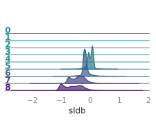
>
> 
>
> 
>
> 
>
> 
>
> 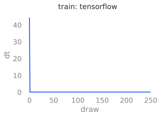
>
> 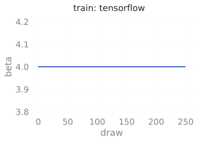
>
> 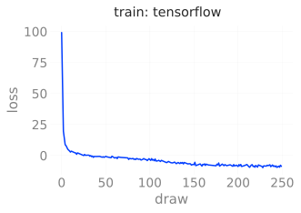
>
> 
>
> 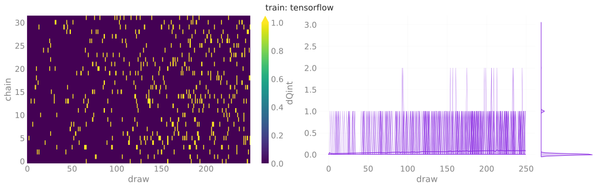
>
> 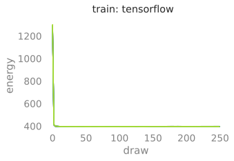
>
> 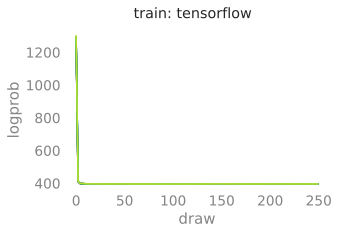
>
> 
>
> 
>
> 
>
> 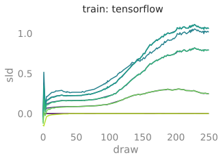
>
> 
>
> 
>
> 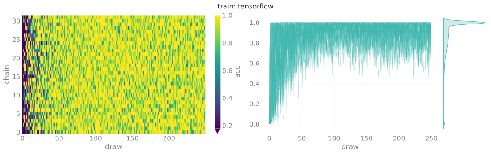
>
> 
>
> 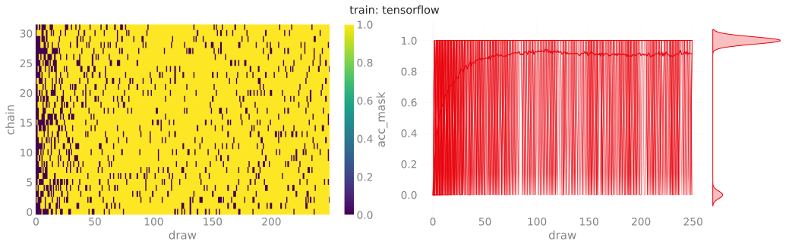
>
> 
>
> 
>
> 
>
> 
>
> </div>

</div>

### Inference

#### Evaluate

``` python
outputs['tensorflow']['eval'] = tfExpU1.trainer.eval(
    job_type='eval',
    nprint=500,
    nchains=128,
    eval_steps=2000,
)
# dset_eval_tf = tfExpU1.trainer.histories['eval'].plot_all()
_ = tfExpU1.save_dataset(job_type='eval', nchains=32)
```

<div>

> **<span class="code-text">`output`:</span>**
>
> <div class="cell-output cell-output-display">
>
> <pre style="white-space:pre;overflow-x:auto;line-height:normal;font-family:monospace"><span style="color: #838383; text-decoration-color: #838383">[2023-12-05 12:05:41]</span><span style="color: #FD971F; text-decoration-color: #FD971F">[WARNING]</span><span style="color: #777777; text-decoration-color: #777777">[trainer.py:194]</span> - x.shape <span style="font-weight: bold">(</span>original<span style="font-weight: bold">)</span>: <span style="font-weight: bold">(</span><span style="color: #1A8FFF; text-decoration-color: #1A8FFF; font-weight: bold">2048</span>, <span style="color: #1A8FFF; text-decoration-color: #1A8FFF; font-weight: bold">2</span>, <span style="color: #1A8FFF; text-decoration-color: #1A8FFF; font-weight: bold">16</span>, <span style="color: #1A8FFF; text-decoration-color: #1A8FFF; font-weight: bold">16</span><span style="font-weight: bold">)</span> </pre>
> <pre style="white-space:pre;overflow-x:auto;line-height:normal;font-family:monospace"><span style="color: #838383; text-decoration-color: #838383">[2023-12-05 12:05:41]</span><span style="color: #FD971F; text-decoration-color: #FD971F">[WARNING]</span><span style="color: #777777; text-decoration-color: #777777">[trainer.py:194]</span> - x<span style="font-weight: bold">[</span>:nchains<span style="font-weight: bold">]</span>.shape: <span style="font-weight: bold">(</span><span style="color: #1A8FFF; text-decoration-color: #1A8FFF; font-weight: bold">128</span>, <span style="color: #1A8FFF; text-decoration-color: #1A8FFF; font-weight: bold">2</span>, <span style="color: #1A8FFF; text-decoration-color: #1A8FFF; font-weight: bold">16</span>, <span style="color: #1A8FFF; text-decoration-color: #1A8FFF; font-weight: bold">16</span><span style="font-weight: bold">)</span> </pre>
> <pre style="white-space:pre;overflow-x:auto;line-height:normal;font-family:monospace"><span style="color: #838383; text-decoration-color: #838383">[2023-12-05 12:05:41]</span><span style="color: #2196F3; text-decoration-color: #2196F3">[INFO]</span><span style="color: #777777; text-decoration-color: #777777">[trainer.py:198]</span> - eps = <span style="color: #ff00ff; text-decoration-color: #ff00ff; font-style: italic">None</span>
> beta = <span style="color: #1A8FFF; text-decoration-color: #1A8FFF; font-weight: bold">4.0</span>
> nlog = <span style="color: #1A8FFF; text-decoration-color: #1A8FFF; font-weight: bold">10</span>
> table = <span style="font-weight: bold">&lt;</span><span style="color: #ff00ff; text-decoration-color: #ff00ff; font-weight: bold">rich.table.Table</span><span style="color: #000000; text-decoration-color: #000000"> object at </span><span style="color: #1A8FFF; text-decoration-color: #1A8FFF; font-weight: bold">0x7efa683ea0e0</span><span style="font-weight: bold">&gt;</span>
> nprint = <span style="color: #1A8FFF; text-decoration-color: #1A8FFF; font-weight: bold">500</span>
> eval_steps = <span style="color: #1A8FFF; text-decoration-color: #1A8FFF; font-weight: bold">2000</span>
> nleapfrog = <span style="color: #ff00ff; text-decoration-color: #ff00ff; font-style: italic">None</span> </pre>
>
> 
>
>       0%|          | 0/2000 [00:00<?, ?it/s]
>
> <pre style="white-space:pre;overflow-x:auto;line-height:normal;font-family:monospace"><span style="color: #838383; text-decoration-color: #838383">[2023-12-05 12:06:28]</span><span style="color: #2196F3; text-decoration-color: #2196F3">[INFO]</span><span style="color: #777777; text-decoration-color: #777777">[trainer.py:198]</span> - <span style="color: #ff00ff; text-decoration-color: #ff00ff; font-style: italic">estep</span>=<span style="color: #1A8FFF; text-decoration-color: #1A8FFF; font-weight: bold">0</span> <span style="color: #ff00ff; text-decoration-color: #ff00ff; font-style: italic">dt</span>=<span style="color: #1A8FFF; text-decoration-color: #1A8FFF; font-weight: bold">4.940</span> <span style="color: #ff00ff; text-decoration-color: #ff00ff; font-style: italic">beta</span>=<span style="color: #1A8FFF; text-decoration-color: #1A8FFF; font-weight: bold">4.000</span> <span style="color: #ff00ff; text-decoration-color: #ff00ff; font-style: italic">loss</span>=<span style="color: #1A8FFF; text-decoration-color: #1A8FFF; font-weight: bold">-7.502</span> <span style="color: #ff00ff; text-decoration-color: #ff00ff; font-style: italic">dQsin</span>=<span style="color: #1A8FFF; text-decoration-color: #1A8FFF; font-weight: bold">0.238</span> <span style="color: #ff00ff; text-decoration-color: #ff00ff; font-style: italic">dQint</span>=<span style="color: #1A8FFF; text-decoration-color: #1A8FFF; font-weight: bold">0.117</span> <span style="color: #ff00ff; text-decoration-color: #ff00ff; font-style: italic">energy</span>=<span style="color: #1A8FFF; text-decoration-color: #1A8FFF; font-weight: bold">396.232</span> <span style="color: #ff00ff; text-decoration-color: #ff00ff; font-style: italic">logprob</span>=<span style="color: #1A8FFF; text-decoration-color: #1A8FFF; font-weight: bold">395.648</span> <span style="color: #ff00ff; text-decoration-color: #ff00ff; font-style: italic">logdet</span>=<span style="color: #1A8FFF; text-decoration-color: #1A8FFF; font-weight: bold">0.584</span> <span style="color: #ff00ff; text-decoration-color: #ff00ff; font-style: italic">sldf</span>=<span style="color: #1A8FFF; text-decoration-color: #1A8FFF; font-weight: bold">0.349</span> <span style="color: #ff00ff; text-decoration-color: #ff00ff; font-style: italic">sldb</span>=<span style="color: #1A8FFF; text-decoration-color: #1A8FFF; font-weight: bold">-0.222</span> <span style="color: #ff00ff; text-decoration-color: #ff00ff; font-style: italic">sld</span>=<span style="color: #1A8FFF; text-decoration-color: #1A8FFF; font-weight: bold">0.584</span> <span style="color: #ff00ff; text-decoration-color: #ff00ff; font-style: italic">xeps</span>=<span style="color: #1A8FFF; text-decoration-color: #1A8FFF; font-weight: bold">0.141</span> <span style="color: #ff00ff; text-decoration-color: #ff00ff; font-style: italic">veps</span>=<span style="color: #1A8FFF; text-decoration-color: #1A8FFF; font-weight: bold">0.121</span> <span style="color: #ff00ff; text-decoration-color: #ff00ff; font-style: italic">acc</span>=<span style="color: #1A8FFF; text-decoration-color: #1A8FFF; font-weight: bold">0.928</span> <span style="color: #ff00ff; text-decoration-color: #ff00ff; font-style: italic">sumlogdet</span>=<span style="color: #1A8FFF; text-decoration-color: #1A8FFF; font-weight: bold">0.001</span> <span style="color: #ff00ff; text-decoration-color: #ff00ff; font-style: italic">acc_mask</span>=<span style="color: #1A8FFF; text-decoration-color: #1A8FFF; font-weight: bold">0.914</span> <span style="color: #ff00ff; text-decoration-color: #ff00ff; font-style: italic">plaqs</span>=<span style="color: #1A8FFF; text-decoration-color: #1A8FFF; font-weight: bold">0.863</span> <span style="color: #ff00ff; text-decoration-color: #ff00ff; font-style: italic">intQ</span>=<span style="color: #1A8FFF; text-decoration-color: #1A8FFF; font-weight: bold">0.023</span> <span style="color: #ff00ff; text-decoration-color: #ff00ff; font-style: italic">sinQ</span>=<span style="color: #1A8FFF; text-decoration-color: #1A8FFF; font-weight: bold">0.036</span> </pre>
> <pre style="white-space:pre;overflow-x:auto;line-height:normal;font-family:monospace"><span style="color: #838383; text-decoration-color: #838383">[2023-12-05 12:07:17]</span><span style="color: #2196F3; text-decoration-color: #2196F3">[INFO]</span><span style="color: #777777; text-decoration-color: #777777">[trainer.py:198]</span> - <span style="color: #ff00ff; text-decoration-color: #ff00ff; font-style: italic">estep</span>=<span style="color: #1A8FFF; text-decoration-color: #1A8FFF; font-weight: bold">500</span> <span style="color: #ff00ff; text-decoration-color: #ff00ff; font-style: italic">dt</span>=<span style="color: #1A8FFF; text-decoration-color: #1A8FFF; font-weight: bold">0.024</span> <span style="color: #ff00ff; text-decoration-color: #ff00ff; font-style: italic">beta</span>=<span style="color: #1A8FFF; text-decoration-color: #1A8FFF; font-weight: bold">4.000</span> <span style="color: #ff00ff; text-decoration-color: #ff00ff; font-style: italic">loss</span>=<span style="color: #1A8FFF; text-decoration-color: #1A8FFF; font-weight: bold">-3.405</span> <span style="color: #ff00ff; text-decoration-color: #ff00ff; font-style: italic">dQsin</span>=<span style="color: #1A8FFF; text-decoration-color: #1A8FFF; font-weight: bold">0.239</span> <span style="color: #ff00ff; text-decoration-color: #ff00ff; font-style: italic">dQint</span>=<span style="color: #1A8FFF; text-decoration-color: #1A8FFF; font-weight: bold">0.047</span> <span style="color: #ff00ff; text-decoration-color: #ff00ff; font-style: italic">energy</span>=<span style="color: #1A8FFF; text-decoration-color: #1A8FFF; font-weight: bold">395.434</span> <span style="color: #ff00ff; text-decoration-color: #ff00ff; font-style: italic">logprob</span>=<span style="color: #1A8FFF; text-decoration-color: #1A8FFF; font-weight: bold">394.850</span> <span style="color: #ff00ff; text-decoration-color: #ff00ff; font-style: italic">logdet</span>=<span style="color: #1A8FFF; text-decoration-color: #1A8FFF; font-weight: bold">0.584</span> <span style="color: #ff00ff; text-decoration-color: #ff00ff; font-style: italic">sldf</span>=<span style="color: #1A8FFF; text-decoration-color: #1A8FFF; font-weight: bold">0.349</span> <span style="color: #ff00ff; text-decoration-color: #ff00ff; font-style: italic">sldb</span>=<span style="color: #1A8FFF; text-decoration-color: #1A8FFF; font-weight: bold">-0.223</span> <span style="color: #ff00ff; text-decoration-color: #ff00ff; font-style: italic">sld</span>=<span style="color: #1A8FFF; text-decoration-color: #1A8FFF; font-weight: bold">0.584</span> <span style="color: #ff00ff; text-decoration-color: #ff00ff; font-style: italic">xeps</span>=<span style="color: #1A8FFF; text-decoration-color: #1A8FFF; font-weight: bold">0.141</span> <span style="color: #ff00ff; text-decoration-color: #ff00ff; font-style: italic">veps</span>=<span style="color: #1A8FFF; text-decoration-color: #1A8FFF; font-weight: bold">0.121</span> <span style="color: #ff00ff; text-decoration-color: #ff00ff; font-style: italic">acc</span>=<span style="color: #1A8FFF; text-decoration-color: #1A8FFF; font-weight: bold">0.934</span> <span style="color: #ff00ff; text-decoration-color: #ff00ff; font-style: italic">sumlogdet</span>=<span style="color: #1A8FFF; text-decoration-color: #1A8FFF; font-weight: bold">0.000</span> <span style="color: #ff00ff; text-decoration-color: #ff00ff; font-style: italic">acc_mask</span>=<span style="color: #1A8FFF; text-decoration-color: #1A8FFF; font-weight: bold">0.969</span> <span style="color: #ff00ff; text-decoration-color: #ff00ff; font-style: italic">plaqs</span>=<span style="color: #1A8FFF; text-decoration-color: #1A8FFF; font-weight: bold">0.865</span> <span style="color: #ff00ff; text-decoration-color: #ff00ff; font-style: italic">intQ</span>=<span style="color: #1A8FFF; text-decoration-color: #1A8FFF; font-weight: bold">0.008</span> <span style="color: #ff00ff; text-decoration-color: #ff00ff; font-style: italic">sinQ</span>=<span style="color: #1A8FFF; text-decoration-color: #1A8FFF; font-weight: bold">0.001</span> </pre>
> <pre style="white-space:pre;overflow-x:auto;line-height:normal;font-family:monospace"><span style="color: #838383; text-decoration-color: #838383">[2023-12-05 12:08:01]</span><span style="color: #2196F3; text-decoration-color: #2196F3">[INFO]</span><span style="color: #777777; text-decoration-color: #777777">[trainer.py:198]</span> - <span style="color: #ff00ff; text-decoration-color: #ff00ff; font-style: italic">estep</span>=<span style="color: #1A8FFF; text-decoration-color: #1A8FFF; font-weight: bold">1000</span> <span style="color: #ff00ff; text-decoration-color: #ff00ff; font-style: italic">dt</span>=<span style="color: #1A8FFF; text-decoration-color: #1A8FFF; font-weight: bold">0.024</span> <span style="color: #ff00ff; text-decoration-color: #ff00ff; font-style: italic">beta</span>=<span style="color: #1A8FFF; text-decoration-color: #1A8FFF; font-weight: bold">4.000</span> <span style="color: #ff00ff; text-decoration-color: #ff00ff; font-style: italic">loss</span>=<span style="color: #1A8FFF; text-decoration-color: #1A8FFF; font-weight: bold">-5.784</span> <span style="color: #ff00ff; text-decoration-color: #ff00ff; font-style: italic">dQsin</span>=<span style="color: #1A8FFF; text-decoration-color: #1A8FFF; font-weight: bold">0.227</span> <span style="color: #ff00ff; text-decoration-color: #ff00ff; font-style: italic">dQint</span>=<span style="color: #1A8FFF; text-decoration-color: #1A8FFF; font-weight: bold">0.102</span> <span style="color: #ff00ff; text-decoration-color: #ff00ff; font-style: italic">energy</span>=<span style="color: #1A8FFF; text-decoration-color: #1A8FFF; font-weight: bold">393.733</span> <span style="color: #ff00ff; text-decoration-color: #ff00ff; font-style: italic">logprob</span>=<span style="color: #1A8FFF; text-decoration-color: #1A8FFF; font-weight: bold">393.149</span> <span style="color: #ff00ff; text-decoration-color: #ff00ff; font-style: italic">logdet</span>=<span style="color: #1A8FFF; text-decoration-color: #1A8FFF; font-weight: bold">0.584</span> <span style="color: #ff00ff; text-decoration-color: #ff00ff; font-style: italic">sldf</span>=<span style="color: #1A8FFF; text-decoration-color: #1A8FFF; font-weight: bold">0.349</span> <span style="color: #ff00ff; text-decoration-color: #ff00ff; font-style: italic">sldb</span>=<span style="color: #1A8FFF; text-decoration-color: #1A8FFF; font-weight: bold">-0.222</span> <span style="color: #ff00ff; text-decoration-color: #ff00ff; font-style: italic">sld</span>=<span style="color: #1A8FFF; text-decoration-color: #1A8FFF; font-weight: bold">0.584</span> <span style="color: #ff00ff; text-decoration-color: #ff00ff; font-style: italic">xeps</span>=<span style="color: #1A8FFF; text-decoration-color: #1A8FFF; font-weight: bold">0.141</span> <span style="color: #ff00ff; text-decoration-color: #ff00ff; font-style: italic">veps</span>=<span style="color: #1A8FFF; text-decoration-color: #1A8FFF; font-weight: bold">0.121</span> <span style="color: #ff00ff; text-decoration-color: #ff00ff; font-style: italic">acc</span>=<span style="color: #1A8FFF; text-decoration-color: #1A8FFF; font-weight: bold">0.913</span> <span style="color: #ff00ff; text-decoration-color: #ff00ff; font-style: italic">sumlogdet</span>=<span style="color: #1A8FFF; text-decoration-color: #1A8FFF; font-weight: bold">0.000</span> <span style="color: #ff00ff; text-decoration-color: #ff00ff; font-style: italic">acc_mask</span>=<span style="color: #1A8FFF; text-decoration-color: #1A8FFF; font-weight: bold">0.953</span> <span style="color: #ff00ff; text-decoration-color: #ff00ff; font-style: italic">plaqs</span>=<span style="color: #1A8FFF; text-decoration-color: #1A8FFF; font-weight: bold">0.863</span> <span style="color: #ff00ff; text-decoration-color: #ff00ff; font-style: italic">intQ</span>=<span style="color: #1A8FFF; text-decoration-color: #1A8FFF; font-weight: bold">0.188</span> <span style="color: #ff00ff; text-decoration-color: #ff00ff; font-style: italic">sinQ</span>=<span style="color: #1A8FFF; text-decoration-color: #1A8FFF; font-weight: bold">0.178</span> </pre>
> <pre style="white-space:pre;overflow-x:auto;line-height:normal;font-family:monospace"><span style="color: #838383; text-decoration-color: #838383">[2023-12-05 12:08:44]</span><span style="color: #2196F3; text-decoration-color: #2196F3">[INFO]</span><span style="color: #777777; text-decoration-color: #777777">[trainer.py:198]</span> - <span style="color: #ff00ff; text-decoration-color: #ff00ff; font-style: italic">estep</span>=<span style="color: #1A8FFF; text-decoration-color: #1A8FFF; font-weight: bold">1500</span> <span style="color: #ff00ff; text-decoration-color: #ff00ff; font-style: italic">dt</span>=<span style="color: #1A8FFF; text-decoration-color: #1A8FFF; font-weight: bold">0.024</span> <span style="color: #ff00ff; text-decoration-color: #ff00ff; font-style: italic">beta</span>=<span style="color: #1A8FFF; text-decoration-color: #1A8FFF; font-weight: bold">4.000</span> <span style="color: #ff00ff; text-decoration-color: #ff00ff; font-style: italic">loss</span>=<span style="color: #1A8FFF; text-decoration-color: #1A8FFF; font-weight: bold">-7.127</span> <span style="color: #ff00ff; text-decoration-color: #ff00ff; font-style: italic">dQsin</span>=<span style="color: #1A8FFF; text-decoration-color: #1A8FFF; font-weight: bold">0.226</span> <span style="color: #ff00ff; text-decoration-color: #ff00ff; font-style: italic">dQint</span>=<span style="color: #1A8FFF; text-decoration-color: #1A8FFF; font-weight: bold">0.063</span> <span style="color: #ff00ff; text-decoration-color: #ff00ff; font-style: italic">energy</span>=<span style="color: #1A8FFF; text-decoration-color: #1A8FFF; font-weight: bold">396.790</span> <span style="color: #ff00ff; text-decoration-color: #ff00ff; font-style: italic">logprob</span>=<span style="color: #1A8FFF; text-decoration-color: #1A8FFF; font-weight: bold">396.205</span> <span style="color: #ff00ff; text-decoration-color: #ff00ff; font-style: italic">logdet</span>=<span style="color: #1A8FFF; text-decoration-color: #1A8FFF; font-weight: bold">0.584</span> <span style="color: #ff00ff; text-decoration-color: #ff00ff; font-style: italic">sldf</span>=<span style="color: #1A8FFF; text-decoration-color: #1A8FFF; font-weight: bold">0.349</span> <span style="color: #ff00ff; text-decoration-color: #ff00ff; font-style: italic">sldb</span>=<span style="color: #1A8FFF; text-decoration-color: #1A8FFF; font-weight: bold">-0.223</span> <span style="color: #ff00ff; text-decoration-color: #ff00ff; font-style: italic">sld</span>=<span style="color: #1A8FFF; text-decoration-color: #1A8FFF; font-weight: bold">0.584</span> <span style="color: #ff00ff; text-decoration-color: #ff00ff; font-style: italic">xeps</span>=<span style="color: #1A8FFF; text-decoration-color: #1A8FFF; font-weight: bold">0.141</span> <span style="color: #ff00ff; text-decoration-color: #ff00ff; font-style: italic">veps</span>=<span style="color: #1A8FFF; text-decoration-color: #1A8FFF; font-weight: bold">0.121</span> <span style="color: #ff00ff; text-decoration-color: #ff00ff; font-style: italic">acc</span>=<span style="color: #1A8FFF; text-decoration-color: #1A8FFF; font-weight: bold">0.902</span> <span style="color: #ff00ff; text-decoration-color: #ff00ff; font-style: italic">sumlogdet</span>=<span style="color: #1A8FFF; text-decoration-color: #1A8FFF; font-weight: bold">-0.000</span> <span style="color: #ff00ff; text-decoration-color: #ff00ff; font-style: italic">acc_mask</span>=<span style="color: #1A8FFF; text-decoration-color: #1A8FFF; font-weight: bold">0.898</span> <span style="color: #ff00ff; text-decoration-color: #ff00ff; font-style: italic">plaqs</span>=<span style="color: #1A8FFF; text-decoration-color: #1A8FFF; font-weight: bold">0.864</span> <span style="color: #ff00ff; text-decoration-color: #ff00ff; font-style: italic">intQ</span>=<span style="color: #1A8FFF; text-decoration-color: #1A8FFF; font-weight: bold">-0.172</span> <span style="color: #ff00ff; text-decoration-color: #ff00ff; font-style: italic">sinQ</span>=<span style="color: #1A8FFF; text-decoration-color: #1A8FFF; font-weight: bold">-0.126</span> </pre>
> <pre style="white-space:pre;overflow-x:auto;line-height:normal;font-family:monospace"><span style="color: #838383; text-decoration-color: #838383">[2023-12-05 12:09:32]</span><span style="color: #2196F3; text-decoration-color: #2196F3">[INFO]</span><span style="color: #777777; text-decoration-color: #777777">[plot_helpers.py:1046]</span> - Saving figure to: <span style="color: #008000; text-decoration-color: #008000">/lus/grand/projects/DLHMC/foremans/locations/thetaGPU/projects/saforem2/l2hmc-qcd/src/l2hmc/notebooks/outputs/2023-12-05-111405/tensorflow/plots/ridgeplots/svgs/</span><span style="color: #800080; text-decoration-color: #800080">energy_ridgeplot.svg</span> </pre>
> <pre style="white-space:pre;overflow-x:auto;line-height:normal;font-family:monospace"><span style="color: #838383; text-decoration-color: #838383">[2023-12-05 12:09:34]</span><span style="color: #2196F3; text-decoration-color: #2196F3">[INFO]</span><span style="color: #777777; text-decoration-color: #777777">[plot_helpers.py:1046]</span> - Saving figure to: <span style="color: #008000; text-decoration-color: #008000">/lus/grand/projects/DLHMC/foremans/locations/thetaGPU/projects/saforem2/l2hmc-qcd/src/l2hmc/notebooks/outputs/2023-12-05-111405/tensorflow/plots/ridgeplots/svgs/</span><span style="color: #800080; text-decoration-color: #800080">logprob_ridgeplot.svg</span> </pre>
> <pre style="white-space:pre;overflow-x:auto;line-height:normal;font-family:monospace"><span style="color: #838383; text-decoration-color: #838383">[2023-12-05 12:09:36]</span><span style="color: #2196F3; text-decoration-color: #2196F3">[INFO]</span><span style="color: #777777; text-decoration-color: #777777">[plot_helpers.py:1046]</span> - Saving figure to: <span style="color: #008000; text-decoration-color: #008000">/lus/grand/projects/DLHMC/foremans/locations/thetaGPU/projects/saforem2/l2hmc-qcd/src/l2hmc/notebooks/outputs/2023-12-05-111405/tensorflow/plots/ridgeplots/svgs/</span><span style="color: #800080; text-decoration-color: #800080">logdet_ridgeplot.svg</span> </pre>
> <pre style="white-space:pre;overflow-x:auto;line-height:normal;font-family:monospace"><span style="color: #838383; text-decoration-color: #838383">[2023-12-05 12:09:38]</span><span style="color: #2196F3; text-decoration-color: #2196F3">[INFO]</span><span style="color: #777777; text-decoration-color: #777777">[plot_helpers.py:1046]</span> - Saving figure to: <span style="color: #008000; text-decoration-color: #008000">/lus/grand/projects/DLHMC/foremans/locations/thetaGPU/projects/saforem2/l2hmc-qcd/src/l2hmc/notebooks/outputs/2023-12-05-111405/tensorflow/plots/ridgeplots/svgs/</span><span style="color: #800080; text-decoration-color: #800080">sldf_ridgeplot.svg</span> </pre>
> <pre style="white-space:pre;overflow-x:auto;line-height:normal;font-family:monospace"><span style="color: #838383; text-decoration-color: #838383">[2023-12-05 12:09:40]</span><span style="color: #2196F3; text-decoration-color: #2196F3">[INFO]</span><span style="color: #777777; text-decoration-color: #777777">[plot_helpers.py:1046]</span> - Saving figure to: <span style="color: #008000; text-decoration-color: #008000">/lus/grand/projects/DLHMC/foremans/locations/thetaGPU/projects/saforem2/l2hmc-qcd/src/l2hmc/notebooks/outputs/2023-12-05-111405/tensorflow/plots/ridgeplots/svgs/</span><span style="color: #800080; text-decoration-color: #800080">sldb_ridgeplot.svg</span> </pre>
> <pre style="white-space:pre;overflow-x:auto;line-height:normal;font-family:monospace"><span style="color: #838383; text-decoration-color: #838383">[2023-12-05 12:09:42]</span><span style="color: #2196F3; text-decoration-color: #2196F3">[INFO]</span><span style="color: #777777; text-decoration-color: #777777">[plot_helpers.py:1046]</span> - Saving figure to: <span style="color: #008000; text-decoration-color: #008000">/lus/grand/projects/DLHMC/foremans/locations/thetaGPU/projects/saforem2/l2hmc-qcd/src/l2hmc/notebooks/outputs/2023-12-05-111405/tensorflow/plots/ridgeplots/svgs/</span><span style="color: #800080; text-decoration-color: #800080">sld_ridgeplot.svg</span> </pre>
> <pre style="white-space:pre;overflow-x:auto;line-height:normal;font-family:monospace"><span style="color: #838383; text-decoration-color: #838383">[2023-12-05 12:09:57]</span><span style="color: #2196F3; text-decoration-color: #2196F3">[INFO]</span><span style="color: #777777; text-decoration-color: #777777">[common.py:275]</span> - Saving dataset to: <span style="color: #008000; text-decoration-color: #008000">/lus/grand/projects/DLHMC/foremans/locations/thetaGPU/projects/saforem2/l2hmc-qcd/src/l2hmc/notebooks/outputs/2023-12-05-111405/tensorflow/data/</span><span style="color: #800080; text-decoration-color: #800080">eval_data.h5</span> </pre>
> <pre style="white-space:pre;overflow-x:auto;line-height:normal;font-family:monospace"><span style="color: #838383; text-decoration-color: #838383">[2023-12-05 12:09:57]</span><span style="color: #2196F3; text-decoration-color: #2196F3">[INFO]</span><span style="color: #777777; text-decoration-color: #777777">[experiment.py:378]</span> - Done saving and analyzing data. </pre>
> <pre style="white-space:pre;overflow-x:auto;line-height:normal;font-family:monospace"><span style="color: #838383; text-decoration-color: #838383">[2023-12-05 12:09:57]</span><span style="color: #2196F3; text-decoration-color: #2196F3">[INFO]</span><span style="color: #777777; text-decoration-color: #777777">[experiment.py:379]</span> - Creating summaries for WandB, Aim </pre>
>
> 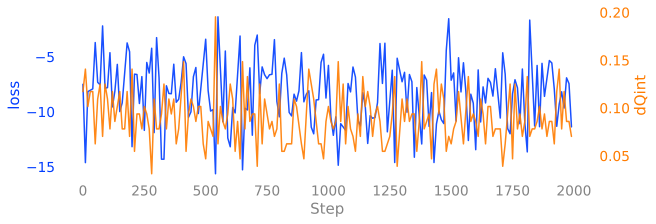
>
> 
>
> 
>
> 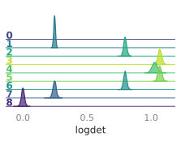
>
> 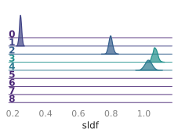
>
> 
>
> 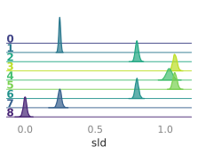
>
> 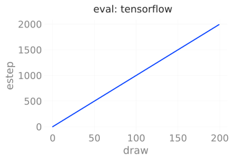
>
> 
>
> 
>
> 
>
> 
>
> 
>
> 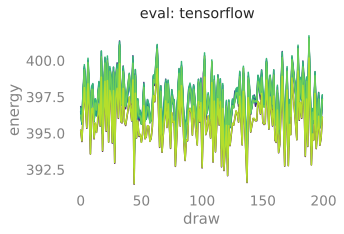
>
> 
>
> 
>
> 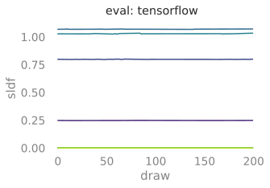
>
> 
>
> 
>
> 
>
> 
>
> 
>
> 
>
> 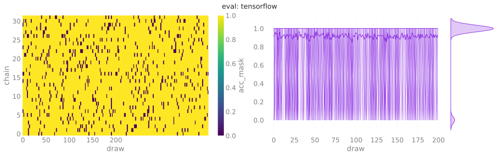
>
> 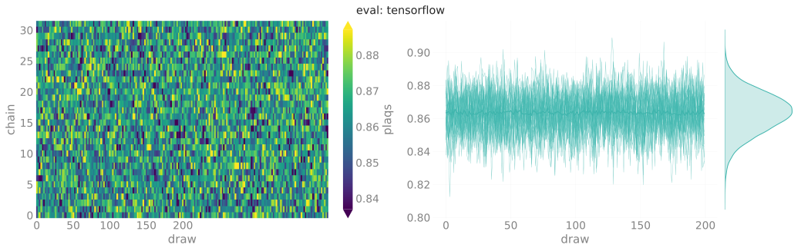
>
> 
>
> 
>
> </div>

</div>

#### HMC

``` python
outputs['tensorflow']['hmc'] = tfExpU1.trainer.eval(
    job_type='hmc',
    nprint=500,
    nchains=128,
    eval_steps=2000,
)
_ = tfExpU1.save_dataset(job_type='hmc', nchains=32)
```

<div>

> **<span class="code-text italic">`output`:</span>**
>
> <div class="cell-output cell-output-display">
>
> <pre style="white-space:pre;overflow-x:auto;line-height:normal;font-family:monospace"><span style="color: #838383; text-decoration-color: #838383">[2023-12-05 12:10:19]</span><span style="color: #FD971F; text-decoration-color: #FD971F">[WARNING]</span><span style="color: #777777; text-decoration-color: #777777">[trainer.py:194]</span> - Step size `eps` not specified for HMC! Using default: <span style="color: #1A8FFF; text-decoration-color: #1A8FFF; font-weight: bold">0.2500</span> for generic HMC </pre>
> <pre style="white-space:pre;overflow-x:auto;line-height:normal;font-family:monospace"><span style="color: #838383; text-decoration-color: #838383">[2023-12-05 12:10:19]</span><span style="color: #FD971F; text-decoration-color: #FD971F">[WARNING]</span><span style="color: #777777; text-decoration-color: #777777">[trainer.py:194]</span> - x.shape <span style="font-weight: bold">(</span>original<span style="font-weight: bold">)</span>: <span style="font-weight: bold">(</span><span style="color: #1A8FFF; text-decoration-color: #1A8FFF; font-weight: bold">2048</span>, <span style="color: #1A8FFF; text-decoration-color: #1A8FFF; font-weight: bold">2</span>, <span style="color: #1A8FFF; text-decoration-color: #1A8FFF; font-weight: bold">16</span>, <span style="color: #1A8FFF; text-decoration-color: #1A8FFF; font-weight: bold">16</span><span style="font-weight: bold">)</span> </pre>
> <pre style="white-space:pre;overflow-x:auto;line-height:normal;font-family:monospace"><span style="color: #838383; text-decoration-color: #838383">[2023-12-05 12:10:19]</span><span style="color: #FD971F; text-decoration-color: #FD971F">[WARNING]</span><span style="color: #777777; text-decoration-color: #777777">[trainer.py:194]</span> - x<span style="font-weight: bold">[</span>:nchains<span style="font-weight: bold">]</span>.shape: <span style="font-weight: bold">(</span><span style="color: #1A8FFF; text-decoration-color: #1A8FFF; font-weight: bold">128</span>, <span style="color: #1A8FFF; text-decoration-color: #1A8FFF; font-weight: bold">2</span>, <span style="color: #1A8FFF; text-decoration-color: #1A8FFF; font-weight: bold">16</span>, <span style="color: #1A8FFF; text-decoration-color: #1A8FFF; font-weight: bold">16</span><span style="font-weight: bold">)</span> </pre>
> <pre style="white-space:pre;overflow-x:auto;line-height:normal;font-family:monospace"><span style="color: #838383; text-decoration-color: #838383">[2023-12-05 12:10:19]</span><span style="color: #2196F3; text-decoration-color: #2196F3">[INFO]</span><span style="color: #777777; text-decoration-color: #777777">[trainer.py:198]</span> - eps = <span style="color: #1A8FFF; text-decoration-color: #1A8FFF; font-weight: bold">0.25</span>
> beta = <span style="color: #1A8FFF; text-decoration-color: #1A8FFF; font-weight: bold">4.0</span>
> nlog = <span style="color: #1A8FFF; text-decoration-color: #1A8FFF; font-weight: bold">10</span>
> table = <span style="font-weight: bold">&lt;</span><span style="color: #ff00ff; text-decoration-color: #ff00ff; font-weight: bold">rich.table.Table</span><span style="color: #000000; text-decoration-color: #000000"> object at </span><span style="color: #1A8FFF; text-decoration-color: #1A8FFF; font-weight: bold">0x7ef93c654940</span><span style="font-weight: bold">&gt;</span>
> nprint = <span style="color: #1A8FFF; text-decoration-color: #1A8FFF; font-weight: bold">500</span>
> eval_steps = <span style="color: #1A8FFF; text-decoration-color: #1A8FFF; font-weight: bold">2000</span>
> nleapfrog = <span style="color: #1A8FFF; text-decoration-color: #1A8FFF; font-weight: bold">8</span> </pre>
>
> 
>
>       0%|          | 0/2000 [00:00<?, ?it/s]
>
> <pre style="white-space:pre;overflow-x:auto;line-height:normal;font-family:monospace"><span style="color: #838383; text-decoration-color: #838383">[2023-12-05 12:11:01]</span><span style="color: #2196F3; text-decoration-color: #2196F3">[INFO]</span><span style="color: #777777; text-decoration-color: #777777">[trainer.py:198]</span> - <span style="color: #ff00ff; text-decoration-color: #ff00ff; font-style: italic">hstep</span>=<span style="color: #1A8FFF; text-decoration-color: #1A8FFF; font-weight: bold">0</span> <span style="color: #ff00ff; text-decoration-color: #ff00ff; font-style: italic">dt</span>=<span style="color: #1A8FFF; text-decoration-color: #1A8FFF; font-weight: bold">0.089</span> <span style="color: #ff00ff; text-decoration-color: #ff00ff; font-style: italic">beta</span>=<span style="color: #1A8FFF; text-decoration-color: #1A8FFF; font-weight: bold">4.000</span> <span style="color: #ff00ff; text-decoration-color: #ff00ff; font-style: italic">loss</span>=<span style="color: #1A8FFF; text-decoration-color: #1A8FFF; font-weight: bold">59.310</span> <span style="color: #ff00ff; text-decoration-color: #ff00ff; font-style: italic">dQsin</span>=<span style="color: #1A8FFF; text-decoration-color: #1A8FFF; font-weight: bold">0.049</span> <span style="color: #ff00ff; text-decoration-color: #ff00ff; font-style: italic">dQint</span>=<span style="color: #1A8FFF; text-decoration-color: #1A8FFF; font-weight: bold">0.039</span> <span style="color: #ff00ff; text-decoration-color: #ff00ff; font-style: italic">energy</span>=<span style="color: #1A8FFF; text-decoration-color: #1A8FFF; font-weight: bold">403.394</span> <span style="color: #ff00ff; text-decoration-color: #ff00ff; font-style: italic">logprob</span>=<span style="color: #1A8FFF; text-decoration-color: #1A8FFF; font-weight: bold">403.394</span> <span style="color: #ff00ff; text-decoration-color: #ff00ff; font-style: italic">logdet</span>=<span style="color: #1A8FFF; text-decoration-color: #1A8FFF; font-weight: bold">0.000</span> <span style="color: #ff00ff; text-decoration-color: #ff00ff; font-style: italic">acc</span>=<span style="color: #1A8FFF; text-decoration-color: #1A8FFF; font-weight: bold">0.059</span> <span style="color: #ff00ff; text-decoration-color: #ff00ff; font-style: italic">sumlogdet</span>=<span style="color: #1A8FFF; text-decoration-color: #1A8FFF; font-weight: bold">0.000</span> <span style="color: #ff00ff; text-decoration-color: #ff00ff; font-style: italic">acc_mask</span>=<span style="color: #1A8FFF; text-decoration-color: #1A8FFF; font-weight: bold">0.078</span> <span style="color: #ff00ff; text-decoration-color: #ff00ff; font-style: italic">plaqs</span>=<span style="color: #1A8FFF; text-decoration-color: #1A8FFF; font-weight: bold">0.863</span> <span style="color: #ff00ff; text-decoration-color: #ff00ff; font-style: italic">intQ</span>=<span style="color: #1A8FFF; text-decoration-color: #1A8FFF; font-weight: bold">-0.109</span> <span style="color: #ff00ff; text-decoration-color: #ff00ff; font-style: italic">sinQ</span>=<span style="color: #1A8FFF; text-decoration-color: #1A8FFF; font-weight: bold">-0.093</span> </pre>
> <pre style="white-space:pre;overflow-x:auto;line-height:normal;font-family:monospace"><span style="color: #838383; text-decoration-color: #838383">[2023-12-05 12:12:14]</span><span style="color: #2196F3; text-decoration-color: #2196F3">[INFO]</span><span style="color: #777777; text-decoration-color: #777777">[trainer.py:198]</span> - <span style="color: #ff00ff; text-decoration-color: #ff00ff; font-style: italic">hstep</span>=<span style="color: #1A8FFF; text-decoration-color: #1A8FFF; font-weight: bold">500</span> <span style="color: #ff00ff; text-decoration-color: #ff00ff; font-style: italic">dt</span>=<span style="color: #1A8FFF; text-decoration-color: #1A8FFF; font-weight: bold">0.083</span> <span style="color: #ff00ff; text-decoration-color: #ff00ff; font-style: italic">beta</span>=<span style="color: #1A8FFF; text-decoration-color: #1A8FFF; font-weight: bold">4.000</span> <span style="color: #ff00ff; text-decoration-color: #ff00ff; font-style: italic">loss</span>=<span style="color: #1A8FFF; text-decoration-color: #1A8FFF; font-weight: bold">55.566</span> <span style="color: #ff00ff; text-decoration-color: #ff00ff; font-style: italic">dQsin</span>=<span style="color: #1A8FFF; text-decoration-color: #1A8FFF; font-weight: bold">0.021</span> <span style="color: #ff00ff; text-decoration-color: #ff00ff; font-style: italic">dQint</span>=<span style="color: #1A8FFF; text-decoration-color: #1A8FFF; font-weight: bold">0.016</span> <span style="color: #ff00ff; text-decoration-color: #ff00ff; font-style: italic">energy</span>=<span style="color: #1A8FFF; text-decoration-color: #1A8FFF; font-weight: bold">400.521</span> <span style="color: #ff00ff; text-decoration-color: #ff00ff; font-style: italic">logprob</span>=<span style="color: #1A8FFF; text-decoration-color: #1A8FFF; font-weight: bold">400.521</span> <span style="color: #ff00ff; text-decoration-color: #ff00ff; font-style: italic">logdet</span>=<span style="color: #1A8FFF; text-decoration-color: #1A8FFF; font-weight: bold">0.000</span> <span style="color: #ff00ff; text-decoration-color: #ff00ff; font-style: italic">acc</span>=<span style="color: #1A8FFF; text-decoration-color: #1A8FFF; font-weight: bold">0.061</span> <span style="color: #ff00ff; text-decoration-color: #ff00ff; font-style: italic">sumlogdet</span>=<span style="color: #1A8FFF; text-decoration-color: #1A8FFF; font-weight: bold">0.000</span> <span style="color: #ff00ff; text-decoration-color: #ff00ff; font-style: italic">acc_mask</span>=<span style="color: #1A8FFF; text-decoration-color: #1A8FFF; font-weight: bold">0.047</span> <span style="color: #ff00ff; text-decoration-color: #ff00ff; font-style: italic">plaqs</span>=<span style="color: #1A8FFF; text-decoration-color: #1A8FFF; font-weight: bold">0.864</span> <span style="color: #ff00ff; text-decoration-color: #ff00ff; font-style: italic">intQ</span>=<span style="color: #1A8FFF; text-decoration-color: #1A8FFF; font-weight: bold">0.148</span> <span style="color: #ff00ff; text-decoration-color: #ff00ff; font-style: italic">sinQ</span>=<span style="color: #1A8FFF; text-decoration-color: #1A8FFF; font-weight: bold">0.112</span> </pre>
> <pre style="white-space:pre;overflow-x:auto;line-height:normal;font-family:monospace"><span style="color: #838383; text-decoration-color: #838383">[2023-12-05 12:13:28]</span><span style="color: #2196F3; text-decoration-color: #2196F3">[INFO]</span><span style="color: #777777; text-decoration-color: #777777">[trainer.py:198]</span> - <span style="color: #ff00ff; text-decoration-color: #ff00ff; font-style: italic">hstep</span>=<span style="color: #1A8FFF; text-decoration-color: #1A8FFF; font-weight: bold">1000</span> <span style="color: #ff00ff; text-decoration-color: #ff00ff; font-style: italic">dt</span>=<span style="color: #1A8FFF; text-decoration-color: #1A8FFF; font-weight: bold">0.084</span> <span style="color: #ff00ff; text-decoration-color: #ff00ff; font-style: italic">beta</span>=<span style="color: #1A8FFF; text-decoration-color: #1A8FFF; font-weight: bold">4.000</span> <span style="color: #ff00ff; text-decoration-color: #ff00ff; font-style: italic">loss</span>=<span style="color: #1A8FFF; text-decoration-color: #1A8FFF; font-weight: bold">63.178</span> <span style="color: #ff00ff; text-decoration-color: #ff00ff; font-style: italic">dQsin</span>=<span style="color: #1A8FFF; text-decoration-color: #1A8FFF; font-weight: bold">0.019</span> <span style="color: #ff00ff; text-decoration-color: #ff00ff; font-style: italic">dQint</span>=<span style="color: #1A8FFF; text-decoration-color: #1A8FFF; font-weight: bold">0.016</span> <span style="color: #ff00ff; text-decoration-color: #ff00ff; font-style: italic">energy</span>=<span style="color: #1A8FFF; text-decoration-color: #1A8FFF; font-weight: bold">401.798</span> <span style="color: #ff00ff; text-decoration-color: #ff00ff; font-style: italic">logprob</span>=<span style="color: #1A8FFF; text-decoration-color: #1A8FFF; font-weight: bold">401.798</span> <span style="color: #ff00ff; text-decoration-color: #ff00ff; font-style: italic">logdet</span>=<span style="color: #1A8FFF; text-decoration-color: #1A8FFF; font-weight: bold">0.000</span> <span style="color: #ff00ff; text-decoration-color: #ff00ff; font-style: italic">acc</span>=<span style="color: #1A8FFF; text-decoration-color: #1A8FFF; font-weight: bold">0.039</span> <span style="color: #ff00ff; text-decoration-color: #ff00ff; font-style: italic">sumlogdet</span>=<span style="color: #1A8FFF; text-decoration-color: #1A8FFF; font-weight: bold">0.000</span> <span style="color: #ff00ff; text-decoration-color: #ff00ff; font-style: italic">acc_mask</span>=<span style="color: #1A8FFF; text-decoration-color: #1A8FFF; font-weight: bold">0.039</span> <span style="color: #ff00ff; text-decoration-color: #ff00ff; font-style: italic">plaqs</span>=<span style="color: #1A8FFF; text-decoration-color: #1A8FFF; font-weight: bold">0.865</span> <span style="color: #ff00ff; text-decoration-color: #ff00ff; font-style: italic">intQ</span>=<span style="color: #1A8FFF; text-decoration-color: #1A8FFF; font-weight: bold">-0.016</span> <span style="color: #ff00ff; text-decoration-color: #ff00ff; font-style: italic">sinQ</span>=<span style="color: #1A8FFF; text-decoration-color: #1A8FFF; font-weight: bold">-0.016</span> </pre>
> <pre style="white-space:pre;overflow-x:auto;line-height:normal;font-family:monospace"><span style="color: #838383; text-decoration-color: #838383">[2023-12-05 12:14:43]</span><span style="color: #2196F3; text-decoration-color: #2196F3">[INFO]</span><span style="color: #777777; text-decoration-color: #777777">[trainer.py:198]</span> - <span style="color: #ff00ff; text-decoration-color: #ff00ff; font-style: italic">hstep</span>=<span style="color: #1A8FFF; text-decoration-color: #1A8FFF; font-weight: bold">1500</span> <span style="color: #ff00ff; text-decoration-color: #ff00ff; font-style: italic">dt</span>=<span style="color: #1A8FFF; text-decoration-color: #1A8FFF; font-weight: bold">0.084</span> <span style="color: #ff00ff; text-decoration-color: #ff00ff; font-style: italic">beta</span>=<span style="color: #1A8FFF; text-decoration-color: #1A8FFF; font-weight: bold">4.000</span> <span style="color: #ff00ff; text-decoration-color: #ff00ff; font-style: italic">loss</span>=<span style="color: #1A8FFF; text-decoration-color: #1A8FFF; font-weight: bold">61.681</span> <span style="color: #ff00ff; text-decoration-color: #ff00ff; font-style: italic">dQsin</span>=<span style="color: #1A8FFF; text-decoration-color: #1A8FFF; font-weight: bold">0.018</span> <span style="color: #ff00ff; text-decoration-color: #ff00ff; font-style: italic">dQint</span>=<span style="color: #1A8FFF; text-decoration-color: #1A8FFF; font-weight: bold">0.008</span> <span style="color: #ff00ff; text-decoration-color: #ff00ff; font-style: italic">energy</span>=<span style="color: #1A8FFF; text-decoration-color: #1A8FFF; font-weight: bold">398.577</span> <span style="color: #ff00ff; text-decoration-color: #ff00ff; font-style: italic">logprob</span>=<span style="color: #1A8FFF; text-decoration-color: #1A8FFF; font-weight: bold">398.577</span> <span style="color: #ff00ff; text-decoration-color: #ff00ff; font-style: italic">logdet</span>=<span style="color: #1A8FFF; text-decoration-color: #1A8FFF; font-weight: bold">0.000</span> <span style="color: #ff00ff; text-decoration-color: #ff00ff; font-style: italic">acc</span>=<span style="color: #1A8FFF; text-decoration-color: #1A8FFF; font-weight: bold">0.058</span> <span style="color: #ff00ff; text-decoration-color: #ff00ff; font-style: italic">sumlogdet</span>=<span style="color: #1A8FFF; text-decoration-color: #1A8FFF; font-weight: bold">0.000</span> <span style="color: #ff00ff; text-decoration-color: #ff00ff; font-style: italic">acc_mask</span>=<span style="color: #1A8FFF; text-decoration-color: #1A8FFF; font-weight: bold">0.062</span> <span style="color: #ff00ff; text-decoration-color: #ff00ff; font-style: italic">plaqs</span>=<span style="color: #1A8FFF; text-decoration-color: #1A8FFF; font-weight: bold">0.865</span> <span style="color: #ff00ff; text-decoration-color: #ff00ff; font-style: italic">intQ</span>=<span style="color: #1A8FFF; text-decoration-color: #1A8FFF; font-weight: bold">-0.148</span> <span style="color: #ff00ff; text-decoration-color: #ff00ff; font-style: italic">sinQ</span>=<span style="color: #1A8FFF; text-decoration-color: #1A8FFF; font-weight: bold">-0.140</span> </pre>
> <pre style="white-space:pre;overflow-x:auto;line-height:normal;font-family:monospace"><span style="color: #838383; text-decoration-color: #838383">[2023-12-05 12:16:02]</span><span style="color: #2196F3; text-decoration-color: #2196F3">[INFO]</span><span style="color: #777777; text-decoration-color: #777777">[plot_helpers.py:1046]</span> - Saving figure to: <span style="color: #008000; text-decoration-color: #008000">/lus/grand/projects/DLHMC/foremans/locations/thetaGPU/projects/saforem2/l2hmc-qcd/src/l2hmc/notebooks/outputs/2023-12-05-111405/tensorflow/plots/ridgeplots/svgs/</span><span style="color: #800080; text-decoration-color: #800080">energy_ridgeplot.svg</span> </pre>
> <pre style="white-space:pre;overflow-x:auto;line-height:normal;font-family:monospace"><span style="color: #838383; text-decoration-color: #838383">[2023-12-05 12:16:03]</span><span style="color: #2196F3; text-decoration-color: #2196F3">[INFO]</span><span style="color: #777777; text-decoration-color: #777777">[plot_helpers.py:1046]</span> - Saving figure to: <span style="color: #008000; text-decoration-color: #008000">/lus/grand/projects/DLHMC/foremans/locations/thetaGPU/projects/saforem2/l2hmc-qcd/src/l2hmc/notebooks/outputs/2023-12-05-111405/tensorflow/plots/ridgeplots/svgs/</span><span style="color: #800080; text-decoration-color: #800080">logprob_ridgeplot.svg</span> </pre>
> <pre style="white-space:pre;overflow-x:auto;line-height:normal;font-family:monospace"><span style="color: #838383; text-decoration-color: #838383">[2023-12-05 12:16:05]</span><span style="color: #2196F3; text-decoration-color: #2196F3">[INFO]</span><span style="color: #777777; text-decoration-color: #777777">[plot_helpers.py:1046]</span> - Saving figure to: <span style="color: #008000; text-decoration-color: #008000">/lus/grand/projects/DLHMC/foremans/locations/thetaGPU/projects/saforem2/l2hmc-qcd/src/l2hmc/notebooks/outputs/2023-12-05-111405/tensorflow/plots/ridgeplots/svgs/</span><span style="color: #800080; text-decoration-color: #800080">logdet_ridgeplot.svg</span> </pre>
> <pre style="white-space:pre;overflow-x:auto;line-height:normal;font-family:monospace"><span style="color: #838383; text-decoration-color: #838383">[2023-12-05 12:16:17]</span><span style="color: #2196F3; text-decoration-color: #2196F3">[INFO]</span><span style="color: #777777; text-decoration-color: #777777">[common.py:275]</span> - Saving dataset to: <span style="color: #008000; text-decoration-color: #008000">/lus/grand/projects/DLHMC/foremans/locations/thetaGPU/projects/saforem2/l2hmc-qcd/src/l2hmc/notebooks/outputs/2023-12-05-111405/tensorflow/data/</span><span style="color: #800080; text-decoration-color: #800080">hmc_data.h5</span> </pre>
> <pre style="white-space:pre;overflow-x:auto;line-height:normal;font-family:monospace"><span style="color: #838383; text-decoration-color: #838383">[2023-12-05 12:16:17]</span><span style="color: #2196F3; text-decoration-color: #2196F3">[INFO]</span><span style="color: #777777; text-decoration-color: #777777">[experiment.py:378]</span> - Done saving and analyzing data. </pre>
> <pre style="white-space:pre;overflow-x:auto;line-height:normal;font-family:monospace"><span style="color: #838383; text-decoration-color: #838383">[2023-12-05 12:16:17]</span><span style="color: #2196F3; text-decoration-color: #2196F3">[INFO]</span><span style="color: #777777; text-decoration-color: #777777">[experiment.py:379]</span> - Creating summaries for WandB, Aim </pre>
>
> 
>
> 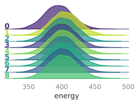
>
> 
>
> 
>
> 
>
> 
>
> 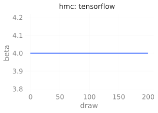
>
> 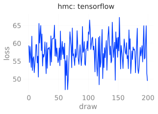
>
> 
>
> 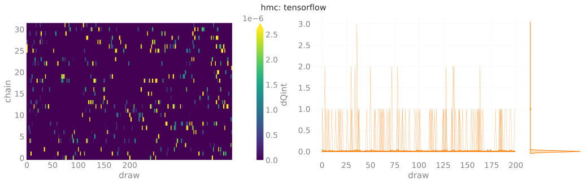
>
> 
>
> 
>
> 
>
> 
>
> 
>
> 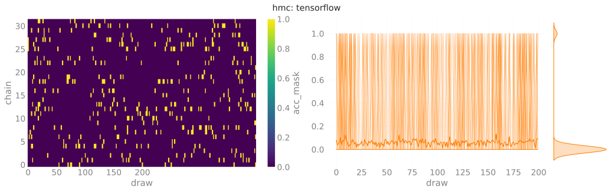
>
> 
>
> 
>
> 
>
> </div>

</div>

# Model Performance

Our goal is improving the efficiency of our MCMC sampler.

In particular, we are interested in generating **independent**
save_datasetrations which we can then use to calculate expectation
values of physical observables.

For our purposes, we are interested in obtaining lattice configurations
from distinct *topological charge sectors*, as characterized by a
configurations *topological charge*, $Q$.

HMC is known to suffer from *critical slowing down*, a phenomenon in
which our configurations remains stuck in some local topological charge
sector and fails to produce distinct configurations.

In particular, it is known that the integrated autocorrelation time of
the topological charge $\tau$ grows exponentially with decreasing
lattice spacing (i.e. continuum limit), making this theory especially
problematic.

Because of this, we can assess our models’ performance by looking at the
*tunneling rate*, i.e. the rate at which our sampler jumps between these
different charge sectors.

We can write this quantity as:

$$
\delta Q = |Q^{(i)} - Q^{(i-1)}|
$$

where we look at the difference in the topological charge between
sequential configurations.

<div class="alert alert-block alert-info"
style="background:rgba(34,139,230,0.1); color: rgb(34,139,230); border: 0px solid; border-radius:5px;">

<b>Note:</b> The efficiency of our sampler is directly proportional to
the tunneling rate, which is inversely proportional to the integrated
autocorrelation time $\tau$, i.e.

 

$$
\text{Efficiency} \propto \delta Q \propto \frac{1}{\tau}
$$

Explicitly, this means that the **more efficient** the model
$\longrightarrow$

- the **larger** tunneling rate
- the **smaller** integrated autocorrelation time for $Q$

</div>

``` python
import xarray as xr

def get_thermalized_configs(
        x: np.ndarray | xr.DataArray,
        drop: int = 5
) -> np.ndarray | xr.DataArray:
    """Drop the first `drop` states across all chains.

    x.shape = [draws, chains]
    """
    if isinstance(x, np.ndarray):
        return np.sort(x)[..., :-drop]
    if isinstance(x, xr.DataArray):
        return x.sortby(
            ['chain', 'draw'],
            ascending=False
        )[..., :-drop]
    raise TypeError
```

# Comparisons

We can measure our models’ performance explicitly by looking at the
average tunneling rate, $\delta Q_{\mathbb{Z}}$, for our **trained
model** and comparing it against generic HMC.

Recall,

$$\delta Q_{\mathbb{Z}} := \big|Q^{(i+1)}_{\mathbb{Z}} - Q^{(i)}_{\mathbb{Z}}\big|$$

where a **higher** value of $\delta Q_{\mathbb{Z}}$ corresponds to
**better** tunneling of the topological charge, $Q_{\mathbb{Z}}$.

Note that we can get a concise representation of the data from different
parts of our run via:

Note that the data from each of the different parts of our experiment
(i.e. `train`, `eval`, and `hmc`) are stored as a dict, e.g.

``` python
>>> list(ptExpU1.trainer.histories.keys())
['train', 'eval', 'hmc']
>>> train_history = ptExpU1.trainer.histories['train']
>>> train_dset = train_history.get_dataset()
>>> assert isinstance(train_history, l2hmc.utils.history.BaseHistory)
>>> assert isinstance(train_dset, xarray.Dataset)
```

(see below, for example)

We aggregate the data into the `dsets` dict below, grouped by:

1.  **Framework** (`pytorch` / `tensorflow`)
2.  **Job type** (`train`, `eval`, `hmc`)

``` python
import logging
log = logging.getLogger(__name__)
dsets = {}
fws = ['pt', 'tf']
modes = ['train', 'eval', 'hmc']
for fw in fws:
    dsets[fw] = {}
    for mode in modes:
        hist = None
        if fw == 'pt':
            hist = ptExpU1.trainer.histories.get(mode, None)
        elif fw == 'tf':
            hist = tfExpU1.trainer.histories.get(mode, None)
        if hist is not None:
            log.info(f'Getting dataset for {fw}: {mode}')
            dsets[fw][mode] = hist.get_dataset()
```

<div>

> **<span class="code-text">`output`:</span>**
>
> <div class="cell-output cell-output-display">
>
> <pre style="white-space:pre;overflow-x:auto;line-height:normal;font-family:monospace"><span style="color: #838383; text-decoration-color: #838383">[2023-12-05 12:16:33]</span><span style="color: #2196F3; text-decoration-color: #2196F3">[INFO]</span><span style="color: #777777; text-decoration-color: #777777">[2324717418.py:15]</span> - Getting dataset for pt: train </pre>
> <pre style="white-space:pre;overflow-x:auto;line-height:normal;font-family:monospace"><span style="color: #838383; text-decoration-color: #838383">[2023-12-05 12:16:33]</span><span style="color: #2196F3; text-decoration-color: #2196F3">[INFO]</span><span style="color: #777777; text-decoration-color: #777777">[2324717418.py:15]</span> - Getting dataset for pt: eval </pre>
> <pre style="white-space:pre;overflow-x:auto;line-height:normal;font-family:monospace"><span style="color: #838383; text-decoration-color: #838383">[2023-12-05 12:16:33]</span><span style="color: #2196F3; text-decoration-color: #2196F3">[INFO]</span><span style="color: #777777; text-decoration-color: #777777">[2324717418.py:15]</span> - Getting dataset for pt: hmc </pre>
> <pre style="white-space:pre;overflow-x:auto;line-height:normal;font-family:monospace"><span style="color: #838383; text-decoration-color: #838383">[2023-12-05 12:16:33]</span><span style="color: #2196F3; text-decoration-color: #2196F3">[INFO]</span><span style="color: #777777; text-decoration-color: #777777">[2324717418.py:15]</span> - Getting dataset for tf: train </pre>
> <pre style="white-space:pre;overflow-x:auto;line-height:normal;font-family:monospace"><span style="color: #838383; text-decoration-color: #838383">[2023-12-05 12:16:33]</span><span style="color: #2196F3; text-decoration-color: #2196F3">[INFO]</span><span style="color: #777777; text-decoration-color: #777777">[2324717418.py:15]</span> - Getting dataset for tf: eval </pre>
> <pre style="white-space:pre;overflow-x:auto;line-height:normal;font-family:monospace"><span style="color: #838383; text-decoration-color: #838383">[2023-12-05 12:16:33]</span><span style="color: #2196F3; text-decoration-color: #2196F3">[INFO]</span><span style="color: #777777; text-decoration-color: #777777">[2324717418.py:15]</span> - Getting dataset for tf: hmc </pre>
>
> </div>

</div>

``` python
dset_eval_pt = ptExpU1.trainer.histories['eval'].get_dataset()
dset_hmc_pt = ptExpU1.trainer.histories['hmc'].get_dataset()
```

``` python
import numpy as np
import matplotlib.pyplot as plt
plt.rcParams['text.usetex'] = False
import matplotlib.pyplot as plt
from l2hmc.utils.plot_helpers import COLORS


# ---------------------------------------------
# ---- DROP FIRST 20% FOR THERMALIZATION ------
# ---------------------------------------------
KEEP = int(0.8 * len(dset_eval_pt.draw))
dqpte = get_thermalized_configs(dset_eval_pt['dQint'].astype('int'))
dqpth = get_thermalized_configs(dset_hmc_pt['dQint'].astype('int'))
#dqpte = get_thermalized_configs(dsets['pt']['eval']['dQint'].astype('int'))
#dqpth = get_thermalized_configs(dsets['pt']['hmc']['dQint'].astype('int'))
```

``` python
dqtfe = get_thermalized_configs(dsets['tf']['eval']['dQint'].astype('int'))
dqtfh = get_thermalized_configs(dsets['tf']['hmc']['dQint'].astype('int'))
```

``` python
dqpte_tot = dqpte.sum().values.item()
dqpth_tot = dqpth.sum().values.item()
```

``` python
log.info(f'{dqpte_tot=}')
log.info(f'{dqpth_tot=}')
```

<div>

> **<span class="code-text">`output`:</span>**
>
> <div class="cell-output cell-output-display">
>
> <pre style="white-space:pre;overflow-x:auto;line-height:normal;font-family:monospace"><span style="color: #838383; text-decoration-color: #838383">[2023-12-05 12:16:34]</span><span style="color: #2196F3; text-decoration-color: #2196F3">[INFO]</span><span style="color: #777777; text-decoration-color: #777777">[853527999.py:1]</span> - <span style="color: #ff00ff; text-decoration-color: #ff00ff; font-style: italic">dqpte_tot</span>=<span style="color: #1A8FFF; text-decoration-color: #1A8FFF; font-weight: bold">1261</span> </pre>
> <pre style="white-space:pre;overflow-x:auto;line-height:normal;font-family:monospace"><span style="color: #838383; text-decoration-color: #838383">[2023-12-05 12:16:34]</span><span style="color: #2196F3; text-decoration-color: #2196F3">[INFO]</span><span style="color: #777777; text-decoration-color: #777777">[853527999.py:2]</span> - <span style="color: #ff00ff; text-decoration-color: #ff00ff; font-style: italic">dqpth_tot</span>=<span style="color: #1A8FFF; text-decoration-color: #1A8FFF; font-weight: bold">170</span> </pre>
>
> </div>

</div>

``` python
with plt.rc_context(
    {
        'text.usetex': False,
        #'font.family': 'sans-serif',
        #'font.sans-serif': 'IBM Plex Sans',
        #'mathtext.fontset': 'dejavusans',
    }
):
    fig, ax = plt.subplots(figsize=(8, 3))
    _ = sns.distplot(
        dqpth.sum('chain'),
        kde=False,
        color=COLORS['blue'],
        hist_kws={'edgecolor': 'none'},
        label=fr'HMC, $ \sum \delta Q =$ {dqpth_tot}',
        ax=ax
    )
    _ = sns.distplot(
        dqpte.sum('chain'),
        kde=False,
        color=COLORS['red'],
        hist_kws={'edgecolor': 'none'},
        label=fr'Trained, $\sum\delta Q =$ {dqpte_tot}',
        ax=ax
    )
    _ = ax.set_xlabel(
        #f'# tunneling events / {dqpte.shape[-1]} configurations'
        r"$\delta Q$",
        #fontname="IBM Plex Sans",
        #textcolor='#838383',
    )
    _ = ax.grid(alpha=0.0)
    _ = ax.legend(loc='best', frameon=False)
    plt.legend()
```

<div class="cell-output cell-output-display"
style="text-align: center;">

<div id="fig-dQpt">


Figure 1: $\delta Q$ for model trained with `PyTorch` (red) vs HMC
(blue).

</div>

</div>

``` python
dqtfe_tot = dqtfe.sum().values.item()
dqtfh_tot = dqtfh.sum().values.item()

fig, ax = plt.subplots(figsize=(8, 3))
_ = sns.distplot(
    dqtfh.sum('chain'),
    kde=False,
    color=COLORS['blue'],
    hist_kws={'edgecolor': 'none'},
    label=fr'HMC, $ \sum \delta Q =$ {dqtfh_tot}',
    ax=ax
)
_ = sns.distplot(
    dqtfe.sum('chain'),
    kde=False,
    color=COLORS['red'],
    hist_kws={'edgecolor': 'none'},
    label=fr'Trained, $\sum\delta Q =$ {dqtfe_tot}',
    ax=ax
)
_ = ax.set_xlabel(
    #f'# tunneling events / {dqtfe.shape[-1]} configurations'
    r"$\delta Q$",
    #fontname="IBM Plex Sans",
    #textcolor='#838383',
)
_ = ax.grid(alpha=0.0)
_ = ax.legend(loc='best', frameon=False)
_ = plt.legend()
```

<div class="cell-output cell-output-display"
style="text-align: center;">

<div id="fig-dQpt">


Figure 2: $\delta Q$ for model trained with `TensorFlow` (red) vs HMC
(blue).

</div>

</div>

``` python
fig, ax = plt.subplots(figsize=(16, 3), ncols=2)
_ = sns.distplot(
    dqpte.sum('chain'),
    kde=False,
    color=COLORS['blue'],
    hist_kws={'edgecolor': 'none'},
    label='Eval',
    ax=ax[0]
)
_ = sns.distplot(
    dqpth.sum('chain'),
    kde=False,
    color=COLORS['red'],
    hist_kws={'edgecolor': 'none'},
    label='HMC',
    ax=ax[0]
)

_ = ax[0].set_title('PyTorch')
_ = ax[0].set_xlabel(
    f'# tunneling events / {dqpte.shape[-1]} configurations'
)
_ = ax[0].legend(loc='best', frameon=False)
plt.legend()

_ = sns.distplot(
    dqtfe.sum('chain'),
    kde=False,
    color=COLORS['blue'],
    hist_kws={'edgecolor': 'none'},
    label='Eval',
    ax=ax[1]
)
_ = sns.distplot(
    dqtfh.sum('chain'),
    kde=False,
    color=COLORS['red'],
    label='HMC',
    ax=ax[1],
    hist_kws={'edgecolor': 'none'},
)

_ = ax[1].set_title('TensorFlow')
_ = ax[1].set_xlabel(
    r"""$\sum_{i=0} \left|\delta Q_{i}\right|$""",
    #fontsize='large',
    #f'# tunneling events / {dqpte.shape[-1]} configurations'
)
_ = ax[1].legend(loc='best', frameon=False)
```

<div>

> **<span class="code-text">`output`:</span>**
>
> <div class="cell-output cell-output-display">
>
> <pre style="white-space:pre;overflow-x:auto;line-height:normal;font-family:monospace"><span style="color: #838383; text-decoration-color: #838383">[2023-12-05 12:32:51]</span><span style="color: #FD971F; text-decoration-color: #FD971F">[WARNING]</span><span style="color: #777777; text-decoration-color: #777777">[legend.py:1363]</span> - No artists with labels found to put in legend.  Note that artists whose label start with an underscore are ignored when <span style="color: #800080; text-decoration-color: #800080; font-weight: bold">legend</span><span style="font-weight: bold">()</span> is called with no argument. </pre>
>
> 
>
> </div>

</div>

## TensorFlow Results

``` python
sns.set_context('notebook')
ndraws = len(dsets['tf']['eval']['dQint'].draw)
drop = int(0.1 * ndraws)
keep = int(0.9 * ndraws)

dqe = dsets['tf']['eval']['dQint'][:, -90:]
dqh = dsets['tf']['hmc']['dQint'][:, -90:]

etot = dqe.astype(int).sum()
htot = dqh.astype(int).sum()

fsize = plt.rcParams['figure.figsize']
#figsize = (2.5 * fsize[0], fsize[1])
fig, ax = plt.subplots(figsize=figsize, ncols=2)
_ = dqe.astype(int).plot(ax=ax[0])
_ = dqh.astype(int).plot(ax=ax[1])
_ = ax[0].set_title(f'Eval, total: {etot.values}');
_ = ax[1].set_title(f'HMC, total: {htot.values}');
_ = fig.suptitle(fr'TensorFlow Improvement: {100*(etot / htot):3.0f}%')

dqe_tot = dqe.astype(int).sum().T.values.sum()
dqh_tot = dqh.astype(int).sum().T.values.sum()
dqeh_ratio = dqe_tot / dqh_tot

log.info(f"TensorFlow, EVAL\n {dqe.astype(int).sum('chain').T=}")
log.info(f"Eval: {dqe.astype(int).sum().T.values.sum()=}")
log.info(f"TensorFlow, HMC\n {dqh.astype(int).sum('chain').T=}")
log.info(f"HMC: {dqh.astype(int).sum().T.values.sum()=}")
log.critical(f"dQ_eval / dQ_hmc: {dqeh_ratio:.4f}")
```

<div>

> **<span class="code-text">`output`:</span>**
>
> <div class="cell-output cell-output-display">
>
> <pre style="white-space:pre;overflow-x:auto;line-height:normal;font-family:monospace"><span style="color: #838383; text-decoration-color: #838383">[2023-12-05 12:33:43]</span><span style="color: #2196F3; text-decoration-color: #2196F3">[INFO]</span><span style="color: #777777; text-decoration-color: #777777">[3549449091.py:25]</span> - TensorFlow, EVAL
>  <span style="color: #800080; text-decoration-color: #800080; font-weight: bold">dqe.astype</span><span style="font-weight: bold">(</span>int<span style="font-weight: bold">)</span><span style="color: #800080; text-decoration-color: #800080; font-weight: bold">.sum</span><span style="font-weight: bold">(</span><span style="color: #008000; text-decoration-color: #008000">'chain'</span><span style="font-weight: bold">)</span>.<span style="color: #ff00ff; text-decoration-color: #ff00ff; font-style: italic">T</span>=<span style="font-weight: bold">&lt;</span><span style="color: #ff00ff; text-decoration-color: #ff00ff; font-weight: bold">xarray.DataArray</span><span style="color: #000000; text-decoration-color: #000000"> </span><span style="color: #008000; text-decoration-color: #008000">'dQint'</span><span style="color: #000000; text-decoration-color: #000000"> </span><span style="color: #000000; text-decoration-color: #000000; font-weight: bold">(</span><span style="color: #000000; text-decoration-color: #000000">draw: </span><span style="color: #1A8FFF; text-decoration-color: #1A8FFF; font-weight: bold">90</span><span style="color: #000000; text-decoration-color: #000000; font-weight: bold">)</span><span style="font-weight: bold">&gt;</span>
> <span style="color: #800080; text-decoration-color: #800080; font-weight: bold">array</span><span style="font-weight: bold">([</span> <span style="color: #1A8FFF; text-decoration-color: #1A8FFF; font-weight: bold">4</span>,  <span style="color: #1A8FFF; text-decoration-color: #1A8FFF; font-weight: bold">2</span>,  <span style="color: #1A8FFF; text-decoration-color: #1A8FFF; font-weight: bold">7</span>,  <span style="color: #1A8FFF; text-decoration-color: #1A8FFF; font-weight: bold">5</span>, <span style="color: #1A8FFF; text-decoration-color: #1A8FFF; font-weight: bold">10</span>,  <span style="color: #1A8FFF; text-decoration-color: #1A8FFF; font-weight: bold">6</span>,  <span style="color: #1A8FFF; text-decoration-color: #1A8FFF; font-weight: bold">9</span>,  <span style="color: #1A8FFF; text-decoration-color: #1A8FFF; font-weight: bold">6</span>,  <span style="color: #1A8FFF; text-decoration-color: #1A8FFF; font-weight: bold">4</span>,  <span style="color: #1A8FFF; text-decoration-color: #1A8FFF; font-weight: bold">5</span>,  <span style="color: #1A8FFF; text-decoration-color: #1A8FFF; font-weight: bold">7</span>,  <span style="color: #1A8FFF; text-decoration-color: #1A8FFF; font-weight: bold">6</span>,  <span style="color: #1A8FFF; text-decoration-color: #1A8FFF; font-weight: bold">3</span>,  <span style="color: #1A8FFF; text-decoration-color: #1A8FFF; font-weight: bold">5</span>,  <span style="color: #1A8FFF; text-decoration-color: #1A8FFF; font-weight: bold">2</span>,  <span style="color: #1A8FFF; text-decoration-color: #1A8FFF; font-weight: bold">7</span>,  <span style="color: #1A8FFF; text-decoration-color: #1A8FFF; font-weight: bold">9</span>,
>         <span style="color: #1A8FFF; text-decoration-color: #1A8FFF; font-weight: bold">7</span>,  <span style="color: #1A8FFF; text-decoration-color: #1A8FFF; font-weight: bold">2</span>,  <span style="color: #1A8FFF; text-decoration-color: #1A8FFF; font-weight: bold">5</span>,  <span style="color: #1A8FFF; text-decoration-color: #1A8FFF; font-weight: bold">8</span>,  <span style="color: #1A8FFF; text-decoration-color: #1A8FFF; font-weight: bold">8</span>, <span style="color: #1A8FFF; text-decoration-color: #1A8FFF; font-weight: bold">10</span>,  <span style="color: #1A8FFF; text-decoration-color: #1A8FFF; font-weight: bold">6</span>,  <span style="color: #1A8FFF; text-decoration-color: #1A8FFF; font-weight: bold">5</span>,  <span style="color: #1A8FFF; text-decoration-color: #1A8FFF; font-weight: bold">9</span>,  <span style="color: #1A8FFF; text-decoration-color: #1A8FFF; font-weight: bold">5</span>, <span style="color: #1A8FFF; text-decoration-color: #1A8FFF; font-weight: bold">10</span>,  <span style="color: #1A8FFF; text-decoration-color: #1A8FFF; font-weight: bold">7</span>,  <span style="color: #1A8FFF; text-decoration-color: #1A8FFF; font-weight: bold">6</span>,  <span style="color: #1A8FFF; text-decoration-color: #1A8FFF; font-weight: bold">7</span>,  <span style="color: #1A8FFF; text-decoration-color: #1A8FFF; font-weight: bold">8</span>,  <span style="color: #1A8FFF; text-decoration-color: #1A8FFF; font-weight: bold">3</span>,  <span style="color: #1A8FFF; text-decoration-color: #1A8FFF; font-weight: bold">7</span>,
>         <span style="color: #1A8FFF; text-decoration-color: #1A8FFF; font-weight: bold">9</span>,  <span style="color: #1A8FFF; text-decoration-color: #1A8FFF; font-weight: bold">4</span>,  <span style="color: #1A8FFF; text-decoration-color: #1A8FFF; font-weight: bold">8</span>,  <span style="color: #1A8FFF; text-decoration-color: #1A8FFF; font-weight: bold">8</span>,  <span style="color: #1A8FFF; text-decoration-color: #1A8FFF; font-weight: bold">4</span>,  <span style="color: #1A8FFF; text-decoration-color: #1A8FFF; font-weight: bold">5</span>,  <span style="color: #1A8FFF; text-decoration-color: #1A8FFF; font-weight: bold">3</span>,  <span style="color: #1A8FFF; text-decoration-color: #1A8FFF; font-weight: bold">4</span>,  <span style="color: #1A8FFF; text-decoration-color: #1A8FFF; font-weight: bold">5</span>, <span style="color: #1A8FFF; text-decoration-color: #1A8FFF; font-weight: bold">10</span>,  <span style="color: #1A8FFF; text-decoration-color: #1A8FFF; font-weight: bold">9</span>,  <span style="color: #1A8FFF; text-decoration-color: #1A8FFF; font-weight: bold">4</span>,  <span style="color: #1A8FFF; text-decoration-color: #1A8FFF; font-weight: bold">9</span>,  <span style="color: #1A8FFF; text-decoration-color: #1A8FFF; font-weight: bold">8</span>,  <span style="color: #1A8FFF; text-decoration-color: #1A8FFF; font-weight: bold">4</span>,  <span style="color: #1A8FFF; text-decoration-color: #1A8FFF; font-weight: bold">9</span>,  <span style="color: #1A8FFF; text-decoration-color: #1A8FFF; font-weight: bold">5</span>,
>         <span style="color: #1A8FFF; text-decoration-color: #1A8FFF; font-weight: bold">5</span>,  <span style="color: #1A8FFF; text-decoration-color: #1A8FFF; font-weight: bold">6</span>,  <span style="color: #1A8FFF; text-decoration-color: #1A8FFF; font-weight: bold">9</span>,  <span style="color: #1A8FFF; text-decoration-color: #1A8FFF; font-weight: bold">4</span>,  <span style="color: #1A8FFF; text-decoration-color: #1A8FFF; font-weight: bold">7</span>,  <span style="color: #1A8FFF; text-decoration-color: #1A8FFF; font-weight: bold">5</span>,  <span style="color: #1A8FFF; text-decoration-color: #1A8FFF; font-weight: bold">5</span>,  <span style="color: #1A8FFF; text-decoration-color: #1A8FFF; font-weight: bold">7</span>,  <span style="color: #1A8FFF; text-decoration-color: #1A8FFF; font-weight: bold">7</span>,  <span style="color: #1A8FFF; text-decoration-color: #1A8FFF; font-weight: bold">6</span>,  <span style="color: #1A8FFF; text-decoration-color: #1A8FFF; font-weight: bold">3</span>,  <span style="color: #1A8FFF; text-decoration-color: #1A8FFF; font-weight: bold">8</span>,  <span style="color: #1A8FFF; text-decoration-color: #1A8FFF; font-weight: bold">8</span>, <span style="color: #1A8FFF; text-decoration-color: #1A8FFF; font-weight: bold">11</span>,  <span style="color: #1A8FFF; text-decoration-color: #1A8FFF; font-weight: bold">4</span>, <span style="color: #1A8FFF; text-decoration-color: #1A8FFF; font-weight: bold">10</span>,  <span style="color: #1A8FFF; text-decoration-color: #1A8FFF; font-weight: bold">7</span>,
>         <span style="color: #1A8FFF; text-decoration-color: #1A8FFF; font-weight: bold">7</span>,  <span style="color: #1A8FFF; text-decoration-color: #1A8FFF; font-weight: bold">7</span>,  <span style="color: #1A8FFF; text-decoration-color: #1A8FFF; font-weight: bold">5</span>,  <span style="color: #1A8FFF; text-decoration-color: #1A8FFF; font-weight: bold">9</span>,  <span style="color: #1A8FFF; text-decoration-color: #1A8FFF; font-weight: bold">7</span>,  <span style="color: #1A8FFF; text-decoration-color: #1A8FFF; font-weight: bold">7</span>,  <span style="color: #1A8FFF; text-decoration-color: #1A8FFF; font-weight: bold">7</span>,  <span style="color: #1A8FFF; text-decoration-color: #1A8FFF; font-weight: bold">9</span>,  <span style="color: #1A8FFF; text-decoration-color: #1A8FFF; font-weight: bold">5</span>,  <span style="color: #1A8FFF; text-decoration-color: #1A8FFF; font-weight: bold">8</span>,  <span style="color: #1A8FFF; text-decoration-color: #1A8FFF; font-weight: bold">6</span>,  <span style="color: #1A8FFF; text-decoration-color: #1A8FFF; font-weight: bold">5</span>,  <span style="color: #1A8FFF; text-decoration-color: #1A8FFF; font-weight: bold">7</span>,  <span style="color: #1A8FFF; text-decoration-color: #1A8FFF; font-weight: bold">6</span>,  <span style="color: #1A8FFF; text-decoration-color: #1A8FFF; font-weight: bold">6</span>,  <span style="color: #1A8FFF; text-decoration-color: #1A8FFF; font-weight: bold">6</span>, <span style="color: #1A8FFF; text-decoration-color: #1A8FFF; font-weight: bold">10</span>,
>         <span style="color: #1A8FFF; text-decoration-color: #1A8FFF; font-weight: bold">6</span>,  <span style="color: #1A8FFF; text-decoration-color: #1A8FFF; font-weight: bold">8</span>,  <span style="color: #1A8FFF; text-decoration-color: #1A8FFF; font-weight: bold">7</span>,  <span style="color: #1A8FFF; text-decoration-color: #1A8FFF; font-weight: bold">7</span>,  <span style="color: #1A8FFF; text-decoration-color: #1A8FFF; font-weight: bold">4</span><span style="font-weight: bold">])</span>
> Coordinates:
>   * draw     <span style="font-weight: bold">(</span>draw<span style="font-weight: bold">)</span> int64 <span style="color: #1A8FFF; text-decoration-color: #1A8FFF; font-weight: bold">110</span> <span style="color: #1A8FFF; text-decoration-color: #1A8FFF; font-weight: bold">111</span> <span style="color: #1A8FFF; text-decoration-color: #1A8FFF; font-weight: bold">112</span> <span style="color: #1A8FFF; text-decoration-color: #1A8FFF; font-weight: bold">113</span> <span style="color: #1A8FFF; text-decoration-color: #1A8FFF; font-weight: bold">114</span> <span style="color: #1A8FFF; text-decoration-color: #1A8FFF; font-weight: bold">115</span> <span style="color: #FD971F; text-decoration-color: #FD971F">...</span> <span style="color: #1A8FFF; text-decoration-color: #1A8FFF; font-weight: bold">194</span> <span style="color: #1A8FFF; text-decoration-color: #1A8FFF; font-weight: bold">195</span> <span style="color: #1A8FFF; text-decoration-color: #1A8FFF; font-weight: bold">196</span> <span style="color: #1A8FFF; text-decoration-color: #1A8FFF; font-weight: bold">197</span> <span style="color: #1A8FFF; text-decoration-color: #1A8FFF; font-weight: bold">198</span> <span style="color: #1A8FFF; text-decoration-color: #1A8FFF; font-weight: bold">199</span> </pre>
> <pre style="white-space:pre;overflow-x:auto;line-height:normal;font-family:monospace"><span style="color: #838383; text-decoration-color: #838383">[2023-12-05 12:33:43]</span><span style="color: #2196F3; text-decoration-color: #2196F3">[INFO]</span><span style="color: #777777; text-decoration-color: #777777">[3549449091.py:26]</span> - Eval: <span style="color: #800080; text-decoration-color: #800080; font-weight: bold">dqe.astype</span><span style="font-weight: bold">(</span>int<span style="font-weight: bold">)</span><span style="color: #800080; text-decoration-color: #800080; font-weight: bold">.sum</span><span style="font-weight: bold">()</span><span style="color: #800080; text-decoration-color: #800080; font-weight: bold">.T.values.sum</span><span style="font-weight: bold">()</span>=<span style="color: #1A8FFF; text-decoration-color: #1A8FFF; font-weight: bold">579</span> </pre>
> <pre style="white-space:pre;overflow-x:auto;line-height:normal;font-family:monospace"><span style="color: #838383; text-decoration-color: #838383">[2023-12-05 12:33:43]</span><span style="color: #2196F3; text-decoration-color: #2196F3">[INFO]</span><span style="color: #777777; text-decoration-color: #777777">[3549449091.py:27]</span> - TensorFlow, HMC
>  <span style="color: #800080; text-decoration-color: #800080; font-weight: bold">dqh.astype</span><span style="font-weight: bold">(</span>int<span style="font-weight: bold">)</span><span style="color: #800080; text-decoration-color: #800080; font-weight: bold">.sum</span><span style="font-weight: bold">(</span><span style="color: #008000; text-decoration-color: #008000">'chain'</span><span style="font-weight: bold">)</span>.<span style="color: #ff00ff; text-decoration-color: #ff00ff; font-style: italic">T</span>=<span style="font-weight: bold">&lt;</span><span style="color: #ff00ff; text-decoration-color: #ff00ff; font-weight: bold">xarray.DataArray</span><span style="color: #000000; text-decoration-color: #000000"> </span><span style="color: #008000; text-decoration-color: #008000">'dQint'</span><span style="color: #000000; text-decoration-color: #000000"> </span><span style="color: #000000; text-decoration-color: #000000; font-weight: bold">(</span><span style="color: #000000; text-decoration-color: #000000">draw: </span><span style="color: #1A8FFF; text-decoration-color: #1A8FFF; font-weight: bold">90</span><span style="color: #000000; text-decoration-color: #000000; font-weight: bold">)</span><span style="font-weight: bold">&gt;</span>
> <span style="color: #800080; text-decoration-color: #800080; font-weight: bold">array</span><span style="font-weight: bold">([</span><span style="color: #1A8FFF; text-decoration-color: #1A8FFF; font-weight: bold">0</span>, <span style="color: #1A8FFF; text-decoration-color: #1A8FFF; font-weight: bold">1</span>, <span style="color: #1A8FFF; text-decoration-color: #1A8FFF; font-weight: bold">0</span>, <span style="color: #1A8FFF; text-decoration-color: #1A8FFF; font-weight: bold">1</span>, <span style="color: #1A8FFF; text-decoration-color: #1A8FFF; font-weight: bold">0</span>, <span style="color: #1A8FFF; text-decoration-color: #1A8FFF; font-weight: bold">0</span>, <span style="color: #1A8FFF; text-decoration-color: #1A8FFF; font-weight: bold">2</span>, <span style="color: #1A8FFF; text-decoration-color: #1A8FFF; font-weight: bold">0</span>, <span style="color: #1A8FFF; text-decoration-color: #1A8FFF; font-weight: bold">3</span>, <span style="color: #1A8FFF; text-decoration-color: #1A8FFF; font-weight: bold">0</span>, <span style="color: #1A8FFF; text-decoration-color: #1A8FFF; font-weight: bold">1</span>, <span style="color: #1A8FFF; text-decoration-color: #1A8FFF; font-weight: bold">2</span>, <span style="color: #1A8FFF; text-decoration-color: #1A8FFF; font-weight: bold">0</span>, <span style="color: #1A8FFF; text-decoration-color: #1A8FFF; font-weight: bold">2</span>, <span style="color: #1A8FFF; text-decoration-color: #1A8FFF; font-weight: bold">1</span>, <span style="color: #1A8FFF; text-decoration-color: #1A8FFF; font-weight: bold">3</span>, <span style="color: #1A8FFF; text-decoration-color: #1A8FFF; font-weight: bold">1</span>, <span style="color: #1A8FFF; text-decoration-color: #1A8FFF; font-weight: bold">0</span>, <span style="color: #1A8FFF; text-decoration-color: #1A8FFF; font-weight: bold">2</span>, <span style="color: #1A8FFF; text-decoration-color: #1A8FFF; font-weight: bold">2</span>, <span style="color: #1A8FFF; text-decoration-color: #1A8FFF; font-weight: bold">0</span>, <span style="color: #1A8FFF; text-decoration-color: #1A8FFF; font-weight: bold">0</span>,
>        <span style="color: #1A8FFF; text-decoration-color: #1A8FFF; font-weight: bold">0</span>, <span style="color: #1A8FFF; text-decoration-color: #1A8FFF; font-weight: bold">0</span>, <span style="color: #1A8FFF; text-decoration-color: #1A8FFF; font-weight: bold">2</span>, <span style="color: #1A8FFF; text-decoration-color: #1A8FFF; font-weight: bold">1</span>, <span style="color: #1A8FFF; text-decoration-color: #1A8FFF; font-weight: bold">2</span>, <span style="color: #1A8FFF; text-decoration-color: #1A8FFF; font-weight: bold">0</span>, <span style="color: #1A8FFF; text-decoration-color: #1A8FFF; font-weight: bold">0</span>, <span style="color: #1A8FFF; text-decoration-color: #1A8FFF; font-weight: bold">0</span>, <span style="color: #1A8FFF; text-decoration-color: #1A8FFF; font-weight: bold">1</span>, <span style="color: #1A8FFF; text-decoration-color: #1A8FFF; font-weight: bold">0</span>, <span style="color: #1A8FFF; text-decoration-color: #1A8FFF; font-weight: bold">0</span>, <span style="color: #1A8FFF; text-decoration-color: #1A8FFF; font-weight: bold">1</span>, <span style="color: #1A8FFF; text-decoration-color: #1A8FFF; font-weight: bold">0</span>, <span style="color: #1A8FFF; text-decoration-color: #1A8FFF; font-weight: bold">0</span>, <span style="color: #1A8FFF; text-decoration-color: #1A8FFF; font-weight: bold">0</span>, <span style="color: #1A8FFF; text-decoration-color: #1A8FFF; font-weight: bold">2</span>, <span style="color: #1A8FFF; text-decoration-color: #1A8FFF; font-weight: bold">1</span>, <span style="color: #1A8FFF; text-decoration-color: #1A8FFF; font-weight: bold">1</span>, <span style="color: #1A8FFF; text-decoration-color: #1A8FFF; font-weight: bold">1</span>, <span style="color: #1A8FFF; text-decoration-color: #1A8FFF; font-weight: bold">0</span>, <span style="color: #1A8FFF; text-decoration-color: #1A8FFF; font-weight: bold">1</span>, <span style="color: #1A8FFF; text-decoration-color: #1A8FFF; font-weight: bold">0</span>,
>        <span style="color: #1A8FFF; text-decoration-color: #1A8FFF; font-weight: bold">2</span>, <span style="color: #1A8FFF; text-decoration-color: #1A8FFF; font-weight: bold">1</span>, <span style="color: #1A8FFF; text-decoration-color: #1A8FFF; font-weight: bold">1</span>, <span style="color: #1A8FFF; text-decoration-color: #1A8FFF; font-weight: bold">1</span>, <span style="color: #1A8FFF; text-decoration-color: #1A8FFF; font-weight: bold">2</span>, <span style="color: #1A8FFF; text-decoration-color: #1A8FFF; font-weight: bold">3</span>, <span style="color: #1A8FFF; text-decoration-color: #1A8FFF; font-weight: bold">3</span>, <span style="color: #1A8FFF; text-decoration-color: #1A8FFF; font-weight: bold">1</span>, <span style="color: #1A8FFF; text-decoration-color: #1A8FFF; font-weight: bold">0</span>, <span style="color: #1A8FFF; text-decoration-color: #1A8FFF; font-weight: bold">2</span>, <span style="color: #1A8FFF; text-decoration-color: #1A8FFF; font-weight: bold">1</span>, <span style="color: #1A8FFF; text-decoration-color: #1A8FFF; font-weight: bold">0</span>, <span style="color: #1A8FFF; text-decoration-color: #1A8FFF; font-weight: bold">0</span>, <span style="color: #1A8FFF; text-decoration-color: #1A8FFF; font-weight: bold">0</span>, <span style="color: #1A8FFF; text-decoration-color: #1A8FFF; font-weight: bold">1</span>, <span style="color: #1A8FFF; text-decoration-color: #1A8FFF; font-weight: bold">0</span>, <span style="color: #1A8FFF; text-decoration-color: #1A8FFF; font-weight: bold">0</span>, <span style="color: #1A8FFF; text-decoration-color: #1A8FFF; font-weight: bold">3</span>, <span style="color: #1A8FFF; text-decoration-color: #1A8FFF; font-weight: bold">1</span>, <span style="color: #1A8FFF; text-decoration-color: #1A8FFF; font-weight: bold">0</span>, <span style="color: #1A8FFF; text-decoration-color: #1A8FFF; font-weight: bold">5</span>, <span style="color: #1A8FFF; text-decoration-color: #1A8FFF; font-weight: bold">0</span>,
>        <span style="color: #1A8FFF; text-decoration-color: #1A8FFF; font-weight: bold">0</span>, <span style="color: #1A8FFF; text-decoration-color: #1A8FFF; font-weight: bold">1</span>, <span style="color: #1A8FFF; text-decoration-color: #1A8FFF; font-weight: bold">0</span>, <span style="color: #1A8FFF; text-decoration-color: #1A8FFF; font-weight: bold">0</span>, <span style="color: #1A8FFF; text-decoration-color: #1A8FFF; font-weight: bold">0</span>, <span style="color: #1A8FFF; text-decoration-color: #1A8FFF; font-weight: bold">1</span>, <span style="color: #1A8FFF; text-decoration-color: #1A8FFF; font-weight: bold">1</span>, <span style="color: #1A8FFF; text-decoration-color: #1A8FFF; font-weight: bold">2</span>, <span style="color: #1A8FFF; text-decoration-color: #1A8FFF; font-weight: bold">1</span>, <span style="color: #1A8FFF; text-decoration-color: #1A8FFF; font-weight: bold">3</span>, <span style="color: #1A8FFF; text-decoration-color: #1A8FFF; font-weight: bold">1</span>, <span style="color: #1A8FFF; text-decoration-color: #1A8FFF; font-weight: bold">1</span>, <span style="color: #1A8FFF; text-decoration-color: #1A8FFF; font-weight: bold">0</span>, <span style="color: #1A8FFF; text-decoration-color: #1A8FFF; font-weight: bold">2</span>, <span style="color: #1A8FFF; text-decoration-color: #1A8FFF; font-weight: bold">0</span>, <span style="color: #1A8FFF; text-decoration-color: #1A8FFF; font-weight: bold">1</span>, <span style="color: #1A8FFF; text-decoration-color: #1A8FFF; font-weight: bold">0</span>, <span style="color: #1A8FFF; text-decoration-color: #1A8FFF; font-weight: bold">0</span>, <span style="color: #1A8FFF; text-decoration-color: #1A8FFF; font-weight: bold">1</span>, <span style="color: #1A8FFF; text-decoration-color: #1A8FFF; font-weight: bold">3</span>, <span style="color: #1A8FFF; text-decoration-color: #1A8FFF; font-weight: bold">0</span>, <span style="color: #1A8FFF; text-decoration-color: #1A8FFF; font-weight: bold">0</span>,
>        <span style="color: #1A8FFF; text-decoration-color: #1A8FFF; font-weight: bold">0</span>, <span style="color: #1A8FFF; text-decoration-color: #1A8FFF; font-weight: bold">1</span><span style="font-weight: bold">])</span>
> Coordinates:
>   * draw     <span style="font-weight: bold">(</span>draw<span style="font-weight: bold">)</span> int64 <span style="color: #1A8FFF; text-decoration-color: #1A8FFF; font-weight: bold">110</span> <span style="color: #1A8FFF; text-decoration-color: #1A8FFF; font-weight: bold">111</span> <span style="color: #1A8FFF; text-decoration-color: #1A8FFF; font-weight: bold">112</span> <span style="color: #1A8FFF; text-decoration-color: #1A8FFF; font-weight: bold">113</span> <span style="color: #1A8FFF; text-decoration-color: #1A8FFF; font-weight: bold">114</span> <span style="color: #1A8FFF; text-decoration-color: #1A8FFF; font-weight: bold">115</span> <span style="color: #FD971F; text-decoration-color: #FD971F">...</span> <span style="color: #1A8FFF; text-decoration-color: #1A8FFF; font-weight: bold">194</span> <span style="color: #1A8FFF; text-decoration-color: #1A8FFF; font-weight: bold">195</span> <span style="color: #1A8FFF; text-decoration-color: #1A8FFF; font-weight: bold">196</span> <span style="color: #1A8FFF; text-decoration-color: #1A8FFF; font-weight: bold">197</span> <span style="color: #1A8FFF; text-decoration-color: #1A8FFF; font-weight: bold">198</span> <span style="color: #1A8FFF; text-decoration-color: #1A8FFF; font-weight: bold">199</span> </pre>
> <pre style="white-space:pre;overflow-x:auto;line-height:normal;font-family:monospace"><span style="color: #838383; text-decoration-color: #838383">[2023-12-05 12:33:43]</span><span style="color: #2196F3; text-decoration-color: #2196F3">[INFO]</span><span style="color: #777777; text-decoration-color: #777777">[3549449091.py:28]</span> - HMC: <span style="color: #800080; text-decoration-color: #800080; font-weight: bold">dqh.astype</span><span style="font-weight: bold">(</span>int<span style="font-weight: bold">)</span><span style="color: #800080; text-decoration-color: #800080; font-weight: bold">.sum</span><span style="font-weight: bold">()</span><span style="color: #800080; text-decoration-color: #800080; font-weight: bold">.T.values.sum</span><span style="font-weight: bold">()</span>=<span style="color: #1A8FFF; text-decoration-color: #1A8FFF; font-weight: bold">80</span> </pre>
> <pre style="white-space:pre;overflow-x:auto;line-height:normal;font-family:monospace"><span style="color: #838383; text-decoration-color: #838383">[2023-12-05 12:33:43]</span><span style="background-color: #ff0000; font-weight: bold">[CRITICAL]</span><span style="color: #777777; text-decoration-color: #777777">[3549449091.py:29]</span> - dQ_eval <span style="color: #008000; text-decoration-color: #008000">/</span> dQ_hmc: <span style="color: #1A8FFF; text-decoration-color: #1A8FFF; font-weight: bold">7.2375</span> </pre>
>
> 
>
> </div>

</div>

### PyTorch Results

``` python
sns.set_context('notebook', font_scale=1.25)

ndraws = len(dsets['pt']['eval']['dQint'].draw)
drop = int(0.1 * ndraws)
keep = int(0.9 * ndraws)

dqe = dsets['pt']['eval']['dQint'][:, -90:]
dqh = dsets['pt']['hmc']['dQint'][:, -90:]

etot = dqe.astype(int).sum()
htot = dqh.astype(int).sum()

fsize = plt.rcParams['figure.figsize']
figsize = (2.5 * fsize[0], 0.8 * fsize[1])
fig, ax = plt.subplots(figsize=figsize, ncols=2)
_ = dqe.astype(int).plot(ax=ax[0])
_ = dqh.astype(int).plot(ax=ax[1])
_ = ax[0].set_title(f'Eval, total: {etot.values}');
_ = ax[1].set_title(f'HMC, total: {htot.values}');
#_ = fig.suptitle(fr'PyTorch Improvement: {100*(etot / htot):3.0f}%')
```

<div>

> **<span class="code-text">`output`:</span>**
>
> <div class="cell-output cell-output-display">
>
> 
>
> </div>

</div>

``` python
dqe_tot = dqe.astype(int).sum().T.values.sum()
dqh_tot = dqh.astype(int).sum().T.values.sum()
dqeh_ratio = dqe_tot / dqh_tot

log.info(f"PyTorch, EVAL\n {dqe.astype(int).sum('chain').T=}")
log.info(f"Eval: {dqe.astype(int).sum().T.values.sum()=}")
log.info(f"TensorFlow, HMC\n {dqh.astype(int).sum('chain').T=}")
log.info(f"HMC: {dqh.astype(int).sum().T.values.sum()=}")
log.critical(f"dQ_eval / dQ_hmc: {dqeh_ratio:.4f}")
```

<div>

> **<span class="code-text">`output`:</span>**
>
> <div class="cell-output cell-output-display">
>
> <pre style="white-space:pre;overflow-x:auto;line-height:normal;font-family:monospace"><span style="color: #838383; text-decoration-color: #838383">[2023-12-05 12:35:35]</span><span style="color: #2196F3; text-decoration-color: #2196F3">[INFO]</span><span style="color: #777777; text-decoration-color: #777777">[2202273834.py:5]</span> - PyTorch, EVAL
>  <span style="color: #800080; text-decoration-color: #800080; font-weight: bold">dqe.astype</span><span style="font-weight: bold">(</span>int<span style="font-weight: bold">)</span><span style="color: #800080; text-decoration-color: #800080; font-weight: bold">.sum</span><span style="font-weight: bold">(</span><span style="color: #008000; text-decoration-color: #008000">'chain'</span><span style="font-weight: bold">)</span>.<span style="color: #ff00ff; text-decoration-color: #ff00ff; font-style: italic">T</span>=<span style="font-weight: bold">&lt;</span><span style="color: #ff00ff; text-decoration-color: #ff00ff; font-weight: bold">xarray.DataArray</span><span style="color: #000000; text-decoration-color: #000000"> </span><span style="color: #008000; text-decoration-color: #008000">'dQint'</span><span style="color: #000000; text-decoration-color: #000000"> </span><span style="color: #000000; text-decoration-color: #000000; font-weight: bold">(</span><span style="color: #000000; text-decoration-color: #000000">draw: </span><span style="color: #1A8FFF; text-decoration-color: #1A8FFF; font-weight: bold">90</span><span style="color: #000000; text-decoration-color: #000000; font-weight: bold">)</span><span style="font-weight: bold">&gt;</span>
> <span style="color: #800080; text-decoration-color: #800080; font-weight: bold">array</span><span style="font-weight: bold">([</span> <span style="color: #1A8FFF; text-decoration-color: #1A8FFF; font-weight: bold">8</span>,  <span style="color: #1A8FFF; text-decoration-color: #1A8FFF; font-weight: bold">6</span>,  <span style="color: #1A8FFF; text-decoration-color: #1A8FFF; font-weight: bold">8</span>,  <span style="color: #1A8FFF; text-decoration-color: #1A8FFF; font-weight: bold">8</span>,  <span style="color: #1A8FFF; text-decoration-color: #1A8FFF; font-weight: bold">5</span>,  <span style="color: #1A8FFF; text-decoration-color: #1A8FFF; font-weight: bold">6</span>,  <span style="color: #1A8FFF; text-decoration-color: #1A8FFF; font-weight: bold">5</span>, <span style="color: #1A8FFF; text-decoration-color: #1A8FFF; font-weight: bold">10</span>, <span style="color: #1A8FFF; text-decoration-color: #1A8FFF; font-weight: bold">13</span>,  <span style="color: #1A8FFF; text-decoration-color: #1A8FFF; font-weight: bold">8</span>,  <span style="color: #1A8FFF; text-decoration-color: #1A8FFF; font-weight: bold">2</span>,  <span style="color: #1A8FFF; text-decoration-color: #1A8FFF; font-weight: bold">4</span>,  <span style="color: #1A8FFF; text-decoration-color: #1A8FFF; font-weight: bold">7</span>,  <span style="color: #1A8FFF; text-decoration-color: #1A8FFF; font-weight: bold">9</span>,  <span style="color: #1A8FFF; text-decoration-color: #1A8FFF; font-weight: bold">6</span>,  <span style="color: #1A8FFF; text-decoration-color: #1A8FFF; font-weight: bold">6</span>,  <span style="color: #1A8FFF; text-decoration-color: #1A8FFF; font-weight: bold">8</span>,
>         <span style="color: #1A8FFF; text-decoration-color: #1A8FFF; font-weight: bold">8</span>,  <span style="color: #1A8FFF; text-decoration-color: #1A8FFF; font-weight: bold">8</span>, <span style="color: #1A8FFF; text-decoration-color: #1A8FFF; font-weight: bold">10</span>,  <span style="color: #1A8FFF; text-decoration-color: #1A8FFF; font-weight: bold">5</span>,  <span style="color: #1A8FFF; text-decoration-color: #1A8FFF; font-weight: bold">9</span>,  <span style="color: #1A8FFF; text-decoration-color: #1A8FFF; font-weight: bold">6</span>,  <span style="color: #1A8FFF; text-decoration-color: #1A8FFF; font-weight: bold">6</span>, <span style="color: #1A8FFF; text-decoration-color: #1A8FFF; font-weight: bold">12</span>,  <span style="color: #1A8FFF; text-decoration-color: #1A8FFF; font-weight: bold">3</span>,  <span style="color: #1A8FFF; text-decoration-color: #1A8FFF; font-weight: bold">6</span>,  <span style="color: #1A8FFF; text-decoration-color: #1A8FFF; font-weight: bold">7</span>,  <span style="color: #1A8FFF; text-decoration-color: #1A8FFF; font-weight: bold">5</span>,  <span style="color: #1A8FFF; text-decoration-color: #1A8FFF; font-weight: bold">8</span>,  <span style="color: #1A8FFF; text-decoration-color: #1A8FFF; font-weight: bold">8</span>, <span style="color: #1A8FFF; text-decoration-color: #1A8FFF; font-weight: bold">12</span>,  <span style="color: #1A8FFF; text-decoration-color: #1A8FFF; font-weight: bold">7</span>,  <span style="color: #1A8FFF; text-decoration-color: #1A8FFF; font-weight: bold">4</span>,
>         <span style="color: #1A8FFF; text-decoration-color: #1A8FFF; font-weight: bold">8</span>,  <span style="color: #1A8FFF; text-decoration-color: #1A8FFF; font-weight: bold">7</span>,  <span style="color: #1A8FFF; text-decoration-color: #1A8FFF; font-weight: bold">3</span>,  <span style="color: #1A8FFF; text-decoration-color: #1A8FFF; font-weight: bold">6</span>,  <span style="color: #1A8FFF; text-decoration-color: #1A8FFF; font-weight: bold">4</span>,  <span style="color: #1A8FFF; text-decoration-color: #1A8FFF; font-weight: bold">5</span>,  <span style="color: #1A8FFF; text-decoration-color: #1A8FFF; font-weight: bold">7</span>,  <span style="color: #1A8FFF; text-decoration-color: #1A8FFF; font-weight: bold">6</span>,  <span style="color: #1A8FFF; text-decoration-color: #1A8FFF; font-weight: bold">6</span>, <span style="color: #1A8FFF; text-decoration-color: #1A8FFF; font-weight: bold">10</span>,  <span style="color: #1A8FFF; text-decoration-color: #1A8FFF; font-weight: bold">7</span>,  <span style="color: #1A8FFF; text-decoration-color: #1A8FFF; font-weight: bold">4</span>,  <span style="color: #1A8FFF; text-decoration-color: #1A8FFF; font-weight: bold">4</span>, <span style="color: #1A8FFF; text-decoration-color: #1A8FFF; font-weight: bold">11</span>,  <span style="color: #1A8FFF; text-decoration-color: #1A8FFF; font-weight: bold">7</span>,  <span style="color: #1A8FFF; text-decoration-color: #1A8FFF; font-weight: bold">7</span>,  <span style="color: #1A8FFF; text-decoration-color: #1A8FFF; font-weight: bold">7</span>,
>         <span style="color: #1A8FFF; text-decoration-color: #1A8FFF; font-weight: bold">4</span>,  <span style="color: #1A8FFF; text-decoration-color: #1A8FFF; font-weight: bold">6</span>,  <span style="color: #1A8FFF; text-decoration-color: #1A8FFF; font-weight: bold">7</span>,  <span style="color: #1A8FFF; text-decoration-color: #1A8FFF; font-weight: bold">6</span>,  <span style="color: #1A8FFF; text-decoration-color: #1A8FFF; font-weight: bold">6</span>, <span style="color: #1A8FFF; text-decoration-color: #1A8FFF; font-weight: bold">10</span>,  <span style="color: #1A8FFF; text-decoration-color: #1A8FFF; font-weight: bold">9</span>,  <span style="color: #1A8FFF; text-decoration-color: #1A8FFF; font-weight: bold">5</span>,  <span style="color: #1A8FFF; text-decoration-color: #1A8FFF; font-weight: bold">6</span>,  <span style="color: #1A8FFF; text-decoration-color: #1A8FFF; font-weight: bold">6</span>,  <span style="color: #1A8FFF; text-decoration-color: #1A8FFF; font-weight: bold">5</span>, <span style="color: #1A8FFF; text-decoration-color: #1A8FFF; font-weight: bold">13</span>,  <span style="color: #1A8FFF; text-decoration-color: #1A8FFF; font-weight: bold">2</span>,  <span style="color: #1A8FFF; text-decoration-color: #1A8FFF; font-weight: bold">9</span>,  <span style="color: #1A8FFF; text-decoration-color: #1A8FFF; font-weight: bold">9</span>, <span style="color: #1A8FFF; text-decoration-color: #1A8FFF; font-weight: bold">14</span>,  <span style="color: #1A8FFF; text-decoration-color: #1A8FFF; font-weight: bold">7</span>,
>         <span style="color: #1A8FFF; text-decoration-color: #1A8FFF; font-weight: bold">3</span>,  <span style="color: #1A8FFF; text-decoration-color: #1A8FFF; font-weight: bold">5</span>,  <span style="color: #1A8FFF; text-decoration-color: #1A8FFF; font-weight: bold">7</span>,  <span style="color: #1A8FFF; text-decoration-color: #1A8FFF; font-weight: bold">6</span>,  <span style="color: #1A8FFF; text-decoration-color: #1A8FFF; font-weight: bold">9</span>,  <span style="color: #1A8FFF; text-decoration-color: #1A8FFF; font-weight: bold">9</span>,  <span style="color: #1A8FFF; text-decoration-color: #1A8FFF; font-weight: bold">3</span>,  <span style="color: #1A8FFF; text-decoration-color: #1A8FFF; font-weight: bold">9</span>,  <span style="color: #1A8FFF; text-decoration-color: #1A8FFF; font-weight: bold">4</span>,  <span style="color: #1A8FFF; text-decoration-color: #1A8FFF; font-weight: bold">2</span>,  <span style="color: #1A8FFF; text-decoration-color: #1A8FFF; font-weight: bold">6</span>,  <span style="color: #1A8FFF; text-decoration-color: #1A8FFF; font-weight: bold">9</span>,  <span style="color: #1A8FFF; text-decoration-color: #1A8FFF; font-weight: bold">5</span>,  <span style="color: #1A8FFF; text-decoration-color: #1A8FFF; font-weight: bold">3</span>, <span style="color: #1A8FFF; text-decoration-color: #1A8FFF; font-weight: bold">10</span>,  <span style="color: #1A8FFF; text-decoration-color: #1A8FFF; font-weight: bold">7</span>,  <span style="color: #1A8FFF; text-decoration-color: #1A8FFF; font-weight: bold">8</span>,
>         <span style="color: #1A8FFF; text-decoration-color: #1A8FFF; font-weight: bold">8</span>,  <span style="color: #1A8FFF; text-decoration-color: #1A8FFF; font-weight: bold">7</span>,  <span style="color: #1A8FFF; text-decoration-color: #1A8FFF; font-weight: bold">6</span>,  <span style="color: #1A8FFF; text-decoration-color: #1A8FFF; font-weight: bold">6</span>,  <span style="color: #1A8FFF; text-decoration-color: #1A8FFF; font-weight: bold">7</span><span style="font-weight: bold">])</span>
> Coordinates:
>   * draw     <span style="font-weight: bold">(</span>draw<span style="font-weight: bold">)</span> int64 <span style="color: #1A8FFF; text-decoration-color: #1A8FFF; font-weight: bold">110</span> <span style="color: #1A8FFF; text-decoration-color: #1A8FFF; font-weight: bold">111</span> <span style="color: #1A8FFF; text-decoration-color: #1A8FFF; font-weight: bold">112</span> <span style="color: #1A8FFF; text-decoration-color: #1A8FFF; font-weight: bold">113</span> <span style="color: #1A8FFF; text-decoration-color: #1A8FFF; font-weight: bold">114</span> <span style="color: #1A8FFF; text-decoration-color: #1A8FFF; font-weight: bold">115</span> <span style="color: #FD971F; text-decoration-color: #FD971F">...</span> <span style="color: #1A8FFF; text-decoration-color: #1A8FFF; font-weight: bold">194</span> <span style="color: #1A8FFF; text-decoration-color: #1A8FFF; font-weight: bold">195</span> <span style="color: #1A8FFF; text-decoration-color: #1A8FFF; font-weight: bold">196</span> <span style="color: #1A8FFF; text-decoration-color: #1A8FFF; font-weight: bold">197</span> <span style="color: #1A8FFF; text-decoration-color: #1A8FFF; font-weight: bold">198</span> <span style="color: #1A8FFF; text-decoration-color: #1A8FFF; font-weight: bold">199</span> </pre>
> <pre style="white-space:pre;overflow-x:auto;line-height:normal;font-family:monospace"><span style="color: #838383; text-decoration-color: #838383">[2023-12-05 12:35:35]</span><span style="color: #2196F3; text-decoration-color: #2196F3">[INFO]</span><span style="color: #777777; text-decoration-color: #777777">[2202273834.py:6]</span> - Eval: <span style="color: #800080; text-decoration-color: #800080; font-weight: bold">dqe.astype</span><span style="font-weight: bold">(</span>int<span style="font-weight: bold">)</span><span style="color: #800080; text-decoration-color: #800080; font-weight: bold">.sum</span><span style="font-weight: bold">()</span><span style="color: #800080; text-decoration-color: #800080; font-weight: bold">.T.values.sum</span><span style="font-weight: bold">()</span>=<span style="color: #1A8FFF; text-decoration-color: #1A8FFF; font-weight: bold">615</span> </pre>
> <pre style="white-space:pre;overflow-x:auto;line-height:normal;font-family:monospace"><span style="color: #838383; text-decoration-color: #838383">[2023-12-05 12:35:35]</span><span style="color: #2196F3; text-decoration-color: #2196F3">[INFO]</span><span style="color: #777777; text-decoration-color: #777777">[2202273834.py:7]</span> - TensorFlow, HMC
>  <span style="color: #800080; text-decoration-color: #800080; font-weight: bold">dqh.astype</span><span style="font-weight: bold">(</span>int<span style="font-weight: bold">)</span><span style="color: #800080; text-decoration-color: #800080; font-weight: bold">.sum</span><span style="font-weight: bold">(</span><span style="color: #008000; text-decoration-color: #008000">'chain'</span><span style="font-weight: bold">)</span>.<span style="color: #ff00ff; text-decoration-color: #ff00ff; font-style: italic">T</span>=<span style="font-weight: bold">&lt;</span><span style="color: #ff00ff; text-decoration-color: #ff00ff; font-weight: bold">xarray.DataArray</span><span style="color: #000000; text-decoration-color: #000000"> </span><span style="color: #008000; text-decoration-color: #008000">'dQint'</span><span style="color: #000000; text-decoration-color: #000000"> </span><span style="color: #000000; text-decoration-color: #000000; font-weight: bold">(</span><span style="color: #000000; text-decoration-color: #000000">draw: </span><span style="color: #1A8FFF; text-decoration-color: #1A8FFF; font-weight: bold">90</span><span style="color: #000000; text-decoration-color: #000000; font-weight: bold">)</span><span style="font-weight: bold">&gt;</span>
> <span style="color: #800080; text-decoration-color: #800080; font-weight: bold">array</span><span style="font-weight: bold">([</span><span style="color: #1A8FFF; text-decoration-color: #1A8FFF; font-weight: bold">2</span>, <span style="color: #1A8FFF; text-decoration-color: #1A8FFF; font-weight: bold">3</span>, <span style="color: #1A8FFF; text-decoration-color: #1A8FFF; font-weight: bold">0</span>, <span style="color: #1A8FFF; text-decoration-color: #1A8FFF; font-weight: bold">1</span>, <span style="color: #1A8FFF; text-decoration-color: #1A8FFF; font-weight: bold">1</span>, <span style="color: #1A8FFF; text-decoration-color: #1A8FFF; font-weight: bold">0</span>, <span style="color: #1A8FFF; text-decoration-color: #1A8FFF; font-weight: bold">1</span>, <span style="color: #1A8FFF; text-decoration-color: #1A8FFF; font-weight: bold">1</span>, <span style="color: #1A8FFF; text-decoration-color: #1A8FFF; font-weight: bold">0</span>, <span style="color: #1A8FFF; text-decoration-color: #1A8FFF; font-weight: bold">0</span>, <span style="color: #1A8FFF; text-decoration-color: #1A8FFF; font-weight: bold">1</span>, <span style="color: #1A8FFF; text-decoration-color: #1A8FFF; font-weight: bold">0</span>, <span style="color: #1A8FFF; text-decoration-color: #1A8FFF; font-weight: bold">2</span>, <span style="color: #1A8FFF; text-decoration-color: #1A8FFF; font-weight: bold">1</span>, <span style="color: #1A8FFF; text-decoration-color: #1A8FFF; font-weight: bold">3</span>, <span style="color: #1A8FFF; text-decoration-color: #1A8FFF; font-weight: bold">0</span>, <span style="color: #1A8FFF; text-decoration-color: #1A8FFF; font-weight: bold">0</span>, <span style="color: #1A8FFF; text-decoration-color: #1A8FFF; font-weight: bold">5</span>, <span style="color: #1A8FFF; text-decoration-color: #1A8FFF; font-weight: bold">3</span>, <span style="color: #1A8FFF; text-decoration-color: #1A8FFF; font-weight: bold">0</span>, <span style="color: #1A8FFF; text-decoration-color: #1A8FFF; font-weight: bold">0</span>, <span style="color: #1A8FFF; text-decoration-color: #1A8FFF; font-weight: bold">0</span>,
>        <span style="color: #1A8FFF; text-decoration-color: #1A8FFF; font-weight: bold">0</span>, <span style="color: #1A8FFF; text-decoration-color: #1A8FFF; font-weight: bold">0</span>, <span style="color: #1A8FFF; text-decoration-color: #1A8FFF; font-weight: bold">1</span>, <span style="color: #1A8FFF; text-decoration-color: #1A8FFF; font-weight: bold">0</span>, <span style="color: #1A8FFF; text-decoration-color: #1A8FFF; font-weight: bold">0</span>, <span style="color: #1A8FFF; text-decoration-color: #1A8FFF; font-weight: bold">0</span>, <span style="color: #1A8FFF; text-decoration-color: #1A8FFF; font-weight: bold">1</span>, <span style="color: #1A8FFF; text-decoration-color: #1A8FFF; font-weight: bold">0</span>, <span style="color: #1A8FFF; text-decoration-color: #1A8FFF; font-weight: bold">1</span>, <span style="color: #1A8FFF; text-decoration-color: #1A8FFF; font-weight: bold">0</span>, <span style="color: #1A8FFF; text-decoration-color: #1A8FFF; font-weight: bold">0</span>, <span style="color: #1A8FFF; text-decoration-color: #1A8FFF; font-weight: bold">3</span>, <span style="color: #1A8FFF; text-decoration-color: #1A8FFF; font-weight: bold">4</span>, <span style="color: #1A8FFF; text-decoration-color: #1A8FFF; font-weight: bold">0</span>, <span style="color: #1A8FFF; text-decoration-color: #1A8FFF; font-weight: bold">0</span>, <span style="color: #1A8FFF; text-decoration-color: #1A8FFF; font-weight: bold">0</span>, <span style="color: #1A8FFF; text-decoration-color: #1A8FFF; font-weight: bold">1</span>, <span style="color: #1A8FFF; text-decoration-color: #1A8FFF; font-weight: bold">1</span>, <span style="color: #1A8FFF; text-decoration-color: #1A8FFF; font-weight: bold">0</span>, <span style="color: #1A8FFF; text-decoration-color: #1A8FFF; font-weight: bold">0</span>, <span style="color: #1A8FFF; text-decoration-color: #1A8FFF; font-weight: bold">0</span>, <span style="color: #1A8FFF; text-decoration-color: #1A8FFF; font-weight: bold">1</span>,
>        <span style="color: #1A8FFF; text-decoration-color: #1A8FFF; font-weight: bold">0</span>, <span style="color: #1A8FFF; text-decoration-color: #1A8FFF; font-weight: bold">0</span>, <span style="color: #1A8FFF; text-decoration-color: #1A8FFF; font-weight: bold">1</span>, <span style="color: #1A8FFF; text-decoration-color: #1A8FFF; font-weight: bold">0</span>, <span style="color: #1A8FFF; text-decoration-color: #1A8FFF; font-weight: bold">1</span>, <span style="color: #1A8FFF; text-decoration-color: #1A8FFF; font-weight: bold">1</span>, <span style="color: #1A8FFF; text-decoration-color: #1A8FFF; font-weight: bold">0</span>, <span style="color: #1A8FFF; text-decoration-color: #1A8FFF; font-weight: bold">0</span>, <span style="color: #1A8FFF; text-decoration-color: #1A8FFF; font-weight: bold">0</span>, <span style="color: #1A8FFF; text-decoration-color: #1A8FFF; font-weight: bold">0</span>, <span style="color: #1A8FFF; text-decoration-color: #1A8FFF; font-weight: bold">2</span>, <span style="color: #1A8FFF; text-decoration-color: #1A8FFF; font-weight: bold">1</span>, <span style="color: #1A8FFF; text-decoration-color: #1A8FFF; font-weight: bold">2</span>, <span style="color: #1A8FFF; text-decoration-color: #1A8FFF; font-weight: bold">2</span>, <span style="color: #1A8FFF; text-decoration-color: #1A8FFF; font-weight: bold">0</span>, <span style="color: #1A8FFF; text-decoration-color: #1A8FFF; font-weight: bold">1</span>, <span style="color: #1A8FFF; text-decoration-color: #1A8FFF; font-weight: bold">2</span>, <span style="color: #1A8FFF; text-decoration-color: #1A8FFF; font-weight: bold">4</span>, <span style="color: #1A8FFF; text-decoration-color: #1A8FFF; font-weight: bold">0</span>, <span style="color: #1A8FFF; text-decoration-color: #1A8FFF; font-weight: bold">1</span>, <span style="color: #1A8FFF; text-decoration-color: #1A8FFF; font-weight: bold">2</span>, <span style="color: #1A8FFF; text-decoration-color: #1A8FFF; font-weight: bold">1</span>,
>        <span style="color: #1A8FFF; text-decoration-color: #1A8FFF; font-weight: bold">1</span>, <span style="color: #1A8FFF; text-decoration-color: #1A8FFF; font-weight: bold">0</span>, <span style="color: #1A8FFF; text-decoration-color: #1A8FFF; font-weight: bold">0</span>, <span style="color: #1A8FFF; text-decoration-color: #1A8FFF; font-weight: bold">1</span>, <span style="color: #1A8FFF; text-decoration-color: #1A8FFF; font-weight: bold">0</span>, <span style="color: #1A8FFF; text-decoration-color: #1A8FFF; font-weight: bold">1</span>, <span style="color: #1A8FFF; text-decoration-color: #1A8FFF; font-weight: bold">0</span>, <span style="color: #1A8FFF; text-decoration-color: #1A8FFF; font-weight: bold">2</span>, <span style="color: #1A8FFF; text-decoration-color: #1A8FFF; font-weight: bold">0</span>, <span style="color: #1A8FFF; text-decoration-color: #1A8FFF; font-weight: bold">2</span>, <span style="color: #1A8FFF; text-decoration-color: #1A8FFF; font-weight: bold">2</span>, <span style="color: #1A8FFF; text-decoration-color: #1A8FFF; font-weight: bold">0</span>, <span style="color: #1A8FFF; text-decoration-color: #1A8FFF; font-weight: bold">0</span>, <span style="color: #1A8FFF; text-decoration-color: #1A8FFF; font-weight: bold">0</span>, <span style="color: #1A8FFF; text-decoration-color: #1A8FFF; font-weight: bold">1</span>, <span style="color: #1A8FFF; text-decoration-color: #1A8FFF; font-weight: bold">0</span>, <span style="color: #1A8FFF; text-decoration-color: #1A8FFF; font-weight: bold">1</span>, <span style="color: #1A8FFF; text-decoration-color: #1A8FFF; font-weight: bold">1</span>, <span style="color: #1A8FFF; text-decoration-color: #1A8FFF; font-weight: bold">2</span>, <span style="color: #1A8FFF; text-decoration-color: #1A8FFF; font-weight: bold">0</span>, <span style="color: #1A8FFF; text-decoration-color: #1A8FFF; font-weight: bold">0</span>, <span style="color: #1A8FFF; text-decoration-color: #1A8FFF; font-weight: bold">1</span>,
>        <span style="color: #1A8FFF; text-decoration-color: #1A8FFF; font-weight: bold">0</span>, <span style="color: #1A8FFF; text-decoration-color: #1A8FFF; font-weight: bold">0</span><span style="font-weight: bold">])</span>
> Coordinates:
>   * draw     <span style="font-weight: bold">(</span>draw<span style="font-weight: bold">)</span> int64 <span style="color: #1A8FFF; text-decoration-color: #1A8FFF; font-weight: bold">110</span> <span style="color: #1A8FFF; text-decoration-color: #1A8FFF; font-weight: bold">111</span> <span style="color: #1A8FFF; text-decoration-color: #1A8FFF; font-weight: bold">112</span> <span style="color: #1A8FFF; text-decoration-color: #1A8FFF; font-weight: bold">113</span> <span style="color: #1A8FFF; text-decoration-color: #1A8FFF; font-weight: bold">114</span> <span style="color: #1A8FFF; text-decoration-color: #1A8FFF; font-weight: bold">115</span> <span style="color: #FD971F; text-decoration-color: #FD971F">...</span> <span style="color: #1A8FFF; text-decoration-color: #1A8FFF; font-weight: bold">194</span> <span style="color: #1A8FFF; text-decoration-color: #1A8FFF; font-weight: bold">195</span> <span style="color: #1A8FFF; text-decoration-color: #1A8FFF; font-weight: bold">196</span> <span style="color: #1A8FFF; text-decoration-color: #1A8FFF; font-weight: bold">197</span> <span style="color: #1A8FFF; text-decoration-color: #1A8FFF; font-weight: bold">198</span> <span style="color: #1A8FFF; text-decoration-color: #1A8FFF; font-weight: bold">199</span> </pre>
> <pre style="white-space:pre;overflow-x:auto;line-height:normal;font-family:monospace"><span style="color: #838383; text-decoration-color: #838383">[2023-12-05 12:35:35]</span><span style="color: #2196F3; text-decoration-color: #2196F3">[INFO]</span><span style="color: #777777; text-decoration-color: #777777">[2202273834.py:8]</span> - HMC: <span style="color: #800080; text-decoration-color: #800080; font-weight: bold">dqh.astype</span><span style="font-weight: bold">(</span>int<span style="font-weight: bold">)</span><span style="color: #800080; text-decoration-color: #800080; font-weight: bold">.sum</span><span style="font-weight: bold">()</span><span style="color: #800080; text-decoration-color: #800080; font-weight: bold">.T.values.sum</span><span style="font-weight: bold">()</span>=<span style="color: #1A8FFF; text-decoration-color: #1A8FFF; font-weight: bold">73</span> </pre>
> <pre style="white-space:pre;overflow-x:auto;line-height:normal;font-family:monospace"><span style="color: #838383; text-decoration-color: #838383">[2023-12-05 12:35:35]</span><span style="background-color: #ff0000; font-weight: bold">[CRITICAL]</span><span style="color: #777777; text-decoration-color: #777777">[2202273834.py:9]</span> - dQ_eval <span style="color: #008000; text-decoration-color: #008000">/</span> dQ_hmc: <span style="color: #1A8FFF; text-decoration-color: #1A8FFF; font-weight: bold">8.4247</span> </pre>
>
> </div>

</div>

## Comparisons

``` python
import matplotlib.pyplot as plt
from l2hmc.utils.plot_helpers import set_plot_style, COLORS

import seaborn as sns
set_plot_style()
plt.rcParams['axes.linewidth'] = 2.0
sns.set_context('notebook', font_scale=1.25)
figsize = plt.rcParamsDefault['figure.figsize']
plt.rcParams['figure.dpi'] = plt.rcParamsDefault['figure.dpi']

for idx in range(4):
    fig, (ax, ax1) = plt.subplots(
        ncols=2,
        #nrows=4,
        figsize=(3. * figsize[0], figsize[1]),
    )
    _ = ax.plot(
        dsets['pt']['eval'].intQ[idx] + 5,  # .dQint.mean('chain')[100:],
        color=COLORS['red'],
        ls=':',
        label='Trained',
        lw=1.5,
    );

    _ = ax.plot(
        dsets['pt']['hmc'].intQ[idx] - 5,  # .dQint.mean('chain')[100:],
        ls='-',
        label='HMC',
        color='#666666',
        zorder=5,
        lw=2.0,
    );

    _ = ax1.plot(
        dsets['tf']['eval'].intQ[idx] + 5,  # .dQint.mean('chain')[-100:],
        color=COLORS['blue'],
        ls=':',
        label='Trained',
        lw=1.5,

    );
    _ = ax1.plot(
        dsets['tf']['hmc'].intQ[idx] - 5,  # .dQint.mean('chain')[-100:],
        color='#666666',
        ls='-',
        label='HMC',
        zorder=5,
        lw=2.0,
    );
    _ = ax.set_title('PyTorch')
    _ = ax1.set_title('TensorFlow')
    #_ = ax1.set_ylim(ax.get_ylim())
    _ = ax.grid(True, alpha=0.2)
    _ = ax1.grid(True, alpha=0.2)
    _ = ax.set_xlabel('MD Step')
    _ = ax1.set_xlabel('MD Step')
    _ = ax.set_ylabel('dQint'
                     )
    _ = ax.legend(loc='best', ncol=2, labelcolor='#939393')
    _ = ax1.legend(loc='best', ncol=2, labelcolor='#939393')
```

<div>

> **<span class="code-text">`output`:</span>**
>
> <div class="cell-output cell-output-display">
>
> 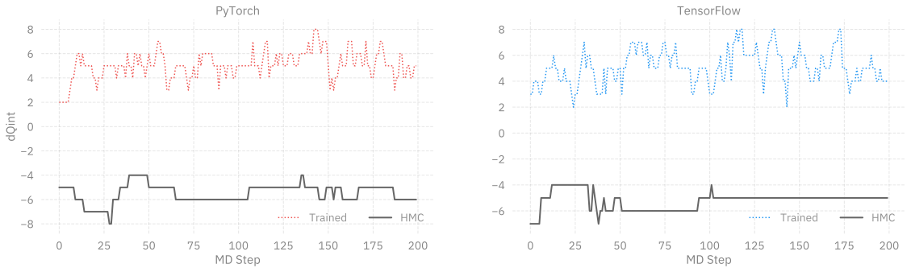
>
> 
>
> 
>
> 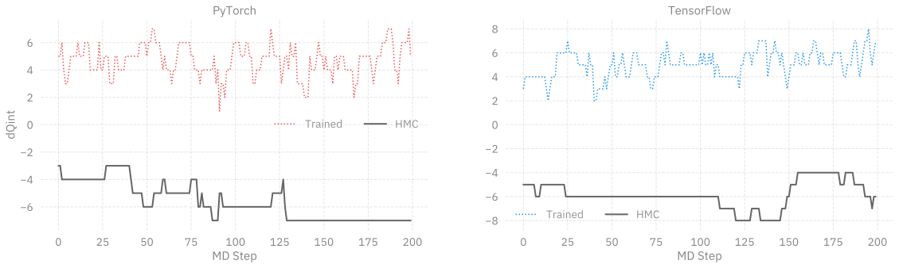
>
> </div>

</div>
