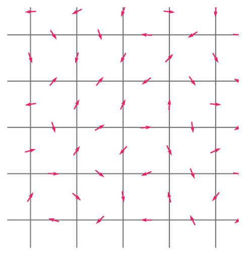
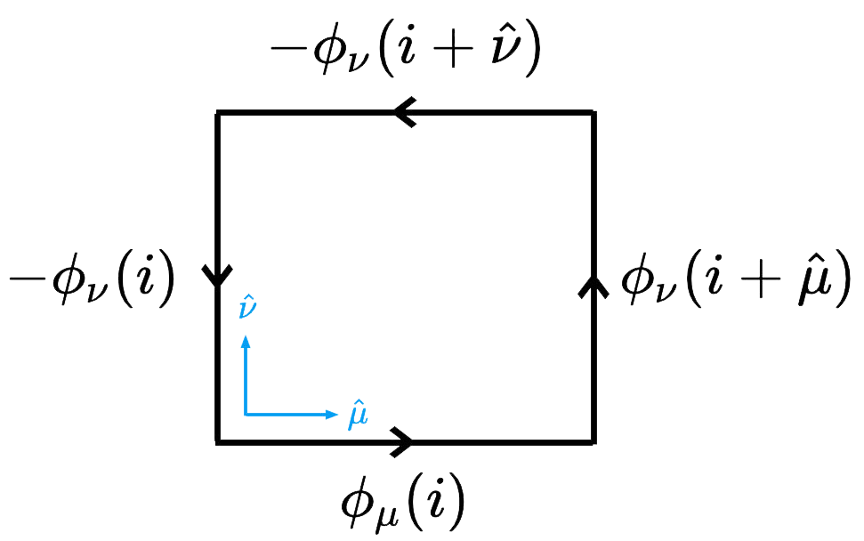

# l2hmc-qcd  [](https://www.codefactor.io/repository/github/saforem2/l2hmc-qcd) 

A description of the L2HMC algorithm can be found in the paper:

[*Generalizing Hamiltonian Monte Carlo with Neural Network*](https://arxiv.org/abs/1711.09268)

by [Daniel Levy](http://ai.stanford.edu/~danilevy), [Matt D. Hoffman](http://matthewdhoffman.com/) and [Jascha Sohl-Dickstein](sohldickstein.com)


# Overview

We are interested in applying the L2HMC algorithm to generate *gauge configurations* for LatticeQCD.    

This work is based on the original implementation which can be found at [brain-research/l2hmc/](https://github.com/brain-research/l2hmc). 


Given an *analytically* described target distribution, $\pi(x)$, L2HMC provides a *statistically exact* sampler that:

- Quickly converges to the target distribution (fast ***burn-in***).
- Quickly produces uncorrelated samples (fast ***mixing***).
- Is able to efficiently mix between energy levels.
- Is capable of traversing low-density zones to mix between modes (often difficult for generic HMC).

Simple examples of target distributions (Gaussian, GaussianMixtureModel, lattice/ring of Gaussians, etc) can be found in `utils/distributions.py`.


# L2HMC for LatticeQCD

#### **Goal:**

- ##### Use L2HMC to generate *gauge configurations* for LatticeQCD.


<figure class="half" style="display:flex">
    <div align="center">
    
     
    <figcaption></figcaption>
</div>
</figure>

## $U(1)$ Lattice Gauge Theory

We start by considering the simpler $(1+1)$-dimensional $U(1)$ lattice gauge theory, defined on an $N_{x} \times N_{t}$ lattice with periodic boundary conditions.

The action of this gauge theory is defined in terms of the *link variables*
$$
U_{\mu}(i) = e^{i\phi_{\mu}(i)}, \quad \phi_{\mu}(i) \in [0, 2\pi)
$$
and can be written as
$$
S = \sum_{P}\, 1 - \cos(\phi_{P})
$$
where $\phi_{P}$ is the sum of the link variables around an elementary plaquette:
$$
\phi_{P} \equiv \phi_{\mu\nu}(i) = \phi_{\mu}(i) + \phi_{\nu}(i+\hat{\mu}) - \phi_{\mu}(i+\hat\nu) - \phi_{\nu}(i)
$$

<div align="center">
    
</div>

#### Target distribution:

- Our target distribution is then given by:
  $$
  \pi(\phi) = \frac{e^{-\beta S[\phi]}}{\mathcal{Z}}
  $$
  where $\mathcal{Z}$ is the partition function (normalizing factor).


Lattice code can be found in `l2hmc-qcd/lattice/` and the particular code for the $2D$ $U{(1)}$ lattice gauge model can be found in `l2hmc-qcd/lattice/lattice.py`.


# Organization

### Lattice

Lattice code can be found in `lattice/lattice.py`, specifically the `GaugeLattice` object that provides the base structure on which our target distribution exists.

​	Additionally, the `GaugeLattice` object implements a variety of methods for calculating physical observables such as the average plaquette, $\phi_{P}$, and the topological charge $\mathcal{Q}$,

### Model

An abstract base model `BaseModel` can be found in `l2hmc-qcd/base/base_model.py`.

This `BaseModel` is responsible for creating and organizing all of the various tensorflow operations, tensors and placeholders necessary for training and evaluating the L2HMC sampler.

In particular, the `BaseModel` object is responsible for both defining the loss function to be minimized, as well as building and grouping the backpropagation operations that apply the gradients accumulated during the loss function calculation.

Building on this `BaseClass`, there are two additional models:

1. `GaugeModel` (defined in `l2hmc-qcd/models/gauge_model.py`) that extends the `BaseModel` to exist on a two-dimensional lattice with periodic boundary conditions and a target distribution defined by the Wilson gauge action $\beta S$, i.e. $\pi(x) = e^{\beta S(x)}$.

Model information (including the implementation of the loss function) can be
found in `l2hmc-qcd/base/base_model.py`. 

This module implements an abstract
base class from which additional models can be built.

For example, both the `GaugeModel` and `GaussianMixtureModel` (defined in
`l2hmc-qcd/models/`) inherit from the `BaseModel` object and extend it in
different ways.

### Dynamics / Network

The augmented L2HMC leapfrog integrator is implemented using the `Dynamics`
object which is located in the `l2hmc-qcd/dynamics/dynamics.py` module.

The `Dynamics` object has a `build_network` method that builds the neural
network. The network architecture is specified via the `--network_arch` command
line flag, with possible values being: `generic`, `conv2D`, or `conv3D`.

Specific details about the network can be found in
`l2hcm-qcd/network/network.py`.

Due to the unconventional architecture and
data-flow of the L2HMC algorithm, the network is implemented by subclassing the
`tf.keras.Model`, which is a sufficiently flexible approach.

### Training

Example command line arguments can be found in `l2hmc-qcd/args`. The module
`l2hmc-qcd/main.py` implements wrapper functions that are used to train the
model and save the resulting trained graph which can then be loaded and used
for inference.

The code responsible for actually training the model can be found in the
`Trainer` object inside the `l2hmc-qcd/trainers/trainer.py` module.

Summary objects for monitoring model performance in TensorBoard are created in
the various methods found in `l2hmc-qcd/loggers/summary_utils.py`. These
objects are then created inside the `create_summaries(...)` method of the
`TrainLogger` class (defined in `l2hmc-qcd/loggers/train_logger.py`).

To train the model, you can either specify command line arguments manually
(descriptions can be found in `utils/parse_args.py`), or use the
`args/args.txt` file, which can be passed directly to `main.py` by prepending
the `.txt` file with `@`.

For example, from within the `l2hmc-qcd/args` directory:
```
python3 ../main.py @args.txt
```

All of the relevant command line options are well documented and can be found
in `l2hmc-qcd/utils/parse_args.py`. Almost all relevant information about
different parameters and run options can be found in this file.

### Inference

Once the training is complete, we can use the trained model to run inference to
gather statistics about relevant lattice observables. This can be done using
the `gauge_inference.py` module which implements helper functions for loading
and running the saved model.

Explicitly, assuming we trained the model by running the `main.py` module from
within the `l2hmc-qcd/args` directory using the command given above, we can
then run inference via:

```
python ../gauge_inference.py \
    --run_steps 5000 \
    --beta_inference 5. \
    --samples_init 'random'
```
where

 - `run_steps` is the number of complete accept/reject steps to perform
 - `beta_inference` is the value of `beta` (inverse gauge coupling) at which
     the inference run should be performed
 - `samples_init` specifies how the samples should be initialized

### Notebooks
`l2hmc-qcd/notebooks/` contains a random collection of jupyter notebooks that
each serve different purposes and should be somewhat self explanatory.


# Features

- **Distributed training**  (via[`horovod`](https://github.com/horovod/horovod)): The ability to train the sampler across multiple nodes (using data-parallelism) can be enabled simply by passing the `--horovod` command line argument to the training script `main.py`.


# Contact

***Code author:*** Sam Foreman

***Pull requests and issues should be directed to:*** [saforem2](http://github.com/saforem2)

## Citation

If you use this code, please cite the original paper:
```
@article{levy2017generalizing,
  title={Generalizing Hamiltonian Monte Carlo with Neural Networks},
  author={Levy, Daniel and Hoffman, Matthew D. and Sohl-Dickstein, Jascha},
  journal={arXiv preprint arXiv:1711.09268},
  year={2017}
}
```


